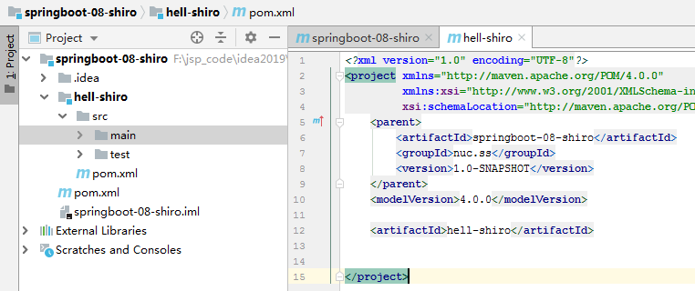

# SpringBoot：Hello,World！

SpringBoot简介

## 回顾什么是Spring

Spring是一个开源框架，2003 年兴起的一个轻量级的Java 开发框架，作者：Rod Johnson 。

**Spring是为了解决企业级应用开发的复杂性而创建的，简化开发。**

## Spring是如何简化Java开发的

为了降低Java开发的复杂性，Spring采用了以下4种关键策略：

1、基于POJO的轻量级和最小侵入性编程，所有东西都是bean；

2、通过IOC，依赖注入（DI）和面向接口实现松耦合；

3、基于切面（AOP）和惯例进行声明式编程；

4、通过切面和模版减少样式代码，RedisTemplate，xxxTemplate；

## 什么是SpringBoot

学过javaweb的同学就知道，开发一个web应用，从最初开始接触Servlet结合Tomcat, 跑出一个Hello Wolrld程序，是要经历特别多的步骤；后来就用了框架Struts，再后来是SpringMVC，到了现在的SpringBoot，过一两年又会有其他web框架出现；你们有经历过框架不断的演进，然后自己开发项目所有的技术也在不断的变化、改造吗？建议都可以去经历一遍；

言归正传，什么是SpringBoot呢，就是一个javaweb的开发框架，和SpringMVC类似，对比其他javaweb框架的好处，官方说是简化开发，约定大于配置， you can "just run"，能迅速的开发web应用，几行代码开发一个http接口。

所有的技术框架的发展似乎都遵循了一条主线规律：从一个复杂应用场景 衍生 一种规范框架，人们只需要进行各种配置而不需要自己去实现它，这时候强大的配置功能成了优点；发展到一定程度之后，人们根据实际生产应用情况，选取其中实用功能和设计精华，重构出一些轻量级的框架；之后为了提高开发效率，嫌弃原先的各类配置过于麻烦，于是开始提倡“约定大于配置”，进而衍生出一些一站式的解决方案。

是的这就是Java企业级应用->J2EE->spring->springboot的过程。

随着 Spring 不断的发展，涉及的领域越来越多，项目整合开发需要配合各种各样的文件，慢慢变得不那么易用简单，违背了最初的理念，甚至人称配置地狱。Spring Boot 正是在这样的一个背景下被抽象出来的开发框架，目的为了让大家更容易的使用 Spring 、更容易的集成各种常用的中间件、开源软件；

Spring Boot 基于 Spring 开发，Spirng Boot 本身并不提供 Spring 框架的核心特性以及扩展功能，只是用于快速、敏捷地开发新一代基于 Spring 框架的应用程序。也就是说，它并不是用来替代 Spring 的解决方案，而是和 Spring 框架紧密结合用于提升 Spring 开发者体验的工具。Spring Boot 以**约定大于配置的核心思想**，默认帮我们进行了很多设置，多数 Spring Boot 应用只需要很少的 Spring 配置。同时它集成了大量常用的第三方库配置（例如 Redis、MongoDB、Jpa、RabbitMQ、Quartz 等等），Spring Boot 应用中这些第三方库几乎可以零配置的开箱即用。

简单来说就是SpringBoot其实不是什么新的框架，它默认配置了很多框架的使用方式，就像maven整合了所有的jar包，spring boot整合了所有的框架 。

Spring Boot 出生名门，从一开始就站在一个比较高的起点，又经过这几年的发展，生态足够完善，Spring Boot 已经当之无愧成为 Java 领域最热门的技术。

**Spring Boot的主要优点：**

- 为所有Spring开发者更快的入门
- **开箱即用**，提供各种默认配置来简化项目配置
- 内嵌式容器简化Web项目
- 没有冗余代码生成和XML配置的要求

真的很爽，我们快速去体验开发个接口的感觉吧！

Hello，World

## 准备工作

我们将学习如何快速的创建一个Spring Boot应用，并且实现一个简单的Http请求处理。通过这个例子对Spring Boot有一个初步的了解，并体验其结构简单、开发快速的特性。

我的环境准备：

- java version "1.8.0_181"
- Maven-3.6.1
- SpringBoot 2.x 最新版

开发工具：

- IDEA

## 创建基础项目说明

Spring官方提供了非常方便的工具让我们快速构建应用

Spring Initializr：https://start.spring.io/

**项目创建方式一：**使用Spring Initializr 的 Web页面创建项目

1、打开 https://start.spring.io/

2、填写项目信息

3、点击”Generate Project“按钮生成项目；下载此项目

4、解压项目包，并用IDEA以Maven项目导入，一路下一步即可，直到项目导入完毕。

5、如果是第一次使用，可能速度会比较慢，包比较多、需要耐心等待一切就绪。

**项目创建方式二：**使用 IDEA 直接创建项目

1、创建一个新项目

2、选择spring initalizr ， 可以看到默认就是去官网的快速构建工具那里实现

3、填写项目信息

4、选择初始化的组件（初学勾选 Web 即可）

5、填写项目路径

6、等待项目构建成功

**项目结构分析：**

通过上面步骤完成了基础项目的创建。就会自动生成以下文件。

1、程序的主启动类

2、一个 application.properties 配置文件

3、一个 测试类

4、一个 pom.xml

## pom.xml 分析

打开pom.xml，看看Spring Boot项目的依赖：

```xml
<!-- 父依赖 -->
<parent>
    <groupId>org.springframework.boot</groupId>
    <artifactId>spring-boot-starter-parent</artifactId>
    <version>2.2.5.RELEASE</version>
    <relativePath/>
</parent>

<dependencies>
    <!-- web场景启动器 tomcat,dispatcherServlet,xml -->
    <dependency>
        <groupId>org.springframework.boot</groupId>
        <artifactId>spring-boot-starter-web</artifactId>
    </dependency>
    <!-- spring-boot-starter 所有的sprintboot依赖都是使用这个开头的 -->
    <!-- springboot单元测试 -->
    <dependency>
        <groupId>org.springframework.boot</groupId>
        <artifactId>spring-boot-starter-test</artifactId>
        <scope>test</scope>
        <!-- 剔除依赖 -->
        <exclusions>
            <exclusion>
                <groupId>org.junit.vintage</groupId>
                <artifactId>junit-vintage-engine</artifactId>
            </exclusion>
        </exclusions>
    </dependency>
</dependencies>

<build>
    <plugins>
        <!-- 打包插件 -->
        <plugin>
            <groupId>org.springframework.boot</groupId>
            <artifactId>spring-boot-maven-plugin</artifactId>
        </plugin>
    </plugins>
</build>
```

## 编写一个http接口

1、在主程序的同级目录下，新建一个controller包，一定要在同级目录下，否则识别不到

2、在包中新建一个HelloController类

@RestController

@RestController = @Controller + @ResponseBody组成，等号右边两位同志简单介绍两句，就明白我们@RestController的意义了：

- @Controller 将当前修饰的类注入SpringBoot IOC容器，使得从该类所在的项目跑起来的过程中，这个类就被实例化。当然也有语义化的作用，即代表该类是充当Controller的作用
- @ResponseBody 它的作用简短截说就是指该类中所有的API接口返回的数据，甭管你对应的方法返回Map或是其他Object，它会以Json字符串的形式返回给客户端，本人尝试了一下，如果返回的是String类型，则仍然是String。

```java
@RestController
public class HelloController {

    @RequestMapping("/hello")
    public String hello() {
        return "Hello World";
    }
    
}
```

3、编写完毕后，从主程序启动项目，浏览器发起请求，看页面返回；控制台输出了 Tomcat 访问的端口号！


简单几步，就完成了一个web接口的开发，SpringBoot就是这么简单。所以我们常用它来建立我们的微服务项目！

## 将项目打成jar包，点击 maven的 package


如果遇到以上错误，可以配置打包时 跳过项目运行测试用例

```xml
<!--
    在工作中,很多情况下我们打包是不想执行测试用例的
    可能是测试用例不完事,或是测试用例会影响数据库数据
    跳过测试用例执
    -->
<plugin>
    <groupId>org.apache.maven.plugins</groupId>
    <artifactId>maven-surefire-plugin</artifactId>
    <configuration>
        <!--跳过项目运行测试用例-->
        <skipTests>true</skipTests>
    </configuration>
</plugin>
```

如果打包成功，则会在target目录下生成一个 jar 包


打成了jar包后，就可以在任何地方运行了！OK

**彩蛋**

更改端口号（在application.properties中）

```properties
#更改项目端口号
server.port=8081
```

如何更改启动时显示的字符拼成的字母，SpringBoot呢？也就是 banner 图案；

只需一步：到项目下的 resources 目录下新建一个banner.txt 即可。

图案可以到：https://www.bootschool.net/ascii 这个网站生成，然后拷贝到文件中即可！


# SpringBoot：运行原理初探

我们之前写的HelloSpringBoot，到底是怎么运行的呢，Maven项目，我们一般从pom.xml文件探究起；

> **pom.xml**

## 父依赖

其中它主要是依赖一个父项目，主要是管理项目的资源过滤及插件！

```xml
<parent>
    <groupId>org.springframework.boot</groupId>
    <artifactId>spring-boot-starter-parent</artifactId>
    <version>2.2.5.RELEASE</version>
    <relativePath/> <!-- lookup parent from repository -->
</parent>
```

点进去，发现还有一个父依赖

```xml
<parent>
    <groupId>org.springframework.boot</groupId>
    <artifactId>spring-boot-dependencies</artifactId>
    <version>2.2.5.RELEASE</version>
    <relativePath>../../spring-boot-dependencies</relativePath>
</parent>
```

这里才是真正管理SpringBoot应用里面所有依赖版本的地方，SpringBoot的版本控制中心；

**以后我们导入依赖默认是不需要写版本；但是如果导入的包没有在依赖中管理着就需要手动配置版本了；**

## 启动器 spring-boot-starter

```xml
<dependency>
    <groupId>org.springframework.boot</groupId>
    <artifactId>spring-boot-starter-web</artifactId>
</dependency>
```

**springboot-boot-starter-xxx**：就是spring-boot的场景启动器

**spring-boot-starter-web**：帮我们导入了web模块正常运行所依赖的组件；

SpringBoot将所有的功能场景都抽取出来，做成一个个的starter （启动器），只需要在项目中引入这些starter即可，所有相关的依赖都会导入进来 ， 我们要用什么功能就导入什么样的场景启动器即可 ；我们未来也可以自己自定义 starter；

> **主启动类**

分析完了 pom.xml 来看看这个启动类

## 默认的主启动类

```java
//@SpringBootApplication 来标注一个主程序类
//说明这是一个Spring Boot应用
@SpringBootApplication
public class SpringbootApplication {

   public static void main(String[] args) {
     //以为是启动了一个方法，没想到启动了一个服务
      SpringApplication.run(SpringbootApplication.class, args);
   }

}
```

但是**一个简单的启动类并不简单！**我们来分析一下这些注解都干了什么

## @SpringBootApplication

作用：标注在某个类上说明这个类是SpringBoot的主配置类 ， SpringBoot就应该运行这个类的main方法来启动SpringBoot应用；

进入这个注解：可以看到上面还有很多其他注解！

```java
@SpringBootConfiguration
@EnableAutoConfiguration
@ComponentScan(
    excludeFilters = {@Filter(
    type = FilterType.CUSTOM,
    classes = {TypeExcludeFilter.class}
), @Filter(
    type = FilterType.CUSTOM,
    classes = {AutoConfigurationExcludeFilter.class}
)}
)
public @interface SpringBootApplication {
    // ......
}
```

注解源码:

```java
@SpringBootConfiguration:  springboot的配置
    @Configuration : spring配置类
    @Component : 说明这也是一个spring的组件
        
@EnableAutoConfiguration : 自动配置
    @AutoConfigurationPackage : 自动配置包
    	@Import(AutoConfigurationPackages.Registrar.class) : 自动配置`包注册`
    @Import({AutoConfigurationImportSelector.class}) : 自动配置导入选择
        

```

## @ComponentScan

这个注解在Spring中很重要 ,它对应XML配置中的元素。

作用：自动扫描并加载符合条件的组件或者bean ， 将这个bean定义加载到IOC容器中

## @SpringBootConfiguration

作用：SpringBoot的配置类 ，标注在某个类上 ， 表示这是一个SpringBoot的配置类；

我们继续进去这个注解查看

```java
// 点进去得到下面的 @Component
@Configuration
public @interface SpringBootConfiguration {}

@Component
public @interface Configuration {}
```

这里的 @Configuration，说明这是一个配置类 ，配置类就是对应Spring的xml 配置文件；

里面的 @Component 这就说明，启动类本身也是Spring中的一个组件而已，负责启动应用！

我们回到 SpringBootApplication 注解中继续看。

## @EnableAutoConfiguration

**@EnableAutoConfiguration ：开启自动配置功能**

以前我们需要自己配置的东西，而现在SpringBoot可以自动帮我们配置 ；@EnableAutoConfiguration告诉SpringBoot开启自动配置功能，这样自动配置才能生效；

点进注解接续查看：

**@AutoConfigurationPackage ：自动配置包**

```java
@Import({Registrar.class})
public @interface AutoConfigurationPackage {
}
```

**@import** ：Spring底层注解@import ， 给容器中导入一个组件

Registrar.class 作用：将主启动类的所在包及包下面所有子包里面的所有组件扫描到Spring容器 ；

这个分析完了，退到上一步，继续看

**@Import({AutoConfigurationImportSelector.class}) ：给容器导入组件 ；**

AutoConfigurationImportSelector ：自动配置导入选择器，那么它会导入哪些组件的选择器呢？我们点击去这个类看源码：

1、这个类中有一个这样的方法

```java
// 获得候选的配置
protected List<String> getCandidateConfigurations(AnnotationMetadata metadata, AnnotationAttributes attributes) {
    //这里的getSpringFactoriesLoaderFactoryClass（）方法
    //返回的就是我们最开始看的启动自动导入配置文件的注解类；EnableAutoConfiguration
    List<String> configurations = SpringFactoriesLoader.loadFactoryNames(this.getSpringFactoriesLoaderFactoryClass(), this.getBeanClassLoader());
    Assert.notEmpty(configurations, "No auto configuration classes found in META-INF/spring.factories. If you are using a custom packaging, make sure that file is correct.");
    return configurations;
}
```

2、这个方法又调用了 SpringFactoriesLoader 类的静态方法！我们进入SpringFactoriesLoader类loadFactoryNames() 方法

```java
public static List<String> loadFactoryNames(Class<?> factoryClass, @Nullable ClassLoader classLoader) {
    String factoryClassName = factoryClass.getName();
    //这里它又调用了 loadSpringFactories 方法
    return (List)loadSpringFactories(classLoader).getOrDefault(factoryClassName, Collections.emptyList());
}
```

3、我们继续点击查看 loadSpringFactories 方法

```java
private static Map<String, List<String>> loadSpringFactories(@Nullable ClassLoader classLoader) {
    //获得classLoader ， 我们返回可以看到这里得到的就是EnableAutoConfiguration标注的类本身
    MultiValueMap<String, String> result = (MultiValueMap)cache.get(classLoader);
    if (result != null) {
        return result;
    } else {
        try {
            //去获取一个资源 "META-INF/spring.factories"
            Enumeration<URL> urls = classLoader != null ? classLoader.getResources("META-INF/spring.factories") : ClassLoader.getSystemResources("META-INF/spring.factories");
            LinkedMultiValueMap result = new LinkedMultiValueMap();

            //将读取到的资源遍历，封装成为一个Properties
            while(urls.hasMoreElements()) {
                URL url = (URL)urls.nextElement();
                UrlResource resource = new UrlResource(url);
                Properties properties = PropertiesLoaderUtils.loadProperties(resource);
                Iterator var6 = properties.entrySet().iterator();

                while(var6.hasNext()) {
                    Entry<?, ?> entry = (Entry)var6.next();
                    String factoryClassName = ((String)entry.getKey()).trim();
                    String[] var9 = StringUtils.commaDelimitedListToStringArray((String)entry.getValue());
                    int var10 = var9.length;

                    for(int var11 = 0; var11 < var10; ++var11) {
                        String factoryName = var9[var11];
                        result.add(factoryClassName, factoryName.trim());
                    }
                }
            }

            cache.put(classLoader, result);
            return result;
        } catch (IOException var13) {
            throw new IllegalArgumentException("Unable to load factories from location [META-INF/spring.factories]", var13);
        }
    }
}
```

4、发现一个多次出现的文件：spring.factories，全局搜索它

## spring.factories

我们根据源头打开spring.factories ， 看到了很多自动配置的文件；这就是自动配置根源所在！


**WebMvcAutoConfiguration**

我们在上面的自动配置类随便找一个打开看看，比如 ：WebMvcAutoConfiguration


可以看到这些一个个的都是JavaConfig配置类，而且都注入了一些Bean，可以找一些自己认识的类，看着熟悉一下！

所以，自动配置真正实现是从classpath中搜寻所有的META-INF/spring.factories配置文件 ，并将其中对应的 org.springframework.boot.autoconfigure. 包下的配置项，通过反射实例化为对应标注了 @Configuration的JavaConfig形式的IOC容器配置类 ， 然后将这些都汇总成为一个实例并加载到IOC容器中。

**结论：**

1. SpringBoot在启动的时候从类路径下的META-INF/spring.factories中获取EnableAutoConfiguration指定的值
2. 将这些值作为自动配置类导入容器 ， 自动配置类就生效 ， 帮我们进行自动配置工作；
3. 整个J2EE的整体解决方案和自动配置都在springboot-autoconfigure的jar包中；
4. 它会给容器中导入非常多的自动配置类 （xxxAutoConfiguration）, 就是给容器中导入这个场景需要的所有组件 ， 并配置好这些组件 ；
5. 有了自动配置类 ， 免去了我们手动编写配置注入功能组件等的工作；

**现在大家应该大概的了解了下，SpringBoot的运行原理，后面我们还会深化一次！**

> **SpringApplication**

## 不简单的方法

我最初以为就是运行了一个main方法，没想到却开启了一个服务；

```java
@SpringBootApplication
public class SpringbootApplication {
    public static void main(String[] args) {
        SpringApplication.run(SpringbootApplication.class, args);
    }
}
```

**SpringApplication.run分析**

分析该方法主要分两部分，一部分是SpringApplication的实例化，二是run方法的执行；

## SpringApplication

**这个类主要做了以下四件事情：**

1、推断应用的类型是普通的项目还是Web项目

2、查找并加载所有可用初始化器 ， 设置到initializers属性中

3、找出所有的应用程序监听器，设置到listeners属性中

4、推断并设置main方法的定义类，找到运行的主类

查看构造器：

```java
public SpringApplication(ResourceLoader resourceLoader, Class... primarySources) {
    // ......
    this.webApplicationType = WebApplicationType.deduceFromClasspath();
    this.setInitializers(this.getSpringFactoriesInstances();
    this.setListeners(this.getSpringFactoriesInstances(ApplicationListener.class));
    this.mainApplicationClass = this.deduceMainApplicationClass();
}
```

## run方法流程分析


跟着源码和这幅图就可以一探究竟了！

# SpringBoot：yaml配置注入

yaml语法学习

## 配置文件

SpringBoot使用一个全局的配置文件 ， 配置文件名称是固定的

- application.properties
- - 语法结构 ：key=value
- application.yml
- - 语法结构 ：key：空格 value

**配置文件的作用 ：**修改SpringBoot自动配置的默认值，因为SpringBoot在底层都给我们自动配置好了；

比如我们可以在配置文件中修改Tomcat 默认启动的端口号！测试一下！

- 

```
server.port=8081
```

## yaml概述

YAML是 "YAML Ain't a Markup Language" （YAML不是一种标记语言）的递归缩写。在开发的这种语言时，YAML 的意思其实是："Yet Another Markup Language"（仍是一种标记语言）

**这种语言以数据\**\*\*作\*\**\*为中心，而不是以标记语言为重点！**

以前的配置文件，大多数都是使用xml来配置；比如一个简单的端口配置，我们来对比下yaml和xml

传统xml配置：

```xml
<server>
    <port>8081<port>
</server>
```

yaml配置：

```yml
server：
  prot: 8080
```

## yaml基础语法

说明：语法要求严格！

1、空格不能省略

2、以缩进来控制层级关系，只要是左边对齐的一列数据都是同一个层级的。

3、属性和值的大小写都是十分敏感的。

**字面量：普通的值 [ 数字，布尔值，字符串 ]**

字面量直接写在后面就可以 ， 字符串默认不用加上双引号或者单引号；

```yml
k: v
```

注意：

- “ ” 双引号，不会转义字符串里面的特殊字符 ， 特殊字符会作为本身想表示的意思；

  比如 ：name: "kuang \n shen" 输出 ：kuang 换行 shen

- '' 单引号，会转义特殊字符 ， 特殊字符最终会变成和普通字符一样输出

  比如 ：name: ‘kuang \n shen’ 输出 ：kuang \n shen

**对象、Map（键值对）**

```yml
#对象、Map格式
k: 
    v1:
    v2:
```

在下一行来写对象的属性和值得关系，注意缩进；比如：

```yml
student:
    name: qinjiang
    age: 3
```

行内写法

```yml
student: {name: qinjiang,age: 3}
```

**数组（ List、set ）**

用 - 值表示数组中的一个元素,比如：

```yml
pets:
 - cat
 - dog
 - pig
```

行内写法

```yml
pets: [cat,dog,pig]
```

**修改SpringBoot的默认端口号**

配置文件中添加，端口号的参数，就可以切换端口；

```yml
server:  
  port: 8082
```

注入配置文件

yaml文件更强大的地方在于，他可以给我们的实体类直接注入匹配值！

## yaml注入配置文件

1、在springboot项目中的resources目录下新建一个文件 application.yml

2、编写一个实体类 Dog；

```java
package com.kuang.springboot.pojo;

@Component  //注册bean到容器中
public class Dog {
    private String name;
    private Integer age;
    
    //有参无参构造、get、set方法、toString()方法  
}
```

3、思考，我们原来是如何给bean注入属性值的！@Value，给狗狗类测试一下：

```java
@Component //注册bean
public class Dog {
    @Value("阿黄")
    private String name;
    @Value("18")
    private Integer age;
}
```

4、在SpringBoot的测试类下注入狗狗输出一下；

```java
@SpringBootTest
class DemoApplicationTests {

    @Autowired //将狗狗自动注入进来
    Dog dog;

    @Test
    public void contextLoads() {
        System.out.println(dog); //打印看下狗狗对象
    }

}
```

结果成功输出，@Value注入成功，这是我们原来的办法对吧。


5、我们在编写一个复杂一点的实体类：Person 类

```java
@Component //注册bean到容器中
public class Person {
    private String name;
    private Integer age;
    private Boolean happy;
    private Date birth;
    private Map<String,Object> maps;
    private List<Object> lists;
    private Dog dog;
    
    //有参无参构造、get、set方法、toString()方法  
}
```

6、我们来使用yaml配置的方式进行注入，大家写的时候注意区别和优势，我们编写一个yaml配置！

```yml
person:
  name: qinjiang
  age: 3
  happy: false
  birth: 2000/01/01
  maps: {k1: v1,k2: v2}
  lists:
   - code
   - girl
   - music
  dog:
    name: 旺财
    age: 1
```

7、我们刚才已经把person这个对象的所有值都写好了，我们现在来注入到我们的类中！

```java
/*
@ConfigurationProperties作用：
将配置文件中配置的每一个属性的值，映射到这个组件中；
告诉SpringBoot将本类中的所有属性和配置文件中相关的配置进行绑定
参数 prefix = “person” : 将配置文件中的person下面的所有属性一一对应
*/
@Component //注册bean
@ConfigurationProperties(prefix = "person")
public class Person {
    private String name;
    private Integer age;
    private Boolean happy;
    private Date birth;
    private Map<String,Object> maps;
    private List<Object> lists;
    private Dog dog;
}
```

8、IDEA 提示，springboot配置注解处理器没有找到，让我们看文档，我们可以查看文档，找到一个依赖！


也可以不配置


```xml
<!-- 导入配置文件处理器，配置文件进行绑定就会有提示，需要重启 -->
<dependency>
  <groupId>org.springframework.boot</groupId>
  <artifactId>spring-boot-configuration-processor</artifactId>
  <optional>true</optional>
</dependency>
```

9、确认以上配置都OK之后，我们去测试类中测试一下：

```java
@SpringBootTest
class DemoApplicationTests {

    @Autowired
    Person person; //将person自动注入进来

    @Test
    public void contextLoads() {
        System.out.println(person); //打印person信息
    }

}
```

结果：所有值全部注入成功！

**yaml配置注入到实体类完全OK！**

课堂测试：

1、将配置文件的key 值 和 属性的值设置为不一样，则结果输出为null，注入失败

2、在配置一个person2，然后将 @ConfigurationProperties(prefix = "person2") 指向我们的person2；

## 加载指定的配置文件

**@PropertySource ：**加载指定的配置文件；

**@configurationProperties**：默认从全局配置文件中获取值；

1、我们去在resources目录下新建一个**person.properties**文件

```properties
name=kuangshen
```

2、然后在我们的代码中指定加载person.properties文件

```java
@PropertySource(value = "classpath:person.properties")
@Component //注册bean
public class Person {

    @Value("${name}")
    private String name;

    ......  
}
```

3、再次输出测试一下：指定配置文件绑定成功！


## 配置文件占位符

配置文件还可以编写占位符生成随机数

```yml
person:
    name: qinjiang${random.uuid} # 随机uuid
    age: ${random.int}  # 随机int
    happy: false
    birth: 2000/01/01
    maps: {k1: v1,k2: v2}
    lists:
      - code
      - girl
      - music
    dog:
      name: ${person.hello:other}_旺财 #这里表示，hello有值就用hello的值+_旺财，若没有值就是hello_旺财
      age: 1
```

## 回顾properties配置

我们上面采用的yaml方法都是最简单的方式，开发中最常用的；也是springboot所推荐的！那我们来唠唠其他的实现方式，道理都是相同的；写还是那样写；配置文件除了yml还有我们之前常用的properties ， 我们没有讲，我们来唠唠！

【注意】properties配置文件在写中文的时候，会有乱码 ， 我们需要去IDEA中设置编码格式为UTF-8；

settings-->FileEncodings 中配置；


**测试步骤：**

1、新建一个实体类User

```java
@Component //注册bean
public class User {
    private String name;
    private int age;
    private String sex;
}
```

2、编辑配置文件 user.properties

```properties
user1.name=kuangshen
user1.age=18user1.sex=男
```

3、我们在User类上使用@Value来进行注入！

```java
@Component //注册bean
@PropertySource(value = "classpath:user.properties")
public class User {
    //直接使用@value
    @Value("${user.name}") //从配置文件中取值
    private String name;
    @Value("#{9*2}")  // #{SPEL} Spring表达式
    private int age;
    @Value("男")  // 字面量
    private String sex;
}
```

4、Springboot测试

```
user1.name=kuangshen
user1.age=18
user1.sex=男
```

结果正常输出

## 对比小结

@Value这个使用起来并不友好！我们需要为每个属性单独注解赋值，比较麻烦；我们来看个功能对比图


1、@ConfigurationProperties只需要写一次即可 ， @Value则需要每个字段都添加

2、松散绑定：这个什么意思呢? 比如我的yml中写的last-name，这个和lastName是一样的， - 后面跟着的字母默认是大写的。这就是松散绑定。可以测试一下

3、JSR303数据校验 ， 这个就是我们可以在字段是增加一层过滤器验证 ， 可以保证数据的合法性

4、复杂类型封装，yml中可以封装对象 ， 使用value就不支持

**结论：**

配置yml和配置properties都可以获取到值 ， 强烈推荐 yml；

如果我们在某个业务中，只需要获取配置文件中的某个值，可以使用一下 @value；

如果说，我们专门编写了一个JavaBean来和配置文件进行一一映射，就直接@configurationProperties，不要犹豫！

# SpringBoot：JSR303数据校验及多环境切换

JSR303数据校验

## 先看看如何使用

Springboot中可以用@validated来校验数据，如果数据异常则会统一抛出异常，方便异常中心统一处理。我们这里来写个注解让我们的name只能支持Email格式；

```java
@Component //注册bean
@ConfigurationProperties(prefix = "person")
@Validated  //数据校验
public class Person {

    @Email(message="邮箱格式错误") //name必须是邮箱格式
    private String name;
}
```

运行结果 ：default message [不是一个合法的电子邮件地址];

可能Email爆红，因为没有加入启动器validation的依赖

**使用数据校验，可以保证数据的正确性；**

## 常见参数

```java
@NotNull(message="名字不能为空")
private String userName;
@Max(value=120,message="年龄最大不能查过120")
private int age;
@Email(message="邮箱格式错误")
private String email;

空检查
@Null       验证对象是否为null
@NotNull    验证对象是否不为null, 无法查检长度为0的字符串
@NotBlank   检查约束字符串是不是Null还有被Trim的长度是否大于0,只对字符串,且会去掉前后空格.
@NotEmpty   检查约束元素是否为NULL或者是EMPTY.
    
Booelan检查
@AssertTrue     验证 Boolean 对象是否为 true  
@AssertFalse    验证 Boolean 对象是否为 false  
    
长度检查
@Size(min=, max=) 验证对象（Array,Collection,Map,String）长度是否在给定的范围之内  
@Length(min=, max=) string is between min and max included.

日期检查
@Past       验证 Date 和 Calendar 对象是否在当前时间之前  
@Future     验证 Date 和 Calendar 对象是否在当前时间之后  
@Pattern    验证 String 对象是否符合正则表达式的规则

.......等等
除此以外，我们还可以自定义一些数据校验规则
```

多环境切换

profile是Spring对不同环境提供不同配置功能的支持，可以通过激活不同的环境版本，实现快速切换环境；

## 多配置文件

我们在主配置文件编写的时候，文件名可以是 application-{profile}.properties/yml , 用来指定多个环境版本；

**例如：**

application-test.properties 代表测试环境配置

application-dev.properties 代表开发环境配置

但是Springboot并不会直接启动这些配置文件，它**默认使用application.properties主配置文件**；

我们需要通过一个配置来选择需要激活的环境：

```properties
#比如在配置文件中指定使用dev环境，我们可以通过设置不同的端口号进行测试；
#我们启动SpringBoot，就可以看到已经切换到dev下的配置了；
spring.profiles.active=dev
```

## yaml的多文档块

和properties配置文件中一样，但是使用yml去实现不需要创建多个配置文件，更加方便了 !

设置了spring profiles active就会优先激活那个环境块

使用 --- 来表示一个环境块

```yml
server:
  port: 8081
#选择要激活那个环境块
spring:
  profiles:
    active: prod

---
server:
  port: 8083
spring:
  profiles: dev #配置环境的名称


---

server:
  port: 8084
spring:
  profiles: prod  #配置环境的名称
```

**注意：如果yml和properties同时都配置了端口，并且没有激活其他环境 ， 默认会使用properties配置文件的！**

## 配置文件加载位置

**外部加载配置文件的方式十分多，我们选择最常用的即可，在开发的资源文件中进行配置！**

官方外部配置文件说明参考文档


springboot 启动会扫描以下位置的application.properties或者application.yml文件作为Spring boot的默认配置文件：

```
优先级1：项目路径下的config文件夹配置文件
优先级2：项目路径下配置文件
优先级3：资源路径下的config文件夹配置文件
优先级4：资源路径下配置文件
```

优先级由高到底，高优先级的配置会覆盖低优先级的配置；

**SpringBoot会从这四个位置全部加载主配置文件；互补配置；**

我们在最低级的配置文件中设置一个项目访问路径的配置来测试互补问题；

```properties
#配置项目的访问路径
server.servlet.context-path=/kuang
```

## 拓展，运维小技巧

指定位置加载配置文件

我们还可以通过spring.config.location来改变默认的配置文件位置

项目打包好以后，我们可以使用命令行参数的形式，启动项目的时候来指定配置文件的新位置；这种情况，一般是后期运维做的多，相同配置，外部指定的配置文件优先级最高

# SpringBoot：自动配置原理

自动配置原理

配置文件到底能写什么？怎么写？

SpringBoot官方文档中有大量的配置，我们无法全部记住

## 分析自动配置原理

我们以**HttpEncodingAutoConfiguration（Http编码自动配置）**为例解释自动配置原理；

```java
//表示这是一个配置类，和以前编写的配置文件一样，也可以给容器中添加组件；
@Configuration 

//启动指定类的ConfigurationProperties功能；
  //进入这个HttpProperties查看，将配置文件中对应的值和HttpProperties绑定起来；
  //并把HttpProperties加入到ioc容器中
@EnableConfigurationProperties({HttpProperties.class}) 

//Spring底层@Conditional注解
  //根据不同的条件判断，如果满足指定的条件，整个配置类里面的配置就会生效；
  //这里的意思就是判断当前应用是否是web应用，如果是，当前配置类生效
@ConditionalOnWebApplication(
    type = Type.SERVLET
)

//判断当前项目有没有这个类CharacterEncodingFilter；SpringMVC中进行乱码解决的过滤器；
@ConditionalOnClass({CharacterEncodingFilter.class})

//判断配置文件中是否存在某个配置：spring.http.encoding.enabled；
  //如果不存在，判断也是成立的
  //即使我们配置文件中不配置pring.http.encoding.enabled=true，也是默认生效的；
@ConditionalOnProperty(
    prefix = "spring.http.encoding",
    value = {"enabled"},
    matchIfMissing = true
)

public class HttpEncodingAutoConfiguration {
    //他已经和SpringBoot的配置文件映射了
    private final Encoding properties;
    //只有一个有参构造器的情况下，参数的值就会从容器中拿
    public HttpEncodingAutoConfiguration(HttpProperties properties) {
        this.properties = properties.getEncoding();
    }
    
    //给容器中添加一个组件，这个组件的某些值需要从properties中获取
    @Bean
    @ConditionalOnMissingBean //判断容器没有这个组件？
    public CharacterEncodingFilter characterEncodingFilter() {
        CharacterEncodingFilter filter = new OrderedCharacterEncodingFilter();
        filter.setEncoding(this.properties.getCharset().name());
        filter.setForceRequestEncoding(this.properties.shouldForce(org.springframework.boot.autoconfigure.http.HttpProperties.Encoding.Type.REQUEST));
        filter.setForceResponseEncoding(this.properties.shouldForce(org.springframework.boot.autoconfigure.http.HttpProperties.Encoding.Type.RESPONSE));
        return filter;
    }
    //。。。。。。。
}
```

**一句话总结 ：根据当前不同的条件判断，决定这个配置类是否生效！**

- 一但这个配置类生效；这个配置类就会给容器中添加各种组件；
- 这些组件的属性是从对应的properties类中获取的，这些类里面的每一个属性又是和配置文件绑定的；
- 所有在配置文件中能配置的属性都是在xxxxProperties类中封装着；
- 配置文件能配置什么就可以参照某个功能对应的这个属性类

```java
//从配置文件中获取指定的值和bean的属性进行绑定
@ConfigurationProperties(prefix = "spring.http") 
public class HttpProperties {
    // .....
}
```

我们去配置文件里面试试前缀，看提示！


**这就是自动装配的原理！**

## 精髓

1、SpringBoot启动会加载大量的自动配置类

2、我们看我们需要的功能有没有在SpringBoot默认写好的自动配置类当中；

3、我们再来看这个自动配置类中到底配置了哪些组件；（只要我们要用的组件存在在其中，我们就不需要再手动配置了）

4、给容器中自动配置类添加组件的时候，会从properties类中获取某些属性。我们只需要在配置文件中指定这些属性的值即可；

**xxxxAutoConfigurartion：自动配置类；**给容器中添加组件

**xxxxProperties:封装配置文件中相关属性；**

## 了解：@Conditional

了解完自动装配的原理后，我们来关注一个细节问题，**自动配置类必须在一定的条件下才能生效；**

**@Conditional派生注解（Spring注解版原生的@Conditional作用）**

作用：必须是@Conditional指定的条件成立，才给容器中添加组件，配置配里面的所有内容才生效；


**那么多的自动配置类，必须在一定的条件下才能生效；也就是说，我们加载了这么多的配置类，但不是所有的都生效了。**

我们怎么知道哪些自动配置类生效？

**我们可以通过启用 debug=true属性；来让控制台打印自动配置报告，这样我们就可以很方便的知道哪些自动配置类生效；**

```properties
#开启springboot的调试类
debug=true
```

**Positive matches:（自动配置类启用的：正匹配）**

**Negative matches:（没有启动，没有匹配成功的自动配置类：负匹配）**

**Unconditional classes: （没有条件的类）**

【演示：查看输出的日志】

# SpringBoot：web开发探究

## 静态资源映射规则

**首先，我们搭建一个普通的SpringBoot项目，回顾一下HelloWorld程序！**

写请求非常简单，那我们要引入我们前端资源，我们项目中有许多的静态资源，比如css，js等文件，这个SpringBoot怎么处理呢？

如果我们是一个web应用，我们的main下会有一个webapp，我们以前都是将所有的页面导在这里面的，对吧！但是我们现在的pom呢，打包方式是为jar的方式，那么这种方式SpringBoot能不能来给我们写页面呢？当然是可以的，但是SpringBoot对于静态资源放置的位置，是有规定的！

**我们先来聊聊这个静态资源映射规则：**

SpringBoot中，SpringMVC的web配置都在 WebMvcAutoConfiguration 这个配置类里面；

我们可以去看看 WebMvcAutoConfigurationAdapter 中有很多配置方法；

有一个方法：addResourceHandlers 添加资源处理

```java
@Override
public void addResourceHandlers(ResourceHandlerRegistry registry) {
    if (!this.resourceProperties.isAddMappings()) {
        // 已禁用默认资源处理
        logger.debug("Default resource handling disabled");
        return;
    }
    // 缓存控制
    Duration cachePeriod = this.resourceProperties.getCache().getPeriod();
    CacheControl cacheControl = this.resourceProperties.getCache().getCachecontrol().toHttpCacheControl();
    // webjars 配置
    if (!registry.hasMappingForPattern("/webjars/**")) {
        customizeResourceHandlerRegistration(registry.addResourceHandler("/webjars/**")
                                             .addResourceLocations("classpath:/META-INF/resources/webjars/")
                                             .setCachePeriod(getSeconds(cachePeriod)).setCacheControl(cacheControl));
    }
    // 静态资源配置
    String staticPathPattern = this.mvcProperties.getStaticPathPattern();
    if (!registry.hasMappingForPattern(staticPathPattern)) {
        customizeResourceHandlerRegistration(registry.addResourceHandler(staticPathPattern)
                                             .addResourceLocations(getResourceLocations(this.resourceProperties.getStaticLocations()))
                                             .setCachePeriod(getSeconds(cachePeriod)).setCacheControl(cacheControl));
    }
}
```

读一下源代码：比如所有的 /webjars/** ， 都需要去 classpath:/META-INF/resources/webjars/ 找对应的资源；

## webjars 

Webjars本质就是以jar包的方式引入我们的静态资源 ， 我们以前要导入一个静态资源文件，直接导入即可。

使用SpringBoot需要使用Webjars，我们可以去搜索一下：

网站：https://www.webjars.org

要使用jQuery，我们只要要引入jQuery对应版本的pom依赖即可！

```xml
<dependency>
    <groupId>org.webjars</groupId>
    <artifactId>jquery</artifactId>
    <version>3.4.1</version>
</dependency>
```

导入完毕，查看webjars目录结构，并访问Jquery.js文件！


访问：只要是静态资源，SpringBoot就会去对应的路径寻找资源，我们这里访问：http://localhost:8080/webjars/jquery/3.4.1/jquery.js


## 第二种静态资源映射规则

那我们项目中要是使用自己的静态资源该怎么导入呢？我们看下一行代码；

我们去找staticPathPattern发现第二种映射规则 ：/** , 访问当前的项目任意资源，它会去找 resourceProperties 这个类，我们可以点进去看一下分析：

```java
// 进入方法
public String[] getStaticLocations() {
    return this.staticLocations;
}
// 找到对应的值
private String[] staticLocations = CLASSPATH_RESOURCE_LOCATIONS;
// 找到路径
private static final String[] CLASSPATH_RESOURCE_LOCATIONS = { 
    "classpath:/META-INF/resources/",
  "classpath:/resources/", 
    "classpath:/static/", 
    "classpath:/public/" 
};
```

ResourceProperties 可以设置和我们静态资源有关的参数；这里面指向了它会去寻找资源的文件夹，即上面数组的内容。

所以得出结论，以下四个目录存放的静态资源可以被我们识别：

```xml
"classpath:/META-INF/resources/"
"classpath:/resources/"
"classpath:/static/"
"classpath:/public/"
```

我们可以在resources根目录下新建对应的文件夹，都可以存放我们的静态文件；

比如我们访问 http://localhost:8080/1.js , 他就会去这些文件夹中寻找对应的静态资源文件；

## 自定义静态资源路径

我们也可以自己通过配置文件来指定一下，哪些文件夹是需要我们放静态资源文件的，在application.properties中配置；

```yaml
spring.resources.static-locations=classpath:/coding/,classpath:/kuang/
```

一旦自己定义了静态文件夹的路径，原来的自动配置就都会失效了！

**首页处理**

静态资源文件夹说完后，我们继续向下看源码！可以看到一个欢迎页的映射，就是我们的首页！

```java
@Bean
public WelcomePageHandlerMapping welcomePageHandlerMapping(ApplicationContext applicationContext,
                                                           FormattingConversionService mvcConversionService,
                                                           ResourceUrlProvider mvcResourceUrlProvider) {
    WelcomePageHandlerMapping welcomePageHandlerMapping = new WelcomePageHandlerMapping(
        new TemplateAvailabilityProviders(applicationContext), applicationContext, getWelcomePage(), // getWelcomePage 获得欢迎页
        this.mvcProperties.getStaticPathPattern());
    welcomePageHandlerMapping.setInterceptors(getInterceptors(mvcConversionService, mvcResourceUrlProvider));
    return welcomePageHandlerMapping;
}
```

点进去继续看

```java
private Optional<Resource> getWelcomePage() {
    String[] locations = getResourceLocations(this.resourceProperties.getStaticLocations());
    // ::是java8 中新引入的运算符
    // Class::function的时候function是属于Class的，应该是静态方法。
    // this::function的funtion是属于这个对象的。
    // 简而言之，就是一种语法糖而已，是一种简写
    return Arrays.stream(locations).map(this::getIndexHtml).filter(this::isReadable).findFirst();
}
// 欢迎页就是一个location下的的 index.html 而已
private Resource getIndexHtml(String location) {
    return this.resourceLoader.getResource(location + "index.html");
}
```

欢迎页，静态资源文件夹下的所有 index.html 页面；被 /** 映射。

比如我访问  http://localhost:8080/ ，就会找静态资源文件夹下的 index.html

新建一个 index.html ，在我们上面的3个目录中任意一个；然后访问测试  http://localhost:8080/  看结果！


**关于网站图标说明**：

与其他静态资源一样，Spring Boot在配置的静态内容位置中查找 favicon.ico。如果存在这样的文件，它将自动用作应用程序的favicon。

1、关闭SpringBoot默认图标

```yaml
#关闭默认图标
spring.mvc.favicon.enabled=false
```

2、自己放一个图标在静态资源目录下，我放在 public 目录下

3、清除浏览器缓存！刷新网页，发现图标已经变成自己的了！

# Thymeleaf模板引擎

模板引擎
前端交给我们的页面，是html页面。如果是我们以前开发，我们需要把他们转成jsp页面，jsp好处就是当我们查出一些数据转发到JSP页面以后，我们可以用jsp轻松实现数据的显示，及交互等。

jsp支持非常强大的功能，包括能写Java代码，但是呢，我们现在的这种情况，SpringBoot这个项目首先是以jar的方式，不是war，像第二，我们用的还是嵌入式的Tomcat，所以呢，他现在默认是不支持jsp的。

那不支持jsp，如果我们直接用纯静态页面的方式，那给我们开发会带来非常大的麻烦，那怎么办呢？

SpringBoot推荐你可以来使用模板引擎：

模板引擎，我们其实大家听到很多，其实jsp就是一个模板引擎，还有用的比较多的freemarker，包括SpringBoot给我们推荐的Thymeleaf，模板引擎有非常多，但再多的模板引擎，他们的思想都是一样的，什么样一个思想呢我们来看一下这张图：


模板引擎的作用就是我们来写一个页面模板，比如有些值呢，是动态的，我们写一些表达式。而这些值，从哪来呢，就是我们在后台封装一些数据。然后把这个模板和这个数据交给我们模板引擎，模板引擎按照我们这个数据帮你把这表达式解析、填充到我们指定的位置，然后把这个数据最终生成一个我们想要的内容给我们写出去，这就是我们这个模板引擎，不管是jsp还是其他模板引擎，都是这个思想。只不过呢，就是说不同模板引擎之间，他们可能这个语法有点不一样。其他的我就不介绍了，我主要来介绍一下SpringBoot给我们推荐的Thymeleaf模板引擎，这模板引擎呢，是一个高级语言的模板引擎，他的这个语法更简单。而且呢，功能更强大。

我们呢，就来看一下这个模板引擎，那既然要看这个模板引擎。首先，我们来看SpringBoot里边怎么用。

## 引入Thymeleaf

怎么引入呢，对于springboot来说，什么事情不都是一个start的事情嘛，我们去在项目中引入一下。给大家三个网址：

Thymeleaf 官网：https://www.thymeleaf.org/

Thymeleaf 在Github 的主页：https://github.com/thymeleaf/thymeleaf

Spring官方文档：找到我们对应的版本

https://docs.spring.io/spring-boot/docs/2.2.5.RELEASE/reference/htmlsingle/#using-boot-starter

找到对应的pom依赖：可以适当点进源码看下本来的包！

```xml
<!--thymeleaf-->
<dependency>
    <groupId>org.springframework.boot</groupId>
    <artifactId>spring-boot-starter-thymeleaf</artifactId>
</dependency>
```

Maven会自动下载jar包，我们可以去看下下载的东西；


## Thymeleaf分析

前面呢，我们已经引入了Thymeleaf，那这个要怎么使用呢？

我们首先得按照SpringBoot的自动配置原理看一下我们这个Thymeleaf的自动配置规则，在按照那个规则，我们进行使用。

我们去找一下Thymeleaf的自动配置类：ThymeleafProperties

```java
@ConfigurationProperties(
    prefix = "spring.thymeleaf"
)
public class ThymeleafProperties {
    private static final Charset DEFAULT_ENCODING;
    public static final String DEFAULT_PREFIX = "classpath:/templates/";
    public static final String DEFAULT_SUFFIX = ".html";
    private boolean checkTemplate = true;
    private boolean checkTemplateLocation = true;
    private String prefix = "classpath:/templates/";
    private String suffix = ".html";
    private String mode = "HTML";
    private Charset encoding;
}
```

我们可以在其中看到默认的前缀和后缀！

我们只需要把我们的html页面放在类路径下的templates下，thymeleaf就可以帮我们自动渲染了。

使用thymeleaf什么都不需要配置，只需要将他放在指定的文件夹下即可！

**测试**

1、编写一个TestController

```java
@Controller
public class TestController {
    
    @RequestMapping("/t1")
    public String test1(){
        //classpath:/templates/test.html
        return "test";
    }
    
}
```

2、编写一个测试页面  test.html 放在 templates 目录下

```html
<!DOCTYPE html>
<html lang="en">
<head>
    <meta charset="UTF-8">
    <title>Title</title>
</head>
<body>
<h1>测试页面</h1>
 
 
</body>
</html>
```

3、启动项目请求测试

Thymeleaf 语法学习
要学习语法，还是参考官网文档最为准确，我们找到对应的版本看一下；

Thymeleaf 官网：https://www.thymeleaf.org/ ， 简单看一下官网！我们去下载Thymeleaf的官方文档！

我们做个最简单的练习 ：我们需要查出一些数据，在页面中展示

1、修改测试请求，增加数据传输；

```java
@RequestMapping("/t1")
public String test1(Model model){
    //存入数据
    model.addAttribute("msg","Hello,Thymeleaf");
    //classpath:/templates/test.html
    return "test";
}
```

2、我们要使用thymeleaf，需要在html文件中导入命名空间的约束，方便提示。

我们可以去官方文档的#3中看一下命名空间拿来过来：

```xml
<!DOCTYPE html>
<html lang="en"  xmlns:th="http://www.thymeleaf.org">
```

3、我们去编写下前端页面

```html
<!DOCTYPE html>
<html lang="en" xmlns:th="http://www.thymeleaf.org">
<head>
    <meta charset="UTF-8">
    <title>狂神说</title>
</head>
<body>
<h1>测试页面</h1>
 
 
<!--th:text就是将div中的内容设置为它指定的值，和之前学习的Vue一样-->
<div th:text="${msg}"></div>
</body>
</html>
```

4、启动测试！

访问/t1

**练习测试：**

1、 我们编写一个Controller，放一些数据

```java
package com.sucker.controller;

import org.springframework.beans.factory.annotation.Required;
import org.springframework.stereotype.Controller;
import org.springframework.ui.Model;
import org.springframework.web.bind.annotation.RequestMapping;

import java.util.Arrays;

@Controller
public class IndexController {

    @RequestMapping("/test")
    public String test(Model model){
        model.addAttribute("msg","<h1>hello,springboot<h1/>");

        model.addAttribute("users", Arrays.asList("qingjiang","kuangshen"));
        return "test";
    }

}
```

2、测试页面取出数据

```html
<!DOCTYPE html>
<html lang="en" xmlns:th="http://www.thymeleaf.org">
<head>
    <meta charset="UTF-8">
    <title>狂神说</title>
</head>
<body>
<h1>测试页面</h1>
 
 
<div th:text="${msg}"></div>
<!--不转义-->
<div th:utext="${msg}"></div>
 
 
<!--遍历数据-->
<!--th:each每次遍历都会生成当前这个标签：官网#9-->
<h4 th:each="user :${users}" th:text="${user}"></h4>
 
 
<h4>
    <!--行内写法：官网#12-->
    <span th:each="user:${users}">[[${user}]]</span>
</h4>
 
 
</body>
</html>
```

3、启动项目测试！

# MVC自动配置原理

## 官网阅读

在进行项目编写前，我们还需要知道一个东西，就是SpringBoot对我们的SpringMVC还做了哪些配置，包括如何扩展，如何定制。

只有把这些都搞清楚了，我们在之后使用才会更加得心应手。途径一：源码分析，途径二：官方文档！

地址 ：https://docs.spring.io/spring-boot/docs/2.2.5.RELEASE/reference/htmlsingle/#boot-features-spring-mvc-auto-configuration

```java
Spring MVC Auto-configuration
// Spring Boot为Spring MVC提供了自动配置，它可以很好地与大多数应用程序一起工作。
Spring Boot provides auto-configuration for Spring MVC that works well with most applications.
// 自动配置在Spring默认设置的基础上添加了以下功能：
The auto-configuration adds the following features on top of Spring’s defaults:
// 包含视图解析器
Inclusion of ContentNegotiatingViewResolver and BeanNameViewResolver beans.
// 支持静态资源文件夹的路径，以及webjars
Support for serving static resources, including support for WebJars 
// 自动注册了Converter：
// 转换器，这就是我们网页提交数据到后台自动封装成为对象的东西，比如把"1"字符串自动转换为int类型
// Formatter：【格式化器，比如页面给我们了一个2019-8-10，它会给我们自动格式化为Date对象】
Automatic registration of Converter, GenericConverter, and Formatter beans.
// HttpMessageConverters
// SpringMVC用来转换Http请求和响应的的，比如我们要把一个User对象转换为JSON字符串，可以去看官网文档解释；
Support for HttpMessageConverters (covered later in this document).
// 定义错误代码生成规则的
Automatic registration of MessageCodesResolver (covered later in this document).
// 首页定制
Static index.html support.
// 图标定制
Custom Favicon support (covered later in this document).
// 初始化数据绑定器：帮我们把请求数据绑定到JavaBean中！
Automatic use of a ConfigurableWebBindingInitializer bean (covered later in this document).
 
 
/*
如果您希望保留Spring Boot MVC功能，并且希望添加其他MVC配置（拦截器、格式化程序、视图控制器和其他功能），则可以添加自己
的@configuration类，类型为webmvcconfiguer，但不添加@EnableWebMvc。如果希望提供
RequestMappingHandlerMapping、RequestMappingHandlerAdapter或ExceptionHandlerExceptionResolver的自定义
实例，则可以声明WebMVCregistrationAdapter实例来提供此类组件。
*/
If you want to keep Spring Boot MVC features and you want to add additional MVC configuration 
(interceptors, formatters, view controllers, and other features), you can add your own 
@Configuration class of type WebMvcConfigurer but without @EnableWebMvc. If you wish to provide 
custom instances of RequestMappingHandlerMapping, RequestMappingHandlerAdapter, or 
ExceptionHandlerExceptionResolver, you can declare a WebMvcRegistrationsAdapter instance to provide such components.
 
 
// 如果您想完全控制Spring MVC，可以添加自己的@Configuration，并用@EnableWebMvc进行注释。
If you want to take complete control of Spring MVC, you can add your own @Configuration annotated with @EnableWebMvc.
```

我们来仔细对照，看一下它怎么实现的，它告诉我们SpringBoot已经帮我们自动配置好了SpringMVC，然后自动配置了哪些东西呢？

## ContentNegotiatingViewResolver 内容协商视图解析器

自动配置了ViewResolver，就是我们之前学习的SpringMVC的视图解析器；

即根据方法的返回值取得视图对象（View），然后由视图对象决定如何渲染（转发，重定向）。

我们去看看这里的源码：我们找到 WebMvcAutoConfiguration ， 然后搜索ContentNegotiatingViewResolver。找到如下方法！

```java
@Bean
@ConditionalOnBean(ViewResolver.class)
@ConditionalOnMissingBean(name = "viewResolver", value = ContentNegotiatingViewResolver.class)
public ContentNegotiatingViewResolver viewResolver(BeanFactory beanFactory) {
    ContentNegotiatingViewResolver resolver = new ContentNegotiatingViewResolver();
    resolver.setContentNegotiationManager(beanFactory.getBean(ContentNegotiationManager.class));
    // ContentNegotiatingViewResolver使用所有其他视图解析器来定位视图，因此它应该具有较高的优先级
    resolver.setOrder(Ordered.HIGHEST_PRECEDENCE);
    return resolver;
}
```

我们可以点进这类看看！找到对应的解析视图的代码；

```java
@Nullable // 注解说明：@Nullable 即参数可为null
public View resolveViewName(String viewName, Locale locale) throws Exception {
    RequestAttributes attrs = RequestContextHolder.getRequestAttributes();
    Assert.state(attrs instanceof ServletRequestAttributes, "No current ServletRequestAttributes");
    List<MediaType> requestedMediaTypes = this.getMediaTypes(((ServletRequestAttributes)attrs).getRequest());
    if (requestedMediaTypes != null) {
        // 获取候选的视图对象
        List<View> candidateViews = this.getCandidateViews(viewName, locale, requestedMediaTypes);
        // 选择一个最适合的视图对象，然后把这个对象返回
        View bestView = this.getBestView(candidateViews, requestedMediaTypes, attrs);
        if (bestView != null) {
            return bestView;
        }
    }
    // .....
}
```

我们继续点进去看，他是怎么获得候选的视图的呢？

getCandidateViews中看到他是把所有的视图解析器拿来，进行while循环，挨个解析！

```java
Iterator var5 = this.viewResolvers.iterator();
```

所以得出结论：**ContentNegotiatingViewResolver 这个视图解析器就是用来组合所有的视图解析器的**

我们再去研究下他的组合逻辑，看到有个属性viewResolvers，看看它是在哪里进行赋值的！

```java
protected void initServletContext(ServletContext servletContext) {
    // 这里它是从beanFactory工具中获取容器中的所有视图解析器
    // ViewRescolver.class 把所有的视图解析器来组合的
    Collection<ViewResolver> matchingBeans = BeanFactoryUtils.beansOfTypeIncludingAncestors(this.obtainApplicationContext(), ViewResolver.class).values();
    ViewResolver viewResolver;
    if (this.viewResolvers == null) {
        this.viewResolvers = new ArrayList(matchingBeans.size());
    }
    // ...............
}
```

既然它是在容器中去找视图解析器，我们是否可以猜想，我们就可以去实现一个视图解析器了呢？

我们可以自己给容器中去添加一个视图解析器；这个类就会帮我们自动的将它组合进来；**我们去实现一下**

1、我们在我们的主程序中去写一个视图解析器来试试；

```java
package com.sucker.config;

import org.springframework.context.annotation.Bean;
import org.springframework.context.annotation.Configuration;
import org.springframework.web.servlet.View;
import org.springframework.web.servlet.ViewResolver;

import java.util.Locale;

// 如果你想 diy 一些定制化的功能，只要写这个组件，然后让他交给springboot即可，springboot会自动装配！

@Configuration
public class MyMvcConfig implements WebMvcConfigurer {

    //ViewResolver 实现了视图解析器接口的类，我们就可以把它看作视图解析器
    @Bean
    public ViewResolver myViewResolver(){
        return new MyViewResolver();
    }

    public static class MyViewResolver implements ViewResolver {
        @Override
        public View resolveViewName(String viewName, Locale locale) throws Exception {
            return null;
        }
    }

}
```

只是一般不这么用

2、怎么看我们自己写的视图解析器有没有起作用呢？

我们给 DispatcherServlet 中的 doDispatch方法 加个断点进行调试一下，因为所有的请求都会走到这个方法中


3、我们启动我们的项目，然后随便访问一个页面，看一下Debug信息；

找到this


找到视图解析器，我们看到我们自己定义的就在这里了；


所以说，我们如果想要使用自己定制化的东西，我们只需要给容器中添加这个组件就好了！剩下的事情SpringBoot就会帮我们做了！

## 转换器和格式化器

找到格式化转换器：

```java
@Bean
@Override
public FormattingConversionService mvcConversionService() {
    // 拿到配置文件中的格式化规则
    WebConversionService conversionService = 
        new WebConversionService(this.mvcProperties.getDateFormat());
    addFormatters(conversionService);
    return conversionService;
}
```

点击去：

```java
public String getDateFormat() {
    return this.dateFormat;
}
 
 
/**
* Date format to use. For instance, `dd/MM/yyyy`. 默认的
 */
private String dateFormat;
```

可以看到在我们的Properties文件中，我们可以进行自动配置它！

如果配置了自己的格式化方式，就会注册到Bean中生效，我们可以在配置文件中配置日期格式化的规则：

```properties
spring.mvc.date-format=//已经过时
```

## 修改SpringBoot的默认配置

这么多的自动配置，原理都是一样的，通过这个WebMVC的自动配置原理分析，我们要学会一种学习方式，通过源码探究，得出结论；这个结论一定是属于自己的，而且一通百通。

SpringBoot的底层，大量用到了这些设计细节思想，所以，没事需要多阅读源码！得出结论；

**SpringBoot在自动配置很多组件的时候，先看容器中有没有用户自己配置的（如果用户自己配置@bean），如果有就用用户配置的，如果没有就用自动配置的；**

如果有些组件可以存在多个，比如我们的视图解析器，就将用户配置的和自己默认的组合起来！

扩展使用SpringMVC  官方文档如下：

If you want to keep Spring Boot MVC features and you want to add additional MVC configuration (interceptors, formatters, view controllers, and other features), you can add your own @Configuration class of type WebMvcConfigurer but without @EnableWebMvc. If you wish to provide custom instances of RequestMappingHandlerMapping, RequestMappingHandlerAdapter, or ExceptionHandlerExceptionResolver, you can declare a WebMvcRegistrationsAdapter instance to provide such components.

我们要做的就是编写一个@Configuration注解类，并且类型要为WebMvcConfigurer，还不能标注@EnableWebMvc注解；我们去自己写一个；我们新建一个包叫config，写一个类MyMvcConfig；

```java
//应为类型要求为WebMvcConfigurer，所以我们实现其接口
//可以使用自定义类扩展MVC的功能
@Configuration
public class MyMvcConfig implements WebMvcConfigurer {
 
    @Override
    public void addViewControllers(ViewControllerRegistry registry) {
        // 浏览器发送/sucker ， 就会跳转到test1页面；
        registry.addViewController("/sucker").setViewName("test1");
    }
}
```

test1.html

```html
<!DOCTYPE html>
<html lang="en">
<head>
    <meta charset="UTF-8">
    <title>Title</title>
</head>
<body>

<h1>test1</h1>

</body>
</html>
```


**确实也跳转过来了！所以说，我们要扩展SpringMVC，官方就推荐我们这么去使用，既保留SpringBoot所有的自动配置，也能用我们扩展的配置！**

我们可以去分析一下原理：

1、WebMvcAutoConfiguration 是 SpringMVC的自动配置类，里面有一个类WebMvcAutoConfigurationAdapter

2、这个类上有一个注解，在做其他自动配置时会导入：@Import(EnableWebMvcConfiguration.class)

3、我们点进EnableWebMvcConfiguration这个类看一下，它继承了一个父类：DelegatingWebMvcConfiguration

这个父类中有这样一段代码：

```java
public class DelegatingWebMvcConfiguration extends WebMvcConfigurationSupport {
    private final WebMvcConfigurerComposite configurers = new WebMvcConfigurerComposite();
    
  // 从容器中获取所有的webmvcConfigurer
    @Autowired(required = false)
    public void setConfigurers(List<WebMvcConfigurer> configurers) {
        if (!CollectionUtils.isEmpty(configurers)) {
            this.configurers.addWebMvcConfigurers(configurers);
        }
    }
}
```

4、我们可以在这个类中去寻找一个我们刚才设置的viewController当做参考，发现它调用了一个

```java
protected void addViewControllers(ViewControllerRegistry registry) {
    this.configurers.addViewControllers(registry);
}
```

5、我们点进去看一下

```java
public void addViewControllers(ViewControllerRegistry registry) {
    Iterator var2 = this.delegates.iterator();
 
 
    while(var2.hasNext()) {
        // 将所有的WebMvcConfigurer相关配置来一起调用！包括我们自己配置的和Spring给我们配置的
        WebMvcConfigurer delegate = (WebMvcConfigurer)var2.next();
        delegate.addViewControllers(registry);
    }
}
```

所以得出结论：所有的WebMvcConfiguration都会被作用，不止Spring自己的配置类，我们自己的配置类当然也会被调用；

## 全面接管SpringMVC

官方文档：

```html
If you want to take complete control of Spring MVC
you can add your own @Configuration annotated with @EnableWebMvc.
```

全面接管即：SpringBoot对SpringMVC的自动配置不需要了，所有都是我们自己去配置！

只需在我们的配置类中要加一个@EnableWebMvc。

我们看下如果我们全面接管了SpringMVC了，我们之前SpringBoot给我们配置的静态资源映射一定会无效，我们可以去测试一下；

不加注解之前，访问首页：


给配置类加上注解：@EnableWebMvc 后访问不了

我们发现所有的SpringMVC自动配置都失效了！回归到了最初的样子；

**当然，我们开发中，不推荐使用全面接管SpringMVC**

思考问题？为什么加了一个注解，自动配置就失效了！我们看下源码：

1、这里发现它是导入了一个类，我们可以继续进去看

```java
@Import({DelegatingWebMvcConfiguration.class})
public @interface EnableWebMvc {
}
```

2、它继承了一个父类 WebMvcConfigurationSupport

```java
public class DelegatingWebMvcConfiguration extends WebMvcConfigurationSupport {
  // ......
}
```

3、我们来回顾一下Webmvc自动配置类

```java
@Configuration(proxyBeanMethods = false)
@ConditionalOnWebApplication(type = Type.SERVLET)
@ConditionalOnClass({ Servlet.class, DispatcherServlet.class, WebMvcConfigurer.class })
// 这个注解的意思就是：容器中没有这个组件的时候，这个自动配置类才生效
@ConditionalOnMissingBean(WebMvcConfigurationSupport.class)
@AutoConfigureOrder(Ordered.HIGHEST_PRECEDENCE + 10)
@AutoConfigureAfter({ DispatcherServletAutoConfiguration.class, TaskExecutionAutoConfiguration.class,
    ValidationAutoConfiguration.class })
public class WebMvcAutoConfiguration {
    
}
```

总结一句话：@EnableWebMvc将WebMvcConfigurationSupport组件导入进来了；

而导入的WebMvcConfigurationSupport只是SpringMVC最基本的功能！

在SpringBoot中会有非常多的扩展配置，只要看见了这个，我们就应该多留心注意~

# 实战：员工管理系统

## （一）环境搭建

### 1. 新建一个SpringBoot项目

选择配件时勾选`SpringWeb`和`Thymeleaf`

点击`next`，然后`finish`创建完成即可

### 2. 导入静态资源

首先创建不存在的**静态资源目录**`public`和`resources`

将`html`静态资源放置`templates`目录下


将`asserts`目录下的`css`、`img`、`js`等静态资源放置`static`目录下


### 3. 模拟数据库

#### 1. 创建数据库实体类

在主程序同级目录下新建`pojo`包，用来存放实体类

在`pojo`包下创建一个部门表`Department`和一个员工表`Employee`

```java
package com.sucker.pojo;


//伪造数据库 部门表

public class Department {

    private Integer id;
    private String departmentName;

    public Department() {
    }

    public Department(Integer id, String departmentName) {
        this.id = id;
        this.departmentName = departmentName;
    }

    public Integer getId() {
        return id;
    }

    public void setId(Integer id) {
        this.id = id;
    }

    public String getDepartmentName() {
        return departmentName;
    }

    public void setDepartmentName(String departmentName) {
        this.departmentName = departmentName;
    }

    @Override
    public String toString() {
        return "Department{" +
                "id=" + id +
                ", departmentName='" + departmentName + '\'' +
                '}';
    }
}
```

```java
package com.sucker.pojo;

import java.util.Date;

//员工表
public class Employee {

    private Integer id;
    private String lastName;
    private String emile;
    private Integer gender;//0:女 1：男

    private Department department;
    private Date birth;

    public Employee() {
    }

    public Employee(Integer id, String lastName, String emile, Integer gender, Department department) {
        this.id = id;
        this.lastName = lastName;
        this.emile = emile;
        this.gender = gender;
        this.department = department;
        this.birth = new Date();
    }

    public Integer getId() {
        return id;
    }

    public void setId(Integer id) {
        this.id = id;
    }

    public String getLastName() {
        return lastName;
    }

    public void setLastName(String lastName) {
        this.lastName = lastName;
    }

    public String getEmile() {
        return emile;
    }

    public void setEmile(String emile) {
        this.emile = emile;
    }

    public Integer getGender() {
        return gender;
    }

    public void setGender(Integer gender) {
        this.gender = gender;
    }

    public Department getDepartment() {
        return department;
    }

    public void setDepartment(Department department) {
        this.department = department;
    }

    public Date getBirth() {
        return birth;
    }

    public void setBirth(Date birth) {
        this.birth = birth;
    }

    @Override
    public String toString() {
        return "Employee{" +
                "id=" + id +
                ", lastName='" + lastName + '\'' +
                ", emile='" + emile + '\'' +
                ", gender=" + gender +
                ", department=" + department +
                ", birth=" + birth +
                '}';
    }
}
```

#### 2. 编写dao层（模拟数据）

在主程序同级目录下新建`dao`包

然后分别编写`DepartmentDao`和`EmployeeDao`，并在其中模拟数据库的数据

```java
package com.sucker.dao;

import com.sucker.pojo.Department;
import org.springframework.stereotype.Repository;

import java.util.Collection;
import java.util.HashMap;
import java.util.Map;

//部门dao
@Repository
public class DepartmentDao {

    //模拟数据库中的数据
    private static Map<Integer, Department> departments = null;

    static{
        departments = new HashMap<>();

        departments.put(101,new Department(101,"教学部"));
        departments.put(102,new Department(102,"市场部"));
        departments.put(103,new Department(103,"调研部"));
        departments.put(104,new Department(104,"运营部"));
        departments.put(105,new Department(105,"财务部"));

    }

    //获得所有部门信息
    public Collection<Department> getDepartments(){
        return departments.values();
    }

    //通过id得到部门
    public Department getDepartmentById(Integer id){
        return departments.get(id);
    }

}
```

```java
package com.sucker.dao;

import com.sucker.pojo.Department;
import com.sucker.pojo.Employee;
import org.springframework.beans.factory.annotation.Autowired;
import org.springframework.stereotype.Repository;

import java.util.Collection;
import java.util.Collections;
import java.util.HashMap;
import java.util.Map;

//员工Dao
@Repository
public class EmployeeDao {

    //模拟数据库中的数据
    private static Map<Integer, Employee> employees = null;
    //员工所属的部门
    @Autowired
    private DepartmentDao departmentDao;

    static{
        employees = new HashMap<>();

        employees.put(1001,new Employee(1001,"AA","A3211221686@qq.com",0,new Department(101,"教学部")));
        employees.put(1002,new Employee(1002,"BB","B3211221686@qq.com",1,new Department(102,"市场部")));
        employees.put(1003,new Employee(1003,"CC","C3211221686@qq.com",0,new Department(103,"调研部")));
        employees.put(1004,new Employee(1004,"DD","D3211221686@qq.com",1,new Department(104,"运营部")));
        employees.put(1005,new Employee(1005,"EE","E3211221686@qq.com",0,new Department(105,"财务部")));

    }

    //主键自增
    private static Integer initId = 1006;
    //增加一个员工
    public void add(Employee employee){
        if(employee.getId()==null) employee.setId(initId++);

        employee.setDepartment(departmentDao.getDepartmentById(employee.getDepartment().getId()));

        employees.put(employee.getId(),employee);
    }

    //查询全部员工的信息
    public Collection<Employee> getAll(){
        return employees.values();
    }

    //通过id查询员工
    public Employee getEmployeeById(Integer id){
        return employees.get(id);
    }

    //删除员工
    public void delete(Integer id){
        employees.remove(id);
    }

}
```

## （二）首页实现

在主程序同级目录下新建`config`包用来存放自己的配置类

在其中新建一个自己的配置类`MyMvcConfig`，进行视图跳转

```java
package com.sucker.config;

import org.springframework.context.annotation.Configuration;
import org.springframework.web.servlet.config.annotation.ViewControllerRegistry;
import org.springframework.web.servlet.config.annotation.WebMvcConfigurer;


@Configuration
public class MyMvcConfig implements WebMvcConfigurer {

    @Override
    public void addViewControllers(ViewControllerRegistry registry) {
        registry.addViewController("/").setViewName("index");
        registry.addViewController("/index.html").setViewName("index");
    }
}
```

我们启动主程序访问测试一下，访问`localhost:8080/`或者`locahost:8080/index.html`

出现以下页面则成功


`上述测试可以看到页面有图片没有加载出来，且没有css和js的样式，这就是因为我们html页面中静态资源引入的语法出了问题，在SpringBoot中，推荐使用Thymeleaf作为模板引擎，我们将其中的语法改为Thymeleaf，所有页面的静态资源都需要使用其接管`

注意所有html都需要引入Thymeleaf命名空间

```html
xmlns:th="http://www.thymeleaf.org"
```

然后修改所有页面静态资源的引入，使用`@{...}` 链接表达式

例如`index.html`中：

**注意**：第一个`/`代表项目的classpath，也就是这里的`resources`目录

```html
<!DOCTYPE html>
<html lang="en" xmlns:th="http://www.thymeleaf.org">
	<head>
		<meta http-equiv="Content-Type" content="text/html; charset=UTF-8">
		<meta name="viewport" content="width=device-width, initial-scale=1, shrink-to-fit=no">
		<meta name="description" content="">
		<meta name="author" content="">
		<title>Signin Template for Bootstrap</title>
		<!-- Bootstrap core CSS -->
		<link th:href="@{/css/bootstrap.min.css}" rel="stylesheet">
		<!-- Custom styles for this template -->
		<link th:href="@{/css/signin.css}" rel="stylesheet">
	</head>

	<body class="text-center">
		<form class="form-signin" action="dashboard.html">
			
			<h1 class="h3 mb-3 font-weight-normal">Please sign in</h1>
			<label class="sr-only">Username</label>
			<input type="text" class="form-control" placeholder="Username" required="" autofocus="">
			<label class="sr-only">Password</label>
			<input type="password" class="form-control" placeholder="Password" required="">
			<div class="checkbox mb-3">
				<label>
          <input type="checkbox" value="remember-me"> Remember me
        </label>
			</div>
			<button class="btn btn-lg btn-primary btn-block" type="submit">Sign in</button>
			<p class="mt-5 mb-3 text-muted">© 2017-2018</p>
			<a class="btn btn-sm">中文</a>
			<a class="btn btn-sm">English</a>
		</form>

	</body>

</html>
```


其他页面亦是如此，再次测试访问，正确显示页面

在properties中可以更改 server.servlet.context-path

```properties
server.servlet.context-path=/sucker
```

一、server.servlet.context-path配置的作用
定义： server.servlet.context-path= # Context path of the application. 应用的上下文路径，也可以称为项目路径，是构成url地址的一部分。

server.servlet.context-path不配置时，默认为 / ，如：localhost:8080/xxxxxx

当server.servlet.context-path有配置时，比如 /demo，此时的访问方式为localhost:8080/demo/xxxxxx

此时需要访问localhost:8080/sucker才能转到首页

## （三）页面国际化

### 1. 统一properties编码

首先在IDEA中统一设置properties的编码为`UTF-8`

在setting中搜索encoding 找到file encoding 全部设置为 UTF - 8

### 2. 编写i18n国际化资源文件

在`resources`目录下新建一个`i18n`包，其中放置国际化相关的配置

其中新建三个配置文件，用来配置语言：

- `login.properties`：无语言配置时候生效
- `login_en_US.properties`：英文生效
- `login_zh_CN.properties`：中文生效

**命名方式**是下划线的组合：文件名`_`语言`_`国家.properties；

以此方式命名，IDEA会帮我们识别这是个国际化配置包，自动绑定在一起转换成如下的模式：


绑定在一起后，我们想要添加更过语言配置，只需要在大的资源包**右键添加到该绑定配置文件**即可


此时只需要输入`区域名`即可创建成功，比如输入`en_US`，就会自动识别


然后打开英文或者中文语言的配置文件，点击`Resource Bundle`进入可视化编辑页面


进入到可视化编辑页面后，点击加号，添加属性，首先新建一个`login.tip`代表首页中的提示


然后对该提示分别做三种情况的语言配置，在三个对应的输入框输入即可（**注意：IDEA2020.1可能无法保存，建议直接在配置文件中编写**）


接下来再配置所有要转换语言的变量（**注意：IDEA2020.1可能无法保存，建议直接在配置文件中编写**）


然后打开三个配置文件的查看其中的文本内容，可以看到已经做好了全部的配置

login.properties

```properties
login.tip=请登录
login.password=密码
login.remember=记住我
login.btn=登录
login.username=用户名
```

login_en_US.properties

```properties
login.tip=Please sign in
login.password=password
login.remember=remember me
login.btn=login
login.username=username
```

login_zh_CN.properties

```properties
login.tip=请登录
login.password=密码
login.remember=记住我
login.btn=登录
login.username=用户名
```

### 3. 配置国际化资源文件名称

在Spring程序中，国际化主要是通过`ResourceBundleMessageSource`这个类来实现的

Spring Boot通过`MessageSourceAutoConfiguration`为我们自动配置好了管理国际化资源文件的组件

我们在IDEA中查看以下`MessageSourceAutoConfiguration`类

```java
@Configuration(proxyBeanMethods = false)
@ConditionalOnMissingBean(name = AbstractApplicationContext.MESSAGE_SOURCE_BEAN_NAME, search = SearchStrategy.CURRENT)
@AutoConfigureOrder(Ordered.HIGHEST_PRECEDENCE)
@Conditional(ResourceBundleCondition.class)
@EnableConfigurationProperties
public class MessageSourceAutoConfiguration {

	private static final Resource[] NO_RESOURCES = {};

	@Bean
	@ConfigurationProperties(prefix = "spring.messages")
	public MessageSourceProperties messageSourceProperties() {
		return new MessageSourceProperties();
	}

	@Bean
	public MessageSource messageSource(MessageSourceProperties properties) {
		ResourceBundleMessageSource messageSource = new ResourceBundleMessageSource();
		if (StringUtils.hasText(properties.getBasename())) {
			messageSource.setBasenames(StringUtils
					.commaDelimitedListToStringArray(StringUtils.trimAllWhitespace(properties.getBasename())));
		}
		if (properties.getEncoding() != null) {
			messageSource.setDefaultEncoding(properties.getEncoding().name());
		}
		messageSource.setFallbackToSystemLocale(properties.isFallbackToSystemLocale());
		Duration cacheDuration = properties.getCacheDuration();
		if (cacheDuration != null) {
			messageSource.setCacheMillis(cacheDuration.toMillis());
		}
		messageSource.setAlwaysUseMessageFormat(properties.isAlwaysUseMessageFormat());
		messageSource.setUseCodeAsDefaultMessage(properties.isUseCodeAsDefaultMessage());
		return messageSource;
	}
	//......
}
```

主要了解messageSource()这个方法：

```java
public MessageSource messageSource(MessageSourceProperties properties);
```

可以看到，它的参数为`MessageSourceProperties`对象，我们看看这个类

```java
public class MessageSourceProperties {

	/**
	 * Comma-separated list of basenames (essentially a fully-qualified classpath
	 * location), each following the ResourceBundle convention with relaxed support for
	 * slash based locations. If it doesn't contain a package qualifier (such as
	 * "org.mypackage"), it will be resolved from the classpath root.
	 */
	private String basename = "messages";

	/**
	 * Message bundles encoding.
	 */
	private Charset encoding = StandardCharsets.UTF_8;
```

类中首先声明了一个属性`basename`,默认值为`messages`;

我们翻译其注释：

- 逗号分隔的基名列表(本质上是完全限定的类路径位置)

- 每个都遵循ResourceBundle约定，并轻松支持于斜杠的位置
- 如果不包含包限定符(例如"org.mypackage"),它将从类路径根目录中解析

意思是：

- 如果你不在springboot配置文件中指定以`.`分隔开的国际化资源文件名称的话
- 它默认会去类路径下找messages.properties作为国际化资源文件

这里我们自定义了国际化资源文件，因此我们需要在SpringBoot配置文件application.properties中加入以下配置指定我们配置文件的名称

```properties
spring.messages.basename=i18n.login
```

其中`i18n`是存放资源的文件夹名，`login`是资源文件的基本名称。

### 4. 首页获取显示国际化值

利用`#{...}` 消息表达式，去首页`index.html`获取国际化的值


重启项目，访问首页，可以发现已经自动识别为中文

### 5. 配置国际化组件实现中英文切换

#### 1. 添加中英文切换标签链接

上述实现了登录首页显示为中文，我们在`index.html`页面中可以看到两个标签

```html
<a class="btn btn-sm">中文</a>
<a class="btn btn-sm">English</a>
```

也就对应着视图中的


那么我们怎么通过这两个标签实现中英文切换呢?

首先在这两个标签上加上跳转链接并带上相应的参数

```html
<!--这里传入参数不需要使用?使用key=value-->
<a class="btn btn-sm" th:href="@{/index.html(l='zh_CN')}">中文</a>
<a class="btn btn-sm" th:href="@{/index.html(l='en_US')}">English</a>
```

#### 2. 自定义地区解析器组件

怎么实现我们自定义的地区解析器呢？我们首先来分析一波源码

在Spring中有关于国际化的两个类：

- `Locale`：代表地区，每一个Locale对象都代表了一个特定的地理、政治和文化地区
- `LocaleResolver`：地区解析器

首先搜索`WebMvcAutoConfiguration`，可以在其中找到关于一个方法`localeResolver()`

```java
@Bean
@ConditionalOnMissingBean
@ConditionalOnProperty(prefix = "spring.mvc", name = "locale")
public LocaleResolver localeResolver() {
    //如果用户配置了,则使用用户配置好的
   if (this.mvcProperties.getLocaleResolver() == WebMvcProperties.LocaleResolver.FIXED) {
      return new FixedLocaleResolver(this.mvcProperties.getLocale());
   }
    //用户没有配置,则使用默认的
   AcceptHeaderLocaleResolver localeResolver = new AcceptHeaderLocaleResolver();
   localeResolver.setDefaultLocale(this.mvcProperties.getLocale());
   return localeResolver;
}
```

该方法就是获取`LocaleResolver`地区对象解析器：

- 如果用户配置了则使用用户配置的地区解析器；
- 如果用户没有配置，则使用默认的地区解析器

我们可以看到默认地区解析器的是`AcceptHeaderLocaleResolver`对象，我们点入该类查看源码


可以发现它继承了`LocaleResolver`接口，实现了地区解析

因此我们想要实现上述自定义的国际化资源生效，只需要编写一个自己的地区解析器，继承`LocaleResolver`接口，重写其方法即可

我们在config包下新建`MyLocaleResolver`类，作为自己的国际化地区解析器

我们在`index.html`中，编写了对应的请求跳转

- 如果点击中文按钮，则跳转到`/index.html(l='zh_CN')`页面
- 如果点击English按钮，则跳转到`/index.html(l='en_US')`页面

因此我们自定义的地区解析器`MyLocaleResolver`中，需要处理这两个带参数的链接请求

```java
package com.sucker.config;

import org.springframework.web.servlet.LocaleResolver;
import org.thymeleaf.util.StringUtils;

import javax.servlet.http.HttpServletRequest;
import javax.servlet.http.HttpServletResponse;
import java.util.Locale;

public class MyLocaleResolver implements LocaleResolver {

    //解析请求
    @Override
    public Locale resolveLocale(HttpServletRequest request) {
        //获取请求中的语言参数
        String language = request.getParameter("l");

        Locale aDefaultLocale = Locale.getDefault();//如果没有自定义的就使用默认的

        //如果请求的链接携带了国际化的参数
        if(!(StringUtils.isEmpty(language))){
            //zh_CN
            String[] split = language.split("_");
            //国家，地区
            aDefaultLocale = new Locale(split[0],split[1]);
        }

        return aDefaultLocale;
    }

    @Override
    public void setLocale(HttpServletRequest request, HttpServletResponse response, Locale locale) {

    }
}
```

为了让我们的区域化信息能够生效，我们需要再配置一下这个组件！在自己的`MvcConofig`配置类下添加bean；

```java
package com.sucker.config;

import org.springframework.context.annotation.Bean;
import org.springframework.context.annotation.Configuration;
import org.springframework.web.servlet.LocaleResolver;
import org.springframework.web.servlet.config.annotation.ViewControllerRegistry;
import org.springframework.web.servlet.config.annotation.WebMvcConfigurer;


@Configuration
public class MyMvcConfig implements WebMvcConfigurer {

    @Override
    public void addViewControllers(ViewControllerRegistry registry) {
        registry.addViewController("/").setViewName("index");
        registry.addViewController("/index.html").setViewName("index");
    }

    //自定义的国际化组件就生效了！
    @Bean
    public LocaleResolver localeResolver(){
        return new MyLocaleResolver();
    }

}
```

我们重启项目，来访问一下，发现点击按钮可以实现成功切换！

点击中文按钮，跳转到`http://localhost:8080/index.html?l=zh_CN`，显示为中文

点击`English`按钮，跳转到`http://localhost:8080/index.html?l=en_US`，显示为英文

## （四）登录功能的实现

登录，也就是当我们点击`登录`按钮的时候，会进入一个页面，这里进入`dashboard`页面

因此我们首先在`index.html`中的表单编写一个提交地址`/user/login`，并给名称和密码输入框添加`name`属性为了后面的传参


然后编写对应的**controller**

在主程序同级目录下新建`controller`包，在其中新建类`loginController`，处理登录请求

```java
package com.sucker.controller;

import org.springframework.stereotype.Controller;
import org.springframework.ui.Model;
import org.springframework.web.bind.annotation.RequestMapping;
import org.springframework.web.bind.annotation.RequestParam;
import org.springframework.web.bind.annotation.ResponseBody;
import org.thymeleaf.util.StringUtils;

@Controller
public class LoginController {

    @RequestMapping("/user/login")
    public String login(@RequestParam("username")String username
            , @RequestParam("password") String password
            , Model model){

        //具体业务
        if(!StringUtils.isEmpty(username) && "123456".equals(password)){
            return "dashboard";
        }else {
            //告诉用户，登录失败!
            model.addAttribute("msg","用户名或密码错误");
            return "index";
        }

    }

}
```

然后我们在`index.html`首页中加一个标签用来显示controller返回的错误信息

```html
<p style="color: red" th:text="${msg}"></p>
```


我们再测试一下，启动主程序，访问`localhost:8080`

如果我们输入正确的用户名和密码

则重新跳转到`dashboard`页面，浏览器url为`http://localhost:8080/user/login?username=admin&password=123456`

随便输入错误的用户名`12`，输入错误的密码`12`

浏览器url为`http://localhost:8080/user/login?username=12&password=123456`，页面上附有错误提示信息


到此我们**的登录功能实现完毕**，但是有一个很大的**问题**，浏览器的url暴露了用户的用户名和密码，这在实际开发中可是重大的漏洞，**泄露了用户信息**，因此我们需要编写一个映射

我们在自定义的配置类`MyMvcConfig`中加一句代码

```java
registry.addViewController("/main.html").setViewName("dashboard");
```

```java
package com.sucker.config;

import org.springframework.context.annotation.Bean;
import org.springframework.context.annotation.Configuration;
import org.springframework.web.servlet.LocaleResolver;
import org.springframework.web.servlet.config.annotation.ViewControllerRegistry;
import org.springframework.web.servlet.config.annotation.WebMvcConfigurer;


@Configuration
public class MyMvcConfig implements WebMvcConfigurer {

    @Override
    public void addViewControllers(ViewControllerRegistry registry) {
        registry.addViewController("/").setViewName("index");
        registry.addViewController("/index.html").setViewName("index");
        registry.addViewController("/main.html").setViewName("dashboard");
    }

    //自定义的国际化组件就生效了！
    @Bean
    public LocaleResolver localeResolver(){
        return new MyLocaleResolver();
    }

}
```

也就是访问`/main.html`页面就跳转到`dashboard`页面

然后我们稍稍修改一下`LoginController`，当登录成功时重定向到`main.html`页面，也就跳转到了`dashboard`页面

```java
package com.sucker.controller;

import org.springframework.stereotype.Controller;
import org.springframework.ui.Model;
import org.springframework.web.bind.annotation.RequestMapping;
import org.springframework.web.bind.annotation.RequestParam;
import org.springframework.web.bind.annotation.ResponseBody;
import org.thymeleaf.util.StringUtils;

@Controller
public class LoginController {

    @RequestMapping("/user/login")
    public String login(@RequestParam("username")String username
            , @RequestParam("password") String password
            , Model model){

        //具体业务
        if(!StringUtils.isEmpty(username) && "123456".equals(password)){
            return "redirect:/main.html";//重定向到main.html页面,也就是跳转到dashboard页面
        }else {
            //告诉用户，登录失败!
            model.addAttribute("msg","用户名或密码错误");
            return "index";
        }

    }

}
```

我们再次重启测试，输入正确的用户名和密码登陆成功后，浏览器不再携带泄露信息

但是这又出现了**新的问题**，无论登不登陆，我们访问`localhost/main.html`都会跳转到`dashboard`的页面，这就引入了接下来的拦截器

## （五）登录拦截器

为了解决上述遗留的问题，我们需要自定义一个拦截器；

在`config`目录下，新建一个登录拦截器类`LoginHandlerInterceptor`

**用户登录成功后，后台会得到用户信息；如果没有登录，则不会有任何的用户信息；**

我们就可以利用这一点通过**拦截器进行拦截**：

- 当用户登录时将用户信息存入session中，访问页面时首先判断session中有没有用户的信息
- 如果没有，拦截器进行拦截；
- 如果有，拦截器放行

因此我们首先在`LoginController`中当用户登录成功后，存入用户信息到session中

```java
package com.sucker.controller;

import org.springframework.stereotype.Controller;
import org.springframework.ui.Model;
import org.springframework.web.bind.annotation.RequestMapping;
import org.springframework.web.bind.annotation.RequestParam;
import org.thymeleaf.util.StringUtils;

import javax.servlet.http.HttpSession;

@Controller
public class LoginController {

    @RequestMapping("/user/login")
    public String login(@RequestParam("username")String username
            , @RequestParam("password") String password
            , Model model, HttpSession session){

        //具体业务
        if(!StringUtils.isEmpty(username) && "123456".equals(password)){
            session.setAttribute("loginUser",username);
            return "redirect:/main.html";//重定向到main.html页面,也就是跳转到dashboard页面
        }else {
            //告诉用户，登录失败!
            model.addAttribute("msg","用户名或密码错误");
            return "index";
        }

    }

}
```

然后再在实现自定义的登录拦截器，继承`HandlerInterceptor`接口

- 其中获取存入的session进行判断，如果不为空，则放行；
- 如果为空，则返回错误消息，并且返回到首页，不放行。

```java
package com.sucker.config;

import org.springframework.web.servlet.HandlerInterceptor;
import org.springframework.web.servlet.ModelAndView;

import javax.servlet.http.HttpServletRequest;
import javax.servlet.http.HttpServletResponse;

public class LoginHandlerInterceptor implements HandlerInterceptor {

    @Override
    public boolean preHandle(HttpServletRequest request, HttpServletResponse response, Object handler) throws Exception {

        //登陆成功后，应该有用户的session
        Object loginUser = request.getSession().getAttribute("loginUser");

        if(loginUser==null){//没有登录
            request.setAttribute("msg","没有权限，请登录");
            request.getRequestDispatcher("/index.html").forward(request,response);//重定向
            return false;
        }else{
            return true;
        }

    }
}
```

然后配置到bean中注册，在`MyMvcConfig`配置类中，重写关于拦截器的方法，添加我们自定义的拦截器，注意屏蔽静态资源及主页以及相关请求的拦截

```java
package com.sucker.config;

import org.springframework.context.annotation.Bean;
import org.springframework.context.annotation.Configuration;
import org.springframework.web.servlet.LocaleResolver;
import org.springframework.web.servlet.config.annotation.InterceptorRegistry;
import org.springframework.web.servlet.config.annotation.ViewControllerRegistry;
import org.springframework.web.servlet.config.annotation.WebMvcConfigurer;


@Configuration
public class MyMvcConfig implements WebMvcConfigurer {

    @Override
    public void addViewControllers(ViewControllerRegistry registry) {
        registry.addViewController("/").setViewName("index");
        registry.addViewController("/index.html").setViewName("index");
        registry.addViewController("/main.html").setViewName("dashboard");
    }

    //自定义的国际化组件就生效了！
    @Bean
    public LocaleResolver localeResolver(){
        return new MyLocaleResolver();
    }

	//拦截器
    @Override
    public void addInterceptors(InterceptorRegistry registry) {
        registry.addInterceptor(new LoginHandlerInterceptor()).addPathPatterns("/**")
                .excludePathPatterns("/index.html","/","/user/login","/css/**","/js/**","/img/**");
    }
}

```

这里的css等目录必须这样写，直接写/static/**无效

然后重启主程序进行测试，直接访问`http://localhost:8080/main.html`

提示权限不够，请先登录，我们登录一下

进入到`dashboard`页面

如果我们再直接重新访问`http://localhost:8080/main.html`，也可以直接直接进入到`dashboard`页面，这是因为session里面存入了用户的信息，拦截器放行通过

## （六）展示员工信息——查

### 1. 实现Customers视图跳转

目标：点击`dashboard.html`页面中的`Customers`展示跳转到`list.html`页面显示所有员工信息


因此，我们首先给`dashboard.html`页面中`Customers`部分标签添加`href`属性，实现点击该标签请求`/emps`路径跳转到`list.html`展示所有的员工信息


```html
<li class="nav-item">
    <a class="nav-link" th:href="@{/emps}">
        <svg xmlns="http://www.w3.org/2000/svg" width="24" height="24" viewBox="0 0 24 24"
             fill="none" stroke="currentColor" stroke-width="2" stroke-linecap="round"
             stroke-linejoin="round" class="feather feather-users">
            <path d="M17 21v-2a4 4 0 0 0-4-4H5a4 4 0 0 0-4 4v2"></path>
            <circle cx="9" cy="7" r="4"></circle>
            <path d="M23 21v-2a4 4 0 0 0-3-3.87"></path>
            <path d="M16 3.13a4 4 0 0 1 0 7.75"></path>
        </svg>
        Customers
    </a>
</li>
```

同样修改`list.html`对应该的代码为上述代码


我们在`templates`目录下新建一个包`emp`，用来放所有关于员工信息的页面，我们将`list.html`页面移入该包中


然后编写请求对应的controller，处理`/emps`请求，在`controller`包下，新建一个`EmployeeController`类

```java
package com.zsr.controller;

import com.zsr.dao.EmployeeDao;
import com.zsr.pojo.Employee;
import org.springframework.beans.factory.annotation.Autowired;
import org.springframework.stereotype.Controller;
import org.springframework.ui.Model;
import org.springframework.web.bind.annotation.RequestMapping;

import java.util.Collection;

@Controller
public class EmployeeController {
    @Autowired
    private EmployeeDao employeeDao;

    @RequestMapping("/emps")
    public String list(Model model) {
        Collection<Employee> employees = employeeDao.getAllEmployees();
        model.addAttribute(employees);
        return "emp/list";//返回到list页面
    }
}
```

然后我们重启主程序进行测试，登录到`dashboard`页面，再点击`Customers`，成功跳转到`/emps`


**但是有些问题**：

1. 我们点击了`Customers`后，它应该处于高亮状态，但是这里点击后还是普通的样子，高亮还是在`Dashboard`上
2. `list.html`和`dashboard.html`页面的侧边栏和顶部栏是相同的，可以抽取出来

### 2. 提取页面公共部分

在`templates`目录下新建一个`commons`包，其中新建`commons.html`用来放置公共页面代码

利用`th:fragment`标签抽取公共部分（顶部导航栏和侧边栏）


```html
<!DOCTYPE html>
<html lang="en" xmlns:th="http://www.thymeleaf.org">
    
<!--顶部导航栏,利用th:fragment提取出来,命名为topbar-->
<nav class="navbar navbar-dark sticky-top bg-dark flex-md-nowrap p-0" th:fragment="topbar">
    <a class="navbar-brand col-sm-3 col-md-2 mr-0" href="http://getbootstrap.com/docs/4.0/examples/dashboard/#">Company
        name</a>
    <input class="form-control form-control-dark w-100" type="text" placeholder="Search" aria-label="Search">
    <ul class="navbar-nav px-3">
        <li class="nav-item text-nowrap">
            <a class="nav-link" href="http://getbootstrap.com/docs/4.0/examples/dashboard/#">Sign out</a>
        </li>
    </ul>
</nav>
    
<!--侧边栏,利用th:fragment提取出来,命名为sidebar-->
<nav class="col-md-2 d-none d-md-block bg-light sidebar" th:fragment="siderbar">
    <div class="sidebar-sticky">
        <ul class="nav flex-column">
            <li class="nav-item">
                <a class="nav-link active" href="http://getbootstrap.com/docs/4.0/examples/dashboard/#">
                    <svg xmlns="http://www.w3.org/2000/svg" width="24" height="24" viewBox="0 0 24 24"
                         fill="none" stroke="currentColor" stroke-width="2" stroke-linecap="round"
                         stroke-linejoin="round" class="feather feather-home">
                        <path d="M3 9l9-7 9 7v11a2 2 0 0 1-2 2H5a2 2 0 0 1-2-2z"></path>
                        <polyline points="9 22 9 12 15 12 15 22"></polyline>
                    </svg>
                    Dashboard <span class="sr-only">(current)</span>
                </a>
            </li>
            <li class="nav-item">
                <a class="nav-link" href="http://getbootstrap.com/docs/4.0/examples/dashboard/#">
                    <svg xmlns="http://www.w3.org/2000/svg" width="24" height="24" viewBox="0 0 24 24"
                         fill="none" stroke="currentColor" stroke-width="2" stroke-linecap="round"
                         stroke-linejoin="round" class="feather feather-file">
                        <path d="M13 2H6a2 2 0 0 0-2 2v16a2 2 0 0 0 2 2h12a2 2 0 0 0 2-2V9z"></path>
                        <polyline points="13 2 13 9 20 9"></polyline>
                    </svg>
                    Orders
                </a>
            </li>
            <li class="nav-item">
                <a class="nav-link" href="http://getbootstrap.com/docs/4.0/examples/dashboard/#">
                    <svg xmlns="http://www.w3.org/2000/svg" width="24" height="24" viewBox="0 0 24 24"
                         fill="none" stroke="currentColor" stroke-width="2" stroke-linecap="round"
                         stroke-linejoin="round" class="feather feather-shopping-cart">
                        <circle cx="9" cy="21" r="1"></circle>
                        <circle cx="20" cy="21" r="1"></circle>
                        <path d="M1 1h4l2.68 13.39a2 2 0 0 0 2 1.61h9.72a2 2 0 0 0 2-1.61L23 6H6"></path>
                    </svg>
                    Products
                </a>
            </li>
            <li class="nav-item">
                <a class="nav-link" th:href="@{/emps}">
                    <svg xmlns="http://www.w3.org/2000/svg" width="24" height="24" viewBox="0 0 24 24"
                         fill="none" stroke="currentColor" stroke-width="2" stroke-linecap="round"
                         stroke-linejoin="round" class="feather feather-users">
                        <path d="M17 21v-2a4 4 0 0 0-4-4H5a4 4 0 0 0-4 4v2"></path>
                        <circle cx="9" cy="7" r="4"></circle>
                        <path d="M23 21v-2a4 4 0 0 0-3-3.87"></path>
                        <path d="M16 3.13a4 4 0 0 1 0 7.75"></path>
                    </svg>
                    Customers
                </a>
            </li>
            <li class="nav-item">
                <a class="nav-link" href="http://getbootstrap.com/docs/4.0/examples/dashboard/#">
                    <svg xmlns="http://www.w3.org/2000/svg" width="24" height="24" viewBox="0 0 24 24"
                         fill="none" stroke="currentColor" stroke-width="2" stroke-linecap="round"
                         stroke-linejoin="round" class="feather feather-bar-chart-2">
                        <line x1="18" y1="20" x2="18" y2="10"></line>
                        <line x1="12" y1="20" x2="12" y2="4"></line>
                        <line x1="6" y1="20" x2="6" y2="14"></line>
                    </svg>
                    Reports
                </a>
            </li>
            <li class="nav-item">
                <a class="nav-link" href="http://getbootstrap.com/docs/4.0/examples/dashboard/#">
                    <svg xmlns="http://www.w3.org/2000/svg" width="24" height="24" viewBox="0 0 24 24"
                         fill="none" stroke="currentColor" stroke-width="2" stroke-linecap="round"
                         stroke-linejoin="round" class="feather feather-layers">
                        <polygon points="12 2 2 7 12 12 22 7 12 2"></polygon>
                        <polyline points="2 17 12 22 22 17"></polyline>
                        <polyline points="2 12 12 17 22 12"></polyline>
                    </svg>
                    Integrations
                </a>
            </li>
        </ul>

        <h6 class="sidebar-heading d-flex justify-content-between align-items-center px-3 mt-4 mb-1 text-muted">
            <span>Saved reports</span>
            <a class="d-flex align-items-center text-muted"
               href="http://getbootstrap.com/docs/4.0/examples/dashboard/#">
                <svg xmlns="http://www.w3.org/2000/svg" width="24" height="24" viewBox="0 0 24 24" fill="none"
                     stroke="currentColor" stroke-width="2" stroke-linecap="round" stroke-linejoin="round"
                     class="feather feather-plus-circle">
                    <circle cx="12" cy="12" r="10"></circle>
                    <line x1="12" y1="8" x2="12" y2="16"></line>
                    <line x1="8" y1="12" x2="16" y2="12"></line>
                </svg>
            </a>
        </h6>
        <ul class="nav flex-column mb-2">
            <li class="nav-item">
                <a class="nav-link" href="http://getbootstrap.com/docs/4.0/examples/dashboard/#">
                    <svg xmlns="http://www.w3.org/2000/svg" width="24" height="24" viewBox="0 0 24 24"
                         fill="none" stroke="currentColor" stroke-width="2" stroke-linecap="round"
                         stroke-linejoin="round" class="feather feather-file-text">
                        <path d="M14 2H6a2 2 0 0 0-2 2v16a2 2 0 0 0 2 2h12a2 2 0 0 0 2-2V8z"></path>
                        <polyline points="14 2 14 8 20 8"></polyline>
                        <line x1="16" y1="13" x2="8" y2="13"></line>
                        <line x1="16" y1="17" x2="8" y2="17"></line>
                        <polyline points="10 9 9 9 8 9"></polyline>
                    </svg>
                    Current month
                </a>
            </li>
            <li class="nav-item">
                <a class="nav-link" href="http://getbootstrap.com/docs/4.0/examples/dashboard/#">
                    <svg xmlns="http://www.w3.org/2000/svg" width="24" height="24" viewBox="0 0 24 24"
                         fill="none" stroke="currentColor" stroke-width="2" stroke-linecap="round"
                         stroke-linejoin="round" class="feather feather-file-text">
                        <path d="M14 2H6a2 2 0 0 0-2 2v16a2 2 0 0 0 2 2h12a2 2 0 0 0 2-2V8z"></path>
                        <polyline points="14 2 14 8 20 8"></polyline>
                        <line x1="16" y1="13" x2="8" y2="13"></line>
                        <line x1="16" y1="17" x2="8" y2="17"></line>
                        <polyline points="10 9 9 9 8 9"></polyline>
                    </svg>
                    Last quarter
                </a>
            </li>
            <li class="nav-item">
                <a class="nav-link" href="http://getbootstrap.com/docs/4.0/examples/dashboard/#">
                    <svg xmlns="http://www.w3.org/2000/svg" width="24" height="24" viewBox="0 0 24 24"
                         fill="none" stroke="currentColor" stroke-width="2" stroke-linecap="round"
                         stroke-linejoin="round" class="feather feather-file-text">
                        <path d="M14 2H6a2 2 0 0 0-2 2v16a2 2 0 0 0 2 2h12a2 2 0 0 0 2-2V8z"></path>
                        <polyline points="14 2 14 8 20 8"></polyline>
                        <line x1="16" y1="13" x2="8" y2="13"></line>
                        <line x1="16" y1="17" x2="8" y2="17"></line>
                        <polyline points="10 9 9 9 8 9"></polyline>
                    </svg>
                    Social engagement
                </a>
            </li>
            <li class="nav-item">
                <a class="nav-link" href="http://getbootstrap.com/docs/4.0/examples/dashboard/#">
                    <svg xmlns="http://www.w3.org/2000/svg" width="24" height="24" viewBox="0 0 24 24"
                         fill="none" stroke="currentColor" stroke-width="2" stroke-linecap="round"
                         stroke-linejoin="round" class="feather feather-file-text">
                        <path d="M14 2H6a2 2 0 0 0-2 2v16a2 2 0 0 0 2 2h12a2 2 0 0 0 2-2V8z"></path>
                        <polyline points="14 2 14 8 20 8"></polyline>
                        <line x1="16" y1="13" x2="8" y2="13"></line>
                        <line x1="16" y1="17" x2="8" y2="17"></line>
                        <polyline points="10 9 9 9 8 9"></polyline>
                    </svg>
                    Year-end sale
                </a>
            </li>
        </ul>
    </div>
</nav>
</html>
```

然后删除`dashboard.html`和`list.html`中顶部导航栏和侧边栏的代码


我们再次重启主程序测试一下，登陆成功后，可以看到已经没有了顶部导航栏和侧边栏

这是因为我们删除了公共部分，还没有引入，我们分别在`dashboard.html`和`list.html`删除的部分插入提取出来的公共部分`topbar`和`sidebar`

```html
<!--顶部导航栏-->
<div th:replace="~{commons/commons::topbar}" }></div>
```

```html
<!--侧边栏-->
<div th:replace="~{commons/commons::siderbar}"></div>
```


再次重启主程序进行测试，登陆成功后，成功看到侧边栏和顶部栏，代表我们插入成功

### 3. 点击高亮处理

在页面中，使高亮的代码是`class="nav-link active"`属性


我们可以传递参数判断点击了哪个标签实现相应的高亮

首先在`dashboard.html`的侧边栏标签传递参数`active`为`dashboard.html`


```html
<!--侧边栏-->
<div th:replace="~{commons/commons::siderbar(active='dashboard.html')}"></div>
```

同样在`list.html`的侧边栏标签传递参数`active`为`list.html`


```html
<!--侧边栏-->
<div th:replace="~{commons/commons::siderbar(active='list.html')}"></div>
```

然后我们在公共页面`commons.html`相应标签部分利用thymeleaf接收参数`active`，利用三元运算符判断决定是否高亮


```html
<!--侧边栏使用fragment抽取出来，再到另一个页面插入进去，实现代码复用-->
<nav class="col-md-2 d-none d-md-block bg-light sidebar" th:fragment="sidebar">
    <div class="sidebar-sticky">
        <ul class="nav flex-column">
            <li class="nav-item">
                <a th:class="${active=='dashboard.html'?'nav-link active':'nav-link'}" th:href="@{/index.html}">
                    <svg xmlns="http://www.w3.org/2000/svg" width="24" height="24" viewBox="0 0 24 24" fill="none" stroke="currentColor" stroke-width="2" stroke-linecap="round" stroke-linejoin="round" class="feather feather-home">
                        <path d="M3 9l9-7 9 7v11a2 2 0 0 1-2 2H5a2 2 0 0 1-2-2z"></path>
                        <polyline points="9 22 9 12 15 12 15 22"></polyline>
                    </svg>
                    首页 <span class="sr-only">(current)</span>
                </a>
            </li>

            <li class="nav-item">
                <a th:class="${active=='list.html'?'nav-link active':'nav-link'}" th:href="@{/emps}">
                    <svg xmlns="http://www.w3.org/2000/svg" width="24" height="24" viewBox="0 0 24 24" fill="none" stroke="currentColor" stroke-width="2" stroke-linecap="round" stroke-linejoin="round" class="feather feather-users">
                        <path d="M17 21v-2a4 4 0 0 0-4-4H5a4 4 0 0 0-4 4v2"></path>
                        <circle cx="9" cy="7" r="4"></circle>
                        <path d="M23 21v-2a4 4 0 0 0-3-3.87"></path>
                        <path d="M16 3.13a4 4 0 0 1 0 7.75"></path>
                    </svg>
                    员工管理
                </a>
            </li>
```

再次重启主程序测试，登录成功后，首先`Dashboard`高亮

再点击`Customers`，`Customers`高亮，成功

### 4. 显示员工信息

修改`list.html`页面，显示我们自己的数据值


```java
<!DOCTYPE html>
<!-- saved from url=(0052)http://getbootstrap.com/docs/4.0/examples/dashboard/ -->
<html lang="en" xmlns:th="http://www.thymeleaf.org">

	<head>
		<meta http-equiv="Content-Type" content="text/html; charset=UTF-8">
		<meta name="viewport" content="width=device-width, initial-scale=1, shrink-to-fit=no">
		<meta name="description" content="">
		<meta name="author" content="">

		<title>Dashboard Template for Bootstrap</title>
		<!-- Bootstrap core CSS -->
		<link th:href="@{/css/bootstrap.min.css}" rel="stylesheet">

		<!-- Custom styles for this template -->
		<link th:href="@{/css/dashboard.css}" rel="stylesheet">
		<style type="text/css">
			/* Chart.js */
			
			@-webkit-keyframes chartjs-render-animation {
				from {
					opacity: 0.99
				}
				to {
					opacity: 1
				}
			}
			
			@keyframes chartjs-render-animation {
				from {
					opacity: 0.99
				}
				to {
					opacity: 1
				}
			}
			
			.chartjs-render-monitor {
				-webkit-animation: chartjs-render-animation 0.001s;
				animation: chartjs-render-animation 0.001s;
			}
		</style>
	</head>

	<body>

		<div th:replace="~{commons/commons::topbar}"></div>

		<div class="container-fluid">
			<div class="row">

				<div th:replace="~{commons/commons::sidebar(active='list.html')}"></div>

				<main role="main" class="col-md-9 ml-sm-auto col-lg-10 pt-3 px-4">
					<h2>Section title</h2>
					<div class="table-responsive">
						<table class="table table-striped table-sm">
							<thead>
								<tr>
									<th>id</th>
									<th>lastName</th>
									<th>email</th>
									<th>gender</th>
									<th>department</th>
									<th>birth</th>
									<th>操作</th>
								</tr>
							</thead>
							<tbody>
								<tr th:each="emp:${emps}">
									<td th:text="${emp.getId()}"></td>
									<td>[[${emp.getLastName}]]</td>
									<td th:text="${emp.getEmail()}"></td>
									<td th:text="${emp.getGender()==0?'女':'男'}"></td>
									<td th:text="${emp.department.getDepartmentName()}"></td>
									<td th:text="${#dates.format(emp.getBirth(),'yyyy-MM-dd HH:mm:ss')}"></td>
									<td>
										<button class="btn btn-sm btn-primary">编辑</button>
										<button class="btn btn-sm btn-danger">删除</button>
									</td>
								</tr>
							</tbody>
						</table>
					</div>
				</main>
			</div>
		</div>

		<!-- Bootstrap core JavaScript
    ================================================== -->
		<!-- Placed at the end of the document so the pages load faster -->
		<script type="text/javascript" src="asserts/js/jquery-3.2.1.slim.min.js"></script>
		<script type="text/javascript" src="asserts/js/popper.min.js"></script>
		<script type="text/javascript" src="asserts/js/bootstrap.min.js"></script>

		<!-- Icons -->
		<script type="text/javascript" src="asserts/js/feather.min.js"></script>
		<script>
			feather.replace()
		</script>

		<!-- Graphs -->
		<script type="text/javascript" src="asserts/js/Chart.min.js"></script>
		<script>
			var ctx = document.getElementById("myChart");
			var myChart = new Chart(ctx, {
				type: 'line',
				data: {
					labels: ["Sunday", "Monday", "Tuesday", "Wednesday", "Thursday", "Friday", "Saturday"],
					datasets: [{
						data: [15339, 21345, 18483, 24003, 23489, 24092, 12034],
						lineTension: 0,
						backgroundColor: 'transparent',
						borderColor: '#007bff',
						borderWidth: 4,
						pointBackgroundColor: '#007bff'
					}]
				},
				options: {
					scales: {
						yAxes: [{
							ticks: {
								beginAtZero: false
							}
						}]
					},
					legend: {
						display: false,
					}
				}
			});
		</script>

	</body>

</html>
```

修改完成后，重启主程序，登录完成后查看所有员工信息，成功显示

接下来修改一下性别的显示和date的显示，并添加`编辑`和`删除`两个标签，为后续做准备

```html
<thead>
    <tr>
        <th>id</th>
        <th>lastName</th>
        <th>email</th>
        <th>gender</th>
        <th>department</th>
        <th>date</th>
        <th>操作</th>
    </tr>
</thead>
<tbody>
    <tr th:each="emp:${emps}">
        <td th:text="${emp.getId()}"></td>
        <td th:text="${emp.getLastName()}"></td>
        <td th:text="${emp.getEmail()}"></td>
        <td th:text="${emp.getGender()==0?'女':'男'}"></td>
        <td th:text="${emp.getDepartment().getDepartmentName()}"></td>
        <td th:text="${#dates.format(emp.getDate(),'yyyy-MM-dd HH:mm:ss')}"></td>
        <td>
            <a class="btn btn-sm btn-primary">编辑</a>
            <a class="btn btn-sm btn-danger">删除</a>
        </td>
    </tr>
</tbody>

```

再次重启主程序测试，成功

## （七）增加员工实现——增

### 1. list页面增加添加员工按钮

首先在`list.html`页面增添一个`增加员工`按钮，点击该按钮时发起一个请求`/add`


```html
<h2><a class="btn btn-sm btn-success" th:href="@{/add}">添加员工</a></h2>
```

```html
		<div th:replace="~{commons/commons::topbar}"></div>

		<div class="container-fluid">
			<div class="row">

				<div th:replace="~{commons/commons::sidebar(active='list.html')}"></div>

				<main role="main" class="col-md-9 ml-sm-auto col-lg-10 pt-3 px-4">
					<h2><a class="btn btn-sm btn-success" th:href="@{/emp}">添加员工</a></h2>

					<div class="table-responsive">
						<table class="table table-striped table-sm">
							<thead>
								<tr>
									<th>id</th>
									<th>lastName</th>
									<th>email</th>
									<th>gender</th>
									<th>department</th>
									<th>birth</th>
									<th>操作</th>
								</tr>
							</thead>
```

然后编写对应的controller，处理点击`添加员工`的请求

这里通过`get`方式提交请求，在`EmployeeController`中添加一个方法`emp`用来处理`list`页面点击提交按钮的操作，返回到`add.html`添加员工页面，我们即将创建

```java
    @GetMapping("/emp")
    public String toAddPage(Model model){
        //查出所有部门信息
        Collection<Department> departments = departmentDao.getDepartments();
        model.addAttribute("departments",departments);
        return "emp/add";
    }
```

### 2. 创建添加员工页面add

在`templates/emp`下新建一个`add.html`

我们复制`list.html`中的内容，修改其中表格为：放在原先的main中

```html
<main role="main" class="col-md-9 ml-sm-auto col-lg-10 pt-3 px-4">
    <form>
        <div class="form-group">
            <label>LastName</label>
            <input type="text" name="lastName" class="form-control" placeholder="lastname:zsr">
        </div>
        <div class="form-group">
            <label>Email</label>
            <input type="email" name="email" class="form-control" placeholder="email:xxxxx@qq.com">
        </div>
        <div class="form-group">
            <label>Gender</label><br/>
            <div class="form-check form-check-inline">
                <input class="form-check-input" type="radio" name="gender" value="1">
                <label class="form-check-label">男</label>
            </div>
            <div class="form-check form-check-inline">
                <input class="form-check-input" type="radio" name="gender" value="0">
                <label class="form-check-label">女</label>
            </div>
        </div>
        <div class="form-group">
            <label>department</label>
            <!--注意这里的name是department.id，因为传入的参数为id-->
            <select class="form-control" name="department.id">
                <option th:each="department:${departments}" th:text="${department.getDepartmentName()}" th:value="${department.getId()}"></option>
            </select>
        </div>
        <div class="form-group">
            <label>Birth</label>
            <!--springboot默认的日期格式为yy/MM/dd-->
            <input type="text" name="date" class="form-control" placeholder="birth:yyyy/MM/dd">
        </div>
        <button type="submit" class="btn btn-primary">添加</button>
    </form>
</main>
```

我们重启主程序看看，点击添加员工，成功跳转到`add.html`页面

下拉框中的内容不应该是1、2、3、4、5；应该是所有的部门名，我们遍历得到

```html
<!--其中th:value用来表示部门的id,我们实际传入的值为id-->
<option th:each="department:${departments}" th:text="${department.getDepartmentName()}" th:value="${department.getId()}"></option>
```

重启测试，成功显示所有部门

到此，添加员工页面编写完成

### 3. add页面添加员工请求

在`add.html`页面，当我们填写完信息，点击`添加`按钮，应该完成添加返回到`list`页面，展示新的员工信息；因此在`add.html`点击`添加`按钮的一瞬间，我们同样发起一个请求`/add`，与上述`提交按钮`发出的请求路径一样，但这里发出的是`post`请求


然后编写对应的controller，同样在`EmployeeController`中添加一个方法`addEmp`用来处理点击`添加按钮`的操作

```java
@PostMapping("/emp")
public String addEmp(Employee employee) {
    employeeDao.addEmployee(employee);//添加一个员工
    return "redirect:/emps";//重定向到/emps,刷新列表,返回到list页面
}
```

我们重启主程序，进行测试，进入添加页面，填写相关信息，注意日期格式默认为`yyyy/MM/dd`


然后点击添加按钮，成功实现添加员工

如果想要更改默认时间格式化，就需要在properties文件中更改


## （八）修改员工信息——改

### 1. list页面编辑按钮增添请求


当我们点击`编辑`标签时，应该跳转到编辑页面`update.html`（我们即将创建）进行编辑

因此首先将`list.html`页面的编辑标签添加`href`属性，实现点击请求`/emp/id号`到编辑页面

```html
<a class="btn btn-sm btn-primary" th:href="@{/emp/}+${emp.getId()}">编辑</a>
```


然后编写对应的controller，在`EmployeeController`中添加一个方法`toUpdatePage`用来处理`list`页面点击`编辑`按钮的操作，返回到`update.html`编辑员工页面，我们即将创建

```java
//restful风格接收参数
//去员工的修改界面
@GetMapping("/emp/{id}")//@PathVariable("id")将URL中的传参占位符绑定到方法中的形参
public String toUpdatePage(@PathVariable("id")Integer id,Model model){
    //查出原来的数据
    Employee employee = employeeDao.getEmployeeById(id);
    model.addAttribute("emp",employee);
    //查出所有部门信息
    Collection<Department> departments = departmentDao.getDepartments();
    model.addAttribute("departments",departments);
    return "emp/update";
}
```

### 2. 创建编辑员工页面edit

在`templates/emp`下新建一个`update.html`，复制`add.html`中的代码，稍作修改

th:value="${emp.getLastName()}"利用这些语句测试

```html
<main role="main" class="col-md-9 ml-sm-auto col-lg-10 pt-3 px-4">
    <form th:action="@{/emp}" method="post">
        <div class="form-group">
            <label>LastName</label>
            <input th:value="${emp.getLastName()}" type="text" name="lastName" class="form-control"
                   placeholder="lastname:zsr">
        </div>
        <div class="form-group">
            <label>Email</label>
            <input th:value="${emp.getEmail()}" type="email" name="email" class="form-control"
                   placeholder="email:xxxxx@qq.com">
        </div>
        <div class="form-group">
            <label>Gender</label><br/>
            <div class="form-check form-check-inline">
                <input th:checked="${emp.getGender()==1}" class="form-check-input" type="radio"
                       name="gender" value="1">
                <label class="form-check-label">男</label>
            </div>
            <div class="form-check form-check-inline">
                <input th:checked="${emp.getGender()==0}" class="form-check-input" type="radio"
                       name="gender" value="0">
                <label class="form-check-label">女</label>
            </div>
        </div>
        <div class="form-group">
            <label>department</label>
            <!--注意这里的name是department.id，因为传入的参数为id-->
            <select class="form-control" name="department.id">
                <option th:selected="${department.getId()==emp.department.getId()}"
                        th:each="department:${departments}" th:text="${department.getDepartmentName()}"
                        th:value="${department.getId()}">
                </option>
            </select>
        </div>
        <div class="form-group">
            <label>Birth</label>
            <!--springboot默认的日期格式为yy/MM/dd-->
            <input th:value="${emp.getDate()}" type="text" name="birth" class="form-control"
                   placeholder="birth:yy/MM/dd">
        </div>
        <button type="submit" class="btn btn-primary">修改</button>
    </form>
</main>
```

启动主程序测试，点击编辑1号用户

成功跳转到`update.html`，且所选用户信息正确


但是日期的格式不太正确，我们规定一下显示的日期格式

```html
<!--springboot默认的日期格式为yy/MM/dd-->
<input th:value="${#dates.format(emp.getBirth(),'yyyy/MM/dd HH:mm')}" type="text" name="birth" class="form-control" placeholder="birth:yyyy/MM/dd">
```

### 3. update页面编辑完成提交请求

在`update.html`点击`修改`按钮的一瞬间，我们需要返回到list页面，更新员工信息，因此我们需要添加`href`属性，实现点击按钮时发起一个请求`/updateEmp`


然后编写对应的controller，处理点击`修改`按钮的请求

同样在`EmployeeController`中添加一个方法`updateEmp`用来处理`update`页面点击添加的操作

```java
//修改员工信息
@PostMapping("/updateEmp")
public String updateEmp(Employee employee){
    employeeDao.add(employee);
    return "redirect:/emps";
}
```

此时我们测试会发现，它会相当于添加一个新员工一样，因为我们没有携带ID，所以自增了。因此增加隐藏域携带ID

```html
<input type="hidden" name="id" th:value="${emp.getId()}">
```


重启测试，同样修改1号用户名称为`dddd`，然后点击修改，成功修改并返回到`list.html`

## （九）删除员工信息——删

当我们点击`删除`标签时，应该发起一个请求，删除指定的用户，然后重新返回到`list`页面显示员工数据


```html
<a class="btn btn-sm btn-danger" th:href="@{/delemp/}+${emp.getId()}">删除</a>
```

然后编写对应的controller，处理点击`删除`按钮的请求，删除指定员工，重定向到`/emps`请求，更新员工信息

```java
//删除员工
@GetMapping("/delemp/{id}")
public String deleteEmp(@PathVariable("id")int id){
    employeeDao.delete(id);
    return "redirect:/emps";
}
```

重启测试，点击删除按钮即可删除指定员工

## （十）404页面定制

只需要在`templates`目录下新建一个`error`包，然后将`404.html`放入其中，报错SpringBoot就会自动找到这个页面

我们可以启动程序测试，随便访问一个不存在的页面

出现的404页面即是我们自己的`404.html`

如果是500操作就在error包下创建500这个html页面即可

## （十一）注销操作

在我们提取出来的公共`commons`页面，顶部导航栏处中的标签添加`href`属性，实现点击发起请求`/user/logout`


然后编写对应的controller，处理点击`注销`标签的请求，在`LoginController`中编写对应的方法，清除session，并重定向到首页

```java
//注销
@RequestMapping("/user/logout")
public String logout(HttpSession session){
    session.invalidate();
    return "redirect:/index.html";
}
```

重启测试，登录成功后，点击`log out`即可退出到首页

# SpringBoot整合JDBC

## SpringData简介

对于数据访问层，无论是 SQL(关系型数据库) 还是 NOSQL(非关系型数据库)，Spring Boot 底层都是采用 Spring Data 的方式进行统一处理。

Spring Boot 底层都是采用 Spring Data 的方式进行统一处理各种数据库，Spring Data 也是 Spring 中与 Spring Boot、Spring Cloud 等齐名的知名项目。

Sping Data 官网：https://spring.io/projects/spring-data

数据库相关的启动器 ：可以参考官方文档：

https://docs.spring.io/spring-boot/docs/2.2.5.RELEASE/reference/htmlsingle/#using-boot-starter

整合JDBC

## 创建测试项目测试数据源

1、新建一个项目测试：springboot-data-jdbc ; 引入相应的模块！基础模块


2、项目建好之后，发现自动帮我们导入了如下的启动器

```xml
<dependency>
    <groupId>org.springframework.boot</groupId>
    <artifactId>spring-boot-starter-jdbc</artifactId>
</dependency>
<dependency>
    <groupId>mysql</groupId>
    <artifactId>mysql-connector-java</artifactId>
    <scope>runtime</scope>
</dependency>
```

3、编写yaml配置文件连接数据库；在resources目录下新建application.yml配置文件

```yaml
spring:
  datasource:
    username: root
    password: 123456
    url: jdbc:mysql://localhost:3306/mybatis?useUnicode=true&characterEncoding=utf-8
    driver-class-name: com.mysql.jdbc.Driver #5 版本，还有一个8版本的
```

4、配置完这一些东西后，我们就可以直接去使用了，因为SpringBoot已经默认帮我们进行了自动配置；去测试类测试一下

```java
@SpringBootTest
class SpringbootDataJdbcApplicationTests {

    //DI注入数据源
    @Autowired
    DataSource dataSource;

    @Test
    public void contextLoads() throws SQLException {
        //看一下默认数据源
        System.out.println(dataSource.getClass());
        //获得连接
        Connection connection =   dataSource.getConnection();
        System.out.println(connection);
        //关闭连接
        connection.close();
    }
}
```

结果：我们可以看到他默认给我们配置的数据源为 : class com.zaxxer.hikari.HikariDataSource ， 我们并没有手动配置

测试的时候可能报错配置driver-class-name需要使用另一个8版本的Mysql的，可以不用理会，若还有报错时区，就需要加上serverTimezone=UTC，各个国家自行百度

```yaml
    url: jdbc:mysql://localhost:3306/mybatis?serverTimezone=UTC&useUnicode=true&characterEncoding=utf-8
```

全局搜索一下，找到数据源的所有自动配置都在 ：DataSourceAutoConfiguration文件：

```java
@Import(
    {Hikari.class, Tomcat.class, Dbcp2.class, Generic.class, DataSourceJmxConfiguration.class}
)
protected static class PooledDataSourceConfiguration {
    protected PooledDataSourceConfiguration() {
    }
}
```

这里导入的类都在 DataSourceConfiguration 配置类下，可以看出 Spring Boot 2.2.5 默认使用HikariDataSource 数据源，而以前版本，如 Spring Boot 1.5 默认使用 org.apache.tomcat.jdbc.pool.DataSource 作为数据源；

**HikariDataSource 号称 Java WEB 当前速度最快的数据源，相比于传统的 C3P0 、DBCP、Tomcat jdbc 等连接池更加优秀；**

**可以使用 spring.datasource.type 指定自定义的数据源类型，值为 要使用的连接池实现的完全限定名。**

关于数据源我们并不做介绍，有了数据库连接，显然就可以 CRUD 操作数据库了。但是我们需要先了解一个对象 JdbcTemplate

## JDBCTemplate

1、有了数据源(com.zaxxer.hikari.HikariDataSource)，然后可以拿到数据库连接(java.sql.Connection)，有了连接，就可以使用原生的 JDBC 语句来操作数据库；

2、即使不使用第三方第数据库操作框架，如 MyBatis等，Spring 本身也对原生的JDBC 做了轻量级的封装，即JdbcTemplate。

3、数据库操作的所有 CRUD 方法都在 JdbcTemplate 中。

4、Spring Boot 不仅提供了默认的数据源，同时默认已经配置好了 JdbcTemplate 放在了容器中，程序员只需自己注入即可使用

5、JdbcTemplate 的自动配置是依赖 org.springframework.boot.autoconfigure.jdbc 包下的 JdbcTemplateConfiguration 类

**JdbcTemplate主要提供以下几类方法：**

- execute方法：可以用于执行任何SQL语句，一般用于执行DDL语句；
- update方法及batchUpdate方法：update方法用于执行新增、修改、删除等语句；batchUpdate方法用于执行批处理相关语句；
- query方法及queryForXXX方法：用于执行查询相关语句；
- call方法：用于执行存储过程、函数相关语句。

## 测试

需要导入web 依赖，将jdbc 的复制一份修改jdbc为web即可

编写一个Controller，注入 jdbcTemplate，编写测试方法进行访问测试；

```java
package com.sucker.controller;

import org.springframework.beans.factory.annotation.Autowired;
import org.springframework.jdbc.core.JdbcTemplate;
import org.springframework.web.bind.annotation.GetMapping;
import org.springframework.web.bind.annotation.PathVariable;
import org.springframework.web.bind.annotation.RestController;

import java.util.List;
import java.util.Map;

@RestController
public class JdbcController {

    @Autowired
    JdbcTemplate jdbcTemplate;

    //查询数据库的所有信息
    //没有实体类，数据库的东西，使用Map获取
    @GetMapping("/userList")
    public List<Map<String ,Object>> userList(){
        String sql = "select * from user";
        List<Map<String, Object>> list_maps = jdbcTemplate.queryForList(sql);
        return list_maps;
    }

    @GetMapping("/addUser")
    public String addUser(){
        String sql="insert into mybatis.user(id,name,pwd) values(4,'xiaoming','123456')";
        jdbcTemplate.update(sql);
        return "update-ok";
    }

    @GetMapping("/updateUser/{id}")
    public String updateUser(@PathVariable("id") int id){
        String sql="update mybatis.user set name =?,pwd=? where id="+id;

        //封装
        Object[] objects = new Object[2];
        objects[0]="xiaoming2";
        objects[1]="zzzzzzzz";
        jdbcTemplate.update(sql,objects);
        return "updateUser-ok";
    }

    @GetMapping("/deleteUser/{id}")
    public String deleteUser(@PathVariable("id") int id){
        String sql="delete from mybatis.user where id=?";
        jdbcTemplate.update(sql,id);
        return "deleteUser-ok";
    }


}
```

测试请求，结果正常；

到此，CURD的基本操作，使用 JDBC 就搞定了。https://docs.spring.io/spring-boot/docs/2.0.4.RELEASE/reference/htmlsingle/#using-boot-starter)

## 原理探究 ：

org.springframework.boot.autoconfigure.jdbc.DataSourceConfiguration 数据源配置类作用 ：根据逻辑判断之后，添加数据源；

**SpringBoot默认支持以下数据源：**

**com.zaxxer.hikari.HikariDataSource （Spring Boot 2.0 以上，默认使用此数据源）**

org.apache.tomcat.jdbc.pool.DataSource

org.apache.commons.dbcp2.BasicDataSource

**可以使用 spring.datasource.type 指定自定义的数据源类型，值为 要使用的连接池实现的完全限定名。默认情况下，它是从类路径自动检测的。**

```java
@Configuration
@ConditionalOnMissingBean({DataSource.class})
@ConditionalOnProperty(
    name = {"spring.datasource.type"}
)
static class Generic {
    Generic() {
    }

    @Bean
    public DataSource dataSource(DataSourceProperties properties) {
        return properties.initializeDataSourceBuilder().build();
    }
}
```

# SpringBoot整合Druid

## Druid简介

Java程序很大一部分要操作数据库，为了提高性能操作数据库的时候，又不得不使用数据库连接池。

Druid 是阿里巴巴开源平台上一个数据库连接池实现，结合了 C3P0、DBCP 等 DB 池的优点，同时加入了日志监控。

Druid 可以很好的监控 DB 池连接和 SQL 的执行情况，天生就是针对监控而生的 DB 连接池。

Druid已经在阿里巴巴部署了超过600个应用，经过一年多生产环境大规模部署的严苛考验。

Spring Boot 2.0 以上默认使用 Hikari 数据源，可以说 Hikari 与 Driud 都是当前 Java Web 上最优秀的数据源，我们来重点介绍 Spring Boot 如何集成 Druid 数据源，如何实现数据库监控。

Github地址：https://github.com/alibaba/druid/

**com.alibaba.druid.pool.DruidDataSource 基本配置参数如下：**

| 配置                          | 缺省值             | 说明                                                         |
| ----------------------------- | ------------------ | ------------------------------------------------------------ |
| name                          |                    | 配置这个属性的意义在于，如果存在多个数据源，监控的时候可以通过名字来区分开来。 如果没有配置，将会生成一个名字，格式是："DataSource-" + System.identityHashCode(this). 另外配置此属性至少在1.0.5版本中是不起作用的，强行设置name会出错 [详情-点此处](http://blog.csdn.net/lanmo555/article/details/41248763)。 |
| url                           |                    | 连接数据库的url，不同数据库不一样。例如： mysql : jdbc:mysql://10.20.153.104:3306/druid2 oracle : jdbc:oracle:thin:@10.20.149.85:1521:ocnauto |
| username                      |                    | 连接数据库的用户名                                           |
| password                      |                    | 连接数据库的密码。如果你不希望密码直接写在配置文件中，可以使用ConfigFilter。详细看这里：https://github.com/alibaba/druid/wiki/使用ConfigFilter |
| driverClassName               | 根据url自动识别    | 这一项可配可不配，如果不配置druid会根据url自动识别dbType，然后选择相应的driverClassName |
| initialSize                   | 0                  | 初始化时建立物理连接的个数。初始化发生在显示调用init方法，或者第一次getConnection时 |
| maxActive                     | 8                  | 最大连接池数量                                               |
| maxIdle                       | 8                  | 已经不再使用，配置了也没效果                                 |
| minIdle                       |                    | 最小连接池数量                                               |
| maxWait                       |                    | 获取连接时最大等待时间，单位毫秒。配置了maxWait之后，缺省启用公平锁，并发效率会有所下降，如果需要可以通过配置useUnfairLock属性为true使用非公平锁。 |
| poolPreparedStatements        | false              | 是否缓存preparedStatement，也就是PSCache。PSCache对支持游标的数据库性能提升巨大，比如说oracle。在mysql下建议关闭。 |
| maxOpenPreparedStatements     | -1                 | 要启用PSCache，必须配置大于0，当大于0时，poolPreparedStatements自动触发修改为true。在Druid中，不会存在Oracle下PSCache占用内存过多的问题，可以把这个数值配置大一些，比如说100 |
| validationQuery               |                    | 用来检测连接是否有效的sql，要求是一个查询语句。如果validationQuery为null，testOnBorrow、testOnReturn、testWhileIdle都不会其作用。 |
| validationQueryTimeout        |                    | 单位：秒，检测连接是否有效的超时时间。底层调用jdbc Statement对象的void setQueryTimeout(int seconds)方法 |
| testOnBorrow                  | true               | 申请连接时执行validationQuery检测连接是否有效，做了这个配置会降低性能。 |
| testOnReturn                  | false              | 归还连接时执行validationQuery检测连接是否有效，做了这个配置会降低性能 |
| testWhileIdle                 | false              | 建议配置为true，不影响性能，并且保证安全性。申请连接的时候检测，如果空闲时间大于timeBetweenEvictionRunsMillis，执行validationQuery检测连接是否有效。 |
| timeBetweenEvictionRunsMillis | 1分钟（1.0.14）    | 有两个含义： 1) Destroy线程会检测连接的间隔时间，如果连接空闲时间大于等于minEvictableIdleTimeMillis则关闭物理连接 2) testWhileIdle的判断依据，详细看testWhileIdle属性的说明 |
| numTestsPerEvictionRun        |                    | 不再使用，一个DruidDataSource只支持一个EvictionRun           |
| minEvictableIdleTimeMillis    | 30分钟（1.0.14）   | 连接保持空闲而不被驱逐的最长时间                             |
| connectionInitSqls            |                    | 物理连接初始化的时候执行的sql                                |
| exceptionSorter               | 根据dbType自动识别 | 当数据库抛出一些不可恢复的异常时，抛弃连接                   |
| filters                       |                    | 属性类型是字符串，通过别名的方式配置扩展插件，常用的插件有： 监控统计用的filter:stat 日志用的filter:log4j 防御sql注入的filter:wall |
| proxyFilters                  |                    | 类型是List<com.alibaba.druid.filter.Filter>，如果同时配置了filters和proxyFilters，是组合关系，并非替换关系 |

## 配置数据源

1、添加上 Druid 数据源依赖

```xml
<!-- https://mvnrepository.com/artifact/com.alibaba/druid -->
<dependency>
    <groupId>com.alibaba</groupId>
    <artifactId>druid</artifactId>
    <version>1.2.8</version>
</dependency>
```

2、切换数据源；之前已经说过 Spring Boot 2.0 以上默认使用 com.zaxxer.hikari.HikariDataSource 数据源，但可以 通过 spring.datasource.type 指定数据源。在application.yml文件中

```yml
spring:
  datasource:
    username: root
    password: 123456
    url: jdbc:mysql://localhost:3306/springboot?serverTimezone=UTC&useUnicode=true&characterEncoding=utf-8
    driver-class-name: com.mysql.cj.jdbc.Driver
    type: com.alibaba.druid.pool.DruidDataSource # 自定义数据源
```

3、数据源切换之后，在测试类中注入 DataSource，然后获取到它，输出一看便知是否成功切换；

4、切换成功！既然切换成功，就可以设置数据源连接初始化大小、最大连接数、等待时间、最小连接数 等设置项；可以查看源码

```yml
spring:
  datasource:
    username: root
    password: 123456
    url: jdbc:mysql://localhost:3306/mybatis?useUnicode=true&characterEncoding=utf-8
    driver-class-name: com.mysql.jdbc.Driver #5 ban ben
    type: com.alibaba.druid.pool.DruidDataSource


    #Spring Boot 默认是不注入这些属性值的，需要自己绑定
    #druid 数据源专有配置
    initialSize: 5
    minIdle: 5
    maxActive: 20
    maxWait: 60000
    timeBetweenEvictionRunsMillis: 60000
    minEvictableIdleTimeMillis: 300000
    validationQuery: SELECT 1 FROM DUAL
    testWhileIdle: true
    testOnBorrow: false
    testOnReturn: false
    poolPreparedStatements: true

    #配置监控统计拦截的filters，stat:监控统计、log4j：日志记录、wall：防御sql注入
    #如果允许时报错  java.lang.ClassNotFoundException: org.apache.log4j.Priority
    #则导入 log4j 依赖即可，Maven 地址：https://mvnrepository.com/artifact/log4j/log4j
    filters: stat,wall,log4j
    maxPoolPreparedStatementPerConnectionSize: 20
    useGlobalDataSourceStat: true
    connectionProperties: druid.stat.mergeSql=true;druid.stat.slowSqlMillis=500
```

5、导入Log4j 的依赖

```xml
<!-- https://mvnrepository.com/artifact/log4j/log4j -->
<dependency>
    <groupId>log4j</groupId>
    <artifactId>log4j</artifactId>
    <version>1.2.17</version>
</dependency>
```

6、现在需要程序员自己为 DruidDataSource 绑定全局配置文件中的参数，再添加到容器中，而不再使用 Spring Boot 的自动生成了；我们需要 自己添加 DruidDataSource 组件到容器中，并绑定属性；

创建config包，创建DruidConfig 类

```java
package com.kuang.config;

import com.alibaba.druid.pool.DruidDataSource;
import org.springframework.boot.context.properties.ConfigurationProperties;
import org.springframework.context.annotation.Bean;
import org.springframework.context.annotation.Configuration;

import javax.sql.DataSource;

@Configuration
public class DruidConfig {

    /*
       将自定义的 Druid数据源添加到容器中，不再让 Spring Boot 自动创建
       绑定全局配置文件中的 druid 数据源属性到 com.alibaba.druid.pool.DruidDataSource从而让它们生效
       @ConfigurationProperties(prefix = "spring.datasource")：作用就是将 全局配置文件中
       前缀为 spring.datasource的属性值注入到 com.alibaba.druid.pool.DruidDataSource 的同名参数中
     */
    @ConfigurationProperties(prefix = "spring.datasource")
    @Bean
    public DataSource druidDataSource() {
        return new DruidDataSource();
    }

}
```

## 配置Druid数据源监控

Druid 数据源具有监控的功能，并提供了一个 web 界面方便用户查看，类似安装 路由器 时，人家也提供了一个默认的 web 页面。

所以第一步需要设置 Druid 的后台管理页面，比如 登录账号、密码 等；配置后台管理；

```java
package com.sucker.config;

import com.alibaba.druid.pool.DruidDataSource;
import com.alibaba.druid.support.http.StatViewServlet;
import org.springframework.boot.context.properties.ConfigurationProperties;
import org.springframework.boot.web.servlet.ServletRegistrationBean;
import org.springframework.context.annotation.Bean;
import org.springframework.context.annotation.Configuration;

import javax.servlet.Servlet;
import javax.servlet.ServletRegistration;
import javax.sql.DataSource;
import java.util.HashMap;

@Configuration
public class DruidConfig {

    @ConfigurationProperties(prefix = "spring.datasource") //再绑定
    @Bean //先注册
    public DataSource druidDataSource(){
        return new DruidDataSource();
    }

    //后台监控
    // 因为SpringBoot 内置了 servlet容器 ，所以没有web.xml，替代方法：ServletRegistrationBean
    //配置 Druid 监控管理后台的Servlet；
    //内置 Servlet 容器时没有web.xml文件，所以使用 Spring Boot 的注册 Servlet 方式
    @Bean
    public ServletRegistrationBean statViewServlet() {
        ServletRegistrationBean bean = new ServletRegistrationBean(new StatViewServlet(), "/druid/*");

        // 这些参数可以在 com.alibaba.druid.support.http.StatViewServlet 
        // 的父类 com.alibaba.druid.support.http.ResourceServlet 中找到
        Map<String, String> initParams = new HashMap<>();
        initParams.put("loginUsername", "admin");  //登录的Key是固定的不能变
        initParams.put("loginPassword", "123456"); //后台管理界面的登录密码

        //后台允许谁可以访问
        //initParams.put("allow", "localhost")：表示只有本机可以访问
        //initParams.put("allow", "")：为空或者为null时，表示允许所有访问
        initParams.put("allow", "");
        //deny：Druid 后台拒绝谁访问
        //initParams.put("kuangshen", "192.168.1.20");表示禁止此ip访问

        //设置初始化参数
        bean.setInitParameters(initParams);
        return bean;
    }

}
```

配置完毕后，我们可以选择访问 ：http://localhost:8080/druid，会进入到一个登录界面，登录后可以查看

我们可以重新访问  http://localhost:8080/userList 执行一个查询，此时在 SQL监控中可以看到


**配置 Druid web 监控 filter 过滤器**

```java
    // filter
    @Bean
    public FilterRegistrationBean webStatFilter(){
        FilterRegistrationBean<Filter> bean = new FilterRegistrationBean<>();

        bean.setFilter(new WebStatFilter());

        //配置需要过滤哪些请求
        Map<String, String> initParameters = new HashMap<>();

        //这些东西不过滤
        initParameters.put("exclusions","*.js,*.css,/druid/*");

        bean.setInitParameters(initParameters);

        return bean;
    }
```

# SpringBoot 整合mybatis

## **导入mybatis所需要的依赖**

new project 导入 Web 和 JDBC 和 MySQL Driver


```xml
<!-- https://mvnrepository.com/artifact/org.mybatis.spring.boot/mybatis-spring-boot-starter -->
<dependency>
    <groupId>org.mybatis.spring.boot</groupId>
    <artifactId>mybatis-spring-boot-starter</artifactId>
    <version>2.2.0</version>
</dependency>
```

## **配置数据库连接信息**

在application.properties 中配置

```properties
spring.datasource.username=root
spring.datasource.password=123456
spring.datasource.url=jdbc:mysql://localhost:3306/mybatis?serverTimezone=UTC&useUnicode=true&characterEncoding=utf-8
spring.datasource.driver-class-name=com.mysql.cj.jdbc.Driver
```

## **测试连接是否成功**

```java
package com.sucker;

import org.junit.jupiter.api.Test;
import org.springframework.beans.factory.annotation.Autowired;
import org.springframework.boot.test.context.SpringBootTest;

import javax.sql.DataSource;
import java.sql.SQLException;

@SpringBootTest
class Springboot05MybatisApplicationTests {

    @Autowired
    DataSource dataSource;

    @Test
    void contextLoads() throws SQLException {

        System.out.println(dataSource.getClass());
        System.out.println(dataSource.getConnection());

    }

}
```

## **创建实体类**

```java
package com.sucker.pojo;


public class User {

    private int id;
    private String name;
    private String pwd;

    public User() {
    }

    public User(int id, String name, String pwd) {
        this.id = id;
        this.name = name;
        this.pwd = pwd;
    }

    public int getId() {
        return id;
    }

    public void setId(int id) {
        this.id = id;
    }

    public String getName() {
        return name;
    }

    public void setName(String name) {
        this.name = name;
    }

    public String getPwd() {
        return pwd;
    }

    public void setPwd(String pwd) {
        this.pwd = pwd;
    }

    @Override
    public String toString() {
        return "User{" +
                "id=" + id +
                ", name='" + name + '\'' +
                ", pwd='" + pwd + '\'' +
                '}';
    }
}
```

## 配置Mapper接口类

@Mapper : 表示本类是一个 MyBatis 的 Mapper，等价于以前 Spring 整合 MyBatis 时的 Mapper 接口

也可以在SpringBoot主类上使用@MapperScan("com.sucker.mapper")表示扫描mapper包下的所有mapper

@Repository：将持久化层接口放入SpringBoot容器中

```java
package com.sucker.mapper;

import com.sucker.pojo.User;
import org.apache.ibatis.annotations.Mapper;
import org.springframework.stereotype.Repository;

import java.util.List;

//这个注解表示了这是一个 mybatis  的 Mapper 类    Dao
@Mapper
@Repository
public interface UserMapper {

    List<User> queryUserList();

    User queryUserById(int id);

    int addUser(User user);

    int updateUser(User user);

    int deleteUser(int id);

}
```

## 对应Mapper映射文件

在resources目录下新建mybatis包，在其下新建mapper包，新建文件UserMapper.xml

搜索mybatis中文文档，复制xml配置进行修改

```xml
<?xml version="1.0" encoding="UTF-8" ?>
<!DOCTYPE mapper
  PUBLIC "-//mybatis.org//DTD Mapper 3.0//EN"
  "http://mybatis.org/dtd/mybatis-3-mapper.dtd">
<mapper namespace="org.mybatis.example.BlogMapper">
  <select id="selectBlog" resultType="Blog">
    select * from Blog where id = #{id}
  </select>
</mapper>
```

修改namespace为自己的mapper路径，以及修改sql

```xml
<?xml version="1.0" encoding="UTF-8" ?>
<!DOCTYPE mapper
        PUBLIC "-//mybatis.org//DTD Mapper 3.0//EN"
        "http://mybatis.org/dtd/mybatis-3-mapper.dtd">
<mapper namespace="com.sucker.mapper.UserMapper">
    <select id="queryUserList" resultType="User">
        select * from user
    </select>

    <select id="queryUserById" resultType="User">
        select * from user where id = #{id}
    </select>
    
    <insert id="addUser" parameterType="User">
        insert into user (id,name,pwd) values (#{id},#{name},#{pwd})
    </insert>
    
    <update id="updateUser" parameterType="User">
        update user set name = #{name},pwd=#{pwd} where id=#{id}
    </update>

    <delete id="deleteUser" parameterType="int">
        delete from user where id=#{id}
    </delete>

</mapper>
```

整合mybatis进springboot配置中

```properties
spring.datasource.username=root
spring.datasource.password=123456
spring.datasource.url=jdbc:mysql://localhost:3306/mybatis?serverTimezone=UTC&useUnicode=true&characterEncoding=utf-8
spring.datasource.driver-class-name=com.mysql.cj.jdbc.Driver

# 整合mybatis
mybatis.type-aliases-package=com.sucker.pojo
mybatis.mapper-locations=classpath:mybatis/mapper/*.xml
```

classpath已经代表resource目录了，若在mybatis前加一个/，表示在总目录下了

## maven配置资源过滤问题

有可能需要资源过滤

```xml
<resources>
    <resource>
        <directory>src/main/java</directory>
        <includes>
            <include>**/*.xml</include>
        </includes>
        <filtering>true</filtering>
    </resource>
</resources>
```

已经说过 spring boot 官方并没有提供 myBaits 的启动器，是 myBatis 官方提供的开发包来适配的 spring boot，从 pom.xml 文件中的依赖包名也能看出来，并非是以 spring-boot 开头的；

同理上面全局配置文件中的这两行配置也是以 mybatis 开头 而非 spring 开头也充分说明这些都是 myBatis 官方提供的

可以从 org.mybatis.spring.boot.autoconfigure.MybatisProperties 中查看所有配置项

## 编写controller

```java
package com.sucker.controller;

import com.sucker.mapper.UserMapper;
import com.sucker.pojo.User;
import org.springframework.beans.factory.annotation.Autowired;
import org.springframework.web.bind.annotation.GetMapping;
import org.springframework.web.bind.annotation.RestController;

import java.util.List;

@RestController
public class UserController {

    @Autowired
    private UserMapper userMapper;

    @GetMapping("/queryUserList")
    public List<User> queryUserList(){
        List<User> userList = userMapper.queryUserList();
        return userList;
    }

    //根据id选择用户
    @GetMapping("/queryUserById")
    public String queryUserById(){
        User user = userMapper.queryUserById(1);
        System.out.println(user);
        return "ok";
    }
    //添加一个用户
    @GetMapping("/addUser")
    public String addUser(){
        userMapper.addUser(new User(5,"阿毛","456789"));
        return "ok";
    }
    //修改一个用户
    @GetMapping("/updateUser")
    public String updateUser(){
        userMapper.updateUser(new User(5,"阿毛","421319"));
        return "ok";
    }
    //根据id删除用户
    @GetMapping("/deleteUser")
    public String deleteUser(){
        userMapper.deleteUser(5);
        return "ok";
    }

}
```

启动项目访问localhost：8080/queryUserList等测试即可

**步骤：**

Mybatis整合包

mybatis-spring-boot-starter

1.导入包

2.配置文件

3.mybatis配置

4.编写sql

5.service层调用dao层

6.controller调用service层

可以在前面那个03-web里面整合mybatis

# SpringBoot：集成SpringSecurity

## 安全简介

在 Web 开发中，安全一直是非常重要的一个方面。安全虽然属于应用的非功能性需求，但是应该在应用开发的初期就考虑进来。如果在应用开发的后期才考虑安全的问题，就可能陷入一个两难的境地：一方面，应用存在严重的安全漏洞，无法满足用户的要求，并可能造成用户的隐私数据被攻击者窃取；另一方面，应用的基本架构已经确定，要修复安全漏洞，可能需要对系统的架构做出比较重大的调整，因而需要更多的开发时间，影响应用的发布进程。因此，从应用开发的第一天就应该把安全相关的因素考虑进来，并在整个应用的开发过程中。

市面上存在比较有名的：Shiro，Spring Security ！

这里需要阐述一下的是，每一个框架的出现都是为了解决某一问题而产生了，那么Spring Security框架的出现是为了解决什么问题呢？

首先我们看下它的官网介绍：Spring Security官网地址

Spring Security is a powerful and highly customizable authentication and access-control framework. It is the de-facto standard for securing Spring-based applications.

Spring Security is a framework that focuses on providing both authentication and authorization to Java applications. Like all Spring projects, the real power of Spring Security is found in how easily it can be extended to meet custom requirements

Spring Security是一个功能强大且高度可定制的身份验证和访问控制框架。它实际上是保护基于spring的应用程序的标准。

Spring Security是一个框架，侧重于为Java应用程序提供身份验证和授权。与所有Spring项目一样，Spring安全性的真正强大之处在于它可以轻松地扩展以满足定制需求

从官网的介绍中可以知道这是一个权限框架。想我们之前做项目是没有使用框架是怎么控制权限的？对于权限 一般会细分为功能权限，访问权限，和菜单权限。代码会写的非常的繁琐，冗余。

怎么解决之前写权限代码繁琐，冗余的问题，一些主流框架就应运而生而Spring Scecurity就是其中的一种。

Spring 是一个非常流行和成功的 Java 应用开发框架。Spring Security 基于 Spring 框架，提供了一套 Web 应用安全性的完整解决方案。一般来说，Web 应用的安全性包括用户认证（Authentication）和用户授权（Authorization）两个部分。用户认证指的是验证某个用户是否为系统中的合法主体，也就是说用户能否访问该系统。用户认证一般要求用户提供用户名和密码。系统通过校验用户名和密码来完成认证过程。用户授权指的是验证某个用户是否有权限执行某个操作。在一个系统中，不同用户所具有的权限是不同的。比如对一个文件来说，有的用户只能进行读取，而有的用户可以进行修改。一般来说，系统会为不同的用户分配不同的角色，而每个角色则对应一系列的权限。

对于上面提到的两种应用情景，Spring Security 框架都有很好的支持。在用户认证方面，Spring Security 框架支持主流的认证方式，包括 HTTP 基本认证、HTTP 表单验证、HTTP 摘要认证、OpenID 和 LDAP 等。在用户授权方面，Spring Security 提供了基于角色的访问控制和访问控制列表（Access Control List，ACL），可以对应用中的领域对象进行细粒度的控制。

## 实战测试

### 实验环境搭建

1、新建一个初始的springboot项目web模块，引入thymeleaf模块


```xml
<!--thymeleaf-->
<dependency>
    <groupId>org.springframework.boot</groupId>
    <artifactId>spring-boot-starter-thymeleaf</artifactId>
</dependency>
```

2、导入静态资源

3、关闭thymeleaf缓存，在application.properties中，避免每次重启

```xml
spring.thymeleaf.cache=false
```

4、controller跳转！

```java
package com.sucker.controller;

import org.springframework.stereotype.Controller;
import org.springframework.web.bind.annotation.PathVariable;
import org.springframework.web.bind.annotation.RequestMapping;

@Controller
public class RouterController {

    @RequestMapping({"/","/index"})
    public String index(){
        return "index";
    }

    @RequestMapping("/toLogin")
    public String toLogin(){
        return "views/login";
    }

    @RequestMapping("/level1/{id}")
    public String level1(@PathVariable("id") int id){
        return "views/level1/"+id;
    }

    @RequestMapping("/level2/{id}")
    public String level2(@PathVariable("id") int id){
        return "views/level2/"+id;
    }

    @RequestMapping("/level3/{id}")
    public String level3(@PathVariable("id") int id){
        return "views/level3/"+id;
    }

}
```

分别有首页，各个等级对应跳转

5、测试实验环境是否OK

### 认识SpringSecurity

Spring Security 是针对Spring项目的安全框架，也是Spring Boot底层安全模块默认的技术选型，他可以实现强大的Web安全控制，对于安全控制，我们仅需要引入spring-boot-starter-security 模块，进行少量的配置，即可实现强大的安全管理！

记住几个类：

- WebSecurityConfigurerAdapter：自定义Security策略
- AuthenticationManagerBuilder：自定义认证策略
- @EnableWebSecurity：开启WebSecurity模式

Spring Security的两个主要目标是 “认证” 和 “授权”（访问控制）。

**“认证”（Authentication）**

身份验证是关于验证您的凭据，如用户名/用户ID和密码，以验证您的身份。

身份验证通常通过用户名和密码完成，有时与身份验证因素结合使用。

**“授权” （Authorization）**

Spring Security 是针对Spring项目的安全框架，也是Spring Boot底层安全模块默认的技术选型，他可以实现强大的Web安全控制，对于安全控制，我们仅需要引入spring-boot-starter-security 模块，进行少量的配置，即可实现强大的安全管理！

记住几个类：

- WebSecurityConfigurerAdapter：自定义Security策略
- AuthenticationManagerBuilder：自定义认证策略
- @EnableWebSecurity：开启WebSecurity模式

Spring Security的两个主要目标是 “认证” 和 “授权”（访问控制）。

**“认证”（Authentication）**

身份验证是关于验证您的凭据，如用户名/用户ID和密码，以验证您的身份。

身份验证通常通过用户名和密码完成，有时与身份验证因素结合使用。

**“授权” （Authorization）**

授权发生在系统成功验证您的身份后，最终会授予您访问资源（如信息，文件，数据库，资金，位置，几乎任何内容）的完全权限。

这个概念是通用的，而不是只在Spring Security 中存在。

### 认证和授权

目前，我们的测试环境，是谁都可以访问的，我们使用 Spring Security 增加上认证和授权的功能

1、引入 Spring Security 模块

```xml
<dependency>
   <groupId>org.springframework.boot</groupId>
   <artifactId>spring-boot-starter-security</artifactId>
</dependency>
```

2、编写 Spring Security 配置类

参考官网：https://spring.io/projects/spring-security

查看我们自己项目中的版本，找到对应的帮助文档：

https://docs.spring.io/spring-security/site/docs/5.3.0.RELEASE/reference/html5 #servlet-applications 8.16.4


3、编写基础配置类

建立config包，新建SecurityConfig类

```java
package com.kuang.config;

import org.springframework.security.config.annotation.web.builders.HttpSecurity;
import org.springframework.security.config.annotation.web.configuration.EnableWebSecurity;
import org.springframework.security.config.annotation.web.configuration.WebSecurityConfigurerAdapter;

@EnableWebSecurity // 开启WebSecurity模式
public class SecurityConfig extends WebSecurityConfigurerAdapter {

   @Override
   protected void configure(HttpSecurity http) throws Exception {
       
  }
}
```

4、定制请求的授权规则

```java
package com.sucker.config;

import org.springframework.security.config.annotation.web.builders.HttpSecurity;
import org.springframework.security.config.annotation.web.configuration.EnableWebSecurity;
import org.springframework.security.config.annotation.web.configuration.WebSecurityConfigurerAdapter;

//AOP:横切思想
@EnableWebSecurity
public class SecurityConfig extends WebSecurityConfigurerAdapter {

    //链式编程
    @Override
    protected void configure(HttpSecurity http) throws Exception {
        //首页所有人可以访问，功能页只有对应有权限的人可以访问
        //请求授权的规则
        //authorizeRequests授权请求，

        http.authorizeRequests()
                .antMatchers("/").permitAll()
                .antMatchers("/level1/**").hasRole("vip1")
                .antMatchers("/level2/**").hasRole("vip2")
                .antMatchers("/level3/**").hasRole("vip3");

        //没有权限默认回到登录界面，需要开启登录的页面
        http.formLogin();//自动跳转到login界面

    }
}
```

5、测试一下：发现除了首页都进不去了！因为我们目前没有登录的角色，因为请求需要登录的角色拥有对应的权限才可以！

6、在configure()方法中加入以下配置，开启自动配置的登录功能！

```java
// 开启自动配置的登录功能
// /login 请求来到登录页
// /login?error 重定向到这里表示登录失败
http.formLogin();
```

7、测试一下：发现，没有权限的时候，会跳转到登录的页面！

```java
package com.sucker.config;

import org.springframework.security.config.annotation.authentication.builders.AuthenticationManagerBuilder;
import org.springframework.security.config.annotation.web.builders.HttpSecurity;
import org.springframework.security.config.annotation.web.configuration.EnableWebSecurity;
import org.springframework.security.config.annotation.web.configuration.WebSecurityConfigurerAdapter;

//AOP:横切思想
@EnableWebSecurity
public class SecurityConfig extends WebSecurityConfigurerAdapter {

    //链式编程
    //授权
    @Override
    protected void configure(HttpSecurity http) throws Exception {
        //首页所有人可以访问，功能页只有对应有权限的人可以访问
        //请求授权的规则
        //authorizeRequests授权请求，

        http.authorizeRequests()
                .antMatchers("/").permitAll()
                .antMatchers("/level1/**").hasRole("vip1")
                .antMatchers("/level2/**").hasRole("vip2")
                .antMatchers("/level3/**").hasRole("vip3");

        //没有权限默认回到登录界面，需要开启登录的页面
        http.formLogin();//自动跳转到login界面

    }

    //认证
    @Override
    protected void configure(AuthenticationManagerBuilder auth) throws Exception {
        //inMemoryAuthentication在内存中认证，也有从jdbc数据库中
        //可以通过and拼接多个用户信息

        //这些数据正常应该从数据库中读

        auth.inMemoryAuthentication()
                .withUser("sucker").password("123456").roles("vip2","vip3")
                .and()
                .withUser("root").password("123456").roles("vip1","vip2","vip3")
                .and()
                .withUser("guest").password("123456").roles("vip1");
    }
}
```

9、测试，我们可以使用这些账号登录进行测试！发现会报错！

There is no PasswordEncoder mapped for the id “null”


10、原因，我们要将前端传过来的密码进行某种方式加密，否则就无法登录，修改代码

```java
package com.sucker.config;

import ch.qos.logback.core.pattern.color.BoldCyanCompositeConverter;
import org.springframework.security.config.annotation.authentication.builders.AuthenticationManagerBuilder;
import org.springframework.security.config.annotation.web.builders.HttpSecurity;
import org.springframework.security.config.annotation.web.configuration.EnableWebSecurity;
import org.springframework.security.config.annotation.web.configuration.WebSecurityConfigurerAdapter;
import org.springframework.security.crypto.bcrypt.BCryptPasswordEncoder;

//AOP:横切思想
@EnableWebSecurity
public class SecurityConfig extends WebSecurityConfigurerAdapter {

    //链式编程
    //授权
    @Override
    protected void configure(HttpSecurity http) throws Exception {
        //首页所有人可以访问，功能页只有对应有权限的人可以访问
        //请求授权的规则
        //authorizeRequests授权请求，

        http.authorizeRequests()
                .antMatchers("/").permitAll()
                .antMatchers("/level1/**").hasRole("vip1")
                .antMatchers("/level2/**").hasRole("vip2")
                .antMatchers("/level3/**").hasRole("vip3");

        //没有权限默认回到登录界面，需要开启登录的页面
        http.formLogin();//自动跳转到login界面

    }

    //认证
    @Override
    protected void configure(AuthenticationManagerBuilder auth) throws Exception {
        //inMemoryAuthentication在内存中认证，也有从jdbc数据库中
        //可以通过and拼接多个用户信息

        //这些数据正常应该从数据库中读

        auth.inMemoryAuthentication().passwordEncoder(new BCryptPasswordEncoder())
                .withUser("sucker").password(new BCryptPasswordEncoder().encode("123456")).roles("vip2","vip3")
                .and()
                .withUser("root").password(new BCryptPasswordEncoder().encode("123456")).roles("vip1","vip2","vip3")
                .and()
                .withUser("guest").password(new BCryptPasswordEncoder().encode("123456")).roles("vip1");
    
}
```

这里只要看认证即可

11、测试，发现，登录成功，并且每个角色只能访问自己认证下的规则！搞定

### 权限控制和注销

1、开启自动配置的注销的功能

加一句http.logout()；即可

```java
//AOP:横切思想
@EnableWebSecurity
public class SecurityConfig extends WebSecurityConfigurerAdapter {

    //链式编程
    //授权
    @Override
    protected void configure(HttpSecurity http) throws Exception {
        //首页所有人可以访问，功能页只有对应有权限的人可以访问
        //请求授权的规则
        //authorizeRequests授权请求，

        http.authorizeRequests()
                .antMatchers("/").permitAll()
                .antMatchers("/level1/**").hasRole("vip1")
                .antMatchers("/level2/**").hasRole("vip2")
                .antMatchers("/level3/**").hasRole("vip3");

        //没有权限默认回到登录界面，需要开启登录的页面
        http.formLogin();//自动跳转到login界面

        //开启注销功能,跳转到首页
        http.logout().logoutSuccessUrl("/");

    }
```

2、我们在前端，增加一个注销的按钮，index.html 导航栏中

```html
<a class="item" th:href="@{/logout}">
   <i class="sign-out icon"></i> 注销
</a>
```

3、我们可以去测试一下，登录成功后点击注销，发现注销完毕会跳转到登录页面！

4、但是，我们想让他注销成功后，依旧可以跳转到首页，该怎么处理呢？

```java
// .logoutSuccessUrl("/"); 注销成功来到首页
http.logout().logoutSuccessUrl("/");
```

5、测试，注销完毕后，发现跳转到首页OK

6、我们现在又来一个需求：用户没有登录的时候，导航栏上只显示登录按钮，用户登录之后，导航栏可以显示登录的用户信息及注销按钮！还有就是，比如kuangshen这个用户，它只有 vip2，vip3功能，那么登录则只显示这两个功能，而vip1的功能菜单不显示！这个就是真实的网站情况了！该如何做呢？

**我们需要结合thymeleaf中的一些功能**

sec：authorize="isAuthenticated()":是否认证登录！来显示不同的页面

Maven依赖：

```xml
<!-- https://mvnrepository.com/artifact/org.thymeleaf.extras/thymeleaf-extras-springsecurity4 -->
<dependency>
   <groupId>org.thymeleaf.extras</groupId>
   <artifactId>thymeleaf-extras-springsecurity5</artifactId>
   <version>3.0.4.RELEASE</version>
</dependency>
```

7、修改我们的 前端页面

1. 导入命名空间

2. ```xml
   xmlns:sec="http://www.thymeleaf.org/thymeleaf-extras-springsecurity5"
   ```

3. 修改导航栏，增加认证判断

4. ```xml
   <!--登录注销-->
   <div class="right menu">
       <!--如果没有登录-->
       <div sec:authorize="!isAuthenticated()">
           <a class="item" th:href="@{/toLogin}">
               <i class="address card icon"></i> 登录
           </a>
       </div>
       <div sec:authorize="isAuthenticated()">
           <!--如果登录：用户名，注销-->
           <!--注销-->
           <a class="item">
               用户名：<span sec:authentication="name"></span>
               角色：<span sec:authentication="authorities"></span>
           </a>
       </div>
       <div sec:authorize="isAuthenticated()">
           <!--如果登录：用户名，注销-->
           <!--注销-->
           <a class="item" th:href="@{/logout}">
               <i class="sign-out icon"></i> 注销
           </a>
       </div>
   ```

8、重启测试，我们可以登录试试看，登录成功后确实，显示了我们想要的页面；

9、如果注销的时候404了，就是因为它默认防止csrf跨站请求伪造，因为会产生安全问题，我们可以将请求改为post表单提交，或者在spring security中关闭csrf功能；我们试试：在 配置中增加 `http.csrf().disable();`

```java
http.csrf().disable();//关闭csrf功能:跨站请求伪造,默认只能通过post方式提交logout请求
http.logout().logoutSuccessUrl("/");
```

10、我们继续将下面的角色功能块认证完成！

```html
<!-- sec:authorize="hasRole('vip1')" -->
<div class="column" sec:authorize="hasRole('vip1')">
   <div class="ui raised segment">
       <div class="ui">
           <div class="content">
               <h5 class="content">Level 1</h5>
               <hr>
               <div><a th:href="@{/level1/1}"><i class="bullhorn icon"></i> Level-1-1</a></div>
               <div><a th:href="@{/level1/2}"><i class="bullhorn icon"></i> Level-1-2</a></div>
               <div><a th:href="@{/level1/3}"><i class="bullhorn icon"></i> Level-1-3</a></div>
           </div>
       </div>
   </div>
</div>

<div class="column" sec:authorize="hasRole('vip2')">
   <div class="ui raised segment">
       <div class="ui">
           <div class="content">
               <h5 class="content">Level 2</h5>
               <hr>
               <div><a th:href="@{/level2/1}"><i class="bullhorn icon"></i> Level-2-1</a></div>
               <div><a th:href="@{/level2/2}"><i class="bullhorn icon"></i> Level-2-2</a></div>
               <div><a th:href="@{/level2/3}"><i class="bullhorn icon"></i> Level-2-3</a></div>
           </div>
       </div>
   </div>
</div>

<div class="column" sec:authorize="hasRole('vip3')">
   <div class="ui raised segment">
       <div class="ui">
           <div class="content">
               <h5 class="content">Level 3</h5>
               <hr>
               <div><a th:href="@{/level3/1}"><i class="bullhorn icon"></i> Level-3-1</a></div>
               <div><a th:href="@{/level3/2}"><i class="bullhorn icon"></i> Level-3-2</a></div>
               <div><a th:href="@{/level3/3}"><i class="bullhorn icon"></i> Level-3-3</a></div>
           </div>
       </div>
   </div>
</div>
```

11、测试一下！

12、权限控制和注销搞定！

### 记住我

现在的情况，我们只要登录之后，关闭浏览器，再登录，就会让我们重新登录，但是很多网站的情况，就是有一个记住密码的功能，这个该如何实现呢？很简单

1、开启记住我功能

```java
//定制请求的授权规则
@Override
protected void configure(HttpSecurity http) throws Exception {
//。。。。。。。。。。。
   //记住我
   http.rememberMe();
}
```

2、我们再次启动项目测试一下，发现登录页多了一个记住我功能，我们登录之后关闭 浏览器，然后重新打开浏览器访问，发现用户依旧存在！

思考：如何实现的呢？其实非常简单

我们可以查看浏览器的cookie


4、结论：登录成功后，将cookie发送给浏览器保存，以后登录带上这个cookie，只要通过检查就可以免登录了。如果点击注销，则会删除这个cookie，具体的原理我们在JavaWeb阶段都讲过了，这里就不在多说了！

### 定制登录页

现在这个登录页面都是spring security 默认的，怎么样可以使用我们自己写的Login界面呢？

1、在刚才的登录页配置后面指定 loginpage

```java
http.formLogin().loginPage("/toLogin");
```

2、然后前端也需要指向我们自己定义的 login请求

```html
                        <!--如果要使用toLogin，则http.formLogin().loginPage("/toLogin");配置一致。
                            如果非要使用login，则http.formLogin().loginPage("/toLogin").loginProcessingUrl("/login");
                        -->
                        <form th:action="@{/login}" method="post">
                            <div class="field">
                                <label>工号</label>
                                <div class="ui left icon input">
                                    <input type="text" placeholder="请输入工号..." name="ugh">
                                    <i class="user icon"></i>
                                </div>
                            </div>
```

3、我们登录，需要将这些信息发送到哪里，我们也需要配置，login.html 配置提交请求及方式，方式必须为post:

在 loginPage()源码中的注释上有写明：


4、有时前端写的参数名不是username和password，可能写成user和pwd，我们可以查看formLogin()方法的源码！我们配置接收登录的用户名和密码的参数！

```java
http.formLogin()
  .usernameParameter("user")
  .passwordParameter("pwd")
  .loginPage("/toLogin")
  .loginProcessingUrl("/login"); // 登陆表单提交请求
```

5、在登录页增加记住我的多选框

```html
<input type="checkbox" name="remember"> 记住我
```

6、后端验证处理！

```java
//定制记住我的参数！
http.rememberMe().rememberMeParameter("remember");
```

## 完整配置代码

```java
package com.sucker.config;

import ch.qos.logback.core.pattern.color.BoldCyanCompositeConverter;
import org.springframework.security.config.annotation.authentication.builders.AuthenticationManagerBuilder;
import org.springframework.security.config.annotation.web.builders.HttpSecurity;
import org.springframework.security.config.annotation.web.configuration.EnableWebSecurity;
import org.springframework.security.config.annotation.web.configuration.WebSecurityConfigurerAdapter;
import org.springframework.security.crypto.bcrypt.BCryptPasswordEncoder;

//AOP:横切思想
@EnableWebSecurity
public class SecurityConfig extends WebSecurityConfigurerAdapter {

    //链式编程
    //授权
    @Override
    protected void configure(HttpSecurity http) throws Exception {
        //首页所有人可以访问，功能页只有对应有权限的人可以访问
        //请求授权的规则
        //authorizeRequests授权请求，

        http.authorizeRequests()
                .antMatchers("/").permitAll()
                .antMatchers("/level1/**").hasRole("vip1")
                .antMatchers("/level2/**").hasRole("vip2")
                .antMatchers("/level3/**").hasRole("vip3");

        //没有权限默认回到登录界面，需要开启登录的页面  自动跳转到login界面
        //定制登录界面
        http.formLogin()
                .usernameParameter("user")
                .passwordParameter("pwd")
                .loginPage("/toLogin").loginProcessingUrl("/login");

        //开启注销功能,跳转到首页
        http.csrf().disable();//关闭csrf功能:跨站请求伪造,默认只能通过post方式提交logout请求
        http.logout().logoutSuccessUrl("/");

        //开启记住我功能,默认两周
        http.rememberMe().rememberMeParameter("remember");

    }

    //认证
    @Override
    protected void configure(AuthenticationManagerBuilder auth) throws Exception {
        //inMemoryAuthentication在内存中认证，也有从jdbc数据库中
        //可以通过and拼接多个用户信息

        //这些数据正常应该从数据库中读

        auth.inMemoryAuthentication().passwordEncoder(new BCryptPasswordEncoder())
                .withUser("sucker").password(new BCryptPasswordEncoder().encode("123456")).roles("vip2","vip3")
                .and()
                .withUser("root").password(new BCryptPasswordEncoder().encode("123456")).roles("vip1","vip2","vip3")
                .and()
                .withUser("guest").password(new BCryptPasswordEncoder().encode("123456")).roles("vip1");
    }
}
```

# Shiro简介

## Shiro 是什么

Apache Shiro 是 Java 的一个安全（权限）框架。

Shiro 可以非常容易的开发出足够好的应用，其不仅可以用在 JavaSE 环境，也可以用在 JavaEE 环境。

Shiro 可以完成：认证、授权、加密、会话管理、与Web 集成、缓存等。

下载地址

官网：http://shiro.apache.org/
github：https://github.com/apache/shiro

## 有哪些功能


Authentication:身份认证/登录，验证用户是不是拥有相应的身份

Authorization:授权，即权限验证，验证某个已认证的用户是否拥有某个权限；即判断用户是否能进行什么操作，如：验证某个用户是否拥有某个角色。或者细粒度的验证某个用户对某个资源是否具有某个权限

Session Management:会话管理，即用户登录后就是一次会话，在没有退出之前，它的所有信息都在会话中；会话可以是普通JavaSE环境，也可以是Web 环境的

Cryptography:加密，保护数据的安全性，如密码加密存储到数据库，而不是明文存储

Web Support:Web 支持，可以非常容易的集成到Web 环境

Caching:缓存，比如用户登录后，其用户信息、拥有的角色/权限不必每次去查，这样可以提高效率

Concurrency:Shiro支持多线程应用的并发验证，即如在一个线程中开启另一个线程，能把权限自动传播过去

Testing:提供测试支持

“Run As”:允许一个用户假装为另一个用户（如果他们允许）的身份进行访问

Remember Me:记住我，这个是非常常见的功能，即一次登录后，下次再来的话不用登录了

## Shiro架构(外部)

从外部来看Shiro，即从应用程序角度的来观察如何使用Shiro完成工作


Subject：应用代码直接交互的对象是Subject，也就是说Shiro的对外API 核心就是Subject。Subject 代表了当前“用户”，这个用户不一定是一个具体的人，与当前应用交互的任何东西都是Subject，如网络爬虫，机器人等；与Subject 的所有交互都会委托给SecurityManager；Subject 其实是一个门面，SecurityManager才是实际的执行者

SecurityManager：安全管理器；即所有与安全有关的操作都会与SecurityManager交互；且其管理着所有Subject；可以看出它是Shiro的核心，它负责与Shiro的其他组件进行交互，它相当于SpringMVC中DispatcherServlet的角色

Realm：Shiro从Realm 获取安全数据（如用户、角色、权限），就是说SecurityManager要验证用户身份，那么它需要从Realm 获取相应的用户进行比较以确定用户身份是否合法；也需要从Realm 得到用户相应的角色/权限进行验证用户是否能进行操作；可以把Realm 看成DataSource

## Shiro架构(内部)


Subject：任何可以与应用交互的“用户”；
SecurityManager：相当于SpringMVC中的DispatcherServlet；是Shiro的心脏；所有具体的交互都通过SecurityManager进行控制；它管理着所有Subject、且负责进行认证、授权、会话及缓存的管理。
Authenticator：负责Subject 认证，是一个扩展点，可以自定义实现；可以使用认证策略（Authentication Strategy），即什么情况下算用户认证通过了；
Authorizer：授权器、即访问控制器，用来决定主体是否有权限进行相应的操作；即控制着用户能访问应用中的哪些功能；
Realm：可以有1 个或多个Realm，可以认为是安全实体数据源，即用于获取安全实体的；可以是JDBC 实现，也可以是内存实现等等；由用户提供；所以一般在应用中都需要实现自己的Realm；
SessionManager：管理Session 生命周期的组件；而Shiro并不仅仅可以用在Web 环境，也可以用在如普通的JavaSE环境
CacheManager：缓存控制器，来管理如用户、角色、权限等的缓存的；因为这些数据基本上很少改变，放到缓存中后可以提高访问的性能
Cryptography：密码模块，Shiro提高了一些常见的加密组件用于如密码加密/解密。

## Hello World

### 快速实践

- 查看官方文档：http://shiro.apache.org/tutorial.html
- 官方的quickstart : https://[github](https://so.csdn.net/so/search?q=github&spm=1001.2101.3001.7020).com/apache/shiro/tree/master/samples/quickstart/

1. 创建一个maven父工程，用来学习Shiro,删掉不必要的部分
2. 创建一个普通的Maven子工程：hell-shiro



3. 根据[官方文档](https://github.com/apache/shiro/blob/master/samples/quickstart/pom.xml)，我们导入Shiro的依赖


[版本号点击这里](https://mvnrepository.com/artifact/org.apache.shiro/shiro-core)

```xml
    <dependencies>
        <!-- https://mvnrepository.com/artifact/org.apache.shiro/shiro-core -->
        <dependency>
            <groupId>org.apache.shiro</groupId>
            <artifactId>shiro-core</artifactId>
            <version>1.8.0</version>
        </dependency>

        <!-- https://mvnrepository.com/artifact/org.slf4j/jcl-over-slf4j -->
        <dependency>
            <groupId>org.slf4j</groupId>
            <artifactId>jcl-over-slf4j</artifactId>
            <version>2.0.0-alpha5</version>
        </dependency>

        <!-- https://mvnrepository.com/artifact/org.slf4j/slf4j-log4j12 -->
        <dependency>
            <groupId>org.slf4j</groupId>
            <artifactId>slf4j-log4j12</artifactId>
            <version>2.0.0-alpha5</version>
        </dependency>

        <dependency>
            <groupId>log4j</groupId>
            <artifactId>log4j</artifactId>
            <version>1.2.17</version>
        </dependency>
    </dependencies>
```

4. 相关配置文件

   1. log4j.properties——[官网](https://github.com/apache/shiro/blob/master/samples/quickstart/src/main/resources/log4j.properties)

      ```properties
      log4j.rootLogger=INFO, stdout
      
      log4j.appender.stdout=org.apache.log4j.ConsoleAppender
      log4j.appender.stdout.layout=org.apache.log4j.PatternLayout
      log4j.appender.stdout.layout.ConversionPattern=%d %p [%c] - %m %n
      
      # General Apache libraries
      log4j.logger.org.apache=WARN
      
      # Spring
      log4j.logger.org.springframework=WARN
      
      # Default Shiro logging
      log4j.logger.org.apache.shiro=INFO
      
      # Disable verbose logging
      log4j.logger.org.apache.shiro.util.ThreadContext=WARN
      log4j.logger.org.apache.shiro.cache.ehcache.EhCache=WARN
      ```

   2. shiro.ini——[官网](https://github.com/apache/shiro/blob/master/samples/quickstart/src/main/resources/shiro.ini)

      ```ini
      [users]
      # user 'root' with password 'secret' and the 'admin' role
      root = secret, admin
      # user 'guest' with the password 'guest' and the 'guest' role
      guest = guest, guest
      # user 'presidentskroob' with password '12345' ("That's the same combination on
      # my luggage!!!" ;)), and role 'president'
      presidentskroob = 12345, president
      # user 'darkhelmet' with password 'ludicrousspeed' and roles 'darklord' and 'schwartz'
      darkhelmet = ludicrousspeed, darklord, schwartz
      # user 'lonestarr' with password 'vespa' and roles 'goodguy' and 'schwartz'
      lonestarr = vespa, goodguy, schwartz
      
      # -----------------------------------------------------------------------------
      # Roles with assigned permissions
      # 
      # Each line conforms to the format defined in the
      # org.apache.shiro.realm.text.TextConfigurationRealm#setRoleDefinitions JavaDoc
      # -----------------------------------------------------------------------------
      [roles]
      # 'admin' role has all permissions, indicated by the wildcard '*'
      admin = *
      # The 'schwartz' role can do anything (*) with any lightsaber:
      schwartz = lightsaber:*
      # The 'goodguy' role is allowed to 'drive' (action) the winnebago (type) with
      # license plate 'eagle5' (instance specific id)
      goodguy = winnebago:drive:eagle5
      ```

   3. 启动类 Quickstart——[官网](https://github.com/apache/shiro/blob/master/samples/quickstart/src/main/java/Quickstart.java)

      ```java
      /*
       * Licensed to the Apache Software Foundation (ASF) under one
       * or more contributor license agreements.  See the NOTICE file
       * distributed with this work for additional information
       * regarding copyright ownership.  The ASF licenses this file
       * to you under the Apache License, Version 2.0 (the
       * "License"); you may not use this file except in compliance
       * with the License.  You may obtain a copy of the License at
       *
       *     http://www.apache.org/licenses/LICENSE-2.0
       *
       * Unless required by applicable law or agreed to in writing,
       * software distributed under the License is distributed on an
       * "AS IS" BASIS, WITHOUT WARRANTIES OR CONDITIONS OF ANY
       * KIND, either express or implied.  See the License for the
       * specific language governing permissions and limitations
       * under the License.
       */
      
      import org.apache.shiro.SecurityUtils;
      import org.apache.shiro.authc.*;
      import org.apache.shiro.config.IniSecurityManagerFactory;
      import org.apache.shiro.mgt.SecurityManager;
      import org.apache.shiro.session.Session;
      import org.apache.shiro.subject.Subject;
      import org.apache.shiro.util.Factory;
      import org.slf4j.Logger;
      import org.slf4j.LoggerFactory;
      
      
      /**
       * Simple Quickstart application showing how to use Shiro's API.
       * 简单入门Shiro使用API
       *
       * @since 0.9 RC2
       */
      public class Quickstart {
      
          private static final transient Logger log = LoggerFactory.getLogger(Quickstart.class);
      
      
          public static void main(String[] args) {
      
              // The easiest way to create a Shiro SecurityManager with configured
              // realms, users, roles and permissions is to use the simple INI config.
              // We'll do that by using a factory that can ingest a .ini file and
              // return a SecurityManager instance:
      
              // Use the shiro.ini file at the root of the classpath
              // (file: and url: prefixes load from files and urls respectively):
              // 读取配置文件:
              DefaultSecurityManager securityManager = new DefaultSecurityManager();
              IniRealm iniRealm = new IniRealm("classpath:shiro.ini");
              securityManager.setRealm(iniRealm);
      
              // for this simple example quickstart, make the SecurityManager
              // accessible as a JVM singleton.  Most applications wouldn't do this
              // and instead rely on their container configuration or web.xml for
              // webapps.  That is outside the scope of this simple quickstart, so
              // we'll just do the bare minimum so you can continue to get a feel
              // for things.
              SecurityUtils.setSecurityManager(securityManager);
      
              // Now that a simple Shiro environment is set up, let's see what you can do:
      
              // get the currently executing user:
              // 获取当前的用户对象 Subject
              Subject currentUser = SecurityUtils.getSubject();
      
              // Do some stuff with a Session (no need for a web or EJB container!!!)
              //通过当前用户拿到Shiro的Session 可以脱离web存值取值
              Session session = currentUser.getSession();
              session.setAttribute("someKey", "aValue");
              String value = (String) session.getAttribute("someKey");
              if (value.equals("aValue")) {
                  log.info("Retrieved the correct value! [" + value + "]");
              }
      
              // let's login the current user so we can check against roles and permissions:
              //判断当前的用户是否被认证
              if (!currentUser.isAuthenticated()) {
                  //Token 令牌
                  UsernamePasswordToken token = new UsernamePasswordToken("lonestarr", "vespa");
                  //设置记住我
                  token.setRememberMe(true);
                  try {
                      //执行登录操作
                      currentUser.login(token);
                  } catch (UnknownAccountException uae) {
                      log.info("There is no user with username of " + token.getPrincipal());
                  } catch (IncorrectCredentialsException ice) {
                      log.info("Password for account " + token.getPrincipal() + " was incorrect!");
                  } catch (LockedAccountException lae) {
                      log.info("The account for username " + token.getPrincipal() + " is locked.  " +
                              "Please contact your administrator to unlock it.");
                  }
                  // ... catch more exceptions here (maybe custom ones specific to your application?
                  catch (AuthenticationException ae) {
                      //unexpected condition?  error?
                  }
              }
      
              //say who they are:
              //print their identifying principal (in this case, a username):
              log.info("User [" + currentUser.getPrincipal() + "] logged in successfully.");
      
              //test a role:
              // 检查角色
              if (currentUser.hasRole("schwartz")) {
                  log.info("May the Schwartz be with you!");
              } else {
                  log.info("Hello, mere mortal.");
              }
      
              //test a typed permission (not instance-level)
              //粗粒度
              if (currentUser.isPermitted("lightsaber:wield")) {
                  log.info("You may use a lightsaber ring.  Use it wisely.");
              } else {
                  log.info("Sorry, lightsaber rings are for schwartz masters only.");
              }
      
              //a (very powerful) Instance Level permission:
              //细粒度
              if (currentUser.isPermitted("winnebago:drive:eagle5")) {
                  log.info("You are permitted to 'drive' the winnebago with license plate (id) 'eagle5'.  " +
                          "Here are the keys - have fun!");
              } else {
                  log.info("Sorry, you aren't allowed to drive the 'eagle5' winnebago!");
              }
      
              //all done - log out!
              //注销
              currentUser.logout();
      
              //结束
              System.exit(0);
          }
      }
      ```

      

  4. Spring Secutrry都有~（只是换了个名字）重要的方法

     ```java
     // 获取当前的用户对象 Subject
     Subject currentUser = SecurityUtils.getSubject();
     Session session = currentUser.getSession();
     currentUser.isAuthenticated()
         currentUser.getPrincipal()
         currentUser.hasRole("schwartz")
         currentUser.isPermitted("lightsaber:wield")
         currentUser.logout();
     ```

## SpringBoot集成

### SpringBoot整合Shiro环境搭建

新建一个springboot项目或模块，勾选依赖,Spring Web 和 Thymeleaf


测试环境是否正常

- 新建一个controller页面

  ```java
  package com.sucker.controller;
  
  import org.springframework.stereotype.Controller;
  import org.springframework.ui.Model;
  import org.springframework.web.bind.annotation.RequestMapping;
  
  @Controller
  public class MyController {
  
      @RequestMapping({"/","/index"})
      public String toIndex(Model model){
          model.addAttribute("msg","hello,shiro");
          return "index";
      }
  
  }
  ```

- 新建一个index.html页面

  ```html
  <!DOCTYPE html>
  <html lang="en">
  <head>
      <meta charset="UTF-8">
      <title>Title</title>
  </head>
  <body>
  
  <h1>shouye</h1>
  <p th:text="${msg}"></p>
  
  </body>
  </html>
  ```

- 运行成功

3. 导入shiro整合springboot的包,查看最新版本

   ```xml
   <!--
         Subject  用户
         SecurityManager 管理所有用户
         Realm 连接数据库
   -->
   
   <!-- https://mvnrepository.com/artifact/org.apache.shiro/shiro-spring-boot-web-starter -->
   <dependency>
       <groupId>org.apache.shiro</groupId>
       <artifactId>shiro-spring-boot-web-starter</artifactId>
       <version>1.8.0</version>
   </dependency>
   ```

4. 编写导入配置类

   1. 编写一个自定义类UserRealm

      ```java
      package com.sucker.config;
      
      //自定义的UserRealm      extends AuthorizingRealm
      public class UserRealm extends AuthorizingRealm {
      
          //授权
          @Override
          protected AuthorizationInfo doGetAuthorizationInfo(PrincipalCollection principalCollection) {
              return null;
          }
      
          //认证
          @Override
          protected AuthenticationInfo doGetAuthenticationInfo(AuthenticationToken authenticationToken) throws AuthenticationException {
              return null;
          }
      }
      ```

   2. 编写配置ShiroConfig

      - 创建realm对象，需要自定义类

      - DefaultWebSecurityManager

      - ShiroFilterFactoryBean

        ```java
        package com.sucker.config;
        
        @Configuration
        public class ShiroConfig {
        
            //3. shiroFilterFactoryBean
        
            @Bean
            public ShiroFilterFactoryBean shiroFilterFactoryBean(@Qualifier("securityManager") DefaultWebSecurityManager defaultWebSecurityManager) {
                ShiroFilterFactoryBean bean = new ShiroFilterFactoryBean();
                // 设置安全管理器
                bean.setSecurityManager(defaultWebSecurityManager);
                return bean;
            }
        
            //2. DefaultWebSecurityManager
        
            @Bean(name = "securityManager")
            public DefaultWebSecurityManager getDefaultWebSecurityManager(@Qualifier("userRealm") UserRealm userRealm) {
                DefaultWebSecurityManager securityManager = new DefaultWebSecurityManager();
        
                // 关联userRealm
                securityManager.setRealm(userRealm);
                return securityManager;
            }
        
            //1. 创建realm对象，需要自定义类
        
            @Bean
            public UserRealm userRealm() {
                return new UserRealm();
            }
        
        }
        ```

   3. templates目录下新建user目录，新建add.html和update.html用于测试

      ```html
      <!DOCTYPE html>
      <html lang="en">
      <head>
          <meta charset="UTF-8">
          <title>Title</title>
      </head>
      <body>
      
      <h1>add</h1>
      
      </body>
      </html>
      ```

      ```html
      <!DOCTYPE html>
      <html lang="en">
      <head>
          <meta charset="UTF-8">
          <title>Title</title>
      </head>
      <body>
      
      <h1>update</h1>
      
      </body>
      </html>
      ```

   4. 在MyController中增加两个跳转方法

      ```java
      package com.sucker.controller;
      
      @Controller
      public class MyController {
      
          @RequestMapping({"/","/index"})
          public String toIndex(Model model){
              model.addAttribute("msg","hello,shiro");
              return "index";
          }
      
          @RequestMapping("/user/add")
          public String add(){
              return "user/add";
          }
      
          @RequestMapping("/user/update")
          public String update(){
              return "user/update";
          }
      
      }
      ```

   5. 修改index.html

      ```html
      <!DOCTYPE html>
      <html lang="en">
      <head>
          <meta charset="UTF-8">
          <title>Title</title>
      </head>
      <body>
      
      <h1>shouye</h1>
      <p th:text="${msg}"></p>
      <hr>
      
      <a th:href="@{/user/add}">add</a> | <a th:href="@{/user/update}">update</a>
      
      </body>
      </html>
      ```

   6. 测试成功

## Shiro实现登录拦截

- 在`ShiroConfig`中的`shiroFilterFactoryBean`方法中添加如下配置

  - anon： 无需认证就可以访问

  - authc： 必须认证了才能访问

  - user： 必须拥有记住我功能才能用

  - perms： 拥有对某个资源的权限才能访问

  - role： 拥有某个角色权限

    ```java
        //3. shiroFilterFactoryBean
    
        @Bean
        public ShiroFilterFactoryBean shiroFilterFactoryBean(@Qualifier("securityManager") DefaultWebSecurityManager defaultWebSecurityManager) {
            ShiroFilterFactoryBean bean = new ShiroFilterFactoryBean();
            // 设置安全管理器
            bean.setSecurityManager(defaultWebSecurityManager);
    
            Map<String, String> filterMap = new LinkedHashMap<>();
            filterMap.put("/user/add","authc");
            filterMap.put("/user/update","authc");
            bean.setFilterChainDefinitionMap(filterMap);
    
            return bean;
        }
    ```

- 点击首页的add或者update之后无法访问，404

- 添加拦截成功页面

  - 登录页面login.html

    ```html
    <!DOCTYPE html>
    <html lang="en">
    <head>
      <meta charset="UTF-8">
      <title>登录页面</title>
    </head>
    <body>
    <h1>登录</h1>
    <hr>
    
    <form action="">
      <p>用户名：<input type="text" name="username"></p>
      <p>密码：<input type="text" name="password"></p>
      <p><input type="submit"></p>
    </form>
    </body>
    </html>
    ```

  - 在MyContorller中添加toLogin方法

    ```java
    @RequestMapping("/toLogin")
    public String toLogin() {
        return "login";
    }
    ```

  - 在`ShiroConfig`中的`shiroFilterFactoryBean`方法中添加如下配置

    ```java
    //设置登录的请求
    bean.setLoginUrl("/toLogin");
    
    return bean;
    ```

  - 拦截成功页面自动跳转到登录界面

  - 拦截代码可以精简成通配符

    ```java
            Map<String, String> filterMap = new LinkedHashMap<>();
    //        filterMap.put("/user/add","authc");
    //        filterMap.put("/user/update","authc");
            filterMap.put("/user/*","authc");
            bean.setFilterChainDefinitionMap(filterMap);
    ```

## Shiro实现用户认证

1. 在`MyController`中编写用户提交表单之后处理

   ```java
   @RequestMapping("/login")
   public String login(String username, String password, Model model) {
       //获取一个用户
       Subject subject = SecurityUtils.getSubject();
       // 封装用户的登录数据
       UsernamePasswordToken token = new UsernamePasswordToken(username, password);
   
       try {
           subject.login(token);//执行登录的方法，如果没有异常就说明ok了
           return "index";
       } catch (UnknownAccountException e) {//用户名不存在
           model.addAttribute("msg","用户名错误");
           return "login";
       } catch (IncorrectCredentialsException e) {//密码不存在
           model.addAttribute("msg","密码错误");
           return "login";
       }
   
   }
   ```

2. login.html的修改

   ```html
   <!DOCTYPE html>
   <html lang="en" xmlns:th="http://www.thymeleaf.org">
   <head>
       <meta charset="UTF-8">
       <title>登录页面</title>
   </head>
   <body>
   <h1>登录</h1>
   <hr>
   
   <p th:text="${msg}" style="color: red;"></p>
   <form th:action="@{/login}">
       <p>用户名：<input type="text" name="username"></p>
       <p>密码：<input type="text" name="password"></p>
       <p>密码：<input type="submit"></p>
   </form>
   </body>
   </html>
   ```

3. 用户输入登录信息

   1. 页面

      

4. 用户认证编写`UserRealm`中的认证（doGetAuthenticationInfo）

   ```java
   //认证
   @Override
   protected AuthenticationInfo doGetAuthenticationInfo(AuthenticationToken token) throws AuthenticationException {
       System.out.println("执行了=>认证doGetAuthorizationInfo");
       // 用户名、密码， 数据中取
       String name = "root";
       String password = "123456";
   
       UsernamePasswordToken userToken = (UsernamePasswordToken) token;
   
       if (!userToken.getUsername().equals(name)) {
           return null;//抛出异常 UnknownAccountException
       }
   
       // 密码认证，shiro做
       return new SimpleAuthenticationInfo("",password,"");
   }
   ```

## Shiro整合Mybatis

1. 导入依赖

   ```xml
           <dependency>
               <groupId>org.projectlombok</groupId>
               <artifactId>lombok</artifactId>
           </dependency>
           <dependency>
               <groupId>mysql</groupId>
               <artifactId>mysql-connector-java</artifactId>
           </dependency>
   
           <!-- https://mvnrepository.com/artifact/com.alibaba/druid -->
           <dependency>
               <groupId>com.alibaba</groupId>
               <artifactId>druid</artifactId>
               <version>1.2.8</version>
           </dependency>
   
           <!-- https://mvnrepository.com/artifact/log4j/log4j -->
           <dependency>
               <groupId>log4j</groupId>
               <artifactId>log4j</artifactId>
               <version>1.2.17</version>
           </dependency>
   
           <!-- https://mvnrepository.com/artifact/org.mybatis.spring.boot/mybatis-spring-boot-starter -->
           <dependency>
               <groupId>org.mybatis.spring.boot</groupId>
               <artifactId>mybatis-spring-boot-starter</artifactId>
               <version>2.2.0</version>
           </dependency>
   ```

2. 配置文件application.yml的编写

   ```yml
   spring:
     datasource:
       username: root
       password: 123456
       url: jdbc:mysql://localhost:3306/mybatis?useUnicode=true&characterEncoding=utf-8
       driver-class-name: com.mysql.jdbc.Driver #5 ban ben
       type: com.alibaba.druid.pool.DruidDataSource
   
   
       #Spring Boot 默认是不注入这些属性值的，需要自己绑定
       #druid 数据源专有配置
       initialSize: 5
       minIdle: 5
       maxActive: 20
       maxWait: 60000
       timeBetweenEvictionRunsMillis: 60000
       minEvictableIdleTimeMillis: 300000
       validationQuery: SELECT 1 FROM DUAL
       testWhileIdle: true
       testOnBorrow: false
       testOnReturn: false
       poolPreparedStatements: true
   
       #配置监控统计拦截的filters，stat:监控统计、log4j：日志记录、wall：防御sql注入
       #如果允许时报错  java.lang.ClassNotFoundException: org.apache.log4j.Priority
       #则导入 log4j 依赖即可，Maven 地址：https://mvnrepository.com/artifact/log4j/log4j
       filters: stat,wall,log4j
       maxPoolPreparedStatementPerConnectionSize: 20
       useGlobalDataSourceStat: true
       connectionProperties: druid.stat.mergeSql=true;druid.stat.slowSqlMillis=500
   ```

3. 配置mybatis配置，在application.properties中，要在resources目录下新建mapper包

   ```properties
   mybatis.type-aliases-package=com.sucker.pojo
   mybatis.mapper-locations=classpath:mapper/*.xml
   ```

4. 新建pojo实体类

   ```java
   package com.sucker.pojo;
   
   public class User {
   
       private int id;
       private String name;
       private String pwd;
   
       public User() {
       }
   
       public User(int id, String name, String pwd) {
           this.id = id;
           this.name = name;
           this.pwd = pwd;
       }
   
       public int getId() {
           return id;
       }
   
       public void setId(int id) {
           this.id = id;
       }
   
       public String getName() {
           return name;
       }
   
       public void setName(String name) {
           this.name = name;
       }
   
       public String getPwd() {
           return pwd;
       }
   
       public void setPwd(String pwd) {
           this.pwd = pwd;
       }
   
       @Override
       public String toString() {
           return "User{" +
                   "id=" + id +
                   ", name='" + name + '\'' +
                   ", pwd='" + pwd + '\'' +
                   '}';
       }
   }
   ```

5. mapper接口编写

   

   ```java
   package com.sucker.mapper;
   
   @Repository
   @Mapper
   public interface UserMapper {
   
       public User queryUserByName(String name);
   
   }
   ```

6. UserMapper.xml映射

   ```xml
   <?xml version="1.0" encoding="UTF-8" ?>
   <!DOCTYPE mapper
           PUBLIC "-//mybatis.org//DTD Mapper 3.0//EN"
           "http://mybatis.org/dtd/mybatis-3-mapper.dtd">
   <!--namespace=绑定一个对应的Dao/Mapper接口-->
   <mapper namespace="com.sucker.mapper.UserMapper">
       
       <select id="queryUserByName" parameterType="String" resultType="User">
           select * from mybatis.user where name = #{name}
       </select>
       
   </mapper>
   ```

7. UserService接口实现

   ```java
   package com.sucker.service;
   
   import com.sucker.pojo.User;
   
   public interface UserService {
   
       public User queryUserByName(String name);
   
   }
   ```

8. UserServiceImpl业务逻辑

   ```java
   package com.sucker.service;
   
   import com.sucker.mapper.UserMapper;
   import com.sucker.pojo.User;
   import org.springframework.beans.factory.annotation.Autowired;
   import org.springframework.stereotype.Service;
   
   @Service
   public class UserServiceImpl implements UserService{
   
       @Autowired
       UserMapper userMapper;
   
       @Override
       public User queryUserByName(String name) {
           return userMapper.queryUserByName(name);
       }
   }
   ```

9. 测试环境

   ```java
   package com.sucker;
   @SpringBootTest
   class ShiroSpringbootApplicationTests {
   
       @Autowired
       UserService userService;
   
       @Test
       void contextLoads() {
   
           System.out.println(userService.queryUserByName("狂神"));
   
       }
   
   }
   ```

10. `UserRealm`连接真实数据库，要先autowired userservice

    ```java
    package com.sucker.config;
    
    import com.sucker.pojo.User;
    import com.sucker.service.UserService;
    import org.apache.shiro.authc.*;
    import org.apache.shiro.authz.AuthorizationInfo;
    import org.apache.shiro.realm.AuthorizingRealm;
    import org.apache.shiro.subject.PrincipalCollection;
    import org.springframework.beans.factory.annotation.Autowired;
    
    //自定义的UserRealm      extends AuthorizingRealm
    public class UserRealm extends AuthorizingRealm {
    
        @Autowired
        UserService userService;
    
        //授权
        @Override
        protected AuthorizationInfo doGetAuthorizationInfo(PrincipalCollection principalCollection) {
            return null;
        }
    
        //认证
        @Override
        protected AuthenticationInfo doGetAuthenticationInfo(AuthenticationToken token) throws AuthenticationException {
            System.out.println("执行了=>认证doGetAuthorizationInfo");
    
            UsernamePasswordToken userToken = (UsernamePasswordToken) token;
            // 用户名、密码， 数据ku中取
            User user = userService.queryUserByName(userToken.getUsername());
    
            if(user==null) return null;//return null 会自动报异常没有这个用户
    
            // 密码认证，shiro做
            return new SimpleAuthenticationInfo("",user.getPwd(),"");
        }
    
    }
    ```

11. 断点测试密码加密类型

    1. 打断点Debug

       

    2. 默认是`SimpleCredentialsMatcher`加密

       

    3. MD5加密——[测试](http://tool.chinaz.com/tools/md5.aspx)

    4. MD5盐值加密

## Shiro实现用户授权

1. `ShiroConfig`中的`getShiroFilterFactoryBean`方法添加认证代码,有user:add才能被授权

   ```java
   //授权
   filterMap.put("/user/add","perms[user:add]");
   
   //登录拦截
   filterMap.put("/user/*","authc");
   bean.setFilterChainDefinitionMap(filterMap);
   ```

2. 登录之后点击add按钮会弹出如下页面

   

3. 正常情况下未授权会跳转到授权界面

   1. MyController

      ```java
      @RequestMapping("/noauto")
      @ResponseBody
      public String unauthorized() {
          return "未经授权，无法访问此页面";
      }
      ```

   2. `ShiroConfig`中的`getShiroFilterFactoryBean`方法中添加未授权页面跳转

      ```java
      //设置登录的请求
      bean.setLoginUrl("/toLogin");
      //未授权页面
      bean.setUnauthorizedUrl("/noauth");
      ```

4. 再次测试成功跳转到未授权界面，所以需要在UserRealm中为用户进行真正授权

5. UserRealm类的修改

   ```java
   package com.sucker.config;
   
   import com.sucker.pojo.User;
   import com.sucker.service.UserService;
   import org.apache.shiro.authc.*;
   import org.apache.shiro.authz.AuthorizationInfo;
   import org.apache.shiro.authz.SimpleAuthorizationInfo;
   import org.apache.shiro.realm.AuthorizingRealm;
   import org.apache.shiro.subject.PrincipalCollection;
   import org.springframework.beans.factory.annotation.Autowired;
   
   //自定义的UserRealm      extends AuthorizingRealm
   public class UserRealm extends AuthorizingRealm {
   
       @Autowired
       UserService userService;
   
       //授权
       @Override
       protected AuthorizationInfo doGetAuthorizationInfo(PrincipalCollection principalCollection) {
           System.out.println("执行了授权");
           //SimpleAuthorizationInfo
           SimpleAuthorizationInfo info = new SimpleAuthorizationInfo();
   
           info.addStringPermission("user:add");
   
           return info;
       }
   
       //认证
       @Override
       protected AuthenticationInfo doGetAuthenticationInfo(AuthenticationToken token) throws AuthenticationException {
   	.......
           // 密码认证，shiro做
           return new SimpleAuthenticationInfo("",user.getPwd(),"");
       }
   
   }
   ```

6. 再次测试成功，但是此时每个人登陆后都会被授权，所有人都有这个权限

7. 因此实际上的业务是，需要在数据库中增加权限字段，修改数据库字段和pojo

   

   ```java
   修改pojo实体类
   ```

8. 修改UserRealm的认证和授权

   要通过认证中传递的user，拿到当前用户的权限

   ```java
   package com.sucker.config;
   
   //自定义的UserRealm      extends AuthorizingRealm
   public class UserRealm extends AuthorizingRealm {
   
       @Autowired
       UserService userService;
   
       //授权
       @Override
       protected AuthorizationInfo doGetAuthorizationInfo(PrincipalCollection principalCollection) {
           System.out.println("执行了授权");
           //SimpleAuthorizationInfo
           SimpleAuthorizationInfo info = new SimpleAuthorizationInfo();
           //info.addStringPermission("user:add");
   
           //拿到当前登录的这个对象
           Subject subject = SecurityUtils.getSubject();
           User currentUser = (User) subject.getPrincipal();//通过下方的认证中传递的principal得到当前的用户
   
           info.addStringPermission(currentUser.getPerms());
   
           return info;
       }
   
       //认证
       @Override
       protected AuthenticationInfo doGetAuthenticationInfo(AuthenticationToken token) throws AuthenticationException {
           System.out.println("执行了=>认证doGetAuthorizationInfo");
   
           UsernamePasswordToken userToken = (UsernamePasswordToken) token;
           // 用户名、密码， 数据ku中取
           User user = userService.queryUserByName(userToken.getUsername());
   
           if(user==null) return null;//return null 会自动报异常没有这个用户
   
           // 密码认证，shiro做
           return new SimpleAuthenticationInfo(user,user.getPwd(),"");
       }
   
   }
   ```

9. 修改shiroconfig中的授权

   ```java
   //授权
   filterMap.put("/user/add","perms[user:add]");
   filterMap.put("/user/update","perms[user:update]");
   ```

10. 注销就是把Quickstart中的logout加上就行，设置个注销跳转界面即可

## Shiro整合Thymeleaf

1. shiro-thymeleaf整合包导入——[官网](https://mvnrepository.com/artifact/com.github.theborakompanioni/thymeleaf-extras-shiro)

   ```xml
   <!-- https://mvnrepository.com/artifact/com.github.theborakompanioni/thymeleaf-extras-shiro -->
   <dependency>
       <groupId>com.github.theborakompanioni</groupId>
       <artifactId>thymeleaf-extras-shiro</artifactId>
       <version>2.0.0</version>
   </dependency>
   ```

2. 在ShiroConfig中整合ShiroDialect

   ```java
   // 整合ShiroDialect： 用来整合 Shiro thymeleaf
   @Bean
   public ShiroDialect getShiroDialect() {
       return new ShiroDialect();
   }
   ```

3. index.html页面

   ```html
   <!DOCTYPE html>
   <html lang="en" xmlns:th="http://www.thymeleaf.org"
         xmlns:shiro="http://www.thymeleaf.org/thymeleaf-extras-shiro">
   <head>
       <meta charset="UTF-8">
       <title>Title</title>
   </head>
   <body>
   
   <h1>shouye</h1>
   
   <div shiro:notAuthenticated="user:">
       <a th:href="@{/toLogin}">登录</a>
   </div>
   
   <p th:text="${msg}"></p>
   <hr>
   
   <div shiro:hasPermission="user:add">
   <a th:href="@{/user/add}">add</a>
   </div>
   
   <div shiro:hasPermission="user:update">
   <a th:href="@{/user/update}">update</a>
   </div>
   
   </body>
   </html>
   ```

4. 页面显示成功，只会显示相应权限对应的入口

## 所有代码

- ShiroConfig

```java
package com.sucker.config;

import at.pollux.thymeleaf.shiro.dialect.ShiroDialect;
import org.apache.shiro.spring.web.ShiroFilterFactoryBean;
import org.apache.shiro.web.mgt.DefaultWebSecurityManager;
import org.springframework.beans.factory.annotation.Qualifier;
import org.springframework.context.annotation.Bean;
import org.springframework.context.annotation.Configuration;

import java.util.LinkedHashMap;
import java.util.Map;

@Configuration
public class ShiroConfig {

    //3. shiroFilterFactoryBean

    @Bean
    public ShiroFilterFactoryBean shiroFilterFactoryBean(@Qualifier("securityManager") DefaultWebSecurityManager defaultWebSecurityManager) {
        ShiroFilterFactoryBean bean = new ShiroFilterFactoryBean();
        // 设置安全管理器
        bean.setSecurityManager(defaultWebSecurityManager);

        Map<String, String> filterMap = new LinkedHashMap<>();

        //授权
        filterMap.put("/user/add","perms[user:add]");
        filterMap.put("/user/update","perms[user:update]");

        //登录拦截
        filterMap.put("/user/*","authc");
        bean.setFilterChainDefinitionMap(filterMap);

        //设置登录的请求
        bean.setLoginUrl("/toLogin");
        //未授权页面
        bean.setUnauthorizedUrl("/noauth");

        return bean;
    }

    //2. DefaultWebSecurityManager

    @Bean(name = "securityManager")
    public DefaultWebSecurityManager getDefaultWebSecurityManager(@Qualifier("userRealm") UserRealm userRealm) {
        DefaultWebSecurityManager securityManager = new DefaultWebSecurityManager();

        // 关联userRealm
        securityManager.setRealm(userRealm);
        return securityManager;
    }

    //1. 创建realm对象，需要自定义类

    @Bean
    public UserRealm userRealm() {
        return new UserRealm();
    }

    //整合shiroDialect：用来整合 shiro thymeleaf
    @Bean
    public ShiroDialect getShiroDialect(){
        return new ShiroDialect();
    }

}
```

- UserRealm

  ```java
  package com.sucker.config;
  
  import com.sucker.pojo.User;
  import com.sucker.service.UserService;
  import org.apache.shiro.SecurityUtils;
  import org.apache.shiro.authc.*;
  import org.apache.shiro.authz.AuthorizationInfo;
  import org.apache.shiro.authz.SimpleAuthorizationInfo;
  import org.apache.shiro.realm.AuthorizingRealm;
  import org.apache.shiro.subject.PrincipalCollection;
  import org.apache.shiro.subject.Subject;
  import org.springframework.beans.factory.annotation.Autowired;
  
  //自定义的UserRealm      extends AuthorizingRealm
  public class UserRealm extends AuthorizingRealm {
  
      @Autowired
      UserService userService;
  
      //授权
      @Override
      protected AuthorizationInfo doGetAuthorizationInfo(PrincipalCollection principalCollection) {
          System.out.println("执行了授权");
          //SimpleAuthorizationInfo
          SimpleAuthorizationInfo info = new SimpleAuthorizationInfo();
          //info.addStringPermission("user:add");
  
          //拿到当前登录的这个对象
          Subject subject = SecurityUtils.getSubject();
          User currentUser = (User) subject.getPrincipal();//通过下方的认证中传递的principal得到当前的用户
  
          info.addStringPermission(currentUser.getPerms());
  
          return info;
      }
  
      //认证
      @Override
      protected AuthenticationInfo doGetAuthenticationInfo(AuthenticationToken token) throws AuthenticationException {
          System.out.println("执行了=>认证doGetAuthorizationInfo");
  
          UsernamePasswordToken userToken = (UsernamePasswordToken) token;
          // 用户名、密码， 数据ku中取
          User user = userService.queryUserByName(userToken.getUsername());
  
          if(user==null) return null;//return null 会自动报异常没有这个用户
  
          // 密码认证，shiro做
          return new SimpleAuthenticationInfo(user,user.getPwd(),"");
      }
  
  }
  ```

- MyController

  ```java
  package com.sucker.controller;
  
  import org.apache.shiro.SecurityUtils;
  import org.apache.shiro.authc.IncorrectCredentialsException;
  import org.apache.shiro.authc.UnknownAccountException;
  import org.apache.shiro.authc.UsernamePasswordToken;
  import org.apache.shiro.subject.Subject;
  import org.springframework.stereotype.Controller;
  import org.springframework.ui.Model;
  import org.springframework.web.bind.annotation.RequestMapping;
  import org.springframework.web.bind.annotation.ResponseBody;
  
  @Controller
  public class MyController {
  
      @RequestMapping({"/","/index"})
      public String toIndex(Model model){
          model.addAttribute("msg","hello,shiro");
          return "index";
      }
  
      @RequestMapping("/user/add")
      public String add(){
          return "user/add";
      }
  
      @RequestMapping("/user/update")
      public String update(){
          return "user/update";
      }
  
      @RequestMapping("/toLogin")
      public String toLogin(){
          return "login";
      }
  
      @RequestMapping("/login")
      public String login(String username, String password, Model model) {
          //获取一个用户
          Subject subject = SecurityUtils.getSubject();
          // 封装用户的登录数据
          UsernamePasswordToken token = new UsernamePasswordToken(username, password);
  
          try {
              subject.login(token);//执行登录的方法，如果没有异常就说明ok了
              return "index";
          } catch (UnknownAccountException e) {//用户名不存在
              model.addAttribute("msg","用户名错误");
              return "login";
          } catch (IncorrectCredentialsException e) {//密码不存在
              model.addAttribute("msg","密码错误");
              return "login";
          }
  
      }
  
      @RequestMapping("/noauth")
      @ResponseBody
      public String unauthorized(){
          return "未经授权无法访问此页面";
      }
  
  }
  ```

- pom依赖

  ```xml
  <?xml version="1.0" encoding="UTF-8"?>
  <project xmlns="http://maven.apache.org/POM/4.0.0" xmlns:xsi="http://www.w3.org/2001/XMLSchema-instance"
           xsi:schemaLocation="http://maven.apache.org/POM/4.0.0 https://maven.apache.org/xsd/maven-4.0.0.xsd">
      <modelVersion>4.0.0</modelVersion>
      <parent>
          <groupId>org.springframework.boot</groupId>
          <artifactId>spring-boot-starter-parent</artifactId>
          <version>2.6.2</version>
          <relativePath/> <!-- lookup parent from repository -->
      </parent>
      <groupId>com.sucker</groupId>
      <artifactId>shiro-springboot</artifactId>
      <version>0.0.1-SNAPSHOT</version>
      <name>shiro-springboot</name>
      <description>Demo project for Spring Boot</description>
      <properties>
          <java.version>1.8</java.version>
      </properties>
      <dependencies>
  
          <!-- https://mvnrepository.com/artifact/com.github.theborakompanioni/thymeleaf-extras-shiro -->
          <dependency>
              <groupId>com.github.theborakompanioni</groupId>
              <artifactId>thymeleaf-extras-shiro</artifactId>
              <version>2.0.0</version>
          </dependency>
  
  
          <dependency>
              <groupId>org.projectlombok</groupId>
              <artifactId>lombok</artifactId>
          </dependency>
          <dependency>
              <groupId>mysql</groupId>
              <artifactId>mysql-connector-java</artifactId>
          </dependency>
  
          <!-- https://mvnrepository.com/artifact/com.alibaba/druid -->
          <dependency>
              <groupId>com.alibaba</groupId>
              <artifactId>druid</artifactId>
              <version>1.2.8</version>
          </dependency>
  
          <!-- https://mvnrepository.com/artifact/log4j/log4j -->
          <dependency>
              <groupId>log4j</groupId>
              <artifactId>log4j</artifactId>
              <version>1.2.17</version>
          </dependency>
  
          <!-- https://mvnrepository.com/artifact/org.mybatis.spring.boot/mybatis-spring-boot-starter -->
          <dependency>
              <groupId>org.mybatis.spring.boot</groupId>
              <artifactId>mybatis-spring-boot-starter</artifactId>
              <version>2.2.0</version>
          </dependency>
  
          <!-- https://mvnrepository.com/artifact/org.apache.shiro/shiro-spring-boot-web-starter -->
          <dependency>
              <groupId>org.apache.shiro</groupId>
              <artifactId>shiro-spring-boot-web-starter</artifactId>
              <version>1.8.0</version>
          </dependency>
  
  
          <dependency>
              <groupId>org.springframework.boot</groupId>
              <artifactId>spring-boot-starter-thymeleaf</artifactId>
          </dependency>
          <dependency>
              <groupId>org.springframework.boot</groupId>
              <artifactId>spring-boot-starter-web</artifactId>
          </dependency>
  
          <dependency>
              <groupId>org.springframework.boot</groupId>
              <artifactId>spring-boot-starter-test</artifactId>
              <scope>test</scope>
          </dependency>
      </dependencies>
  
      <build>
          <plugins>
              <plugin>
                  <groupId>org.springframework.boot</groupId>
                  <artifactId>spring-boot-maven-plugin</artifactId>
              </plugin>
          </plugins>
      </build>
  
  </project>
  ```

# Swagger

## Swagger简介

**前后端分离**

Vue+SpringBoot

后端时代：前端只用管理静态页面；html==>后端。模板引擎JSP=>后端才是主力

**前后端分离时代**

Vue+SpringBoot

后端时代：前端只用管理静态页面；html==>后端。模板引擎JSP=>后端才是主力

**前后端分离时代**

- 前端 -> 前端控制层、视图层
- 伪造后端数据，json。已经存在了，不需要后端，前端工程队依旧能够跑起来
- 后端 -> 后端控制层、服务层、数据访问层
- 前后端通过API进行交互
- 前后端相对独立且松耦合

**产生的问题**

- 前后端集成联调，前端或者后端无法做到“及时协商，尽早解决”，最终导致问题集中爆发

**解决方案**

- 首先定义schema [ 计划的提纲 ]，并实时跟踪最新的API，降低集成风险；
- 早些年：指定word计划文档；
- 前后端分离：
  - **前端测试后端接口：postman**
  - **后端提供接口，需要实时更新最新的消息及改动**

**Swagger**

- 号称世界上最流行的API框架
- Restful Api 文档在线自动生成器 => **API 文档 与API 定义同步更新**
- 直接运行，在线测试API
- 支持多种语言 （如：Java，PHP等）
- 官网：https://swagger.io/

## SpringBoot集成Swagger

**SpringBoot集成Swagger** => **springfox**，两个jar包

- **[Springfox-swagger2](https://mvnrepository.com/artifact/io.springfox/springfox-swagger2)**
- [springfox-swagger-ui](https://mvnrepository.com/artifact/io.springfox/springfox-swagger-ui)

**使用Swagger**

要求：jdk 1.8 + 否则swagger2无法运行

步骤：

1. 新建一个SpringBoot-web项目
2. 添加Maven依赖（注意：2.9.2版本之前，之后的不行）

```xml
<dependency>
   <groupId>io.springfox</groupId>
   <artifactId>springfox-swagger2</artifactId>
   <version>2.9.2</version>
</dependency>

<dependency>
   <groupId>io.springfox</groupId>
   <artifactId>springfox-swagger-ui</artifactId>
   <version>2.9.2</version>
</dependency>
```

3. 编写HelloController，测试确保运行成功！

4. 要使用Swagger，我们需要编写一个配置类-SwaggerConfig来配置 Swagger(因为不是Springboot的东西)

   新建config包，写配置类，注意这里要将Springboot版本降低到2.5.5才行，2.6.2不支持

   现在2.6版本修改了路由请求规则，在配置文件中加入这句即可

   ```
   spring.mvc.pathmatch.matching-strategy=ant-path-matcher
   ```

   ```java
   @Configuration
   @EnableSwagger2  //开启Swagger2
   public class SwaggerConfig {
   
   }
   ```

5. 访问测试 ：http://localhost:8080/swagger-ui.html ，可以看到swagger的界面；

   

## 配置Swagger

1. Swagger实例**Bean**是Docket，所以通过配置Docket实例来配置Swaggger。

   > bean其实就是实例对象.
   > 不过bean是spring中专属的概念（或者类似框架或容器）
   >
   > 普通new出来的对象，叫对象。
   > 但是你把这个对象交给spring进行管理（通过component之类的），这样每次不用在代码里new了，它就变成bean了.

```java
@Bean //配置docket以配置Swagger具体参数
public Docket docket() {
   return new Docket(DocumentationType.SWAGGER_2);
}
```

2. 可以通过apiInfo()属性配置文档信息

   ```java
   @Configuration
   @EnableSwagger2  //开启Swagger2
   public class SwaggerConfig {
   
       //配置了Swagger的Docket的bean实例
       @Bean
       public Docket docket(){
           return new Docket(DocumentationType.SWAGGER_2)
                   .apiInfo(apiInfo());
       }
   
       //配置Swagger的信息=apiinfo
       private ApiInfo apiInfo(){
   
           //作者信息
           Contact contact = new Contact("Sucker","xxx","1903629378@qq.com");
   
           return new ApiInfo(
                   "Sucker-SwaggerAPI文档",
                   "Api Documentation",
                   "1.0",
                   "urn:tos",
                   contact,
                   "Apache 2.0",
                   "http://www.apache.org/licenses/LICENSE-2.0",
                   new ArrayList());
   
       }
   
   }
   ```

3. **Docket 实例关联上 apiInfo()**

   ```java
   @Bean
   public Docket docket() {
      return new Docket(DocumentationType.SWAGGER_2).apiInfo(apiInfo());
   }
   ```

4. **重启项目，访问测试 http://localhost:8080/swagger-ui.html 看下效果；**

## 配置扫描接口

1. 构建Docket时通过select()方法配置怎么扫描接口。

   ```java
   @Bean
   public Docket docket() {
      return new Docket(DocumentationType.SWAGGER_2)
         .apiInfo(apiInfo())
         .select()// 通过.select()方法，去配置扫描接口,RequestHandlerSelectors配置如何扫描接口
         .apis(RequestHandlerSelectors.basePackage("com.sucker.swagger.controller"))
         .build();
   }
   ```

2. 重启项目测试，由于我们配置根据包的路径扫描接口，所以我们只能看到一个类

   

3. 除了通过包路径配置扫描接口外，还可以通过配置其他方式扫描接口，这里注释一下所有的配置方式：

   ```java
       @Bean
       public Docket docket(){
           return new Docket(DocumentationType.SWAGGER_2)
                   .apiInfo(apiInfo())
                   .select()
                   //RequestHandlerSelectors,配置要扫描接口的方式
                   //basePackage:指定要扫描的包
                   //any():扫描全部
                   //none：都不扫描
                   // 通过方法上的注解扫描，如withMethodAnnotation(GetMapping.class)只扫描get请求
                   //withMethodAnnotation(final Class<? extends Annotation> annotation)
                   // 通过类上的注解扫描，如.withClassAnnotation(Controller.class)只扫描有controller注解的类中的接口
                   //withClassAnnotation(final Class<? extends Annotation> annotation)
                   .apis(RequestHandlerSelectors.basePackage("com.sucker.swagger.controller"))
                   .build();
       }
   ```

4. 除此之外，我们还可以配置接口扫描过滤：

   ```java
       @Bean
       public Docket docket(){
           return new Docket(DocumentationType.SWAGGER_2)
                   .apiInfo(apiInfo())
                   .select()
                   .apis(RequestHandlerSelectors.basePackage("com.sucker.swagger.controller"))
                   // 配置如何通过path过滤,即这里只扫描请求以/sucker开头的接口
                   .paths(PathSelectors.ant("/sucker/**"))
                   .build();
       }
   ```

5. 这里的可选值还有

   ```java
   any() // 任何请求都扫描
   none() // 任何请求都不扫描
   regex(final String pathRegex) // 通过正则表达式控制
   ant(final String antPattern) // 通过ant()控制
   ```

## 配置Swagger开关

1. 通过**enable**()方法配置是否启用swagger，如果是false，swagger将不能在浏览器中访问了

   ```java
   @Bean
   public Docket docket() {
      return new Docket(DocumentationType.SWAGGER_2)
         .apiInfo(apiInfo())
         .enable(false) //配置是否启用Swagger，如果是false，在浏览器将无法访问
         .select()
         .apis(RequestHandlerSelectors.basePackage("com.sucker.swagger.controller"))
         //.paths(PathSelectors.ant("/sucker/**"))
         .build();
   }
   ```

2. **如何动态配置当项目处于test、dev环境时显示swagger，处于pro时不显示？**

3. 先增加两套环境的配置文件，分别是application-dev.properties和application-pro.properties，在application.properties中激活

   ```properties
   spring.profiles.active=dev
   ```

   application-dev.properties

   ```properties
   server.port=8081
   ```

   application-pro.properties

   ```properties
   server.port=8082
   ```

4. ```java
       //配置了Swagger的Docket的bean实例
       @Bean
       public Docket docket(Environment environment){
   
           //设置要显示的Swagger环境
           Profiles profiles = Profiles.of("dev","test");
           //通过environment.acceptsProfiles判断是否处在自己设定的环境中
           boolean flag = environment.acceptsProfiles(profiles);
   
           return new Docket(DocumentationType.SWAGGER_2)
                   .apiInfo(apiInfo())
                   .enable(flag)
                   .select()
                   .apis(RequestHandlerSelectors.basePackage("com.sucker.swagger.controller"))
                   .build();
       }
   ```

5. 可以在项目中增加配置文件

6. 注意端口号变了

## 配置API分组

1. 如果没有配置分组，默认是default。通过**groupName**()方法即可配置分组：

   ```java
   @Bean
   public Docket docket(Environment environment) {
      return new Docket(DocumentationType.SWAGGER_2).apiInfo(apiInfo())
         .groupName("狂神") // 配置分组
          // 省略配置....
   }
   ```

2. 重启项目查看分组

   

3. 如何配置多个分组？**配置多个分组只需要在SwaggerConfig下配置多个docket即可：**

   ```java
   @Bean
   public Docket docket1(){
      return new Docket(DocumentationType.SWAGGER_2).groupName("group1");
   }
   @Bean
   public Docket docket2(){
      return new Docket(DocumentationType.SWAGGER_2).groupName("group2");
   }
   @Bean
   public Docket docket3(){
      return new Docket(DocumentationType.SWAGGER_2).groupName("group3");
   }
   ```

4. 重启项目查看即可

   

## 实体配置

1. 新建一个实体类

   ```java
   @ApiModel("用户实体")
   public class User {
       @ApiModelProperty("用户名")
       private String username;
       @ApiModelProperty("密码")
       private String password;
   
       public String getUsername() {
           return username;
       }
   
       public void setUsername(String username) {
           this.username = username;
       }
   
       public String getPassword() {
           return password;
       }
   
       public void setPassword(String password) {
           this.password = password;
       }
   }
   ```

2. 只要这个实体在**请求接口**的返回值上（即使是泛型），都能映射到实体项中：

   ```java
   @RestController
   public class HelloController {
   
       //   /error默认错误请求
       @GetMapping("/hello")
       public String hello() {
           return "hello";
       }
   
       //只要我们的接口中，返回值中存在实体类，他就会被扫描到Swagger中
       @PostMapping("/user")
       public User user() {
           return new User();
       }
   }
   ```

3. 重启查看测试

   

注：并不是因为**@ApiModel**这个注解让实体显示在这里了，而是只要出现在接口方法的**返回值**上的实体都会显示在这里，**而@ApiModel和@ApiModelProperty这两个注解只是为实体添加注释的。**

- @ApiModel为类添加注释
- @ApiModelProperty为类属性添加注释

**总结：**

- 我们可以通过Swagger给一些比较难理解的接口或者属性，增加注释信息
- 接口文档实时更新
- 可以在线测试

Swagger是一个优秀的工具，几乎所有大公司都有使用它

【注意点】：在正式发布的时候，**关闭Swagger**！！！

- 出于安全考虑
- 而且节省内存

## 常用注解

Swagger的所有注解定义在io.swagger.annotations包下

下面列一些经常用到的，未列举出来的可以另行查阅说明：


我们也可以给请求的接口配置一些注释

1. 在HelloController控制类中的接口添加api接口注释

   ```java
   @RestController
   public class HelloController {
       ......
       @ApiOperation("Hello控制接口")
       @GetMapping("/hello")
       public String hello2(@ApiParam("用户名") String username) {
           return "hello" + username;
       }
       
       @ApiOperation("get测试")
       @GetMapping("/get")
       public User hello2(@ApiParam("用户") User user) {
           return user;
       }
   }
   ```

   

2. 进行try it out测试

   

   测试结果

   

**总结：**

1. 这样的话，可以给一些比较难理解的属性或者接口，增加一些配置信息，让人更容易阅读！
2. 相较于传统的Postman或Curl方式测试接口，使用swagger简直就是傻瓜式操作，不需要额外说明文档(写得好本身就是文档)而且更不容易出错，只需要录入数据然后点击Execute，如果再配合自动化框架，可以说基本就不需要人为操作了。
3. Swagger是个优秀的工具，现在国内已经有很多的中小型互联网公司都在使用它，相较于传统的要先出Word接口文档再测试的方式，显然这样也更符合现在的快速迭代开发行情。当然了，提醒下大家在正式环境要记得关闭Swagger，一来出于安全考虑二来也可以节省运行时内存。

# 异步任务

1. 新建一个项目，加入web模块即可

创建一个service包，创建一个类AsyncService

异步处理还是非常常用的，比如我们在网站上发送邮件，后台会去发送邮件，此时前台会造成响应不动，直到邮件发送完毕，响应才会成功，所以我们一般会采用多线程的方式去处理这些任务

编写方法，假装正在处理数据，使用线程设置一些延时，模拟同步等待的情况；

```java
@Service
public class AsyncService {

   public void hello(){
       try {
           Thread.sleep(3000);
      } catch (InterruptedException e) {
           e.printStackTrace();
      }
       System.out.println("业务进行中....");
  }
}
```

2. 编写controller包，编写AsyncController类

   去写一个Controller测试一下

   ```java
   @RestController
   public class AsyncController {
   
      @Autowired
      AsyncService asyncService;
   
      @GetMapping("/hello")
      public String hello(){
          asyncService.hello();
          return "success";
     }
   
   }
   ```

3. 访问http://localhost:8080/hello进行测试，3秒后出现success，这是同步等待的情况

- **问题**
  我们如果想让用户直接得到消息，就在后台使用多线程的方式进行处理即可，但是每次都需要自己手动去编写多线程的实现的话，太麻烦了，我们只需要用一个简单的办法，在我们的方法上加一个简单的注解即可，如下

4. 给hello方法添加 `@Async` 注解

   ```java
   //告诉Spring这是一个异步方法
   @Async
   public void hello(){
      try {
          Thread.sleep(3000);
     } catch (InterruptedException e) {
          e.printStackTrace();
     }
      System.out.println("业务进行中....");
   }
   ```

   SpringBoot就会自己开一个线程池，进行调用！但是要让这个注解生效，我们还需要在主程序上添加一个注解 `@EnableAsync` ，开启异步注解功能

   ```java
   @EnableAsync  //开启异步注解功能
   @SpringBootApplication
   public class Springboot09TestApplication {
   
       public static void main(String[] args) {
           SpringApplication.run(Springboot09TestApplication.class, args);
       }
   
   }
   ```

5. 重启测试，网页瞬间响应，3 s 后控制台输出“ 业务进行中…”

# 邮件任务

邮件发送，在我们的日常开发中，也非常的多，Springboot也帮我们做了支持

- 邮件发送需要引入spring-boot-start-mail
- SpringBoot 自动配置MailSenderAutoConfiguration
- 定义MailProperties内容，配置在application.yml中
- 自动装配JavaMailSender
- 测试邮件发送

**测试：**

1. 引入pom依赖

   ```xml
   <dependency>
      <groupId>org.springframework.boot</groupId>
      <artifactId>spring-boot-starter-mail</artifactId>
   </dependency>
   ```

   看它引入的依赖，可以看到 jakarta.mail 邮件发送

2. 查看自动配置类

   MailSenderAutoConfiguration

   

   `MailSenderJndiConfiguration` 中存在`mailSender` 发送邮件的实现类，直接使用即可

   

   去看下 `MailProperties` 配置文件

   

3. 开启qq的相关服务

   

4. 开始配置文件，在application.properties

   ```properties
   spring.mail.username=123456@qq.com
   spring.mail.password=你的qq授权码
   spring.mail.host=smtp.qq.com
   # qq需要配置ssl
   spring.mail.properties.mail.smtp.ssl.enable=true
   ```

5. Spring单元测试

   - 一个简单的邮件

     ```java
     @SpringBootTest
     class Springboot09TestApplicationTests {
     
         @Autowired
         JavaMailSenderImpl mailSender;
     
         @Test
         void contextLoads() {
     
             SimpleMailMessage mailMessage = new SimpleMailMessage();
     
             mailMessage.setSubject("啊哈哈哈，鸡汤来咯");
             mailMessage.setText("他奶奶的，喝，为什么不喝");
             mailMessage.setTo("1791614500@qq.com");
             mailMessage.setFrom("1903629378@qq.com");
     
             mailSender.send(mailMessage);
     
         }
     ```

   - 多文件组合、复杂的邮件

     ```java
         @Test
         void contextLoads2() throws MessagingException {
     
             //一个复杂的邮件
             MimeMessage mimeMessage = mailSender.createMimeMessage();
             //组装
             MimeMessageHelper helper = new MimeMessageHelper(mimeMessage,true);
     
             helper.setSubject("啊哈哈哈，鸡汤来咯");
             helper.setText("<p style='color:red'>奶奶的，喝，为什么不喝</p>",true);
     
             //附件
             helper.addAttachment("1.jpg",new File("D:\\JavaCode\\SpringBoot\\springboot-09-test\\src\\main\\resources\\1.jpg"));
     
             helper.setTo("1791614500@qq.com");
             helper.setFrom("1903629378@qq.com");
     
             mailSender.send(mimeMessage);
     
         }
     ```

   - 查看邮箱，邮件接收成功

6. 最后可以把上面的方法写成一个**简单**的工具类（仅仅演示，不完善）

   ```java
   /**
        * 把上面的方法封装成工具类
        * @param multipart 是否开启 mimeMessage
        * @param encoding 字符编码
        * @param subject 邮件标题
        * @param text 邮件内容
        * @param html 是否开启解析 HTML 标签功能
        * @param attachmentFilename 附件名
        * @param file 附件文件
        * @param to 收件人邮箱
        * @param from 发送者邮箱
        * @throws MessagingException
        */
       public void sendMail(boolean multipart,
                            @Nullable String encoding,
                            String subject,
                            String text,
                            boolean html,
                            String attachmentFilename,
                            File file,
                            String to,
                            String from) throws MessagingException {
           MimeMessage mimeMessage = mailSender.createMimeMessage();
           MimeMessageHelper message = new MimeMessageHelper(mimeMessage, multipart, encoding);
           // 组装
           // 设置邮件标题
           message.setSubject(subject);
           // 设置邮件内容, 设为 true ，开启解析 HTML 标签功能
           message.setText(text,html);
           // 添加附件
           message.addAttachment(attachmentFilename, file);
           // 设置邮件收信人
           message.setTo(to);
           // 设置邮件发信人
           message.setFrom(from);
           // 发送
           mailSender.send(mimeMessage);
       }
   ```

我们只需要使用Thymeleaf进行前后端结合即可开发自己网站邮件收发功能了！

# 定时任务

## 概述

项目开发中经常需要执行一些定时任务，比如需要在每天凌晨的时候，分析一次前一天的日志信息，Spring为我们提供了异步执行任务调度的方式，提供了：

1. 两个接口

- TaskExecutor接口，任务执行
- TaskScheduler接口，任务调度

2. 两个注解：

- @EnableScheduling
  开启异步任务调度
- @Scheduled
  表示什么时候执行

3. cron表达式

- 用到了六/七个 `*` 占位符，每个`*`用**一个空格隔开** —— `* * * * * *`
- 这六/七个`*` 从前到后分别表示 —— 秒、分、时、日、月、周几 [、年]


- 举例 ：【 0 * * * * 1-7】
  **周一到周日**的、任何月、任何日、任何时、任何分的、第 **0** 秒 执行操作
- 注：年可以省略，但是要写年必须要写到第七位
- 更详细的内容：[cron表达式详解](https://www.cnblogs.com/javahr/p/8318728.html)（也可自行百度）
- [Cron表达式生成器](http://www.bejson.com/othertools/cron/)

## 使用

创建一个ScheduledService

我们里面存在一个hello方法，他需要定时执行，怎么处理呢？

```java
@Service
public class ScheduledService {
   
   @Scheduled(cron = "0 * * * * 0-7")
   public void hello(){
       System.out.println("hello.....");
  }
}
```

这里写完定时任务之后，我们需要在主程序上增加@EnableScheduling 开启定时任务功能

```java
@EnableAsync //开启异步注解功能
@EnableScheduling //开启基于注解的定时任务
@SpringBootApplication
public class SpringbootTaskApplication {
   public static void main(String[] args) {
       SpringApplication.run(SpringbootTaskApplication.class, args);
  }
}、
```

测试
在第 0 秒时，控制台输出了 ”hello…“

# 分布式理论

## **什么是分布式系统？**

在《分布式系统原理与范型》一书中有如下定义：“分布式系统是若干独立计算机的集合，这些计算机对于用户来说就像单个相关系统”；

分布式系统是由一组通过网络进行通信、为了完成共同的任务而协调工作的计算机节点组成的系统。分布式系统的出现是为了用廉价的、普通的机器完成单个计算机无法完成的计算、存储任务。其目的是利用更多的机器，处理更多的数据。

分布式系统（distributed system）是建立在网络之上的软件系统。

首先需要明确的是，只有当单个节点的处理能力无法满足日益增长的计算、存储任务的时候，且硬件的提升（加内存、加磁盘、使用更好的CPU）高昂到得不偿失的时候，应用程序也不能进一步优化的时候，我们才需要考虑分布式系统。因为，分布式系统要解决的问题本身就是和单机系统一样的，而由于分布式系统多节点、通过网络通信的拓扑结构，会引入很多单机系统没有的问题，为了解决这些问题又会引入更多的机制、协议，带来更多的问题。。。

## [Dubbo](https://so.csdn.net/so/search?q=Dubbo&spm=1001.2101.3001.7020)文档

随着互联网的发展，网站应用的规模不断扩大，常规的垂直应用架构已无法应对，分布式服务架构以及流动计算架构势在必行，急需**一个治理系统**确保架构有条不紊的演进。

在Dubbo的官网文档有这样一张图


## 单一应用架构

当网站流量很小时，只需一个应用，将所有功能都部署在一起，以减少部署节点和成本。此时，用于简化增删改查工作量的数据访问框架(ORM)是关键。


适用于小型网站，小型管理系统，将所有功能都部署到一个功能里，简单易用。

**缺点：**

1、性能扩展比较难

2、协同开发问题

3、不利于升级维护

## 垂直应用架构

当访问量逐渐增大，单一应用增加机器带来的加速度越来越小，将应用拆成互不相干的几个应用，以提升效率。此时，用于加速前端页面开发的Web框架(MVC)是关键。


## 分布式服务架构

当垂直应用越来越多，应用之间交互不可避免，将核心业务抽取出来，作为独立的服务，逐渐形成稳定的服务中心，使前端应用能更快速的响应多变的市场需求。此时，用于提高业务复用及整合的**分布式服务框架(RPC)**是关键。


## 流动计算架构

当服务越来越多，容量的评估，小服务资源的浪费等问题逐渐显现，此时需增加一个调度中心基于访问压力实时管理集群容量，提高集群利用率。此时，用于**提高机器利用率的资源调度和治理中心**(SOA)[ Service Oriented Architecture]是关键。


# 什么是RPC

RPC【Remote Procedure Call】是指远程过程调用，是一种进程间通信方式，他是一种技术的思想，而不是规范。它允许程序调用另一个地址空间（通常是共享网络的另一台机器上）的过程或函数，而不用程序员显式编码这个远程调用的细节。即程序员无论是调用本地的还是远程的函数，本质上编写的调用代码基本相同。

也就是说两台服务器A，B，一个应用部署在A服务器上，想要调用B服务器上应用提供的函数/方法，由于不在一个内存空间，不能直接调用，需要通过网络来表达调用的语义和传达调用的数据。为什么要用RPC呢？就是无法在一个进程内，甚至一个计算机内通过本地调用的方式完成的需求，比如不同的系统间的通讯，甚至不同的组织间的通讯，由于计算能力需要横向扩展，需要在多台机器组成的集群上部署应用。RPC就是要像调用本地的函数一样去调远程函数；

推荐阅读文章：https://www.jianshu.com/p/2accc2840a1b

**RPC基本原理**


RPC两个核心模块：通讯，序列化。

# Dubbo测试环境搭建

## Dubbo

	Apache Dubbo |ˈdʌbəʊ| 是一款高性能、轻量级的开源Java RPC框架，它提供了三大核心能力：面向接口的远程方法调用，智能容错和负载均衡，以及服务自动注册和发现。

dubbo官网 [文档 | Apache Dubbo](https://dubbo.apache.org/zh/docs/)

1.了解Dubbo的特性

2.查看官方文档

dubbo基本概念


**服务提供者**（Provider）：暴露服务的服务提供方，服务提供者在启动时，向注册中心注册自己提供的服务。

**服务消费者**（Consumer）：调用远程服务的服务消费方，服务消费者在启动时，向注册中心订阅自己所需的服务，服务消费者，从提供者地址列表中，基于软负载均衡算法，选一台提供者进行调用，如果调用失败，再选另一台调用。

**注册中心**（Registry）：注册中心返回服务提供者地址列表给消费者，如果有变更，注册中心将基于长连接推送变更数据给消费者

**监控中心**（Monitor）：服务消费者和提供者，在内存中累计调用次数和调用时间，定时每分钟发送一次统计数据到监控中心

**调用关系说明**

- 服务容器负责启动，加载，运行服务提供者。
- 服务提供者在启动时，向注册中心注册自己提供的服务。
- 服务消费者在启动时，向注册中心订阅自己所需的服务。
- 注册中心返回服务提供者地址列表给消费者，如果有变更，注册中心将基于长连接推送变更数据给消费者。
- 服务消费者，从提供者地址列表中，基于软负载均衡算法，选一台提供者进行调用，如果调用失败，再选另一台调用。
- 服务消费者和提供者，在内存中累计调用次数和调用时间，定时每分钟发送一次统计数据到监控中心。

## Dubbo环境搭建

点进dubbo官方文档，推荐我们使用[Zookeeper](https://so.csdn.net/so/search?q=Zookeeper&spm=1001.2101.3001.7020) 注册中心

什么是zookeeper呢？可以查看[官方文档](https://zookeeper.apache.org/)

## Windows下安装zookeeper

[Apache ZooKeeper](https://zookeeper.apache.org/releases.html)

下载带bin的

以管理员身份运行/bin/zkServer.cmd ，初次运行会报错，没有zoo.cfg配置文件；

可能遇到问题：闪退 !

解决方案：编辑zkServer.cmd(记事本打开)文件末尾添加pause 。这样运行出错就不会退出，会提示错误信息，方便找到原因。


​	

修改zoo.cfg配置文件

- 将conf文件夹下面的zoo_sample.cfg复制一份改名为zoo.cfg即可。

- 注意几个重要位置：

  dataDir=./ 临时数据存储的目录（可写相对路径）

  clientPort=2181 zookeeper的端口号

- 修改完成后再次启动zookeeper


使用zkCli.cmd测试

ls /：列出zookeeper根下保存的所有节点


报错别着急，多试几次就好了

create –e /kuangshen 123：创建一个kuangshen节点，值为123


get /kuangshen：获取/kuangshen节点的值


我们再来查看一下节点：ls /


## window下安装dubbo-admin

dubbo本身并不是一个服务软件。它其实就是一个jar包，能够帮你的java程序连接到zookeeper，并利用zookeeper消费、提供服务。

但是为了让用户更好的管理监控众多的dubbo服务，官方提供了一个可视化的监控程序dubbo-admin，不过这个监控即使不装也不影响使用。

我们这里来安装一下：

**1、下载dubbo-admin**

[github.com](https://github.com/apache/dubbo-admin/tree/master-0.2.0)

**2、解压进入目录**

**3、在项目目录下**打包dubbo-admin

```
mvn clean package -Dmaven.test.skip=true
```

**第一次打包的过程有点慢，需要耐心等待！直到成功！**


4、执行 dubbo-admin\target 下的dubbo-admin-0.0.1-SNAPSHOT.jar

```
java -jar dubbo-admin-0.0.1-SNAPSHOT.jar
```

【注意：zookeeper的服务一定要打开！】

执行完毕，我们去访问一下 http://localhost:7001/ ， 这时候我们需要输入登录账户和密码，我们都是默认的root-root；


登录成功后，查看界面

安装完成！

**总结：**

- zookeeper :注册中心
- dubbo-admin:是一 个监控管理后台-查看我们注册了哪些服务，哪些服务被消费了（可以不用）
- Dubbo: jar包

# SpringBoot + Dubbo + zookeeper

## 框架搭建

**1. 启动zookeeper ！**

**2. IDEA创建一个空项目；**

**3.创建一个模块，实现服务提供者：provider-server ， 选择web依赖即可**

**4.项目创建完毕，我们写一个服务，比如卖票的服务；**

编写接口

```java
package com.sucker.service;

public interface TicketService {

    public String getTicket();

}
```

编写实现类

```java
package com.sucker.service;

public class TicketServiceImpl implements TicketService{
    @Override
    public String getTicket() {
        return "sucker学java";
    }
}
```

**5.创建一个模块，实现服务消费者：consumer-server ， 选择web依赖即可**

**6.项目创建完毕，我们写一个服务，比如用户的服务；**

编写service

```java
package nuc.ss.service;

public interface UserService {
   //我们需要去拿去注册中心的服务
}
```

**需求：现在我们的用户想使用买票的服务，这要怎么弄呢 ？**

在consumer和provider的application.properties中分别设置端口号为8002和8001

## 服务提供者

**1、将服务提供者注册到注册中心，我们需要整合Dubbo和zookeeper，所以需要导包**

**我们从dubbo官网进入github，看下方的帮助文档，找到dubbo-springboot，找到依赖包**

```xml
<!-- Dubbo Spring Boot Starter -->
<dependency>
   <groupId>org.apache.dubbo</groupId>
   <artifactId>dubbo-spring-boot-starter</artifactId>
   <version>2.7.3</version>
</dependency>    
```

**zookeeper的包我们去maven仓库下载，zkclient；**

```xml
<!-- https://mvnrepository.com/artifact/com.github.sgroschupf/zkclient -->
<dependency>
   <groupId>com.github.sgroschupf</groupId>
   <artifactId>zkclient</artifactId>
   <version>0.1</version>
</dependency>
```

**【新版的坑】zookeeper及其依赖包，解决日志冲突，还需要剔除日志依赖；**

```xml
<!-- 引入zookeeper -->
<dependency>
   <groupId>org.apache.curator</groupId>
   <artifactId>curator-framework</artifactId>
   <version>2.12.0</version>
</dependency>
<dependency>
   <groupId>org.apache.curator</groupId>
   <artifactId>curator-recipes</artifactId>
   <version>2.12.0</version>
</dependency>
<dependency>
   <groupId>org.apache.zookeeper</groupId>
   <artifactId>zookeeper</artifactId>
   <version>3.4.14</version>
   <!--排除这个slf4j-log4j12-->
   <exclusions>
       <exclusion>
           <groupId>org.slf4j</groupId>
           <artifactId>slf4j-log4j12</artifactId>
       </exclusion>
   </exclusions>
</dependency>
```

**2、在provider-service的配置文件中配置dubbo相关属性！**

```properties
server.port=8001

#当前应用名字
dubbo.application.name=provider-server
#注册中心地址
dubbo.registry.address=zookeeper://127.0.0.1:2181
#扫描指定包下服务
dubbo.scan.base-packages=nuc.ss.service
```

**3、在service的实现类中配置服务注解，发布服务！注意导包问题**

```java
package com.sucker.service;
import org.apache.dubbo.config.annotation.Service;
import org.springframework.stereotype.Component;

//@Service    //可以被扫描到，在项目一启动就自动注册到注册中心
@Component  //使用Dubbo后不要用Spring的Service注解
public interface TicketService {

    public String getTicket();

}
```

**逻辑理解 ：应用启动起来，dubbo就会扫描指定的包下带有@component注解的服务，将它发布在指定的注册中心中！**

**4、运行测试**

要开启zookeeper和dubbo，可能dubbo端口被占用，要先结束进程


## 服务消费者

**1、导入依赖，和之前的依赖一样；**

```xml
<!--dubbo-->
<!-- Dubbo Spring Boot Starter -->
<dependency>
   <groupId>org.apache.dubbo</groupId>
   <artifactId>dubbo-spring-boot-starter</artifactId>
   <version>2.7.3</version>
</dependency>
<!--zookeeper-->
<!-- https://mvnrepository.com/artifact/com.github.sgroschupf/zkclient -->
<dependency>
   <groupId>com.github.sgroschupf</groupId>
   <artifactId>zkclient</artifactId>
   <version>0.1</version>
</dependency>
<!-- 引入zookeeper -->
<dependency>
   <groupId>org.apache.curator</groupId>
   <artifactId>curator-framework</artifactId>
   <version>2.12.0</version>
</dependency>
<dependency>
   <groupId>org.apache.curator</groupId>
   <artifactId>curator-recipes</artifactId>
   <version>2.12.0</version>
</dependency>
<dependency>
   <groupId>org.apache.zookeeper</groupId>
   <artifactId>zookeeper</artifactId>
   <version>3.4.14</version>
   <!--排除这个slf4j-log4j12-->
   <exclusions>
       <exclusion>
           <groupId>org.slf4j</groupId>
           <artifactId>slf4j-log4j12</artifactId>
       </exclusion>
   </exclusions>
</dependency>
```

2、**配置参数**

```properties
server.port=8002

#当前应用名字
dubbo.application.name=consumer-server
#注册中心地址
dubbo.registry.address=zookeeper://127.0.0.1:2181
```

**3. 本来正常步骤是需要将服务提供者的接口打包，然后用pom文件导入，我们这里使用简单的方式，直接将服务的接口拿过来，路径必须保证正确，即和服务提供者相同；**


**4. 完善消费者的服务类**

```java
package nuc.ss.service;

import org.apache.dubbo.config.annotation.Reference;
import org.springframework.stereotype.Service;

@Service //注入到容器中
public class UserService {

    // 想拿到provider-server提供的票，要去注册中心拿到服务
    @Reference //引用，Pom坐标，可以定义路径相同的接口名
            TicketService ticketService;

    public void bugTicket(){
        String ticket = ticketService.getTicket();
        System.out.println("在注册中心买到"+ticket);
    }

}
```

**5. 测试类编写；**

```java
@SpringBootTest
public class ConsumerServerApplicationTests {

   @Autowired
   UserService userService;

   @Test
   public void contextLoads() {

       userService.bugTicket();

  }

}
```

## 启动测试

**1. 开启zookeeper**

**2. 打开dubbo-admin实现监控【可以不用做】**

**3. 开启服务者**

**4. 消费者消费测试，结果：**


**监控中心 ：**


**ok , 这就是SpingBoot + dubbo + zookeeper实现分布式开发的应用，其实就是一个服务拆分的思想；**

