## 认识复杂度和简单排序算法


**冒泡排序：**

比较0 和 1 位置上的数大小，然后交换，然后比较1 和 2 位置上的数交换，依次类推，第二遍从1 开始，1 和 2 比较后交换


因此是等差数列，时间复杂度为O(n^2)


代码：


异或运算：相同为0，不同为1，或者理解为不进位相加


不开辟额外空间交换两个数，**但是要保证a和b指向的内存不同**，因此在上面那个方法中，**i一定不能等于j**


**面试题：在一堆数中，有一个数出现了奇数次，其他数都出现了偶数次，找出这个奇数次的数**


思路：使用异或运算，每个数都跟eor异或，最终得到就是那个奇数次的数


**面试题：在一堆数中，有两个数出现了奇数次，其他数都出现了偶数次，找出这两个奇数次的数**


在一堆数中进行异或，最终结果就是a^b，他们肯定不等于0，表示a和b用二进制表示至少有一位是1，即有一个位置a和b不相同，假设为第8位，根据这个第8位将原数组进行分类，分为第8位是1的数和第8位是0的数，而a和b只可能分别在两边，此时用一个变量去异或第8位是1的数，此时这个变量一定是a或者b，再让他和eor进行异或，即可得到另一个数

提取一个数最右侧的1：


**插入排序**


一直往前面比较，直到比前面大就结束

**二分法**


局部最小值就是 i 位置的数要小于其左右两边的数，求局部最小值也可以用二分

**对数器**


随机数组方法


## 认识O(NlogN)的排序

**递归**


 求中点位置防止溢出：右移一位


master 公式的介绍：只要是子问题等规模就可以用master公式求解

母问题N个数据，子问题每次都是 N/b 的规模，a指的是子问题调用次数，后面的是除了子问题外剩下过程的时间复杂度


所以求出来是这样


求解时间复杂度：


**归并排序**


思路：将数组分为两边，左右都排序完毕后merge合并，双指针比较，谁小谁进入help数组，直到一方越界，然后将剩下的全部复制进help数组

**拓展**


求小和可以逆向思考，每次比较找右边比他大的数，比如1和3合并的时候，在1的右边有一个数比1大，所以记录有1个1，134合并时，在1的右侧有找到一个4比1大，再记录一个1，3和4比较时，3的右边有个数比3大，所以记录1个3，以此类推求出来也是小和


求小和的合并过程中，如果是两边相等，一定要保证是右组先合并进去，否则无法计算小和


process函数中return的是左侧排序求小和的数量+右侧排序求小和的数量+merge合并时产生小和的数量

拷贝的时候只有严格左组比右组小才拷贝左组，否则拷贝右组


逆序对也是一样的思路

**快速排序**


问题一思路：开始的时候设定一个变量表示小于等于的区域的边界，然后边界刚开始在最左边，然后从数组第一个数开始比较，若小于等于num，则当前这个数和边界区的下一个数交换，然后小于等于边界区右扩，i++到下一个数，如果是大于，则直接指针下一个


问题二思路：两个边界，三种判断情况，第三种是 i 原地不动，当大于区域和 i 相等时停止

**快排1.0版本**


在数组中最后一个数，放到小于等于区域的最后一个位置，然后小于等于区域去递归，大于区域也递归，每次排好一个数，就能有序

**快排2.0版本**

利用荷兰国旗问题


思路：一开始在整个范围上用最后一个数做划分，让前面的范围做到都是小于5，中间都是等于5，右边是大于5，让5和大于5的第一个数交换，然后在左右递归


这两种，时间复杂度都是O(N^2)


**快排3.0**

随机选一个数，和最后一个数交换，作为划分

此时时间复杂度为O(NlogN)


partition返回的数组长度一定为2


返回的是12和13，表示返回的是等于区域的左边界和右边界

p[0]是等于区域的左边界，所以-1去左边递归

partition就是荷兰国旗问题


## 详解桶排序以及排序内容总结

**堆**


完全二叉树：节点从左到右的填充的就是完全二叉树，只有左节点也叫完全二叉树，但是略过左节点直接到右节点就不是完全二叉树

数组转完全二叉树的关系：

除法是向下取整


转化大根堆，就是每个数跟自己父亲比较，若大则交换


如果需要删掉大根堆的头节点，那么我们将堆最后一个数字移到头节点，然后堆的大小-1，然后循环用头节点比较他的两个字节点中的最大值，若小于则交换，重复此操作，保证一直是堆结构 


**堆排序**


思路：先用heapInsert将数组调整为堆结构，然后重复将最后一位跟头节点交换后，将0位置做heapify操作，最后即可排序完毕，成为从小到大排序

算法整体复杂度为：O(N*logN)

细节再优化：

将数组调整为堆结构的代码可以再优化成这样，从最后开始往下做heapify调整(即每个子树先调整为大根堆)


这一步的复杂度是O(N)


 拓展题目


有些题目，只需要一个小根堆结构，不需要修改其中的值之类的操作，就可以用系统提供的堆结构函数，如果需要更复杂的调整，则手写的效率更高


思路：先把前几个数放到小根堆中，每次弹出一个数放到数组中，然后新加一个数放到堆中，每次弹出的就是最小值

**比较器**


可以改写成容易理解的样子


就是如果第一个参数更小就返回负数，第一个更大则返回正数，这就是升序


如果是Id降序则用第二个参数-第一个参数


比较器还能用在堆之类的结构中，传个比较器

大根堆就是用第二个参数减第一个


复杂数据，自己定义的类，用这种方式会很方便

**桶排序**

桶可以是任意数据结构，这题我们用队列

对这几个数进行补全，补成3位数，然后按照个位数放到桶里


然后从头开始倒出来


先进桶的先出来，队列先进先出

然后根据十位数再放进桶里面


再倒出来


再按照百位数进桶


再倒出来就排好序了


digit参数表示这些数中最大的数字有几个十进制位


这里不是用桶搞得，是优化了很多，但是思想是这样得，用得是词频表，个位数是几就在下表处++


然后让他变成前缀和数组，所以现在下标2的4变成了个位数小于等于2的数有4个


此时我们从右往左看，062这个数，是最右侧，他一定是最后一个进桶的，根据先进先出，而个位数小于等于2的数只有4个，所以062一定是在help数组的下标3位置(即第四个数)，然后词频-1


以此类推


**排序算法的稳定性及其汇总**


稳定性指的是，相同的元素能否保证在排序完后保证其原来次序不变


一般都会选择快速排序，能用快排就用快排


例如快排加上一段


就是小样本量时，我们直接用插入排序，更快，这种叫综合排序

系统提供的Array.sort，如果是基础数据类型，就会用快排，如果是非基础数据类型就用归并，因为要稳定性

## 链表


hashSet没有值，只有key，hashMap有value，第一次是添加，第二次是更新

哈希表的所有增删改查时间复杂度都是常数级别


不是基础类型，内存占用就是8字节


所以这里的nodeA和nodeB不一样


有序表，根据key组织

有序表的增删改查都是O(logN)


不是基础类型，没给比较器会报错


**单链表**


如果有换头操作，则需要返回头节点


```java
package com.zzw.test;

/**
 * @program: HashMapTest
 * @description: 双向链表反转
 * @author: zhaozhenwei
 * @create: 2021-05-30 10:55
 **/
public class DoubleListInversion {

    public static void main(String[] args) {
        DoubleNode listInversion = createListInversion();
        printListInversion(listInversion);
        printListInversion(inversion(listInversion));

    }

    /**
     * 链表反转
     *  currentNode 当前处理的节点
     *  previous    处理的上一个节点     初始情况下为null
     *  next        要处理的下一个节点    初始情况下为第一个节点的下一个节点
     *   通过死循环进行处理，跳出判断放在循环内
     *   将当前节点的上一个节点currentNode.previous执行要处理的下一个节点next
     *   将当前节点的下一个节点currentNode.next指向上次处理的节点previous
     *   此时当前节点处理完成，进行下一个节点处理的初始化
     *      previous指向当前处理的节点currentNode
     *      判断当前节点currentNode的下一个节点next是否为null，如果为null说明当前节点currentNode是最后一个节点，跳出循环
     *          如果不为null，将下一个节点指向next.next
     * @param node
     * @return
     */
    public static DoubleNode inversion(DoubleNode node) {
        if (null == node) {
            throw new RuntimeException("反转链表起始节点不能为null");
        }
        // 当前节点
        DoubleNode currentNode = node;
        // 上个节点
        DoubleNode previous = null;
        // 下个节点
        DoubleNode next = currentNode.next;
        while (true) {
            currentNode.previous = next;
            currentNode.next = previous;
            previous = currentNode;
            if (null == next) {
                break;
            }
            currentNode = next;
            next = next.next;
        }
        return previous;
    }

    /**
     * 打印链表
     * @param node
     */
    static void printListInversion(DoubleNode node) {
        DoubleNode currentNode = node;
        while (null != currentNode) {
            System.out.println(currentNode);
            currentNode = currentNode.next;
        }
        System.out.println();
    }

    /**
     * 创建链表
     * @return
     */
    static DoubleNode createListInversion() {
        DoubleNode n1 = new DoubleNode(1);
        DoubleNode n2 = new DoubleNode(2);
        DoubleNode n3 = new DoubleNode(3);
        DoubleNode n4 = new DoubleNode(4);
        DoubleNode n5 = new DoubleNode(5);

        n1.previous = null;
        n1.next = n2;

        n2.previous = n1;
        n2.next = n3;

        n3.previous = n2;
        n3.next = n4;

        n4.previous = n3;
        n4.next = n5;

        n5.previous = n4;
        n5.next = null;

        return n1;
    }


}


class DoubleNode {
    int value;
    DoubleNode previous;
    DoubleNode next;
    public DoubleNode(int value) {
        this.value = value;
    }

    @Override
    public String toString() {
        return "DoubleNode{"
                + "previous: " + (null == previous ? "null" : previous.value) +
                "\tvalue=" + value
                + "\tnext:" + (null == next ? "null" : next.value) + "}";
    }
}

```


谁小谁移动，相同就打印然后一起移动


用个栈然后遍历比较就行

可以只放右侧进栈就行，可以省一半空间，此时需要使用快慢指针技巧，快指针一次走两步，慢指针一次一步，快指针到终点的时候，慢指针就在中间了


可能边界条件不同，还分奇偶

如果只用几个变量，不用额外空间


使用快慢指针，慢指针到中点，然后继续遍历时，让中点指向空，其他的反转，然后用变量记住头节点和尾节点，然后他们同时往中间走，每一步都一样即可，有一个走到空就停，但是返回结果前要把链表恢复

方法一：


方法二：


思路：笔试就直接申请一个Node类型数组，然后在数组中进行划分，然后再遍历链接即可

进阶：使用6个变量，分别是小于部分的头指针和尾指针，等于部分的头指针和尾指针，大于部分的头指针和尾指针，一开始都指向空，在遇到第一个时则将头尾都指向它，然后第二个时，将第一个指向第二个，然后尾指针指向第二个，最终让小于部分的最后那个节点指向等于部分的头节点，等于部分的尾节点指向大于部分的头节点即可


注意一定要考虑边界，有可能没有小于部分

方法一：


方法二：


使用一个map，key为老节点，value为新复制的节点，遍历每一个老节点将其放到map中，然后开始设置指针连接方向


方法二：不用map，直接用新的节点接到老节点后面，不管rand指针


然后，遍历的时候一对一对拿，拿1和1`，只考虑其rand指针，通过1的rand指针得到3，此时3后面就是1撇得rand指针3撇，最后分离next指针


判断有环和第一个入环节点，就是使用一个hashSet，每次遍历就将节点放入其中，每次判断是否已经在Set中存在，若存在则是第一个入环节点


还可以使用快慢指针：快指针走到空说明无环，快指针一次两步，慢指针一次一步，总有一步是两个相遇，而且在环上转的圈数不会大于两圈，然后当相遇时，快指针回到头节点，慢指针不动，然后两个都一次走一步，他们一定会在第一个入环节点相遇


这里快慢指针都先走了一次，以免进入不了循环

根据这个可以开始判断相交的第一个节点

如果两个单链表有相交，而且无环，那么一定最后是公共部分


所以我们可以遍历两个链表，记录头节点和尾节点以及长度，比较两个尾节点的内存地址，如果不同则表明一定没有相交

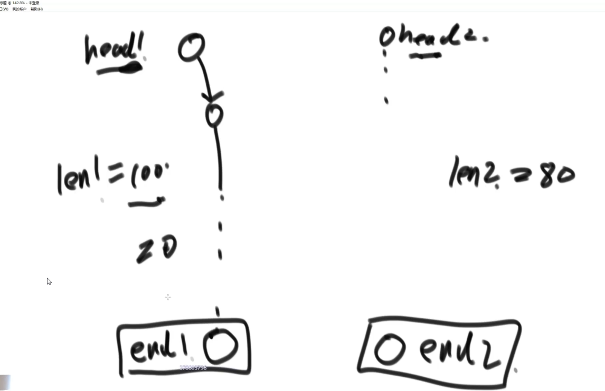

如果链表1比链表2长20步，那么链表1先走20步，然后链表2从头开始，他们一定会在第一个相交节点相遇


第二种情况，如果一个有环，一个无环，即一个遍历到最后为null，一个不为null


这种情况都是不可能相交的

第三种情况:两个链表都有环


设head1的入环节点是loop1，head2的是loop2，比较loop1和loop2的内存地址，相等时则表示是第二种情况，此时求第一个相交节点，此时我们将入环节点当成尾节点，然后和上面一样，直接比较长度，长的先走，然后一起走就能到第一个相交节点，即无环链表相交问题

判断情况一和情况三：让loop1继续走，如果能遇到loop2则是情况三，如果遇不到就是情况一

则情况一就是null，而情况三则是返回loop1和loop2都对，因为都是第一个相交节点


主函数调用：


先使用getLoopNode方法(快慢指针相遇)得到入环节点


## 二叉树


先序遍历：先遍历头节点，再左节点，再右节点

中序遍历：先左节点，然后头节点，然后右节点

后序遍历：先左节点，然后右节点，然后头节点


递归改为非递归：使用栈

先序遍历:先头节点压栈，然后弹出，打印，然后先右后左，循环处理


后序遍历的非递归：可以使用两个栈，先在第一个栈按照头左右加入，然后弹出来的都放另一个收集栈中


因为是头左右，所以放入收集栈中是头右左，打印的顺序是逆序，即左右头，所以是后序遍历

中序遍历非递归：准备一个栈，先把所有左节点压栈，然后弹出每一个时将右节点也压栈


 

宽度遍历使用队列：先放头节点，然后弹出，打印，然后先放左再放右


求一棵树的最大宽度：


不用哈希表：用两个变量存储当前层的最后一个节点和下一层的最后一个节点，这样的判断机制

**二叉树的相关概念及其实现判断**


搜索二叉树：对于 任意一棵子树，左节点都比他小，右节点都比他大

判断搜索二叉树：使用中序遍历，肯定是依次升序，否则就不是搜索二叉树


prevalue就是上一个的值，判断如果左树不是BST则直接返回false，如果head.value小于等于也是不行，然后把当前值设置位preValue，然后用当前的右树去递归

非递归方式：


**判断完全二叉树**

完全二叉树要么是满的，要么是只有最后一层不满，而且也必须是要变满的样子

思路：

- 利用宽度遍历，任一个节点有右无左则直接false
- 在第一个条件不违反的情况下，如果遇到了第一个左右孩子不全的时候，后续所有的节点都必须是叶子节点


 蓝色部分的判断是两个判断条件，第一个是指出现了左右孩子不全的情况并且它不是叶子节点，则返回false

**判断满二叉树**

 麻烦的办法：求出最大深度和节点数，然后用公式  N = 2^l - 1


**判断平衡二叉树**

平衡二叉树：左树和右树的高度差不超过 1 


二叉树递归套路：左树是，右树是，xxx

例如二叉搜索树：左树是搜索树，右树是搜索树，左边max < x，右边min > x，所以递归的返回条件可以定为：是否是搜索树，左树最大值，右树最小值


这其实就是树型DP，通过左右两个子树信息来得到当前信息

**满二叉树**

只告诉高度和个数


主函数得到整棵树的高度和节点数，用公式，2^l -1


这种套路不是所有题目都能解出，比如要求中位数，那不能通过左树的中位数和右树的中位数就得到全部的中位数

----


就是找两个节点网上最初汇聚的节点


通过递归把所有节点的父节点都保存到Map集合里面


然后再将第一个节点的父节点都录到一个Set集合里面，就是当前节点不跟它的父节点相同则保存进去，直到头节点循环停止，然后你再把头节点放进去，然后用循环遍历第二个节点o2，当遇到第一个父亲节点在Set集合里面就表示找到了最低公共祖先


更加抽象的代码：

可以分为几个情况：

- o1是o2的LCA，或者o2是o1的LCA
- o1和o2彼此不是最低公共祖先

这个代码意思是：如果某个子树上没有o1或者o2，那么这个子树一定返回空，遇到o1或o2直接往上返回

而如果两个节点不互为LCA，那么有o1的子树会返回o1，有o2的子树会返回o2，此时会中那个if判断条件，返回他们的头节点


----


前驱节点也是在中序遍历中

虽然可以直接遍历后得到中序遍历的list，但是这样复杂度为O(N)，实际上我们通过父指针可以直接得到后继节点，所以想以此优化

- 当x有右树时，x的后继节点是右树的最左节点 
- 当x无右树时，x的后继节点是一直往上判断是不是父亲节点的左节点，知道找到那个是父亲节点左节点的父亲节点
- 整棵树最右节点没有后继节点


当parent是空的时候，说明了这个节点是整棵树的最右节点，没有后继节点

----


先序后序中序来遍历序列化都行，本质上一样

按先序序列化那就按先序给反序列化


----

给定一个参数n，请打印一张纸一直对折n次后打开后的折痕方向

规律：在第一次折痕上方会出现一个凹折痕，下方出现一个凸折痕，改成二叉树结构就会发现，左子树头节点都是凹，右子树头节点都是凸，所以打印就是直接中序遍历就行


----

## 图


邻接表法：大体上是以点为单位，每个点的直接邻接点写在后面


带权值的


邻接矩阵：


还可以用数组或者其他方式表达图，最好的方式是用自己最会的方式写好模板，到时只需要做转化就行，比用题目给的数据结构来实现一遍算法更加快和稳定

图


一个是点集，一个是边集

点：

也可以将value改为String类型


in表示入度，指有多少条边到这个点来，out表示出度

next表示从这个点发散出去的边所指向的点

edges表示属于这个点的边（从这个点发散出去的边）

----

边：


假设用户给的是这种类型的数组：


需要转化为我们熟悉的


nodes是点集，哈希表结构，key为点的指，value是指这个点

查找有无from和to点，然后获得，然后建立一个新的边，然后修改值

如果具体题目有些数据项不需要，就可以不填

----


这个Set是为了保证不要重复进队列

其实哈希表可以替换为数组，因为有些题目就是数字，而且数据量不大，所以可以数组寻址更快


----


首先找到入度为0的节点，然后将其影响的边擦掉，再找入度为0的节点


所以拓扑排序的下一个是B，以此类推


----


这个算法就是为了生成最小生成树

最小生成树：保证所有点是连通的，同时权值要最小


算法：从最小的边开始考虑，如果加上的时候没有环就加上，形成了环就不行

所以就是要考虑，如何在加上边后判断是不是形成了环，即并查集

首先每个点都是一个单独的集合，加上一个边后判断是不是在同一个集合，如果不是则将其加到一个集合内


这里不展开讲并查集，可以自行查资料，这里用一种简单结构来做

首先建立结构，每个点都有一个自己的集合


然后实现一个接口，判断两个节点是否在同一个集合里面，就判断这两个集合是否内存地址一样就行


然后是如果不在同一个集合，就要合并到同一个集合中

就是把所有toSet中的节点加入到fromSet中，然后把toSet的指向的List改为fromSet


实现这些功能后，使用k算法

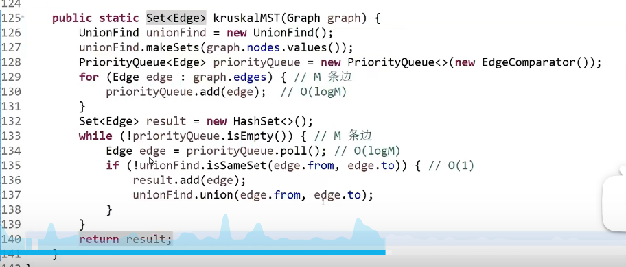这里的unionFind就是并查集，可以用刚才写的方法替代


----

prim算法生成最小生成树


从哪条边出发都行，刚开始认为所有边都没有解锁

从A出发，就是6，1，5这三条边解锁，然后选择最小的1，C就加入集合中


然后就又多了5，5，6，4这4条边解锁了，加上刚才还有2条边，从这里面选一个最小的

然后如果遇到相同权值的边，那就要考虑是否已经加入了集合


用Set集合来判断是否已经考察过了这个点


这个代码会把重复的边放到里面去，但是不影响结果，因为就算重复的边放进去了，对应的点也已经加入到Set中了，会被if给过滤掉

而最外面的for循环是处理森林问题


寻找下一个整体连通的区域，找到最小生成树加入到result中，如果一开始都是连通的，那就不用这个大的for循环

----


用于寻找单元最短路径，适用范围实际上可以有负数边，但是不能有累加和为负数的环

规定一个出发点，求从这个点到后续每一个点的最短距离


初始时，自己到自己是0，其他都是无穷


然后判断A可以到的点，是否将原来的记录变得更短，变了就改写


使用完A后就锁定，再也不用A了，然后剩下中最小的到B，发现B到外面也有3条路，指向A的路是3，但是A到A已经是0，没有更小，所以不改，然后发现B到C有个2，更小，改写A-C为3+2=5


getMinDistanceAndUnselectedNode()是在distanceMap中找到一个最小的记录，但是不能是已经处理过的


就是，如果一个最小距离的节点，他的每一条边，如果原本没路的地方有路了就新加进去，如果让一个之前有路的距离变得更小了就更新

可以用堆来改写，但是不能用系统的堆，因为你会修改值，而系统提供的就不太合适，得自己改写

就是维护一个可以修改的小根堆，每次选取节点后能更改堆中节点的值后还能调整为小根堆


nodes数组是堆的底层结构，然后heapIndexMap用来存储每个节点在堆中的下标位置，distanceMap用于存储node到head目前的最短距离，size表示目前这个堆有多少个节点


isEntered方法判断node是否已存在堆中，本来堆中是要弹出的，但是我们在heapIndexMap中是一直有记录的，弹出了就标记为-1

inHeap就是判断是否在堆中

swap交换方法是在堆中要交换位置


这几个方法之前讲过


addOrUpdateOrIgnore方法是指如果一个新的节点进来就增加记录，如果一个新的记录进来比之前的记录更小就更新，如果比之前更大就忽略

第一个if判断如果有新的值进来了，节点已在堆中，则更新distanceMap，然后用insertHeapify进行堆的调整

第二个if是如果没有进来过堆，就新建


----

## 前缀树


根据字符串建立前缀树，字符一般在路上，如果前面出现过就复用，没有就新建


走过了哪里就p+1，结尾的节点就是e+1


建好一棵树后，我们可以查询bc是否出现过，就是直接去找，看b这条路有没有，c这条路有没有，然后看c这个节点的e值是否为0，不为0表示bc出现过

现在求：之前加的字符串，有多少个字符串是以 ab 作为前缀的

其实就是求p值，p值代表这个节点被通过了几次


----

## 暴力递归


哈诺塔只能小的在大的上面


这个问题可以理解为，1~i个圆盘从from到to位置，还有一个other辅助，可以分为以下三步


然后不断拆分


----


从左到右每个位置穷举要或者不要


省空间做法，直接改str


----


排列就是第一个位置是n种可能，第二个位置是n-1种可能，以此类推


每次把第i个字符与后续的字符进行交换后进行process过程，然后再交换回来

那么如何保证不重复进行？

用visit表进行存储每个字符串位置是否尝试过，试过就不尝试了


也可以直接全部排列出来再把重复的洗掉，但是这样做在常数项上就更慢点

而这里采用的是分支限界，提前处理不可以尝试的路

----


实际上就是要分先手和后手两个函数来确定，先手的时候，先拿一个以后，轮到对方先手，再拿后手函数里面最大的，后手的时候，如果到了base case，则拿不到牌，否则就是对方先手拿完后，轮到我方先手，但是只能得到最小的，因为对方会把最差情况留给我们。不需要考虑太长远，只需要在某一个范围内保持这样的决策


----


先定义一个函数，将栈底元素弹出并返回


从reverse开始


----


假定 i 之前的位置已经决定好了，求 i 之后的转化结果

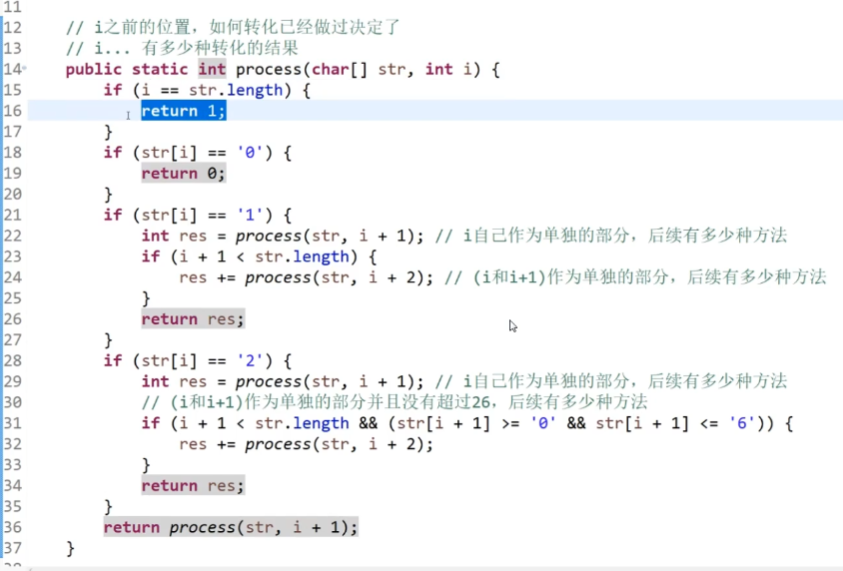

当来到字符最后一个时，表示前面的转化都决定好了，这就是一种转化结果，所以返回1

当遇到0的时候，表示现在坠入了一种无效状态，所以整体0种有效状态

当现在压中了1，那么我们可以有两种选择，一种是 i 作为自己单独的，后续有多少种，另一种是 i 和 i+1 作为一个整体，看后续有多少种，这两种情况应该相加

当压中2时，要考虑不能超过26，剩下最后就是3~9时，只有一种决定

----


这种情况就可以直接全部展开，0~i 要或者不要全部计算，也是只管 i 往后的货物自由选择

选择就是判断最大，如果 i 号货物不要，则从 i+1号开始进行判断，如果 i+1要，则加上当前重量


也可用这种方法


----


每次从新的一行开始点，就只需要保证不共列和不共斜线就行，然后当达到最后一个皇后时，表示前面都合法了，这是一种解法，返回1


在第 i 行中，0-n-1列上每一列都尝试，isValid方法是黑盒检查方法，表示检查 i 行 j 列的皇后是否跟前面 i-1行的皇后不共列不共斜线


先判断是否共列，然后判断y-y，x-x来判断斜率，因为如果一样就表示要么45°要么135°

可以使用位运算进行加速


建立三个变量来做限制，为1就表示这个位置不能放皇后

而判断下一行的左斜线限制，就是用当前选择 或上 左斜线限制，再整体左移一位

而判断下一行右斜线限制，就是右斜线限制 或上 当前选择再右移一位


这个limit就是表示是几皇后问题，则右侧就有几个1，左侧全是0


----

## 哈希函数和哈希表

哈希函数是不随机的，相同的数得到的哈希值相同，不同的输入也可能导致相同输出(哈希碰撞)


如果输入值经过 f 哈希后得到的值在 S 上均匀分布，则 %m 后的值就在 0~m-1上均匀分布

题目：如果一个大文件，里面是无符号整数(范围是0~2^32 -1，即0~42亿+)，总共40亿个数，只给1G内存，找出出现次数最多的数

解答：如果我们用单纯的哈希表key value来对应数和出现次数，会出现内存不够，因为一个key和一个value分别要4B，就算不计算哈希表内部消耗，也可能要到320亿B，即32G。

但是实际情况不一定会是最差情况，同样的数可能多次出现，这时候我们就可以使用哈希函数


得到的m1，m2数范围都是0~99，对应发送到几号文件，相同的数一定发送到同一个文件中，不同的数也会在种类上均匀分到100个文件中(哈希函数的离散性，均匀性)

然后我们在每一个小文件中使用哈希表，就可以做到让原来的32G%100，每一个小文件中再来找到最大的出现次数，最终再统一比较，可以保证不爆内存

不用管碰撞，因为我们在小文件中是用最初的数来做哈希表


**哈希表的实现**

相当于一个数组接上链表


这样就要考虑到数组长度问题，考虑到扩容问题，即设置条件，假如一条链已经到了长度6，根据哈希函数的均匀分布，可以认为其他链也基本到达长度6，此时扩容，我们可以把表扩容到34，每个数重新%34进行计算哈希值

此时我们估算代价，计算哈希函数是O(1)，但是这是一个大常数，%34也是O(1)，在链表中寻找这个记录的时候，如果链表长度为k，则是O(k)，如果保证链表不是特别长，则就是O（1），但是扩容代价则是O(logN)，总共有N个字符串，而每次扩容都会重新计算哈希值，所以每次扩容有O(N)的计算代价，所以总共扩容代价为O(logN*N)，而均摊到每一个数的扩容代价，则是除以N，即O(logN)，逼近O(1)

所以哈希表在使用上可以认为增删改查都是O(1)，但是理论上是O(logN)

----


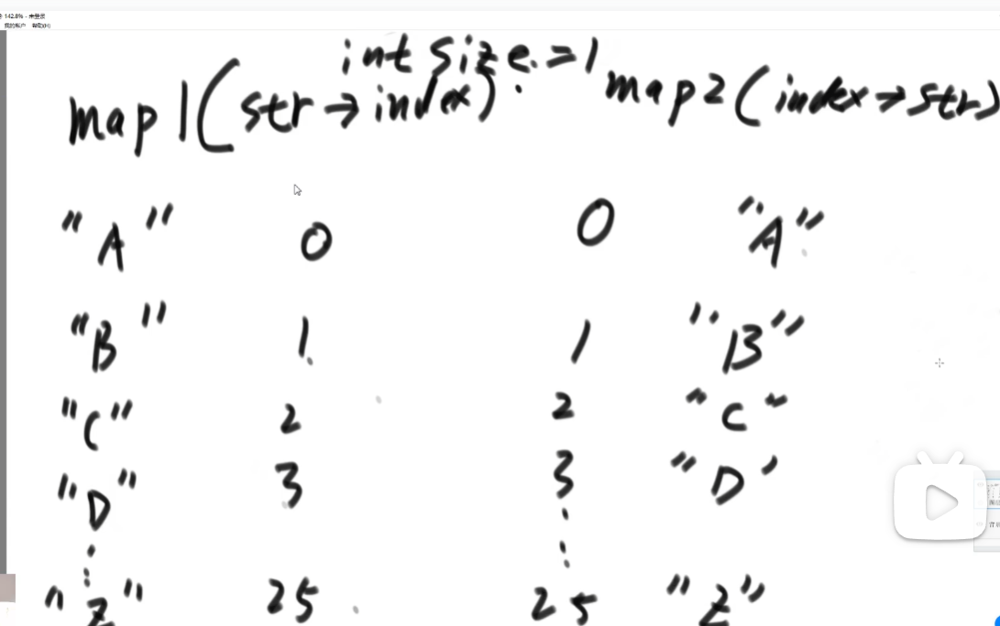

没有删除行为时，我们只需要保证得到一个随机的0~25的数，即可随机的到一个key

如果有删除行为，因为哈希表中实际上是不连续的，如果我们直接删除，则会出现很多个空洞，每次getRandom时可能就会取到空洞，解决办法是，我们拿map2中的index的最后一个，去填上即将删除的那个map1中的。

例如要删除D-3，将25对应的Z，在map1中更新为Z-3，删除D-3，再删除map2中的25-Z，再更新3-Z即可，这样我们取随机数只需要改为0~24


----

**布隆过滤器**


假设有100亿个url，每个url为64Byte，在这个系统中，用户使用一个urlx时，要判断是否在这个100亿个url之中(黑名单)，只有增加和查询操作

这里我们可以使用HashSet，就是没有value的HashMap，但是每个都加进去肯定内存爆炸，而我们可以使用布隆过滤器

布隆过滤器是极大减少内存要求，但是可以允许一定的失误率


它不会出现把黑名单中的内容误放，只可能出现把正常内容当成黑名单中的内容的情况，但是可以认为调整概率，只是失误率不可避免。

使用布隆过滤器先了解 位图，bit arr 或者叫 bit map


整型数组，每个占用4字节，32bit，long类型，8字节，64bit，而使用bit类型数组，则每个占用1bit，100个则是100/8个字节

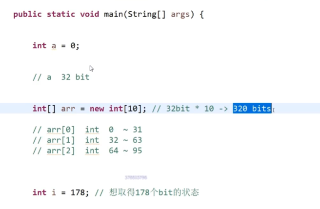

首先申请一个长度为10的整型数组，可以表示长度为320的bit类型数组


178/32表示第几个数里面包含了178bit，而178%32，则是查看这个数中第几个bit表示的是178位bit

这个数右移 bitIndex位，则第178位bit的信息就在这个数的最右侧位置，再将它和1进行 与 运算，得到178位状态是1或者0


而布隆过滤器是一个大的位图

假设有m bit，每个url调用k个哈希函数，得到k个值，把对应的位置描黑


这样就建立好了，当urlx进行查询时，将它调用k个哈希函数得到的值，在位图中拿状态，如果全是1，则表示在这个集合之中，有一个不是1，则认为它不在这个黑名单集合中

这里只有k和m的长度不确定，而如果m太小，则输入太多的时候，可能整个位图都是黑的，这时就所有url都是黑名单，因此m开的越大，失误率可以越低，而k是根据m和失误率来确定


----

**一致性哈希原理**


## 有序表 并查集

**岛问题**


感染问题：定义一个函数将每个连在一片的1都改为2，遍历即可


----

**并查集**

并行算法解决岛问题，先了解并查集结构


issameset方法是判断两个集合是否相同，union是合并两个集合，有很多结构可以做到，但是并查集可以非常快

并查集维护每个集合中的数有个向上指针，最初都是指向自己，合并就是把另一个的最终的向上指针接到另一个集合中

而判断集合是否相同就是看代表元素是否相同，代表元素就是每个集合的向上指针最终指向的那个元素


合并是少的顶直接挂在多的顶上

就是一个往上指的图结构，而并查集中的重要优化是：向上找最终的顶部是可以优化的

如果某个链过长，那么查询过程十分长，所以我们在查到最终顶部时，把之前经过的每个节点的顶指针直接指向顶部


用HashMap来做，维护三个表，用fatherMap来表示父节点的对应关系


并查集初始化要求样本都给予

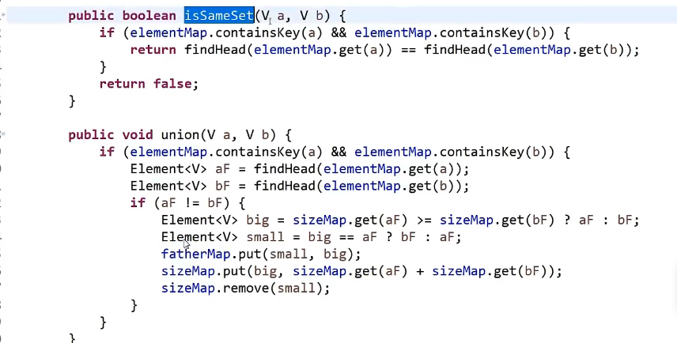


findHead包含扁平化优化，优化查询过程

----

当我们理解并查集后，就可以开始讨论并行算法解决岛问题


假设有这样的二维数组，单独看是只有1个岛，从虚线分开后，还是用感染过程看，左边是2个岛，同理右侧也是2个岛，这样的话我们需要一个合并逻辑来合并

我们把初始感染位置记为A，找到每次感染的边界位置，记录为从A点感染来的


同理右侧也是这样，收集左侧边界的信息

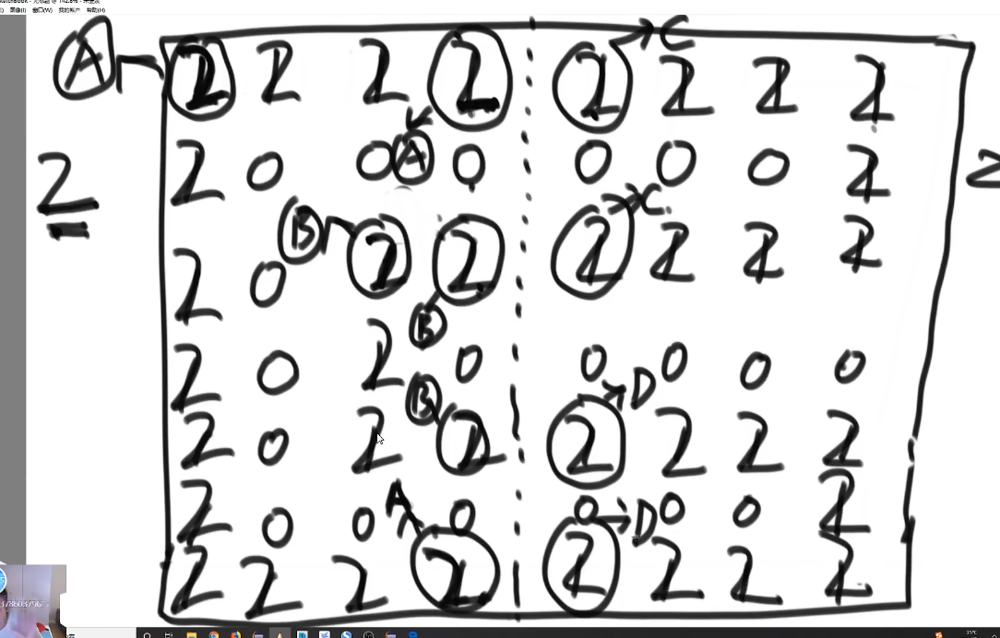

然后进行合并，一共有4个边界点，ABCD，首先各自为一个集合，然后把边界相碰的两个进行查询是否一个集合，不是则合并，合并后岛屿数量减一，一开始A和C合并，总共3个岛，然后继续合并。

这样做就比单独一个CPU去做更快，分为两个CPU去做一个任务再合并

多个CPU同样逻辑，不断合并

----

## KMP


暴力解法就是尝试每一个开头进行匹配，但是时间复杂度较高，为O(N*M)，N和M分别为两个字符串长度

我们看到一个字符串，当前字符k所表示的信息是它前面的字符串中，前缀和后缀相等的最大长度


所以k的信息是3，不能取到整体


而这个信息，我们是要对 str2 的每个字符都求信息

开头为-1，第二个字符的信息，因为前面只有一个字符，不能取整体，所以为0


有了next数组后开始加速

str1 从 i 位置开始和 str2 比对，直到x 和 y 比对时第一次出现不同，本来应该跳回去重新比对，但是KMP中，str2从Y跳回到Y对应信息的前缀的下一个位置


再在str1中标记一个 j 位置，代表str2中信息对应的后缀的第一个字符的位置，然后将str2滑动到这个位置来


然后X再继续跟前缀的下一个比对


复杂度为O(n)


如果 i-1 的信息位置对应的字符跟 i-1 位置的字符一样，则 i 的信息就是 i-1 的信息 +1


而如果不一样，则从 i-1 的信息对应的位置开始往前跳


比如这里就是，如果e和？不同，则从e开始看它的信息，看s和？是否相等，此时e的信息是3，如果s和？相同，则 i 的信息就是3+1=4，如果s还不等于，那就从s开始往前，s的信息是0，则看第一个字符a和？是否相同


如果相同则 i 的信息是1，如果不相同，因为已经没有了，就是0


cn是指拿哪个位置的字符和 i-1 的比，i=2的时候，i-1 的信息是0，也就是拿第1个字符跟 i-1 比，第1个字符就是第0位置

cn也代表当前 i-1 的信息是多少

----

## Manacher算法


暴力解法可以使用双指针遍历每个字符然后往两边进行判断，但是这样的情况无法判断偶数回文


对字符串加上特殊字符进行处理，每个字符再计算，就可以完全找到所有回文串，将找到的个数除以2即可得到答案(向下取整)，特殊字符随便加，可以在原来字符串中出现过

这是经典解法，时间复杂度是O(N^2)，但是我们可以进行加速

先明确几个概念：

- 回文直径和回文半径，就是整个的长度和除以二向上取整
- 做一个辅助数组，把每个回文半径记录下来


- 定义一个变量 R ，记录每次找到回文串的最右侧边界的最大值，每次更新

- 变量 C ，记录每次R更新后的回文串中心点位置


例如到第一个 2 时，回文范围是2~4，R更新为4，C更新为3

1. 当前点的位置没在回文最右边界R的范围内，这种情况只能暴力向左右两侧扩展范围

   

2. 当前点 i 在R内侧，必有中心点C在 i 的左侧，找到左边界L和 i 根据C做对称的 i`点

   

   再将这种情况进行细分(以下都先省略特殊字符方便理解)

   1. i' 得到的回文区域在L-R的内部，此时 i 的回文半径就和 i' 相同

      

   2.  i' 的回文区域有一部分在L-R的外面，此时 i 的回文半径就是 i-R这一段

      

   3. i' 的回文区域刚好和L重合，此时 i 的回文区域有一部分是确定了的，但是还有一部分需要拓展判断

      

      这里就是R的右边如果是k，则就可以拓展


整个循环，每个i最多失败一次，失败复杂度为O(N)，循环内部条件每个都是要么i++要么i和R一起++，最多到N，所以是O(N)


这个方法是加特殊字符


for循环里面第一句是处理不用验证的区域，用min是求至少的

while循环是把所有情况都往外面扩展，就算遇到不用扩的情况，也只会失败一次

最后是求得最大得回文半径-1就得到最大回文串长度

----

## 滑动窗口、单调栈


窗口运动有左边界和右边界，L不能超过R，任何一个时刻可以选择让L动或者R动

**讨论迅速获得窗口内最大值和最小值问题**

维护一个双端队列，即可以从头进也可以从头出，可以从尾进也可以从尾出，把窗口内得值的下标放里面，规定窗口内的最大值都在双端队列的头

遇到比前面的数大的数，就把之前的数弹出，弹出的数不找回


注意，这里存的都是下标，但是比较大小是比的对应位置的数


遇到相同也要弹出，严格单调

当把L进行移动时，如果窗口内出去的数刚好是双端队列头部的数，就直接弹出，如果不是就不管

**双端队列维护的信息是，如果窗口中淘汰值了，那么谁会继续成为最大值**

双端队列更新的代价是O(N)，单次的平均代价就是除以N，平均代价为O(1)

这道题更简单，已经限定了窗口大小和移动轨迹，只要每次记录下每个窗口状态下的最大值


自由调用的黑盒：


**单调栈**

解决的问题：一个数组中，想得到每一个数 左边离他最近的比他大的，和右边离他最近的比他大的 是哪个数


想要尽可能快速到O(N)

经典方法O(N^2)，每次来到一个位置进行遍历


维护一个栈，保持单调性，遇到不符合单调性的就要弹出，每次弹出的时候，弹出的数的信息就生成了，左边最近最大就是当前栈顶，右边最近最大就是现在遇到的这个数

弹出就不返回，直到遍历到最后，此时将栈中剩下的都弹出来生成信息，此时他们右边最近最大都没有

有重复值也可以，栈中存集合，相同的放一起


每次弹出，先生成集合最前面的数的信息，而需要取右边最近最大时就先取的是集合中的最后一个

----


此题漏了一个条件，正数数组，累积和是累加和

此题解法：每个数找到它的子数组中，它自己必须是最小值，可能很多个子数组，找到累加和最大的那个

就是把每个数做单调栈，找每个数左边最近最小和右边最近最小，这是它扩展不到的位置，中间全部是扩展的到的，而且累加和肯定最大，因为是正数数组

----

## 树形dp套路


树形dp的题可以根据头节点参与或者不参与进行分类


三种情况取最大值

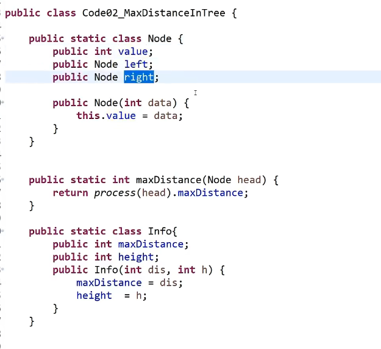


----


分为头节点参与或者不参与的情况

参与的情况就是，直接子节点不来的情况下的整棵子树的最大快乐值

头节点不参与，则是0+每个子节点的子树的两种情况的最大值相加


一开始的lai和bu，都是自己，然后循环每个直接下级

x来的时候加上直接下级的不来，x不来的时候加上下级来或者不来的最大值

## 二叉树Morris遍历


一般代码中没太高要求就不用这个，因为较其他代码更复杂一点

实际上是利用原树底层节点中的大量空闲指针实现，也叫做线索二叉树


一个节点如果有左树，就一定出现2次

最普通的遍历就是这种情况


打印语句放在123，分别代表先序中序和后序


递归版本一个节点要回到3次


总代价逼近O(N)

修改成先序遍历：


中序就是把出现两次的节点，第二次再打印


后序遍历就换成能回到自己的那个节点，第二次到达时，逆序打印左树右边界，而只经过一次的什么都不做，然后最后单独逆序打印整棵树的右边界

而逆序操作，其实就是单链表的逆序操作，先逆序把右指针全部指回去，打印完再逆序回原样


----

如何判断一棵树是否是搜索二叉树？

就是在中序遍历的过程中，一直是升序


如果题目要求是必须要做第三次信息的强整合，就是要完左树信息，要完右树信息，再回到头节点做强整合，那么就是使用二叉树的递归套路是最优解

如果题目不需要第三次信息的强整合，比如那些先序中序遍历，依次判断这些事，就不一定用二叉树的递归套路，最优解是morris遍历

----

## 大数据题目


可以使用哈希函数，或者位图来做

如果条件再限制为3KB

我们使用无符号整型数组来存，一个整型4字节，3KB/4，取最近的2的某次方的结果，是512，而题目数据是0~2^32-1，我们就可以将2^32个数平分到512个位置上


平分后，每个位置表示当前区域的数出现了多少次，40亿个数，每个数出现的时候，x/8388608 就得到该分到哪个区域，将这个区域的词频++，因为我们的范围是42亿多，而输入只有40亿，总有在一个范围内的词频不会达到8388608个，再在这个范围内，再分成512份再来遍历40亿个数，周而复始就能知道哪个数是没出现的

这是利用词频统计一定会不够的情况来判断

如果只能利用有限几个变量，怎么找到一个没出现过的？

使用二分，某一侧如果满的话，就会是2^32/2个词频统计，一定有一个不满，继续二分直到范围是1，最多遍历32次这个文件

----


利用哈希函数或者布隆过滤器都行

这里利用堆的技巧，原理还是通过哈希函数将海量文件分到小文件里，一种重复url只会出现在一个文件里，每个小文件统计词频(哈希表)，每个小文件做出top100后，用堆的技巧来统计总共的


三个小文件的堆顶拿出来，单独做一个大根堆，每次弹出堆顶，然后去看这个堆顶对应的文件，把他的下一个又放到堆里面去


----


还是可以使用哈希函数分流，这个很万能

这个可以用位图做，本来位图只能表示一个数出现过或者没出现过，但是可以用两个位来表示这个数的出现状态


范围是0~2^32 - 1，每个数用两个bit来统计的话，就是2^32 * 2 bit，兑换字节除以8，刚好1G内存

而找到中位数，也是利用范围统计的技巧


如果只有10KB，我们能有多大的无符号整数数组，就是除以4B，大概2500长度，看看跟2的几次方比较接近，2048比较接近，所以数组长度定为2048，我们的范围是2^32，等分为2048，肯定能分完，然后遍历这些数，某个数属于某个范围就把那个范围++，比如11，输入0号范围，就arr[0]++，然后我们要找中位数，就是找第20亿个数左右的，如果前面已经统计到arr[499]时已经有18亿个数了，那么后续肯定中位数在arr[500]这里，然后再在arr[500]里面重复这个步骤


----


n先右移31位，符号位到最右边了，和1进行与运算，此时0正1负，与1进行与运算，然后调用flip函数取反，做到传入n是非负数就返回1，n是负数返回0

getMax方法把 if else 替换为互斥条件相加，总有一个为0，但是这个方法有个问题，a-b可能溢出，就会出错，但是我们要理解互斥条件相加的思路

所以用下面这个方法来考虑溢出


返回a 有两种情况，一种是a和b符号相同，不会溢出，a-b>0，第二种是ab符号不同，a>0，所以returnA就是两种返回a的条件

----


2的某次幂，就是二进制只有一个1，所以这题只需要把最右侧的1取出来，跟原来数比较是否一样就行

还有方法是，如果x只有一个1，那么我们x-1就会把这个1给打乱，此时让x & (x-1)一定==0


判断是否是4的次幂就是先判断是否只有一个1，然后再跟0101010...进行与运算，如果不等于0就表示是4的次幂，因为4的次幂的1都在0，2，4，8这些位上


异或运算，就是无进位相加，而求与运算，就是两个数的进位信息，而与运算向左移动一位，就是完全的进位信息


所以这两个相加就行，然后再继续把这个异或结果和进位结果计算他们的异或结果和进位结果，不断进行，知道没有进位信息了，此时的无进位相加的结果就是答案


任何数的相反数就是他自己取反然后+1，所以减法可以用a+b的相反数来做


乘法跟普通乘法一样


然后累加就行


b&1是看最后一位是不是0，如果是0，那么res就不加，然后a左移一位，b右移一位


然后b的最后一位是1，res+a，直到b全部移完

而a除以b，我们先让b尽可能左移，但是不能超过a，然后让a-b


其实就是乘法的逆运算，我们的乘法是让1的位置左移进行相加，比如现在00101 * 01100，所以我们分别左移两位和3位得到0010100和00101000，再相加得到结果是0111100，那么我们想除回去，想用这个结果除以0000101，那就先让这个0000101左移到不能再左移，此时是0101000，那么我们肯定可以知道，这个第四位的1，肯定在原来乘的那个数上是个1，所以我们把这个0101000减去得到0010100，然后再左移到不能左移，再减去，就是乘法逆运算除法


----

## 暴力递归到动态规划

给出一个整数N>1，代表有N个位置，一个整数S，范围是1-N，机器人一开始就在S位置上，机器人要去e位置，e的范围也是1-N，而机器人必须走 k 步情况下，只能往左走或者往右走，不能不走，比如走到N，只能往N-1走。而现在必须走k步的情况下，从S走到e，有几种方法？


这是暴力递归方法，直接把条件列出来进行递归

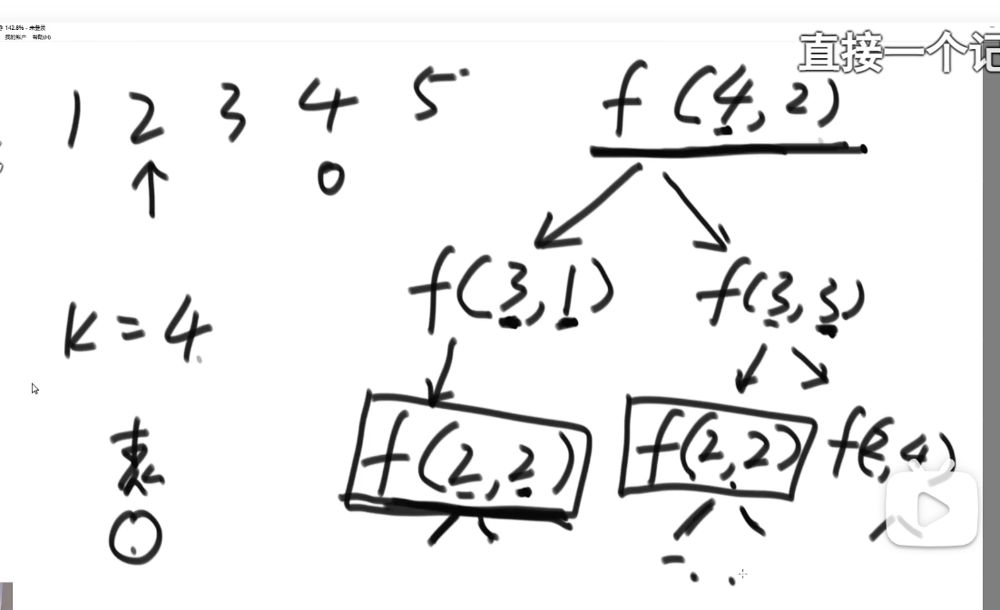

暴力递归就是会重复计算已经计算过的，如果我们有一个表结构，记录已经存在的结果，就可以节省很多时间，用空间换时间，从这里我们可以知道，只要这个可变参数确定了，那么不管是谁调用，结果都一样

这种情况就适合改成动态规划，无后效性的规划

递归的第一步优化是**记忆化搜索**

2个参数，肯定是二维数组，判断参数取值范围


用了缓存，肯定有建立缓存过程，修改一下就行


原始递归，因为机器人只能往左右走，可以认为是一个高度为 k 的二叉树，最坏情况下是O(2^k)，而修改完的版本，是O(k*N)

下一步，我们将其修改为**动态规划**


我们根据原来的递归函数，来判断这个表格的结果，行是还剩几步，列是当前位置。首先第一步，当res==0时，就是终止条件，只有到达k=4位置时返回1，其他都是0，然后我们可以知道，k属于1-N，所以第一列全部无效，然后看第二个递归条件，找边界条件，可以知道，当在1位置的时候，依赖的结果是它右上角格子的结果，然后依次类推看剩下的递归条件，就可以完全把这个表格直接写出来了。这就是**严格表结构的动态规划**

它跟记忆化搜索不一样，记忆化搜索只是缓存，而严格表结构要纠结位置依赖的顺序

因此我们可以看到，每个格子的求解时间都是O(1)，所以整个时间复杂度是O(k*N)


----

给出一个正数数组，里面每个位置代表一枚硬币上的面值，有可能有重复，如果给你一个值，请求出组成这个值最少用几枚硬币，不能重复选择相同位置的硬币


这种模型是 **从左往右尝试模型**


index是当前位置，rest是还需要多少钱才达到目标钱数，最终这个方法返回是最少需要的硬币数量

当rest>0，但是已经到数组结尾了，说明不能得到这么多钱了，返回-1无效解，如果还剩下硬币，那么久开始选择，p1是不选择当前硬币，p2Next是选择当前硬币时，后续的情况，所以进行判断


**下一步，改成记忆化搜索**

做个二维表，-1表示算过，是无效解，所以用-2表示没算过


**下一步改为 严格表的动态规划**

通过递归函数，我们可以知道他们的依赖关系，应该从下往上填表，从左往右填表


填好初始条件后，我们直接把递归过程复制到这个循环当中来改


这类106行应该要改else


----

之前的绝顶聪明的题，一开始几个数字，两个人只能从最左或者最右拿牌，看谁最后拿到的牌分数最高，要考虑当前拿了这张牌后对面是否会拿到大牌


当时是用的在一个范围内进行尝试，如果先手最优分是多少


对手一定会给你最差的

**修改为动态规划**


主函数就是在范围内的先手和后手获得得最高分的最大值就是获胜者

两个函数，两张表，i，j取值都是0-length-1

先找主函数需要得到的结果的位置，是0行的length-1位置


因为是正方形表，范围尝试模型，是0-length-1，表的左下方是无效的，因为不可能出现1-0范围

下一步改basecase


接下来看普遍位置是怎么依赖的

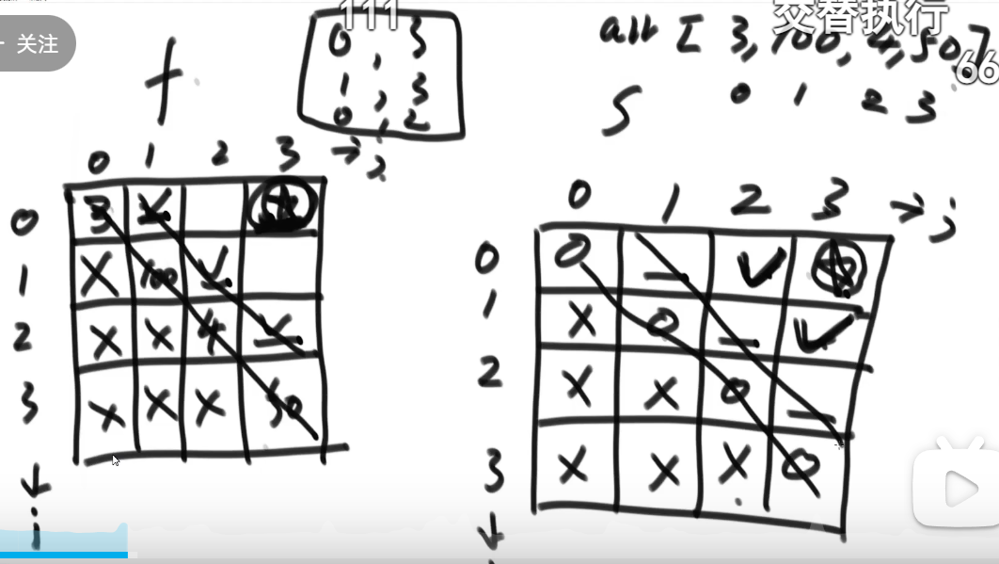

分析可以得到出，f表的普遍位置是s表对应位置的左边和下边，而s表也是在f表对应的左边和下边，所以可以得知，f表的对角线可以推出s表的倒数第二条对角线，而s表的对角线可以推出f表的倒数第二条对角线，以此类推上去

**范围上尝试通常看对角线**


----

**改动态规划一定要画图才行！**

现在有一个棋盘，有一个马，开局在(0，0)位置，要去(a，b)位置，一定要走k步，跳到(a，b)的位置的方法是多少种


注意棋盘的范围是x是0-8，y是0-9


假设现在到a点了，只需要一步就可以走到那个需要到达的点了，那我们到a点的函数就该写成(ax，ay，step-1)

总共有8个这样的位置，这种算是逆推

**修改动态规划**

这里三个参数，是三维表

step是这个体的高度，看条件可以知道，每一层都是依赖下一层，那么从第0层开始，可以推第1层，第1层可以推第二层


getValue防止越界

----

给出两个数代表行和列，再给出一个n和m，代表人的位置，可能是越界的，再给出一个参数 k ，人只能从上下左右走动，如果越界代表人死了，那么人活下来的概率是多少

我们可以先算人活下来的方法数有多少


然后我们知道，不考虑人死的情况，可以走4^k次方种方法，那么用活下来的方法数除以它即可


gcd是求最大公约数

修改为动态规划也是一样的，高层只依赖于低层


----

给出一个正数数组，数组内无重复值，一个位置的值代表一个面值的货币，可以重复使用一个位置的货币，如果我需要找出1000，请问有多少方法


这是标准的**背包从左往右尝试模型**

这里的尝试过程是暴力遍历所有情况


**修改为动态规划，二维表**


当rest等于8，index=1时，拿的是5块钱那个，一开始拿0张，就是他下方，第二次拿1张，要-5

依赖的是根据当前货币，挑出的某些位置 ，枚举后累加，如果不优化这个枚举行为，那么代码很好写

整体顺序从下往上


这里有枚举行为，总共时间复杂度是O(N*aim^2)


本行左边一个位置其实已经把前面的加了，所以？的位置就是x+a即可


不越界才能加

**从尝试递归-->记忆化搜索-->严格表的动态规划-->精致优化的动态规划**

尝试的过程中，不要让代表状态的可变参数突破0维，最好就是一个整数，如果上升到数组，那就很复杂了，可变参数的个数也要尽量少

----

## 平衡二叉树

有序表的所有操作都是O(logN)级别的


红黑树、AVL和SB树时间复杂度相同，都是属于平衡搜索二叉树系列，跳表跟这三种类型不同，是单链表改写的

**二叉搜索树的概念**

二叉搜索树又称为二叉排序树，它或者是一棵空树，或者是具有以下性质的二叉树：

- 若它的左子树不为空，则左子树上所有结点的值都小于根结点的值。
- 若它的右子树不为空，则右子树上所有结点的值都大于根结点的值。
- 它的左右子树也分别是二叉搜索树。

可以默认搜索二叉树上没有重复值，因为就算遇到重复值，我们可以在一个节点上的值做链表

搜索树的删除，就是找到这个删除的节点，并且记录它的父节点，然后删除就行，假设这个节点还有孩子节点，就让这个孩子节点替代它的位置就行，直接删掉然后让父节点指向它的孩子节点

而如果两个孩子都全，则比较麻烦


如果要删除 3 这个节点，就要么将它左树最右节点替换上来，要么是右树的最左节点


把4的右边子树接到6这里，然后把4替换3

其他的红黑树，AVL,SB树都是这样增删改查

现在的搜索二叉树，没有平衡性，时间复杂度不能维持到O(logN)

严格的平衡性：左树跟右树的高度差不能超过1

而这里我们不要求严格，只要求任何一个节点左树右树相差不多，这样也能做到O(logN)

**AVL树**

平衡二叉树，全称为平衡二叉搜索树
它是由苏联数学家Adelson-Velsky 和 Landis提出来的，因此平衡二叉树又叫AVL树
平衡二叉树的定义是一种递归定义，要求每个节点都具有以下特性：

可以是一棵空树
左子树和右子树高度之差的绝对值不超过1（左右子树的高度差可以为0、1和 -1）
左子树和右子树均为平衡二叉树

**搜索二叉树，如果带有左旋和右旋，则是一种自平衡的搜索二叉树，而AVL树，是实现的怎么用这个左旋和右旋的操作**


**红黑树也是这样，但是红黑树有关于自己的平衡性定义，在这种定义下，怎么去实现左旋右旋，SB树同理**


左旋是往左边旋转，C为头节点了，C的左节点比A大，比C小，所以可以成为A的右孩子


右旋同理，B的有孩子比A小比B大，所以成为A的左孩子

现在有个问题，AVL怎么查到自己的不平衡的？

**AVL的增删改查和搜索二叉树相同，但是每次增加或删除一个节点，会从加入的节点开始，往上每个节点查一遍平衡性**

但是删除节点时会遇到一种情况，如果删掉的这个节点左右孩子都有


此时把6替换给5，7接上A，这时从7节点开始查，查7，8，6为头节点的树是否具有平衡性，就是从替换的那个节点的父节点开始查

**那么现在到底具体怎么检查呢？有几种被破坏的情况：**

1. LL型

   左树的左边过长，做个右旋就行

2. RR型

   右树的右边过长，做个左旋

   

3. LR型

   左树的右边过长，调整的时候让那个过长的那部分的头节点旋转成头部就行了，就可以先把X左旋上来，再右旋上去


4. RL型同理，先右旋上去，再左旋上去

   

那么我们怎么确定是这四种类型中的哪一种？


判断左右树的高度，如果右树更大，右树的右树不为空，说明RR型，单次左旋，否则就是RL型，双次调整


----


**SB树**


SB树也有4种调整情况

LL型：左边子树的子树大小，大于右边子树的大小


先做一个右旋，然后再去看孩子变了的节点，进行一个递归判断是否是需要调整的


第三步，发现L的孩子节点也变化了，所以再检查L的

RR型态也是这样，左旋就行，然后递归检查

然后LR型态也是，先左旋后右旋，让那个节点到头部，再递归判断那些孩子变化了的节点


红黑树也是打标签，SB树是size标签，而AVL树是height标签，红黑树就是每个点不是红就是黑

**红黑树**

红黑树的叶节点，指的是最底层的空节点

头节点和底层叶节点(null)必须为黑

红节点不相邻

每一个cur节点，到它叶节点的每一条路径要求黑节点数量一样

其实这些规定就是，最长的那条路径就是黑红交替的，最短的路径就是全是黑节点的，而这两种之间的高度差不会超过两倍

**跳表**

跳表是实现有序表的一种方式，它的Key 一定要求可以比较

指向下级的指针都在链表里，可能有指向多个下级，不止两个


有一个默认节点，它的 key 是默认全局最小，一开始有个指针指向空，


现在有个新节点3，开始随机摇骰子，扔到1则继续仍，同时指针数量+1，直到扔到0，假设扔了两个1，一个0，那么就有3条指针

此时把 3 这个节点加入到默认节点后面，但是默认节点此时只有1个指针，所以需要扩充到跟3节点一样，只有默认节点才会扩充指针，


如果再来了个节点 5，摇出了4层指针，那么默认节点又要扩充，默认节点永远跟着最大的走

然后我们将5这个节点从默认节点的最高层开始看，看看有没有刚刚大于5的节点，没有就直接指向5这个节点，然后看下一层，第二层，然后在遍历过程中，自然能找到小于等于5的最右的节点，就是这个3节点，然后让3节点的第二层的指针指向5


同理看到第一层，也是找到3节点是小于等于5的最右节点，再往下继续

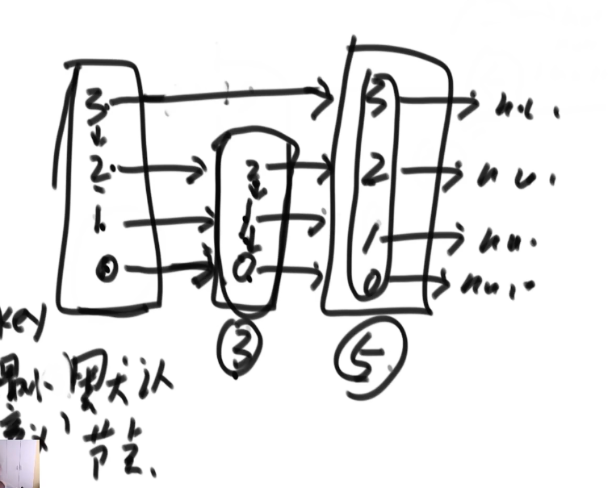

如果再来个4节点，此时他只有2层指针，那么还是默认节点从最高层指针开始找，找小于等于4的最右节点，就是它自己，大于等于4的最左节点是5，但是4节点没有第三层指针，只能往下看，第二层指针时，找到了3节点是比4节点小的最右节点，但是4节点没有第二层指针，此时3节点的指针往下跳，跳到第一层指针，发现还是3节点自身是小于等于4的最左节点，此时4节点有第一层指针，所以挂上它，让4节点的第一层指针指向原来的5，继续往下跳，把第0层的指针也挂上


假设在这种情况下，想加入两层的70这个节点，那么第一次找到最右节点是20，直接跳过了3，10，15，然后70没有第五层指针，所以20往下找，直接到了50，然后发现没有第四层指针，继续往下，直到第一层指针


这就是利用了高度这个索引，跨过了很多步骤

如果是删除节点，那么还是先查找，从最高层开始查找，找到小于50的最右节点，是20，发现不是50，所以20这个节点指针往下一层继续找最右节点。找到了50

删除就是把前面的指针和后面的指针链接一下

----

## 实战题


我们不需要把绳子放在一个不存在的点上，我们就枚举绳子的最右端在每一个点上的情况，那么绳子的左边就会覆盖一些点，这样把所有点都枚举，其中肯定有最多覆盖的那个答案

有点类似贪心思想


比如L=5的情况，此时如果绳子最右端在0位置，对应点是2，绳子左边最长到-3，此时找大于等于某个数的最左位置，来确定这边能覆盖几个点


这里绳子最右端是在2位置时，对应数轴8-5=3，最左是3.大于等于3的最左位置是1号位置对应数轴4，此时8的下标和4的下标2-1，再+1，得到2个数


到9的时候，最左长度能到4，大于等于4的最左就是1号位置的4，此时3-1+1=3个点

这种方法检查了N个点，而每个点的时间复杂度是二分O(logN)，所以总共是O(N*logN)

### 优化为滑动窗口

让绳子左端来位置一个窗口的左边界，R往下面动，不能超过绳长L，


当L是0位置时，R最多来到1位置，因为2位置的8-2=6超过绳长了

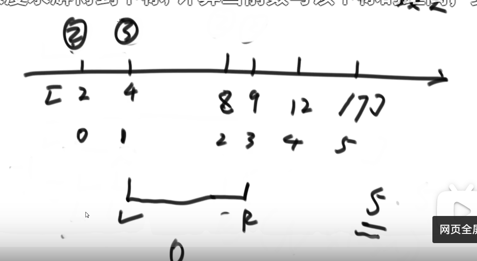

然后L往下动，R继续往下

L和R都不会回退，整个复杂度是O(N)

这种题就是可以构建一种单调，不回退的窗口模型

----

### 打表法


普通解法：尝试的方式应该是，尽可能用8的袋子装完，然后再看剩下的能不能用6的袋子装完，如果不行，那就8的袋子-1，不断尝试


**优化解法：**


我们从一个例子可以得知，剩下的苹果数量大于27个的时候，肯定不行，因为27个时，4个6个(或者3个8个)的为24，还剩3个，已经判断过了不行

当我们发现，输入是整数，输出也是整数，那我们可以先用简单暴力做法做，然后查看结果的规律


看规律后得知这几种情况

----

吃草题目，分先手和后手，必须吃，只能吃4的n次方，n从零开始，假设一共有N份草，谁先把草吃完谁赢

假设N=1，先手赢了，N=2，后手赢，N=4.，先手直接吃4的1次方，先手赢


当前先吃掉 base 份草，if 里面的子过程里面，其实原来的先手就变成了后手，所以如果子过程返回的是后手，则说明整个过程是先手赢了

防溢出是可能溢出整数边界


然后再继续打表看规律


----

### 预处理技巧


正常思路是：先假设全是右侧，全部都涂染成G，然后假设左侧一个R，右侧全部是G，不断尝试，比较最小答案


我们可以做一些辅助结构，让一些结果直接取出

开一个数组，记录0~i 范围内有几个R，这样只需要遍历一遍就可以拿到左边有几个R


再开一个数组记录 i ~N-1范围上有几个G，我们需要把 i ~N-1上变成R，就需要查询这上面有几个G

**这就是预处理技巧，直接拿一个结构记录一些答案，然后查询时直接拿结果就行**

这样我们在遍历过程中，来到任意一个点都不需要重新遍历，直接从辅助数组中拿答案即可

----

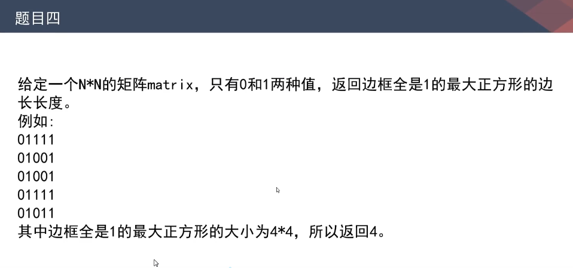


如果一个n^2的矩阵，它内含的长方形子矩阵的大小是n^4规模的，因为我们可以在矩阵内部随机找两个点作为左上角和右下角，以此确定唯一的一个长方形，而找一个点的代价是n^2，所以总共规模是n^4，而两个点可能重复，也只会重复一次，常数项较小

那么现在我们来找正方形的子矩阵数量级，答案是n^3规模，因为只能先定一个点，然后枚举他作为左上角的边长情况


两个点枚举左上角点的所有情况，再来一个for循环枚举边长，边长的范围应该是看向下或者向右碰到底了


然后里面分别四个for循环遍历每条边是否全部是1，这样时间复杂度就到O(n^4)

所以我们要用预处理来解决这个验证过程：

我们开一个同样大的矩阵数组，每个点记录它右边包括自己有多少个连续的1，再生成一个down数组，记录每个点包括自己在内的下方有多少个连续的1


如果我们要判断[4,5]，边长为3的点的正方形，就只需要先拿出[4,5]的两个辅助矩阵，看他们的1是否都是大于等于边长，如果都成功，则跳到右上角看它的down数组，然后再看左下角的right数组

----


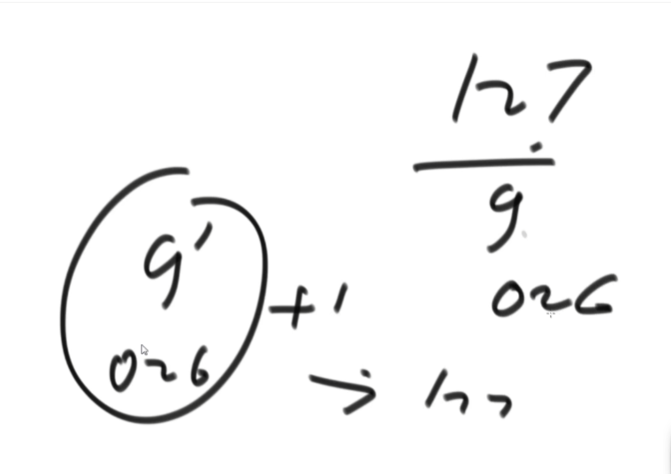

像这种题目，可以直接用二进制来拼凑，因为3个二进制位，我们可以拼出0~7，所以只要我们实现一个函数是等概率返回0或1，那么直接重复3次，就可以等概率得到3个二进制位，就相当于等概率返回0~7，但是现在，我们想要的是0~6，然后+1得到1~7，所以我们直接判断，让得出是7的时候，重新做


如果给出的是13~21，那么同样先改成01发生器，然后求30~59的，就相当于求0~29，然后+30，然后我们只需要5个二进制位就可以求得0~31范围，如果得到的数超过29，直接重做


而第三问，f 函数是p概率0，1-p概率1，那么我们如果随机得到00或11，直接重做，直到得到10或01，因为此时他们的概率相乘

----

### 动态规划


只有一个可变参数，直接改动态规划


----


直接用一个变量记录count记录左边括号和右边括号的数量，遇到左括号就++，右括号--，如果小于0，那么必定不完整

结束的时候，count必须为0，而现在题目是需要添加多少个括号，那么直接用一个变量ans记录，每次count=-1时，让ans++，然后count=0，最后如果count=0，直接返回ans，如果不等于0，那么ans+=count


----


去重就是，如果k=2，那么有0和2的时候不统计2和0，如果有两个0，也只记录一次0和2

直接使用哈希表，把所有数字放进哈希表，遍历的时候找对应差值的数在不在哈希表即可

----

### 贪心


集合中元素不重复，所以放到另一个集合中的值必须是另一个集合中没有的值


当两个集合平均值相同，无法做magic操作

而两个集合平均值不一样的时候，不能从小的集合拿到大的集合


在这种情况，我们应该拿60，让A获得最大程度平均值提升，而B集合最小幅度平均值提升，这样可以更多的进行magic操作，因为这个操作次数取决于两个集合平均值的差值大小


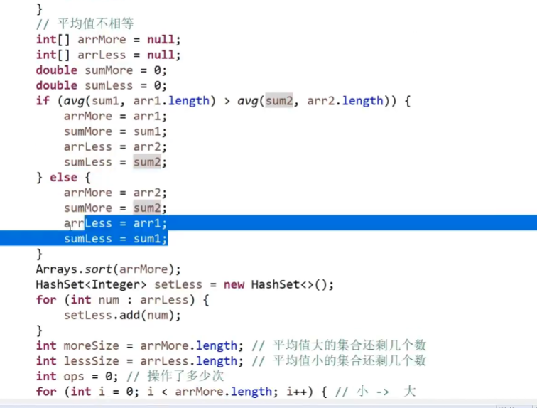


建立hashSet来处理查找想加入的元素是否在平均值小的数组中存在

这里的时间复杂度只有那个sort函数是O(N*logN)，其他都是O(N)

----


这题跟前面思路相同，还是用count记录，count达到的最大值就是最大深度

----

### 动态规划

给出一个字符括号串，请找出里面最长的连续的有效括号子串


这种题目的特征都是，求出每个字符为结尾的情况下的最长连续有效子串长度

左括号结为肯定无效，填0

当我们求 i 位置的值时，肯定前面已经有成功的值了，可以复用结论


当 i 位置时，看 i-1位置，如果是4，那么再往前4个，看是否是左括号，如果是就 i 为6


如果还是右括号，那么肯定是0，有点KMP的思想，


而如果是左括号，还要往前面看一位来推，4位置前面是左括号，所以+2，再看前一位2位置是2，所以再+2


遇到左括号，只需要再往前接一次就行


----


直接在辅助栈里面互相弹出，辅助栈里面保持小到大，再弹回原来栈就是大到小

----

**动态规划**


这是一个明显的**从左往右尝试模型**

就是看当前到达的位置开始，往后能有多少种转化方式

分两种情况：

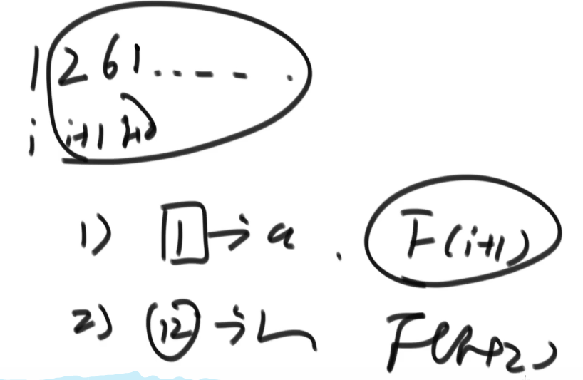

当 i 位置是0时，转化数量为0


这里第一个终止条件返回1，表示的是到达最后一个字符了，说明前面的转化都成功了，所以返回一种转化情况


----

### 二叉树递归套路


非套路解法：


套路解法：


----


经典套路方法：从右上角开始找，进行二叉树搜索，因为都是有序，所以可以直接排除，如果当前节点大于要找那个节点，那这一列都比他大，直接往左边走


如果越界了，就不存在

复杂度为O(N+M)

----


有一个二维数组，里面全是０和１，０一定在１左边，有可能全是０或全是１，需要返回含有１最多的行


准备一个ｌｉｓｔ，从右上角开始走，找１，直到最左的１，然后记录这一行有多少个１，然后往下走看能不能扩展


每次更新要把原来答案删除，多个就直接加入到ｌｉｓｔ中

----

### 贪心


首先大过滤器判断能否整除，判断当前ｉ位置，如果左右位置都需要衣服，那么就说明ｉ位置衣服过多，ｉ位置至少需要移动左右两边需要的衣服的绝对值之和

如果左右都是正的，则取最大值，因为最大值那个必须移动这么多轮

左负右正，也是最大值


把每个位置的瓶颈求出来，找到最差的那个，满足最差那个的时候，其他的一定满足


**这题也可以做预处理之类的优化操作**


----

###　只关注宏观过程


这种题，不能关注细节，只看宏观，我们只关注左上角和右下角，直接打印这一个边框，然后左上角右下角分别移动，继续打印，直到两者错过

只需要处理三种情况：分别是左上角右下角是竖线，横线，以及普遍情况


主函数


----


同理，还是只需要定义一个框如何变动的函数，然后让两个角缩小

每一个框分边长－１个组


各个组的４个变量相继交换即可，ｉ表示第ｉ组


----


还是一样，宏观过程判断，定义两个点，一开始都在左上角，然后A往右边走，B往下面走，A到最右就往下，B到最下就往右，然后我们定义两个斜线打印的函数，一个是从左下往右上，一个从右上往左下


ｆ为ｔｒｕｅ就从右上往左下打


----


这题从规律看，如果ｎ是质数，那么答案一定是只调用第二个操作得到，是ｎ－１次

如果ｎ不是质数，那么我们假设它是由几个质数因子相乘得到的，那么不管他们怎么组合，总会有个最优解


假设最优顺序就是XYZP，那么肯定是最后有P份XYZ，那么P是质数，所以调用ｐ－１次操作二，那么同理往前面推，调用Z－１次操作二....，最终就是X+Y+Z+P-4

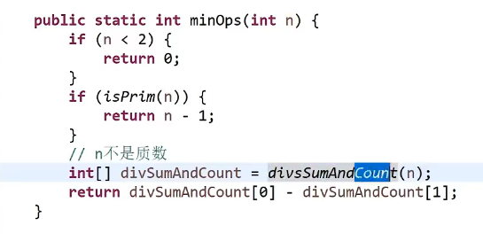


----

### 利用堆


利用堆，遍历一遍建立词频表，用哈希表就可以，然后用大根堆，利用比较器来建立，然后弹出前K个


或者利用小根堆，虽然是小根堆组织，但是存的是目前位置最大的两个，这样堆顶就是一个进入的门槛，每次只有更大的才能进来，然后再调整小根堆，这样比用大根堆更节省空间

----

假设用户需要一种结构，这种结构可以接收用户给的字符串ａｄｄ方法，同时用户可能随时调用一个函数ｐｒｉｎｔTｏｐK

需要这两种的时间代价都不高

**这题不能使用系统提供的堆结构**

如果有重复的值，随便打印一个都对


堆位置ｍａｐ的ｖａｌｕｅ是ｋｅｙ在堆中的位置，这个堆是按词频统计的小根堆，只有ｋ的长度


当A变成２，因为是小根堆，就要ｈｅａｐｉｆｙ调整，对应在堆数组中就是交换位置，更新后堆位置ｍａｐ也要更新


当D进来的时候，因为堆满，又干不过门槛，所以D不能进入，但是堆位置ｍａｐ上记录－１


D进入后，还要进行ｈｅａｐｉｆｙ，然后C上去，D下来

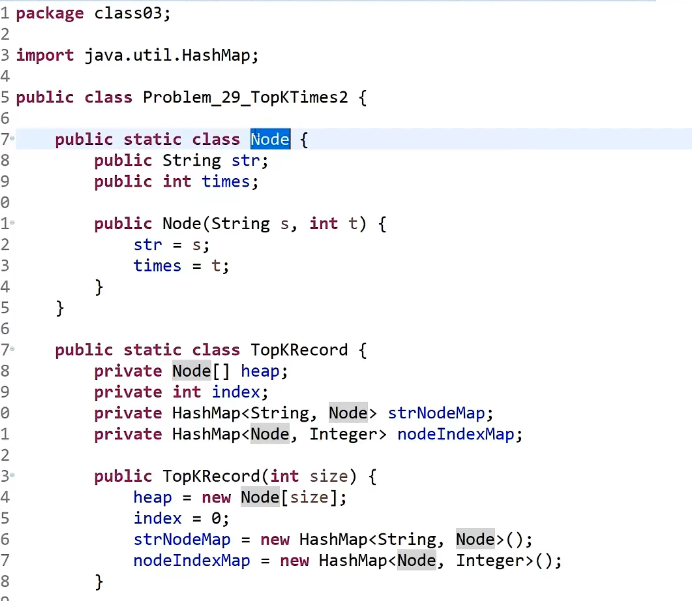

堆上放的是Nｏｄｅ，ｉｎｄｅｘ是目前堆的大小


ｐｒｅIｎｄｅｘ是在堆上位置

如果ｐｒｅIｎｄｅｘ＝－１，表示此时不在堆上，开始分情况，堆满就比较门槛，堆没满就加入


这是大根堆的ｈｅａｐIｎｓｅｒｔ，比较的是自己和自己的父亲节点的大小


这也是大根堆调整

这里有问题，ｈｅａｐｉｆｙ里面调整了位置后，没有更新ｎｏｄｅIｎｄｅｘMａｐ，这题的ｈｅａｐｉｆｙ里面有更新这个表的过程


交换都封装到ｓｗａｐ里面