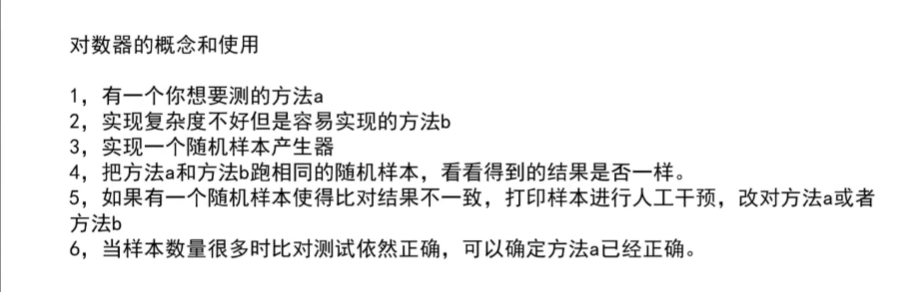

## 认识复杂度和简单排序算法

**冒泡排序：**

比较0 和 1 位置上的数大小，然后交换，然后比较1 和 2 位置上的数交换，依次类推，第二遍从1 开始，1 和 2 比较后交换

因此是等差数列，时间复杂度为O(n^2)

代码：

异或运算：相同为0，不同为1，或者理解为不进位相加

不开辟额外空间交换两个数，**但是要保证a和b指向的内存不同**，因此在上面那个方法中，**i一定不能等于j**

**面试题：在一堆数中，有一个数出现了奇数次，其他数都出现了偶数次，找出这个奇数次的数**

思路：使用异或运算，每个数都跟eor异或，最终得到就是那个奇数次的数

**面试题：在一堆数中，有两个数出现了奇数次，其他数都出现了偶数次，找出这两个奇数次的数**

在一堆数中进行异或，最终结果就是a^b，他们肯定不等于0，表示a和b用二进制表示至少有一位是1，即有一个位置a和b不相同，假设为第8位，根据这个第8位将原数组进行分类，分为第8位是1的数和第8位是0的数，而a和b只可能分别在两边，此时用一个变量去异或第8位是1的数，此时这个变量一定是a或者b，再让他和eor进行异或，即可得到另一个数

提取一个数最右侧的1：

**插入排序**

一直往前面比较，直到比前面大就结束

**二分法**

局部最小值就是 i 位置的数要小于其左右两边的数，求局部最小值也可以用二分

**对数器**

随机数组方法

## 认识O(NlogN)的排序

**递归**

 求中点位置防止溢出：右移一位

master 公式的介绍：只要是子问题等规模就可以用master公式求解

母问题N个数据，子问题每次都是 N/b 的规模，a指的是子问题调用次数，后面的是除了子问题外剩下过程的时间复杂度

所以求出来是这样

求解时间复杂度：

**归并排序**

思路：将数组分为两边，左右都排序完毕后merge合并，双指针比较，谁小谁进入help数组，直到一方越界，然后将剩下的全部复制进help数组

**拓展**

求小和可以逆向思考，每次比较找右边比他大的数，比如1和3合并的时候，在1的右边有一个数比1大，所以记录有1个1，134合并时，在1的右侧有找到一个4比1大，再记录一个1，3和4比较时，3的右边有个数比3大，所以记录1个3，以此类推求出来也是小和

求小和的合并过程中，如果是两边相等，一定要保证是右组先合并进去，否则无法计算小和

process函数中return的是左侧排序求小和的数量+右侧排序求小和的数量+merge合并时产生小和的数量

拷贝的时候只有严格左组比右组小才拷贝左组，否则拷贝右组

逆序对也是一样的思路

**快速排序**

问题一思路：开始的时候设定一个变量表示小于等于的区域的边界，然后边界刚开始在最左边，然后从数组第一个数开始比较，若小于等于num，则当前这个数和边界区的下一个数交换，然后小于等于边界区右扩，i++到下一个数，如果是大于，则直接指针下一个

问题二思路：两个边界，三种判断情况，第三种是 i 原地不动，当大于区域和 i 相等时停止

**快排1.0版本**

在数组中最后一个数，放到小于等于区域的最后一个位置，然后小于等于区域去递归，大于区域也递归，每次排好一个数，就能有序

**快排2.0版本**

利用荷兰国旗问题

思路：一开始在整个范围上用最后一个数做划分，让前面的范围做到都是小于5，中间都是等于5，右边是大于5，让5和大于5的第一个数交换，然后在左右递归

这两种，时间复杂度都是O(N^2)

**快排3.0**

随机选一个数，和最后一个数交换，作为划分

此时时间复杂度为O(NlogN)

partition返回的数组长度一定为2

返回的是12和13，表示返回的是等于区域的左边界和右边界

p[0]是等于区域的左边界，所以-1去左边递归

partition就是荷兰国旗问题

