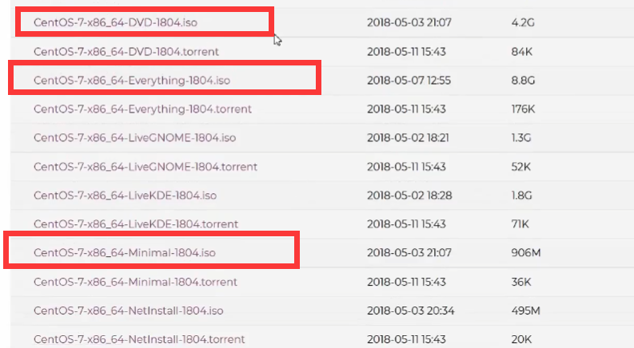
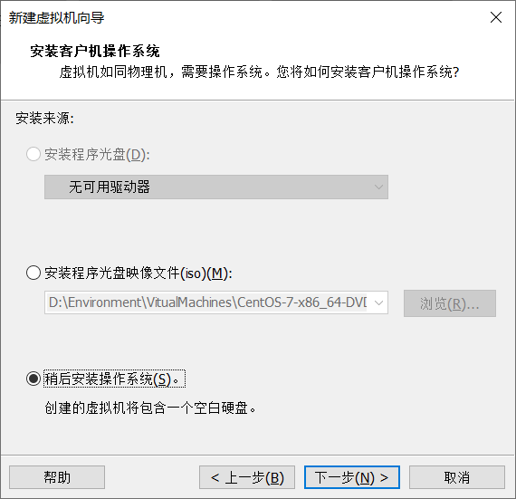
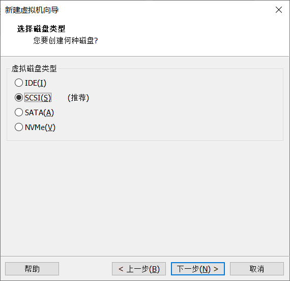
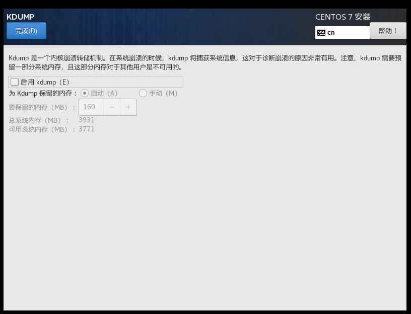
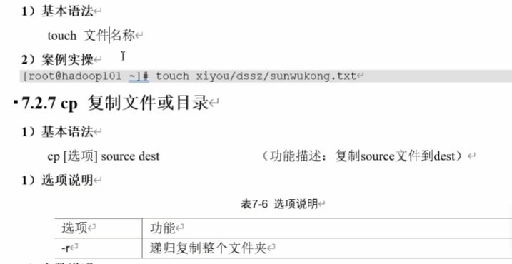
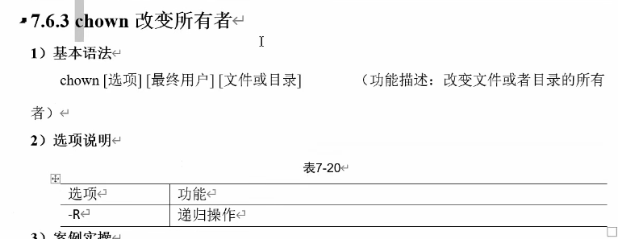
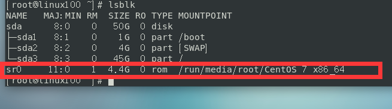
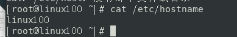

## 下Linux的安装

### Centos7下载

选用Centos7进行学习

首先进入Centos官网: [The CentOS Project](https://www.centos.org/) 

选择x86_64位，根据自己电脑32位还是64位


选择isos目录


随便选一个镜像下载


三种版本分别对应普通版、完全版、最小版、一般选择普通版即可



 centos8已经停止维护，centos7维护到2024年，以后转为centos stream就有可能不够稳定(快速发行版)，也可以用ubuntu

### VMware安装

进入官网：www.vmware.com


### 创建虚拟机

安装VMware后打开


选择自定义，更好了解流程


选择稍后安装



选择配置


选择安装位置


打开任务管理器查看自己CPU


插槽 1 表示只有一个cpu，6核cpu表示有6个处理核心，超线程技术，一个内核可以当成2个逻辑处理器 

这里我们选择2个cpu，4核(每个4核)





完成创建


查看虚拟化是否已开启


### 安装Centos7

点击编辑虚拟机设置，选择下载的Centos7


点击启动虚拟机

选择第一个选项


先选择软件选择


学习用就选择一个简单桌面


选择安装位置


选择主动配置分区


点击完成后进入手动分区


添加swap分区


剩下全部空间给 /


KDUMP真实情况一般启用，但是学习时为了不占资源就先不启用



进入网络


修改主机名，打开网络连接


开始安装，设置root密码，学习时使用123456

创建一个普通用户sucker


可以使用未列出的root用户登录


登录后可能发现网络依旧无法使用

此时参考博客： [(106条消息) 在VMware中安装CentOS7（超详细的图文教程）_laneJJ123的博客-CSDN博客_vmware虚拟机安装centos7](https://blog.csdn.net/laneJJ123/article/details/117063801?spm=1001.2014.3001.5506) 

**自动获取IP**

①、首先要确保的是CentOS为NAT模式。


②、在VMware界面（管理员方式启动）点击“编辑”里面的“虚拟网络编辑器”，然后勾选DHCP服务将IP地址分配给虚拟机，并设置子网IP(默认就好)。


③、点击NAT模式旁边的“NAT设置”，然后修改与子网IP同网段下的网关IP，就是前三位必须相同，

​    即192.168.30要相同，最后一位数不相同即可（其实已经自动设置好了，默认），最后点击“确认”保存设置。


④、然后启动虚拟机，进入网络配置文件目录：cd /etc/sysconfig/network-scripts/，并且用 ls 命令查看是否有ifcfg-xxx名称的配置文件（ifcfg-lo除外），如果没有则说明网卡没有被识别，这种只能重装或者换个CentOS的版本。


⑤、编辑ifcfg-ens33文件：vi ifcfg-ens33。按 i 进入insert编辑模式，

​    将BOOTPROTO设为dhcp，将ONBOOT设为yes，

​    按下Esc进入命令模式输入:wq保存并退出。


⑥、配置完成之后输入：service network restart，重启网卡让网卡设置生效，之后就可以上网了。


⑦、输入ip addr检查一下动态分配的IP，可以发现分配的动态IP为192.168.30.128。


⑧、最后验证是否可以访问外网。


发现是可以访问外网的。自动获取IP至此就介绍完了

此时测试成功


### 桌面和终端及基本操作

新建一个文件要在附件中的文本编辑器


ctrl+alt + f2 可以退出桌面直接进入终端，，ctrl + alt + f1 可以直接回到桌面(ubuntu命令差不多)

调整大小可以按ctrl + shift + (+=在一起的这个键)变大，ctrl + (-) 可以变小


## Linux文件系统

### 文件系统和挂载点

**Linux中一切皆文件（文件：读写执行（查看，创建，移动，删除，复制，编辑））
Linux多用户操作，权限（用户、用户组）
Linux是一个系统（磁盘，进程）**

**Liunx继承Unix以网络为核心的设计**

**系统的目录结构：**

​    **1.一切皆文件**

​    **2.根目录 / 所拥的目录都挂载在这个节点下**

 **Linux 的一切资源都挂载在 `/` 节点下。**

  

### 目录结构


/bin：Binary（二进制）的缩写，该目录存放着最经常使用的命令。
/boot： 启动 Linux 时使用的一些核心文件，包括一些连接文件以及镜像文件。（不要动）
/dev ： Device（设备）的缩写, 存放的是外部设备（访问设备的方式和访问文件的方式是相同的）。
**/etc： 用来存放所有的系统管理所需要的配置文件和子目录。**
**/home：用户的主目录。每个用户都有一个自己的目录，一般该目录名是以用户的账号命名的。**
/lib：系统最基本的动态连接共享库。其作用类似于 Windows 里的 DLL 文件。（不要动）
/lost+found：一般情况下是空的，当系统非法关机后，这里就存放了一些文件。（存放突然关机的一些文件）
/media：系统会自动识别一些设备，例如U盘、光驱等等，当识别后，会把识别的设备挂载到这个目录下。
/mnt：供用户临时挂载别的文件系统，我们可以将光驱挂载在该目录上，然后进入该目录就可以查看光驱里的内容了。  （把一些本地的文件挂载在这个文件下）
**/opt：主机额外安装软件所摆放的目录。比如安装一个 Oracle 数据库就可以放到这个目录下。默认是空的。**
/proc：虚拟的目录，它是系统内存的映射，可以通过直接访问这个目录来获取系统信息。（不用管）
**/root：系统管理员，也称作超级权限者的用户主目录。**
/sbin：s 就是 super user 的意思，这里存放的是系统管理员使用的系统管理程序。
/srv：服务启动之后需要提取的数据。
/sys：这是 Linux2.6 内核的一个很大的变化。该目录下安装了 2.6 内核中新出现的一个文件系统 sysfs。
**/tmp：用来存放临时文件。**
**/usr：用户的应用程序和文件都放在这个目录下，类似于 Windows 下的 program files 目录。**
/bin： 系统用户使用的应用程序。
/sbin： 超级用户使用的比较高级的管理程序和系统守护程序。
/src： 内核源代码默认的放置目录。
/var：存放着在不断扩充着的东西，一般将那些经常被修改的目录放在这个目录下。包括各种日志文件。
/run：一个临时文件系统，存储系统启动以来的信息。当系统重启时，这个目录下的文件应该被删掉或清除。
**/www: 存放服务器网站相关的资源，环境，网站的项目**

## Vim编辑器

### vi/vim是什么

vi  是Unix操作系统和类Unix操作系统中最通用的文本编辑器

 Vim 是从 vi 发展出来的一个文本编辑器。代码补完、编译及错误跳转等方便编程的功能特别丰富，在程序员中被广泛使用。 

自带就有Vim,可以直接使用

 基本上 vi/vim 共分为三种模式，分别是**命令模式（Command mode），输入模式（Insert mode）和底线命令模式（Last line mode）**。这三种模式的作用分别是： 


### 一般模式

一般模式主要操作:复制粘贴删除

 用户刚刚启动 vi/vim，便进入了一般模式。 

此状态下敲击键盘动作会被Vim识别为命令，而非输入字符。比如我们此时按下i，并不会输入一个字符，i被当作了一个命令。

以下是常用的几个命令：

i 切换到输入模式，以输入字符。
x 剪切当前光标所在处的字符。
: 切换到底线命令模式，以在最底一行输入命令。如果是便捷模式，需要退出便捷模式ESC
若想要编辑文本：启动Vim，进入了命令模式，按下i，切换到编辑模式。

yy表示复制这一行,p表示粘贴, 8p表示粘贴8次,8yy表示复制8行,dd表示删除这一行, 3dd表示删除3行

u 表示撤回操作

y$ 表示复制从光标到这行结尾内容

y^ 表示复制从行开头到光标的内容(不包括光标)

yw 表示复制当前单词

删除就是dw,d$之类的


gg 移动到开头

命令模式中: set nu 显示行号,配合 n+G跳转到指定行,取消行号:set nonu

### 编辑模式

按 i 进入


### 命令模式


查找后可以快速替换, :%s/old/new/g 替换整篇文档

## 网络配置

### 网络连接测试

查看主机 ip 地址

打开网络连接设置


找到自己连接的网络,右键状态,详细信息中可以看到


第二种方法:

win + cmd, ipconfig


测试能否ping 通


查看linux的虚拟机地址: ifconfig


主机可以ping通


### 网络连接模式


### 修改静态ip

目前采用 dhcp 动态分配ip地址,重启之类的操作后可能ip会变,导致原先配置出问题

现在修改虚拟机ip为静态ip

进入配置文件目录


将dhcp修改为static


增加固定的配置,与原先dhcp一样


重启网络


可能遇到的问题


### 配置主机名

```
hostname
```

查看主机名

```
vim /etc/hostname
并不是实时的,需要重启
```

修改主机名

```
hostnamectl
查看主机信息
hostnamectl set-hostname linux100
实时生效的修改主机名
```

编辑hosts文件,建立映射关系

```
vim /etc/hosts
192.168.208.100 linux100
```


同理,物理机也要改,这样在物理机ping的时候可以直接使用主机名

## 远程登录

在物理机远程登录


可以使用Xshell登录


搭配Xftp进行使用


## 系统管理

### Linux服务管理

- Linux中的进程和服务

  计算机中,一个正在执行的程序或命令,被叫作 进程(process)

  启动之后一直存在,常驻内存的进程,一般被称作 服务(service)

### systemctl

在 Centos 6的版本中,使用的是 service xxx xxx

在Centos 7版本也可以兼容,但是推荐使用 systemctl


```
ls /usr/lib/systemd
查看
systemctl restart network
```

### 系统运行级别

- 在Centos6中运行级别


不同运行级别区别就在于启动时所启动的服务

- 在Centos7 中


```
init 3 切换到运行级别3
```


### 配置服务开机启动和关闭防火墙

Centos7中的防火墙相关命令

1. 查看防火墙状态

```
systemctl stataus firewalld
```


2. 关闭防火墙

```
systemctl stop firewalld.service
```


3. 关闭防火墙开机自启动

```
systemctl disable firewalld.service
```

4. 开启防火墙

```
systemctl start firewalld.service
```

### 关机重启


```
shutdown  表示一分钟后关机
shutdown -c 取消刚才的关机操作
shutdown now 立刻关机
shutdown 3 表示3分钟后关机
shutdown 15:28  表示15:28关机
```

一分钟后关机其实是要做个sync同步操作

在Linux中，写入数据是先写到缓冲区中，等缓冲区满了再写入，以此提高效率，而关机前就会先自动写入


关机之前可以先 sync 手动同步一下

实操案例


## shell命令整体介绍及帮助命令

### 简单介绍

Shell 可以看作是一个命令解释器，为我们提供交互式的文本控制台界面。我们可以通过终端控制台来输入命令，由shell进行解释并最终交给内核执行。

Centos7本身默认的 shell 就是 bash

### 帮助命令

#### man获得帮助信息

```
man ls  表示说明ls这个命令
```


主要看下面的描述

用空格翻页

#### help 获得shell内置命令的帮助信息

一部分基础功能的系统命令是直接内嵌在 shell 中的，系统加载启动后会随着 shell 一起加载，常驻系统内存中。这部分命令被称为“内置命令”；相应其他命令被成为外部命令

所以使用 help 来获得其帮助信息

```
help cd
```

可以使用 type 来查看类型

```
type cd
history  查看历史敲的命令
```

外部命令还可以通过 --help 查看帮助信息

```
ls --help
```

常用快捷键


## 文件目录类

### 查看和切换工作目录

```
pwd  显示当前工作目录的绝对路径
```


```
cd  切换路径
cd /root/桌面  绝对路径
cd ../视频/  相对路径
cd 桌面  相对路径
绝对路径就要用/开头
cd -  返回之前的文件夹
cd  回到主目录
su sucker  切换用户
```


### 列出目录内容


隐藏文件夹都是用 . 开头


ll 和 ls -l 是一样的

### 创建和删除目录

创建目录

```
mkdir a  创建一个文件夹在当前目录
mkdir /b 在根目录下创建一个b文件夹
ls /  显示根目录下的文件
mkdir b c  创建两个文件夹b和c
mkdir d d/e d/e/f  在当前目录下创建d，在d下创建e....
ls d/
ls d/e/

mkdir -p g/h/i  表示如果父目录不存在就也创建
```

删除目录

```
rmdir a  删除a目录
rmdir a b c

如果目录非空，就不能直接删除
rmdir d/e/f d/e d/

rmdir -p g/h/i  表示都删掉
```

### 创建文件



touch 创建的文件可以不带后缀名，默认是文本文件

touch 可以指定目录，vim也可以自动创建一个，但是如果用vim后，里面是空的，就不会存在这个文件

### 复制文件或文件夹


例子：


如果使用cp复制覆盖：


此时查看hello2文件，成功覆盖


如果复制的时候里面已经有这个文件了，还是会提示是否覆盖，此时可以使用 \cp 来直接覆盖


使用 -r 参数 递归复制整个文件夹


### 删除和移动文件


rm -f 强制删除，不提示

使用rm -r 递归删除，但是会提示，此时可以使用 rm -rf 强制递归删除

如果要删除某一个文件夹里面的内容，但是不删除这个文件夹，可以在这个目录下使用

```
rm -f ./*
```


**移动文件**


还可以重命名，还可以原地重命名


### 查看文件

**cat命令**


**more命令**

对于较大文件，可以使用more 文件内容分屏查看器


**less 分屏显示文件内容**

比more更为强大，对大文件较高效率


### 控制台显示和输出重定向


想要把空格都输出来，使用双引号

```
echo "hello    word"
```

使用 -e 支持转义字符


**输出重定向和追加**


重定向


如果里面已经有内容还是使用 > 则直接覆盖，追加使用 >>

可以搭配 echo 使用

```
echo "hello,linux" >> info
```

查看系统环境变量

```
echo $
echo $USER
echo $PATH
```

### 监控文件变化

**head 显示文件头部内容**


**tail 输出文件尾部内容**


**tail -f 可以实时追踪文档更新**

ctrl + s 还可以暂时停止监控，但是还是会记录下来，ctrl + q 继续监控，之前暂停时记录的也会显示

但是如果直接覆盖文件了，就会报错

**如果使用的不是 echo 之类的追加，例如使用 vim 进行编辑追加，这时其实底层的文件节点号已经改变，所以追踪不到**

### 软链接


指创建一个类似快捷方式的东西，保存的是源文件的路径，类似C语言指针

例子：软链接


此时查看root下的info，和sucker用户下的info是一样的


使用 -P 查看实际路径


还可以和 cd 搭配使用


删除软链接，直接使用 rm 即可

**注意：如果使用的是 rm -rf 软链接名/ 删除，则会把真实目录删除而不删软链接，因为后面有 / ，若无 / 则只是删除软链接**

### 查看历史命令


```
history 10  查看过去10条命令
history -c  清空历史
```


```
！127  执行第127条历史命令
```

## 时间日期类


```
date  直接查看年月日时间
```


时间戳

```
date +%s
```

显示非当前时间


设置系统时间


查看日历


## 用户管理命令

### useradd 添加新用户


新用户的目录是 /home/

root用户目录是 /root/

```
passwd sucker  设置sucker用户的密码
id sucker  用id来验证有无这个用户

cat /etc/passwd  查看系统用户，也可以使用less和more

su sucker  切换用户到sucker

权限不够无法查看其他用户文件夹
```

使用 su 其实是嵌套的，使用exit可以退回上一层会话

```
who am i  查看当前用户和权限

whoami  查看当前会话的用户
```


### 获得root权限和删除用户


采用 sudo 命令临时获得权限，但是还是有问题


在root用户下，修改配置文件

```
vim /etc/sudoers
:wq！  加！强制执行
```


修改配置文件后成功执行


删除用户：userdel sucker

虽然 /home 中的目录还在，但是用户没了

如果想要删掉目录，可以直接删除，也可以使用 userdel -r sucker

使用 id sucker 查看是否存在，cat /etc/passwd 也能查看

### 用户组管理


先创建一个 meifa 组


查看组

```
cat /etc/group
```


修改用户组

```
usermod -g meifa tony
```


修改组名

```
groupmod -n haircut meifa
```

### 文件属性和权限

在使用其他用户时，是否所有文件都可以查看？


**w 可以修改，但不代表可以删除文件，想删除需要有修改这个目录的写权限**


首位是 - 表示是普通文件，d 表示是目录

例如这个文件，表示root用户拥有可读可写，root组的用户只能读，其他用户也只能读，第一个root是表示所属用户，第二个是所属组


### 更改文件权限


给文件增加权限


第二种修改方式


所以可以使用 chmod 777，全部都是最大权限，chmod 644更为合适

可以递归修改


**chown 修改所有者**



修改属主


可以配合修改权限使用，可以加上 -R 递归修改

**chgrp 改变所属组**


### 查找定位文件


查找


还可以使用通配符、后缀名


可以根据属主


+10M 表示大于10M的文件


**locate 快速定位文件路径**


查找之前应该先更新，因为locate数据库不是实时更新的，即 updatedb

```
locate tmp  只要带有tmp的都会找出来
```


可以使用which 查找命令在哪里

```
which locate
whereis locate
```

### 内容过滤查找和管道操作


显示行号来过滤查找


**| 管道符**

```
ls | grep .cfg
```


## 压缩解压类


一般不会单独使用gzip

常用zip


zip 可以保留源文件，而且可以递归压缩，使用 -r

```
zip -r myroot.zip /root  直接压缩root目录
unzip解压
```

**tar 打包**


实际中，tar用的最多

解压


## 磁盘管理类

### 查看目录占用空间大小


可以使用一个 tree 工具来查看树状结构

```
yum -y install tree
tree ./
```

原本可以使用 ls -lh 占用空间大小，但是在对某个文件夹时，它不会把其中子文件夹累加

因此使用 du 命令


想累加文件还得用 -a

### 查看磁盘使用情况


还可以查看内存使用情况 free -h


### 查看设备挂载情况


### 挂载和卸载


首先做好配置，在设置中


使用 lsblk 命令查看挂载点



以上是自动挂载的，接下来使用手动挂载，先右键弹出这个设备

此时看到没有挂载点了


创建一个挂载目录


提示找不到媒体是因为刚才弹出了，此时我们需要关闭图形化界面，先注销root用户


再到设置中开启连接，到 Xshell 中重新挂载即可成功

再使用 unmount 命令取消挂载


可以设置开机自动挂载


### 磁盘分区


我们首先新加入一块硬盘，在设置中添加


默认配置即可


使用 fdisk -l 查看 lsblk 查看，都看不到，因为不是热拔插，所以使用 reboot 重启


此时查看


已经有了sdb了


对它进行分区

```
fdisk /dev/sdb
```


输入 n 开始分区


Linux 最多只能分 4 个主分区，想要更多的话，可以把一个分区替换成拓展分区，就可以拓展出若干个逻辑分区


选择p后回车按照默认配置

再输入 p 查看信息


按w 保存退出


使用 lsbkl -f 显示文件系统信息，发现没有文件系统，因为没有格式化，对应没有挂载点


使用 mkfs 创建文件系统 ，-t 指定文件系统类型，使用xfs 类型


此时我们将这个硬盘挂载到 sucker用户这个目录下，以后sucker用户目录下的文件物理上都是存在 sdb这个硬盘了

使用 mount 命令


查看磁盘信息


此时我们测试一下，复制一个大文件过去，这里文件较小，所以看不出变化


卸载硬盘可以使用 unmount

```
umount /dev/sdb1  直接使用设备名称
umount /home/sucker  使用挂载点来卸载
```

查看一下磁盘信息已经没了


使用 ll 命令查看也没有相关内容了


## 进程管理类

### 查看进程


```
ps aux | less  管道可以接less之类的
```

**进程信息详解**


### 查看远程登录进程

sshd 是远程登录的进程


第三条是输这个命令才产生的进程

在Xshell 中多建立几个终端，就会有更多个进程

### 终止进程


不要kill 掉守护进程了，可能出现很多问题

若 kill 了，可以使用命令重启

```
systemctl status sshd
systemctl start sshd
```

### 查看进程树


没有就需要yum下载

### 实时监控进程


### 网络状态和端口监控


可能常用：查看网络端口号占用情况

```
netstat -nlp | grep 8088
```


## 系统定时任务


要先保证 crond 服务启动了

```
systemctl status crond
```


参数说明


特殊符号


特定时间执行命令

 

例子：

```
crontab -e
*/1 * * * * echo "hello world" >> /root/hello   每隔一分钟写入一句话
ls
tail -f hello   查看变化

crontab -l 查询定时任务
crontab -r  删除当前用户的所有定时任务
```

## 软件包管理

### RPM


**rpm 查询命令**


配合管道过滤


查询详细信息

```
rpm -qi firefox
```


**rpm 卸载命令**


不用全名，模糊查询

**rpm 安装命令**


安装需要全名


### YUM

yum 可以从指定的服务器自动下载rpm包并安装

类似Maven


常用命令


可以修改 YUM 源


查看现在的源

```
less /etc/yum.repos.d/CentOS-Base.repo
```


实际上会先根据ip地址来找最近的镜像源，所以也没必要修改

## 克隆虚拟机

右键管理里面克隆


先关机才能克隆


开启克隆机

先查看ip地址

```
ifconfig
```


发现和之前的完全一样，所以需要修改


只需要改ip地址


查看网络服务


但是Centos7 里面默认的网络服务是 NetworkManager

所以先 stop network 再 restart NetworkManager


ping 测试网络

接下来修改 hostname



在Centos7中使用 hostnamectl 直接 set


此时重启bash可以看到显示也正常了

拍摄快照类似存档


假如有人想用当前虚拟机的配置，就直接把当前文件复制即可，用VMware打开即可