## Redis

## 1 redis入门

### 1.1 NoSQL的引言

```markdown
`NoSQL(Not Only SQL)`，意即`不仅仅是SQL`, 泛指非关系型的数据库。Nosql这个技术门类,早期就有人提出,发展至2009年趋势越发高涨。
RDBMS 关系型数据库  sql语句操作
NoSQL 泛指非关系数据库，用的不一定是sql
两种都是数据库
```

### 1.2 为什么是NoSQL

```markdown
随着互联网网站的兴起，传统的关系数据库在应付动态网站，特别是超大规模和高并发的纯动态网站已经显得力不从心，暴露了很多难以克服的问题。如 `商城网站中对商品数据频繁查询`、`对热搜商品的排行统计`、`订单超时问题`、以及`微信朋友圈（音频，视频）存储`等相关使用传统的关系型数据库实现就显得非常复杂，虽然能实现相应功能但是在性能上却不是那么乐观。nosql这个技术门类的出现，更好的解决了这些问题，它告诉了世界不仅仅是sql。
```

### 1.3 NoSQL的四大分类

#### 1.3.1 键值(Key-Value)存储数据库

```markdown
# 1.说明: 
- 这一类数据库主要会使用到一个哈希表，这个表中有一个特定的键和一个指针指向特定的数据。
<key value>

# 2.特点
- Key/value模型对于IT系统来说的优势在于简单、易部署。  
- 但是如果DBA只对部分值进行查询或更新的时候，Key/value就显得效率低下了。

# 3.相关产品
Tokyo Cabinet/Tyrant,
Redis  数据在内存
SSDB   数据在硬盘
Voldemort 
Oracle BDB
```

#### 1.3.2 列存储数据库

```markdown
# 1.说明
- 这部分数据库通常是用来应对分布式存储的海量数据。

# 2.特点
- 键仍然存在，但是它们的特点是指向了多个列。这些列是由列家族来安排的。

# 3.相关产品
- Cassandra、HBase、Riak.
```

#### 1.3.3 文档型数据库

```markdown
# 1.说明
- 文档型数据库的灵感是来自于Lotus Notes办公软件的，而且它同第一种键值存储相类似该类型的数据模型是版本化的文档，半结构化的文档以特定的格式存储，比如JSON。文档型数据库可以看作是键值数据库的升级版，允许之间嵌套键值。而且文档型数据库比键值数据库的查询效率更高

# 2.特点
- 以文档形式存储

# 3.相关产品
- MongoDB、CouchDB、 MongoDb(4.x). 国内也有文档型数据库SequoiaDB，已经开源。
```

#### 1.3.4 图形(Graph)数据库

```markdown
# 1.说明
- 图形结构的数据库同其他行列以及刚性结构的SQL数据库不同，它是使用灵活的图形模型，并且能够扩展到多个服务器上。NoSQL数据库没有标准的查询语言(SQL)，因此进行数据库查询需要制定数据模型。许多NoSQL数据库都有REST式的数据接口或者查询API。

# 2.相关产品
- Neo4J、InfoGrid、 Infinite Graph、
```

#### 1.3.5 NoSQL应用场景

- 数据模型比较简单

- 需要灵活性更强的IT系统

- 对数据库性能要求较高

- 不需要高度的数据一致性(Nosql产品对于事务支持都不是特别良好)

### 1.4 Redis 简介

```markdown
问题现象
海量用户
高并发

罪魁祸首——关系型数据库
性能瓶颈：磁盘IO性能低下
扩展瓶颈：数据关系复杂，扩展性差，不便于大规模集群

解决思路
降低磁盘IO次数，越低越好 —— 内存存储
去除数据间关系，越简单越好 —— 不存储关系，仅存储数据
这里Nosql可以解决

NoSQL：即 Not-Only SQL（ 泛指非关系型的数据库），作为关系型数据库的补充
作用：应对基于海量用户和海量数据前提下的数据处理问题。

特征：
可扩容，可伸缩
大数据量下高性能
灵活的数据模型
高可用

常见 Nosql 数据库：
Redis
memcache
HBase
MongoDB
```

### 1.5 电商场景 

 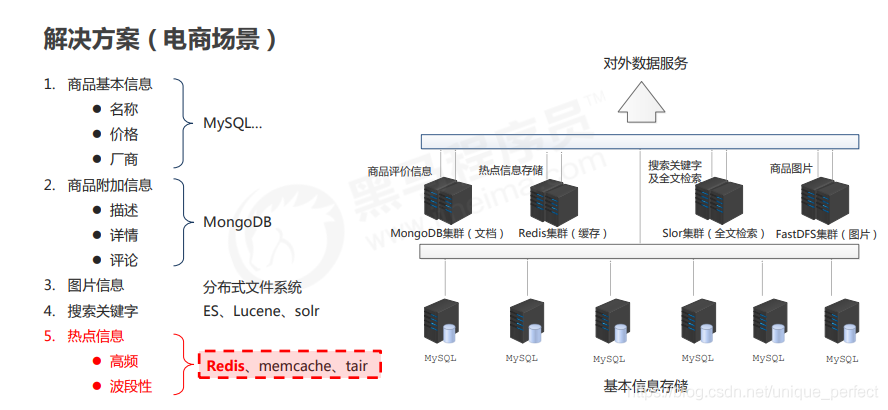 

 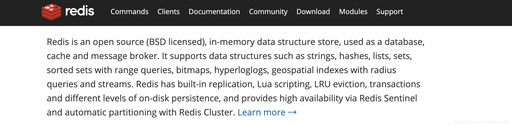 

```markdown
概念：Redis (REmote DIctionary Server) 是用 C 语言开发的一个开源的高性能键值对（key-value）数据库

Redis is an open source (BSD licensed),in-memory data structure store, used as a database, cache and message broker.
Redis开源遵循BSD  基于内存数据存储 被用于作为数据库 缓存 消息中间件

redis的数据都在内存中，内存读写块，但是断电即消失，但redis有：持久化机制  定期写入磁盘

总结: Redis是一个内存型的数据库
```

### 1.6Redis特点

------

- Redis是一个高性能key/value 内存型数据库
- Redis 支持丰富的数据类型 (value 可以是 String，List，Set, ZSet，Hash)
- Redis 支持持久化  内存数据 持久化到硬盘中
- Redis 单线程，单线程  但是效率还是高 不支持并发，不存在线程安全问题，以此 Redis 实现分布式锁(java 中多线程，要使用Synchronized锁，但是在集群中不行，因为只能在当前虚拟机中加锁，不能操作其他虚拟机)

### 1.7 Redis 的应用

```markdown
为热点数据加速查询（主要场景），如热点商品、热点新闻、
热点资讯、推广类等高访问量信息等
任务队列，如秒杀、抢购、购票排队等
即时信息查询，如各位排行榜、各类网站访问统计、公交到站信息、
在线人数信息（聊天室、网站）、设备信号等
时效性信息控制，如验证码控制、投票控制等
分布式数据共享，如分布式集群架构中的 session 分离
消息队列
分布式锁
```

### 1.8 Redis 的下载与安装

```markdown
0.准备环境
vmware15.x+
centos7.x+

1.下载redis源码包
https://redis.io/
```

 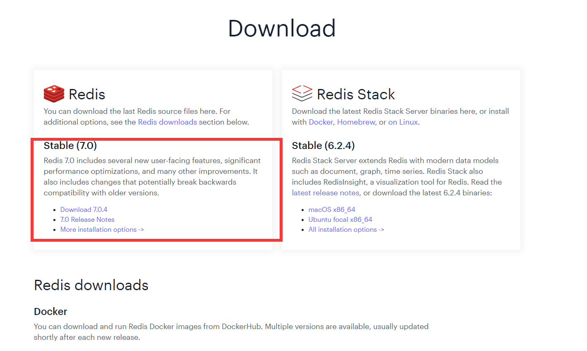

```markdown
2.下载完整源码包
redis-7.0.4.tar.gz
```

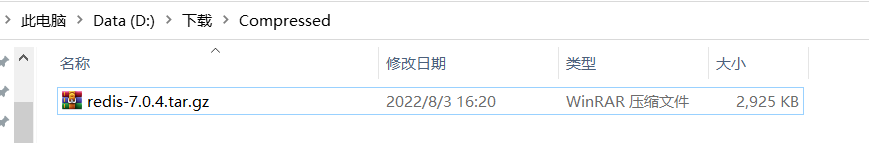 

```markdown
3.将下载redis资料包上传到Linux中

4.解压缩文件

[root@localhost opt]# tar -zxvf redis-7.0.4.tar.gz
[root@localhost opt]# ls
containerd  redis  redis-7.0.4.tar.gz  rh
```

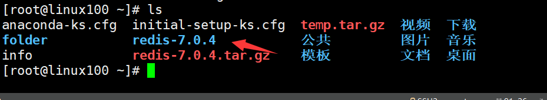

进入文件夹，发现有Makefile，因此可以直接执行make 去编译安装，但是这里面是用C语言编写的，因此要先安装C语言的gcc依赖，否则无法编译通过

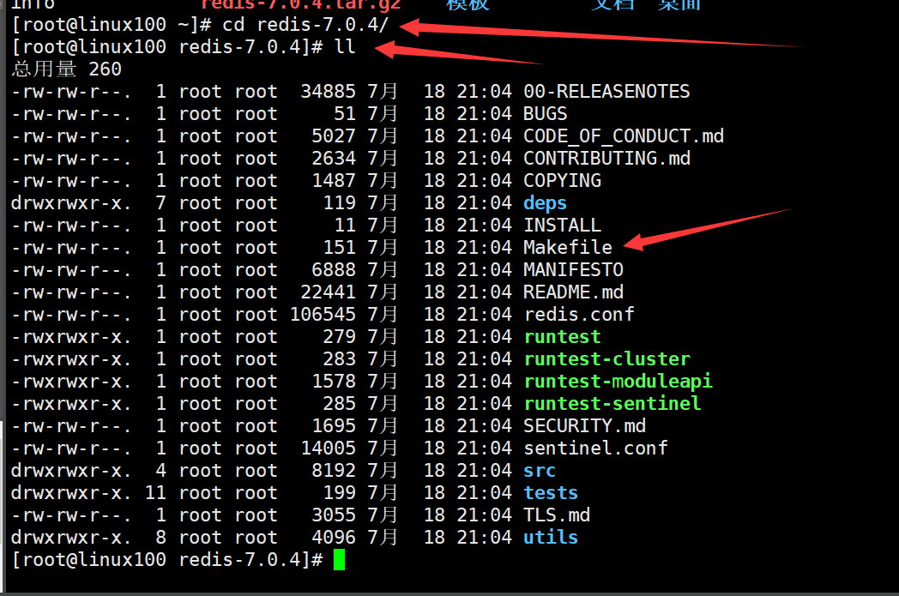

```markdown
# 5.安装gcc  
- yum install -y gcc

# 6.进入解压缩目录执行如下命令
- make MALLOC=libc
# 这一步可能会报错，升级gcc版本即可
升级gcc版本
yum -y install centos-release-scl
yum -y install devtoolset-9-gcc devtoolset-9-gcc-c++ devtoolset-9-binutils scl enable devtoolset-9 bash  # scl命令启用只是临时的，
退出xshell或者重启就会恢复到原来的gcc版本。

# 如果要长期生效的话，执行如下：
echo "source /opt/rh/devtoolset-9/enable" >>/etc/profile

注意：如果用客户端工具连接服务器的话，有可能使用gcc -v还是
原来的版本，只需要断开重新连接即可 
# 7.编译完成后执行如下命令
- make install PREFIX=/usr/redis  # 将编译好的文件放到指定目录下

# 8.进入/usr/local/redis/bin目录启动redis服务 
./redis-server
```


安装到指定目录后

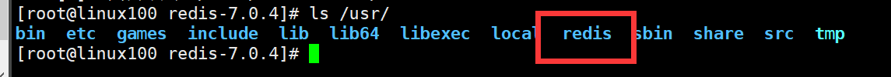

启动成功

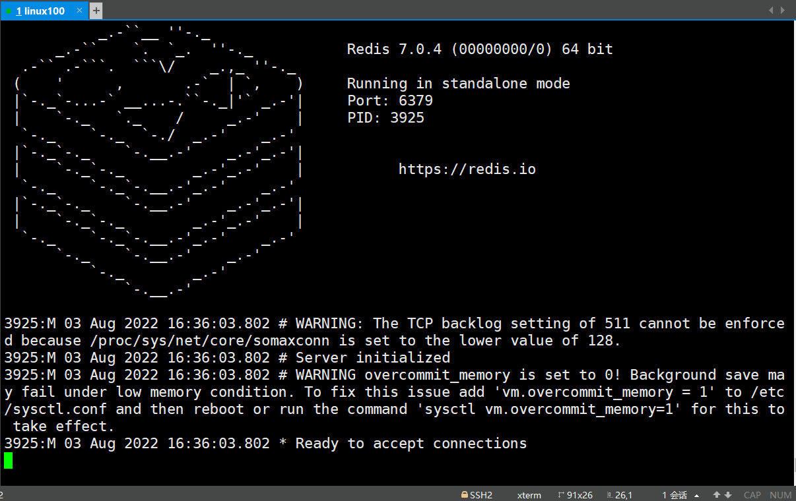

**补充redis的细节**

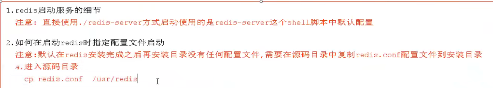

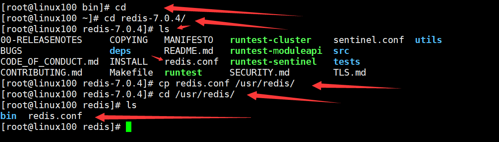

启动时可以指定配置文件，可以用相对路径

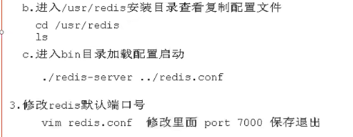

redis中库的概念

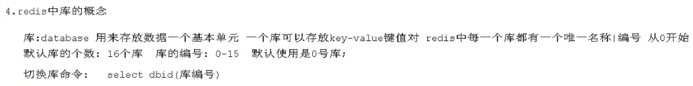

redis中清除库的指令

```
flushdb  清除当前库
flushall 清楚所有库
```

redis客户端显示中文

```
./redis-cli -p 6379 --raw
```


```markdown
# 9.Redis服务端口默认是 6379

# 10.重新开一个会话，进入bin目录执行客户端连接操作
- ./redis-cli -h localhost –p 6379
实际上可以不写后面两个参数，因为默认就是主机和6379

# 补充：
默认配置启动
redis-server
redis-server -p 6379
redis-server  -p 6380
 
# 指定配置文件启动
redis-server redis.conf
redis-server redis-6379.conf
redis-server redis-6380.conf ……
redis-server conf/redis-6379.conf
redis-server config/redis-6380.conf ……

# 默认连接
redis-cli
连接指定服务器
redis-cli -h 127.0.0.1
redis-cli -p 6379
redis-cli -h 127.0.0.1 -p 6379

# 基本配置
daemonize yes
以守护进程方式启动，使用本启动方式，redis将以服务的形式存在，
日志将不再打印到命令窗口中
port 6***
设定当前服务启动端口号
dir “/自定义目录/redis/data“
设定当前服务文件保存位置，包含日志文件、持久化文件
（后面详细讲解）等
logfile "6***.log“
设定日志文件名，便于查阅
```

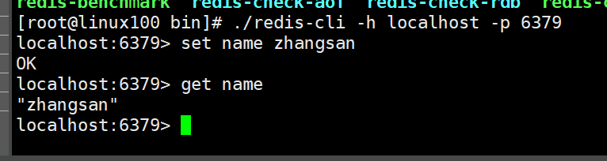

### 1.9 核心文件

```markdown
redis-serve 服务器启动命令
redis-cli 命令行客户端
redis.conf    redis核心配置文件
redis-benchmark 性能测试工具
redis-check-aof AOF文件修复工具
redis-check-dump  RDB文件检查工具（快照持久化文件）
```

### 1.10 Redis 的基本操作

```markdown
信息添加
set key value
set name itheima

信息查询
功能：根据 key 查询对应的 value，如果不存在，返回空（nil）
get key
get name

清除屏幕信息
功能：清除屏幕中的信息
clear

退出客户端命令行模式
功能：退出客户端
quit
exit
<ESC>

帮助
功能：获取命令帮助文档，获取组中所有命令信息名称
命令
help 命令名称
help set

127.0.0.1:6379> help get

GET key
summary: Get the value of a key
since: 1.0.0
group: string

help @组名
127.0.0.1:6379> help @string

APPEND key value
summary: Append a value to a key
since: 2.0.0

BITCOUNT key [start end]
summary: Count set bits in a string
since: 2.6.0

BITFIELD key [GET type offset] [SET type offset value] [INCRBY type offset increment] [OVERFLOW WRAP|SAT|FAIL]
summary: Perform arbitrary bitfield integer operations on strings
since: 3.2.0
....
```

## 2 Redis 数据库相关指令

### 2.0 操作key相关指令

```markdown
# 1. DEL指令
- 语法：DEL key [key ...]
- 作用 删除给定的一个或多个key。不存在的key 会被忽略
```

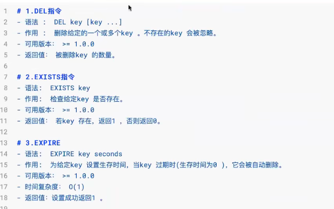

注意 exists 指令，判断多个key的时候只要有一个存在就会返回 1

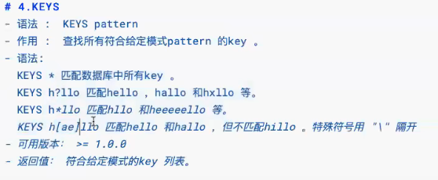

这里的 ? 表示严格匹配一个任意字符，而 * 表示匹配 0-任意个字符，[ae]表示只能匹配 a 或者 e ，keys可以做过滤

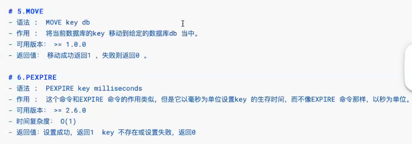

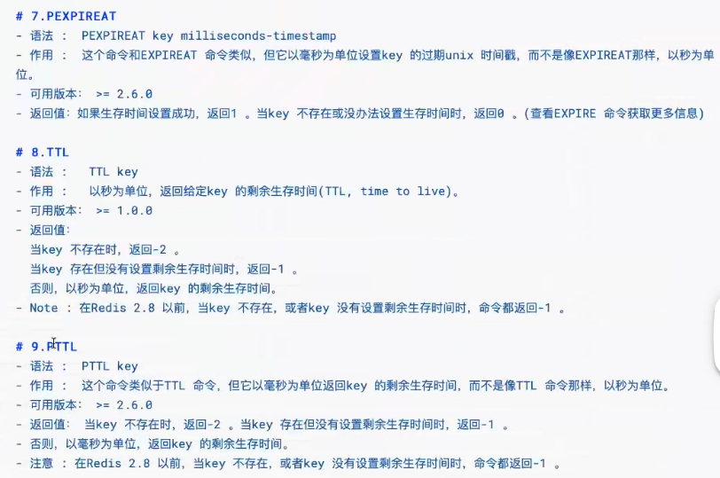

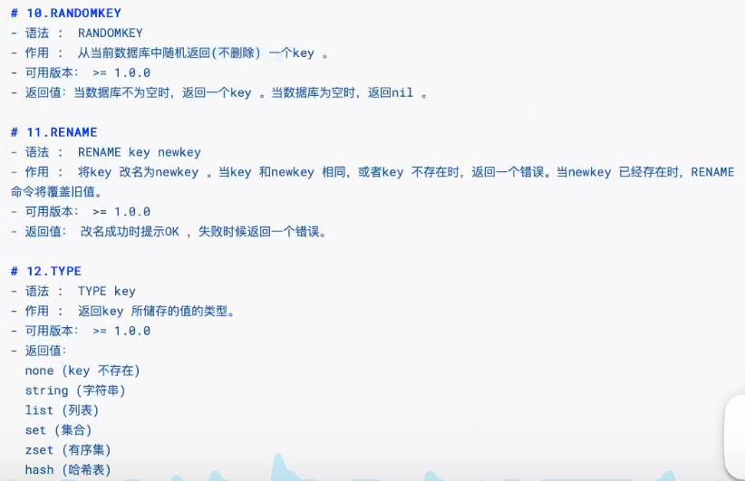

key都是String类型，type key 可以查看值的类型

```markdown
string String
hash HashMap
list LinkedList
set  HashSet
sorted_set TreeSet
```

### 2.1 redis 数据存储格式

```markdown
redis 自身是一个 Map，其中所有的数据都是采用 key : value的形式存储
数据类型指的是存储的数据的类型，也就是 value 部分的类型，
key 部分永远都是字符串
```

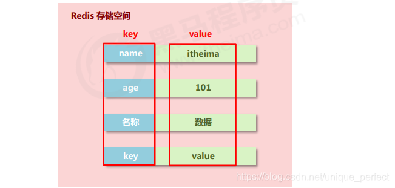

### 2.2 string 类型

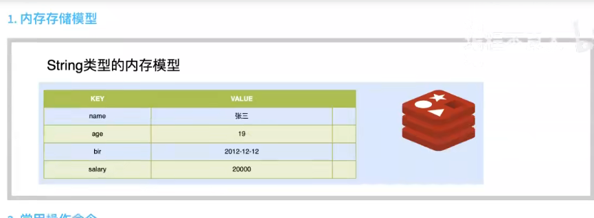

 key 是 String，value 也是 String

#### 2.2.1 string操作

常用命令

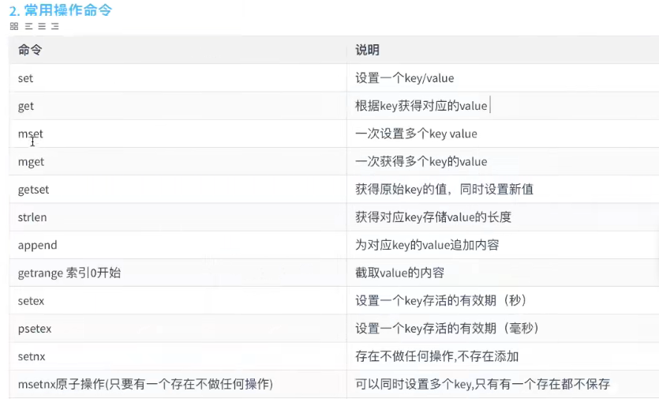

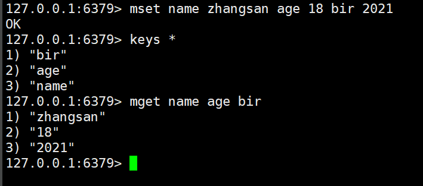

getrange也可以指定范围

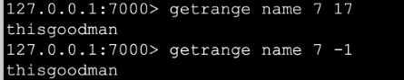

setnx示例

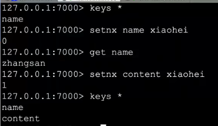

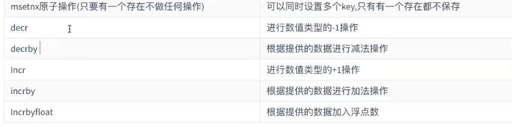

Incrbyfloat  最多保留16位小数

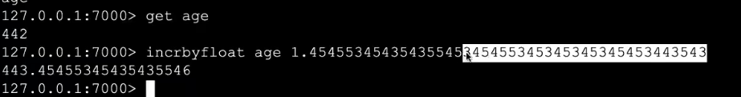


```markdown
存储的数据：单个数据，最简单的数据存储类型，也是最常用的数据存储类型
存储数据的格式：一个存储空间保存一个数据
存储内容：通常使用字符串，如果字符串以整数的形式展示，可以作为数字操作使用

添加/修改数据
set key value
获取数据
get key
删除数据
del key

127.0.0.1:6379> set age 100
OK
127.0.0.1:6379> get age
"100"
127.0.0.1:6379> del age
(integer) 1
127.0.0.1:6379> del age
(integer) 0


添加/修改多个数据
mset key1 value1 key2 value2 …
获取多个数据
mget key1 key2 …
获取数据字符个数（字符串长度）
strlen key
追加信息到原始信息后部（如果原始信息存在就追加，否则新建）
append key value
127.0.0.1:6379> mset a 1 b 2 c 3
OK
127.0.0.1:6379> mget a b c
1) "1"
2) "2"
3) "3"
127.0.0.1:6379> strlen a
(integer) 1
127.0.0.1:6379> append a 23
(integer) 3
127.0.0.1:6379> get a
"123"


设置数值数据增加指定范围的值
incr key  # 增加1
incrby key increment
incrbyfloat key increment

127.0.0.1:6379> get a
"123"
127.0.0.1:6379> incr a
(integer) 124
127.0.0.1:6379> incrby a 26
(integer) 150
127.0.0.1:6379> incrbyfloat a 50
"200"


设置数值数据减少指定范围的值
decr key # 减少1
decrby key increment

127.0.0.1:6379> get a
"174"
127.0.0.1:6379> decr a
(integer) 173
127.0.0.1:6379> decrby a 25
(integer) 148


string 作为数值操作
string在redis内部存储默认就是一个字符串，当遇到增减类操作incr，decr时会转成数值型进行计算。
redis所有的操作都是原子性的，采用单线程处理所有业务，命令是一个一个执行的，因此无需考虑并发带来的数据影响。
注意：按数值进行操作的数据，如果原始数据不能转成数值，或超越了redis 数值上限范围，将报错。

9223372036854775807（java中long型数据最大值，Long.MAX_VALUE）

Tips 1：
redis用于控制数据库表主键id，为数据库表主键提供生成策略，保障数据库表的主键唯一性
此方案适用于所有数据库，且支持数据库集群

设置数据具有指定的生命周期
setex key seconds value  # 秒为单位
psetex key milliseconds value   # 毫秒为单位

Tips 2：
redis 控制数据的生命周期，通过数据是否失效控制业务行为，适用于所有具有时效性限定控制的操作


127.0.0.1:6379> setex a 5 1
OK
127.0.0.1:6379> get a
"1"
127.0.0.1:6379> get a
(nil)

127.0.0.1:6379> psetex a 5000 2
OK
127.0.0.1:6379> get a
"2"
127.0.0.1:6379> get a
"2"
127.0.0.1:6379> get a
(nil)


string 类型数据操作的注意事项
数据操作不成功的反馈与数据正常操作之间的差异
① 表示运行结果是否成功
(integer) 0 → false 失败
(integer) 1 → true 成功
② 表示运行结果值
(integer) 3 → 3 3个
(integer) 1 → 1 1个
数据未获取到
（nil）等同于null
数据最大存储量
512MB
数值计算最大范围（java中的long的最大值）
9223372036854775807
```

### 2.3 list

**list 列表 相当于java中的list 集合，特点：元素有序且可以重复**

key 仍然是String，value 是 list，list中的值还是String

1. 内存存储模型

   可以从左边放，也可以从右边放

   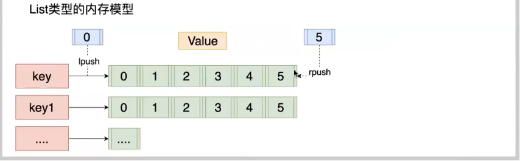

2. 常用命令

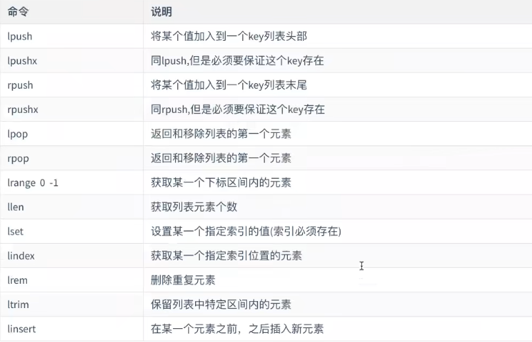

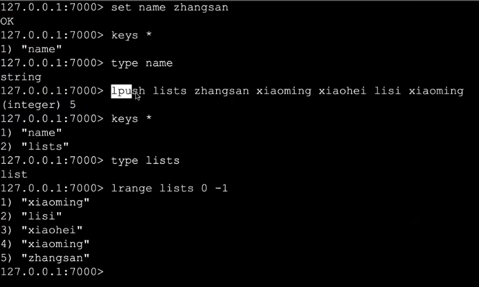

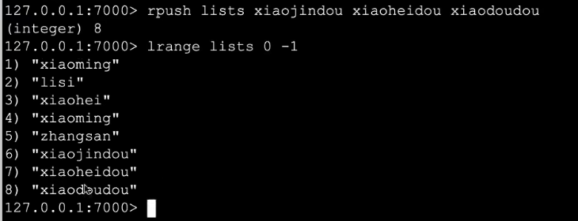

lpop 是移除列表左边第一个并返回该值 ，rpop 是移除列表右边第一个元素并返回

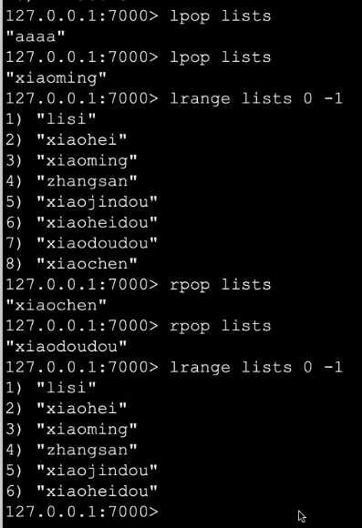

删除重复元素，lrem 要指定删除几个，从左边开始

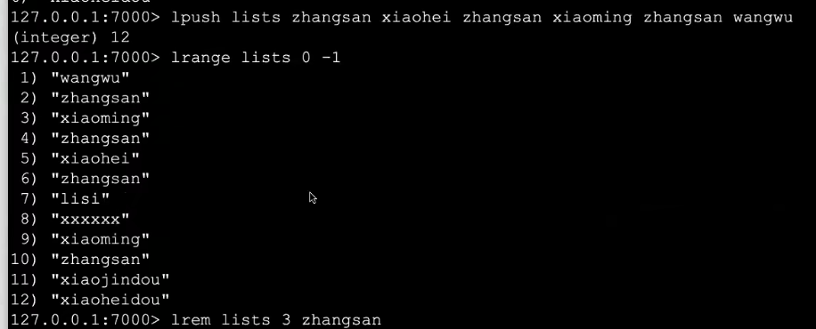

linsert默认从左边开始

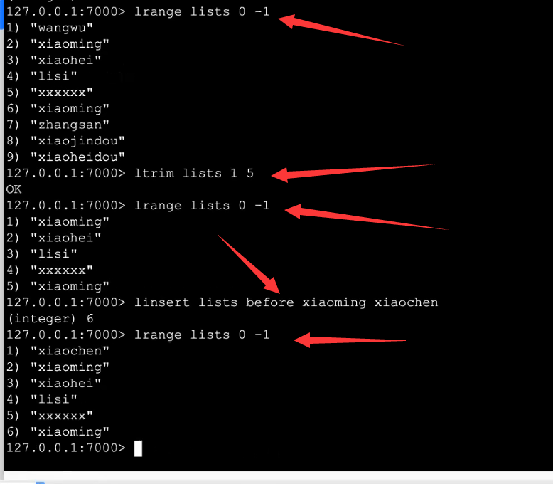

删除特定索引的值

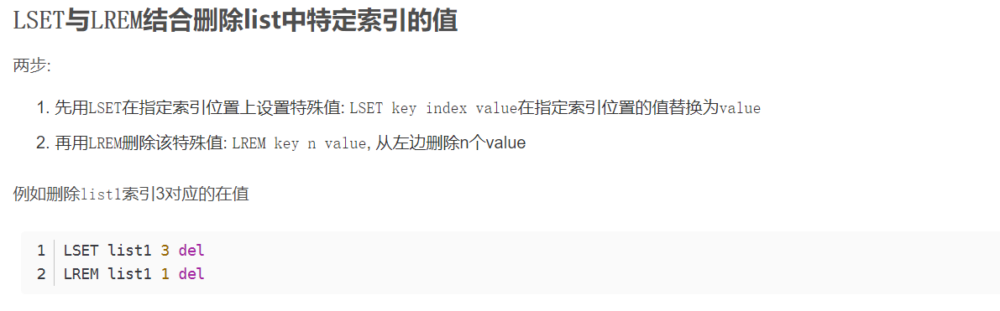


#### 2.3.1 list操作

```markdown
数据存储需求：存储多个数据，并对数据进入存储空间的顺序进行区分
需要的存储结构：一个存储空间保存多个数据，且通过数据可以体现进入顺序
list类型：保存多个数据，底层使用双向链表存储结构实现


添加/修改数据
lpush key value1 [value2] ……
rpush key value1 [value2] ……

获取数据
lrange key start stop
lindex key index
llen key 

获取并移除数据
lpop key
rpop key

127.0.0.1:6379> lpush list1 a b c
(integer) 3
127.0.0.1:6379> rpush list2 d e f
(integer) 3
127.0.0.1:6379> lrange list1 0 -1
1) "c"
2) "b"
3) "a"
127.0.0.1:6379> lrange list2 0 -1
1) "d"
2) "e"
3) "f"
127.0.0.1:6379> lindex list1 0
"c"
127.0.0.1:6379> lindex list1 -1
"a"
127.0.0.1:6379> lindex list1 -2
"b"
127.0.0.1:6379> llen list1
(integer) 3
127.0.0.1:6379> llen list2
(integer) 3
127.0.0.1:6379> lpop list1
"c"
127.0.0.1:6379> rpop list1
"a"
127.0.0.1:6379> llen list1
(integer) 1
127.0.0.1:6379> lpop list2 
"d"
127.0.0.1:6379> rpop list2
"f"
127.0.0.1:6379> llen list2
(integer) 1

规定时间内获取并移除数据
blpop key1 [key2] timeout
brpop key1 [key2] timeout

127.0.0.1:6379> keys *
1) "list2"
127.0.0.1:6379> lpush list1 aa
(integer) 1
127.0.0.1:6379> keys *
1) "list2"
127.0.0.1:6379> lpush list3 bb
(integer) 1
127.0.0.1:6379> 

127.0.0.1:6379> blpop list1 10
1) "list1"
2) "aa"
127.0.0.1:6379> blpop list3 10
1) "list3"
2) "bb"
(3.78s)
```

#### 2.3.2 微信朋友圈点赞

 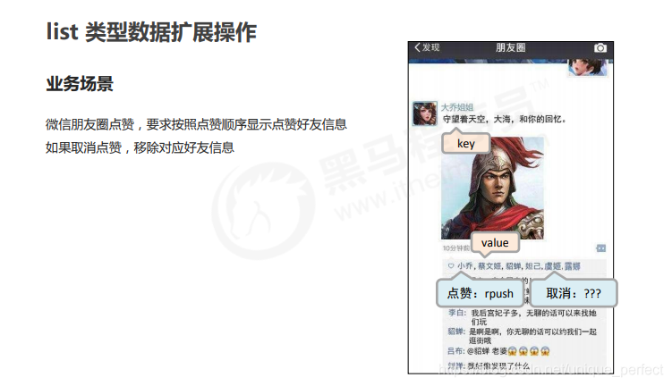 

```markdown
list 类型数据扩展操作
移除指定数据
lrem key count value  # count表示移除的个数


Tips `6`：
redis 应用于具有操作先后顺序的数据控制


127.0.0.1:6379> lpush list1 a b c d a
(integer) 5
127.0.0.1:6379> lrange list1 0 -1
1) "a"
2) "d"
3) "c"
4) "b"
5) "a"
127.0.0.1:6379> lrem list1 2 a
(integer) 2
127.0.0.1:6379> llen list1
(integer) 3
127.0.0.1:6379> lrange list1 0 -1
1) "d"
2) "c"
3) "b"
```

#### 2.3.3 list 类型数据操作注意事项

```markdown
list中保存的数据都是string类型的，数据总容量是有限的，
最多2^32-1 个元素 (4294967295)。

list具有索引的概念，但是操作数据时通常以队列的形式进行入队出队操作，或以栈的形式进行入栈出栈操作

获取全部数据操作结束索引设置为-1

list可以对数据进行分页操作，通常第一页的信息来自于list，第2页及更多的信息通过数据库的形式加载

```

#### 2.3.4 保障多台服务器操作日志的统一顺序输出

```markdown
依赖list的数据具有顺序的特征对信息进行管理
使用队列模型解决多路信息汇总合并的问题
使用栈模型解决最新消息的问题


Tips 7：
redis 应用于最新消息展示

127.0.0.1:6379> rpush logs a1..
(integer) 1
127.0.0.1:6379> rpush logs a1...
(integer) 2
127.0.0.1:6379> lrange logs 0 -1
1) "a1.."
2) "a1..."
3) "b1.."
4) "c1.."
5) "b1..."
6) "c1..."

127.0.0.1:6379> rpush logs b1..
(integer) 3
127.0.0.1:6379> rpush logs b1...
(integer) 5

127.0.0.1:6379> rpush logs c1..
(integer) 4
127.0.0.1:6379> rpush logs c1...
(integer) 6

```

