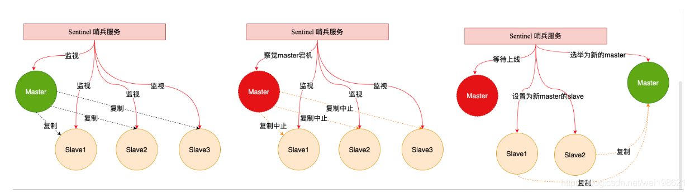
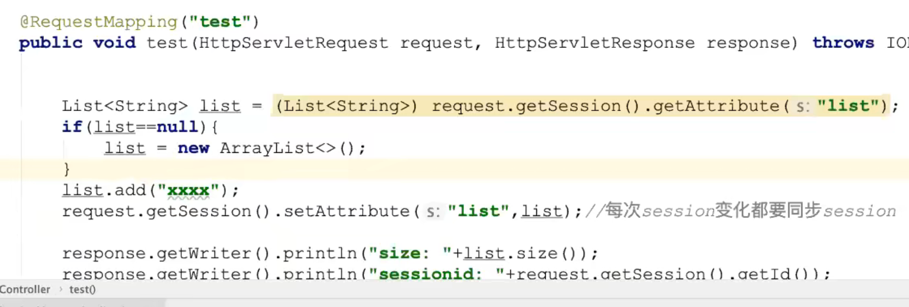

## Redis

## 1 redis入门

### 1.1 NoSQL的引言

```markdown
`NoSQL(Not Only SQL)`，意即`不仅仅是SQL`, 泛指非关系型的数据库。Nosql这个技术门类,早期就有人提出,发展至2009年趋势越发高涨。
RDBMS 关系型数据库  sql语句操作
NoSQL 泛指非关系数据库，用的不一定是sql
两种都是数据库
```

### 1.2 为什么是NoSQL

```markdown
随着互联网网站的兴起，传统的关系数据库在应付动态网站，特别是超大规模和高并发的纯动态网站已经显得力不从心，暴露了很多难以克服的问题。如 `商城网站中对商品数据频繁查询`、`对热搜商品的排行统计`、`订单超时问题`、以及`微信朋友圈（音频，视频）存储`等相关使用传统的关系型数据库实现就显得非常复杂，虽然能实现相应功能但是在性能上却不是那么乐观。nosql这个技术门类的出现，更好的解决了这些问题，它告诉了世界不仅仅是sql。
```

### 1.3 NoSQL的四大分类

#### 1.3.1 键值(Key-Value)存储数据库

```markdown
# 1.说明: 
- 这一类数据库主要会使用到一个哈希表，这个表中有一个特定的键和一个指针指向特定的数据。
<key value>

# 2.特点
- Key/value模型对于IT系统来说的优势在于简单、易部署。  
- 但是如果DBA只对部分值进行查询或更新的时候，Key/value就显得效率低下了。

# 3.相关产品
Tokyo Cabinet/Tyrant,
Redis  数据在内存
SSDB   数据在硬盘
Voldemort 
Oracle BDB
```

#### 1.3.2 列存储数据库

```markdown
# 1.说明
- 这部分数据库通常是用来应对分布式存储的海量数据。

# 2.特点
- 键仍然存在，但是它们的特点是指向了多个列。这些列是由列家族来安排的。

# 3.相关产品
- Cassandra、HBase、Riak.
```

#### 1.3.3 文档型数据库

```markdown
# 1.说明
- 文档型数据库的灵感是来自于Lotus Notes办公软件的，而且它同第一种键值存储相类似该类型的数据模型是版本化的文档，半结构化的文档以特定的格式存储，比如JSON。文档型数据库可以看作是键值数据库的升级版，允许之间嵌套键值。而且文档型数据库比键值数据库的查询效率更高

# 2.特点
- 以文档形式存储

# 3.相关产品
- MongoDB、CouchDB、 MongoDb(4.x). 国内也有文档型数据库SequoiaDB，已经开源。
```

#### 1.3.4 图形(Graph)数据库

```markdown
# 1.说明
- 图形结构的数据库同其他行列以及刚性结构的SQL数据库不同，它是使用灵活的图形模型，并且能够扩展到多个服务器上。NoSQL数据库没有标准的查询语言(SQL)，因此进行数据库查询需要制定数据模型。许多NoSQL数据库都有REST式的数据接口或者查询API。

# 2.相关产品
- Neo4J、InfoGrid、 Infinite Graph、
```

#### 1.3.5 NoSQL应用场景

- 数据模型比较简单

- 需要灵活性更强的IT系统

- 对数据库性能要求较高

- 不需要高度的数据一致性(Nosql产品对于事务支持都不是特别良好)

### 1.4 Redis 简介

```markdown
问题现象
海量用户
高并发

罪魁祸首——关系型数据库
性能瓶颈：磁盘IO性能低下
扩展瓶颈：数据关系复杂，扩展性差，不便于大规模集群

解决思路
降低磁盘IO次数，越低越好 —— 内存存储
去除数据间关系，越简单越好 —— 不存储关系，仅存储数据
这里Nosql可以解决

NoSQL：即 Not-Only SQL（ 泛指非关系型的数据库），作为关系型数据库的补充
作用：应对基于海量用户和海量数据前提下的数据处理问题。

特征：
可扩容，可伸缩
大数据量下高性能
灵活的数据模型
高可用

常见 Nosql 数据库：
Redis
memcache
HBase
MongoDB
```

### 1.5 电商场景 

  

  

```markdown
概念：Redis (REmote DIctionary Server) 是用 C 语言开发的一个开源的高性能键值对（key-value）数据库

Redis is an open source (BSD licensed),in-memory data structure store, used as a database, cache and message broker.
Redis开源遵循BSD  基于内存数据存储 被用于作为数据库 缓存 消息中间件

redis的数据都在内存中，内存读写块，但是断电即消失，但redis有：持久化机制  定期写入磁盘

总结: Redis是一个内存型的数据库
```

### 1.6Redis特点

------

- Redis是一个高性能key/value 内存型数据库
- Redis 支持丰富的数据类型 (value 可以是 String，List，Set, ZSet，Hash)
- Redis 支持持久化  内存数据 持久化到硬盘中
- Redis 单线程，单线程  但是效率还是高 不支持并发，不存在线程安全问题，以此 Redis 实现分布式锁(java 中多线程，要使用Synchronized锁，但是在集群中不行，因为只能在当前虚拟机中加锁，不能操作其他虚拟机)

### 1.7 Redis 的应用

```markdown
为热点数据加速查询（主要场景），如热点商品、热点新闻、
热点资讯、推广类等高访问量信息等
任务队列，如秒杀、抢购、购票排队等
即时信息查询，如各位排行榜、各类网站访问统计、公交到站信息、
在线人数信息（聊天室、网站）、设备信号等
时效性信息控制，如验证码控制、投票控制等
分布式数据共享，如分布式集群架构中的 session 分离
消息队列
分布式锁
```

### 1.8 Redis 的下载与安装

```markdown
0.准备环境
vmware15.x+
centos7.x+

1.下载redis源码包
https://redis.io/
```

 

```markdown
2.下载完整源码包
redis-7.0.4.tar.gz
```

 

```markdown
3.将下载redis资料包上传到Linux中

4.解压缩文件

[root@localhost opt]# tar -zxvf redis-7.0.4.tar.gz
[root@localhost opt]# ls
containerd  redis  redis-7.0.4.tar.gz  rh
```


进入文件夹，发现有Makefile，因此可以直接执行make 去编译安装，但是这里面是用C语言编写的，因此要先安装C语言的gcc依赖，否则无法编译通过


```markdown
# 5.安装gcc  
- yum install -y gcc

# 6.进入解压缩目录执行如下命令
- make MALLOC=libc
# 这一步可能会报错，升级gcc版本即可
升级gcc版本
yum -y install centos-release-scl
yum -y install devtoolset-9-gcc devtoolset-9-gcc-c++ devtoolset-9-binutils scl enable devtoolset-9 bash  # scl命令启用只是临时的，
退出xshell或者重启就会恢复到原来的gcc版本。

# 如果要长期生效的话，执行如下：
echo "source /opt/rh/devtoolset-9/enable" >>/etc/profile

注意：如果用客户端工具连接服务器的话，有可能使用gcc -v还是
原来的版本，只需要断开重新连接即可 
# 7.编译完成后执行如下命令
- make install PREFIX=/usr/redis  # 将编译好的文件放到指定目录下

# 8.进入/usr/local/redis/bin目录启动redis服务 
./redis-server
```


安装到指定目录后


启动成功


**补充redis的细节**


启动时可以指定配置文件，可以用相对路径


redis中库的概念


redis中清除库的指令

```
flushdb  清除当前库
flushall 清楚所有库
```

redis客户端显示中文

```
./redis-cli -p 6379 --raw
```


```markdown
# 9.Redis服务端口默认是 6379

# 10.重新开一个会话，进入bin目录执行客户端连接操作
- ./redis-cli -h localhost –p 6379
实际上可以不写后面两个参数，因为默认就是主机和6379

# 补充：
默认配置启动
redis-server
redis-server -p 6379
redis-server  -p 6380
 
# 指定配置文件启动
redis-server redis.conf
redis-server redis-6379.conf
redis-server redis-6380.conf ……
redis-server conf/redis-6379.conf
redis-server config/redis-6380.conf ……

# 默认连接
redis-cli
连接指定服务器
redis-cli -h 127.0.0.1
redis-cli -p 6379
redis-cli -h 127.0.0.1 -p 6379

# 基本配置
daemonize yes
以守护进程方式启动，使用本启动方式，redis将以服务的形式存在，
日志将不再打印到命令窗口中
port 6***
设定当前服务启动端口号
dir “/自定义目录/redis/data“
设定当前服务文件保存位置，包含日志文件、持久化文件
（后面详细讲解）等
logfile "6***.log“
设定日志文件名，便于查阅
```


### 1.9 核心文件

```markdown
redis-serve 服务器启动命令
redis-cli 命令行客户端
redis.conf    redis核心配置文件
redis-benchmark 性能测试工具
redis-check-aof AOF文件修复工具
redis-check-dump  RDB文件检查工具（快照持久化文件）
```

### 1.10 Redis 的基本操作

```markdown
信息添加
set key value
set name itheima

信息查询
功能：根据 key 查询对应的 value，如果不存在，返回空（nil）
get key
get name

清除屏幕信息
功能：清除屏幕中的信息
clear

退出客户端命令行模式
功能：退出客户端
quit
exit
<ESC>

帮助
功能：获取命令帮助文档，获取组中所有命令信息名称
命令
help 命令名称
help set

127.0.0.1:6379> help get

GET key
summary: Get the value of a key
since: 1.0.0
group: string

help @组名
127.0.0.1:6379> help @string

APPEND key value
summary: Append a value to a key
since: 2.0.0

BITCOUNT key [start end]
summary: Count set bits in a string
since: 2.6.0

BITFIELD key [GET type offset] [SET type offset value] [INCRBY type offset increment] [OVERFLOW WRAP|SAT|FAIL]
summary: Perform arbitrary bitfield integer operations on strings
since: 3.2.0
....
```

## 2 Redis 数据库相关指令

### 2.0 操作key相关指令

```markdown
# 1. DEL指令
- 语法：DEL key [key ...]
- 作用 删除给定的一个或多个key。不存在的key 会被忽略
```


注意 exists 指令，判断多个key的时候只要有一个存在就会返回 1


这里的 ? 表示严格匹配一个任意字符，而 * 表示匹配 0-任意个字符，[ae]表示只能匹配 a 或者 e ，keys可以做过滤


key都是String类型，type key 可以查看值的类型

```markdown
string String
hash HashMap
list LinkedList
set  HashSet
sorted_set TreeSet
```

### 2.1 redis 数据存储格式

```markdown
redis 自身是一个 Map，其中所有的数据都是采用 key : value的形式存储
数据类型指的是存储的数据的类型，也就是 value 部分的类型，
key 部分永远都是字符串
```


### 2.2 string 类型


 key 是 String，value 也是 String

#### 2.2.1 string操作

常用命令


getrange也可以指定范围


setnx示例


Incrbyfloat  最多保留16位小数


```markdown
存储的数据：单个数据，最简单的数据存储类型，也是最常用的数据存储类型
存储数据的格式：一个存储空间保存一个数据
存储内容：通常使用字符串，如果字符串以整数的形式展示，可以作为数字操作使用

添加/修改数据
set key value
获取数据
get key
删除数据
del key

127.0.0.1:6379> set age 100
OK
127.0.0.1:6379> get age
"100"
127.0.0.1:6379> del age
(integer) 1
127.0.0.1:6379> del age
(integer) 0


添加/修改多个数据
mset key1 value1 key2 value2 …
获取多个数据
mget key1 key2 …
获取数据字符个数（字符串长度）
strlen key
追加信息到原始信息后部（如果原始信息存在就追加，否则新建）
append key value
127.0.0.1:6379> mset a 1 b 2 c 3
OK
127.0.0.1:6379> mget a b c
1) "1"
2) "2"
3) "3"
127.0.0.1:6379> strlen a
(integer) 1
127.0.0.1:6379> append a 23
(integer) 3
127.0.0.1:6379> get a
"123"


设置数值数据增加指定范围的值
incr key  # 增加1
incrby key increment
incrbyfloat key increment

127.0.0.1:6379> get a
"123"
127.0.0.1:6379> incr a
(integer) 124
127.0.0.1:6379> incrby a 26
(integer) 150
127.0.0.1:6379> incrbyfloat a 50
"200"


设置数值数据减少指定范围的值
decr key # 减少1
decrby key increment

127.0.0.1:6379> get a
"174"
127.0.0.1:6379> decr a
(integer) 173
127.0.0.1:6379> decrby a 25
(integer) 148


string 作为数值操作
string在redis内部存储默认就是一个字符串，当遇到增减类操作incr，decr时会转成数值型进行计算。
redis所有的操作都是原子性的，采用单线程处理所有业务，命令是一个一个执行的，因此无需考虑并发带来的数据影响。
注意：按数值进行操作的数据，如果原始数据不能转成数值，或超越了redis 数值上限范围，将报错。

9223372036854775807（java中long型数据最大值，Long.MAX_VALUE）

Tips 1：
redis用于控制数据库表主键id，为数据库表主键提供生成策略，保障数据库表的主键唯一性
此方案适用于所有数据库，且支持数据库集群

设置数据具有指定的生命周期
setex key seconds value  # 秒为单位
psetex key milliseconds value   # 毫秒为单位

Tips 2：
redis 控制数据的生命周期，通过数据是否失效控制业务行为，适用于所有具有时效性限定控制的操作


127.0.0.1:6379> setex a 5 1
OK
127.0.0.1:6379> get a
"1"
127.0.0.1:6379> get a
(nil)

127.0.0.1:6379> psetex a 5000 2
OK
127.0.0.1:6379> get a
"2"
127.0.0.1:6379> get a
"2"
127.0.0.1:6379> get a
(nil)


string 类型数据操作的注意事项
数据操作不成功的反馈与数据正常操作之间的差异
① 表示运行结果是否成功
(integer) 0 → false 失败
(integer) 1 → true 成功
② 表示运行结果值
(integer) 3 → 3 3个
(integer) 1 → 1 1个
数据未获取到
（nil）等同于null
数据最大存储量
512MB
数值计算最大范围（java中的long的最大值）
9223372036854775807
```

### 2.3 list

**list 列表 相当于java中的list 集合，特点：元素有序且可以重复**

key 仍然是String，value 是 list，list中的值还是String

1. 内存存储模型

   可以从左边放，也可以从右边放

   

2. 常用命令


lpop 是移除列表左边第一个并返回该值 ，rpop 是移除列表右边第一个元素并返回


删除重复元素，lrem 要指定删除几个，从左边开始


linsert默认从左边开始


删除特定索引的值


#### 2.3.1 list操作

```markdown
数据存储需求：存储多个数据，并对数据进入存储空间的顺序进行区分
需要的存储结构：一个存储空间保存多个数据，且通过数据可以体现进入顺序
list类型：保存多个数据，底层使用双向链表存储结构实现


添加/修改数据
lpush key value1 [value2] ……
rpush key value1 [value2] ……

获取数据
lrange key start stop
lindex key index
llen key 

获取并移除数据
lpop key
rpop key

127.0.0.1:6379> lpush list1 a b c
(integer) 3
127.0.0.1:6379> rpush list2 d e f
(integer) 3
127.0.0.1:6379> lrange list1 0 -1
1) "c"
2) "b"
3) "a"
127.0.0.1:6379> lrange list2 0 -1
1) "d"
2) "e"
3) "f"
127.0.0.1:6379> lindex list1 0
"c"
127.0.0.1:6379> lindex list1 -1
"a"
127.0.0.1:6379> lindex list1 -2
"b"
127.0.0.1:6379> llen list1
(integer) 3
127.0.0.1:6379> llen list2
(integer) 3
127.0.0.1:6379> lpop list1
"c"
127.0.0.1:6379> rpop list1
"a"
127.0.0.1:6379> llen list1
(integer) 1
127.0.0.1:6379> lpop list2 
"d"
127.0.0.1:6379> rpop list2
"f"
127.0.0.1:6379> llen list2
(integer) 1

规定时间内获取并移除数据
blpop key1 [key2] timeout
brpop key1 [key2] timeout

127.0.0.1:6379> keys *
1) "list2"
127.0.0.1:6379> lpush list1 aa
(integer) 1
127.0.0.1:6379> keys *
1) "list2"
127.0.0.1:6379> lpush list3 bb
(integer) 1
127.0.0.1:6379> 

127.0.0.1:6379> blpop list1 10
1) "list1"
2) "aa"
127.0.0.1:6379> blpop list3 10
1) "list3"
2) "bb"
(3.78s)
```

#### 2.3.2 微信朋友圈点赞

  

```markdown
list 类型数据扩展操作
移除指定数据
lrem key count value  # count表示移除的个数


Tips `6`：
redis 应用于具有操作先后顺序的数据控制


127.0.0.1:6379> lpush list1 a b c d a
(integer) 5
127.0.0.1:6379> lrange list1 0 -1
1) "a"
2) "d"
3) "c"
4) "b"
5) "a"
127.0.0.1:6379> lrem list1 2 a
(integer) 2
127.0.0.1:6379> llen list1
(integer) 3
127.0.0.1:6379> lrange list1 0 -1
1) "d"
2) "c"
3) "b"
```

#### 2.3.3 list 类型数据操作注意事项

```markdown
list中保存的数据都是string类型的，数据总容量是有限的，
最多2^32-1 个元素 (4294967295)。

list具有索引的概念，但是操作数据时通常以队列的形式进行入队出队操作，或以栈的形式进行入栈出栈操作

获取全部数据操作结束索引设置为-1

list可以对数据进行分页操作，通常第一页的信息来自于list，第2页及更多的信息通过数据库的形式加载

```

#### 2.3.4 保障多台服务器操作日志的统一顺序输出

```markdown
依赖list的数据具有顺序的特征对信息进行管理
使用队列模型解决多路信息汇总合并的问题
使用栈模型解决最新消息的问题


Tips 7：
redis 应用于最新消息展示

127.0.0.1:6379> rpush logs a1..
(integer) 1
127.0.0.1:6379> rpush logs a1...
(integer) 2
127.0.0.1:6379> lrange logs 0 -1
1) "a1.."
2) "a1..."
3) "b1.."
4) "c1.."
5) "b1..."
6) "c1..."

127.0.0.1:6379> rpush logs b1..
(integer) 3
127.0.0.1:6379> rpush logs b1...
(integer) 5

127.0.0.1:6379> rpush logs c1..
(integer) 4
127.0.0.1:6379> rpush logs c1...
(integer) 6

```

### 2.4 set类型

特点：Set类型，可以称之为Set集合，元素无序不可重复

#### 2.4.1 内存模型


#### 2.4.2 常用命令


Set类型是不可以重复的，所以写了相同的也会自动去重


spop 命令可以指定移除的个数


smove  被移的集合  移动到的集合  移动的元素


srandmember 可以指定返回个数


### 2.5 ZSet类型

类似java中的 treeset，可排序的 set 集合，元素还是无序不可重复，但是可以根据某种条件进行排序

也成为 sortset，每个元素都带了个分数，排序靠分数实现

#### 2.5.1 内存模型


#### 2.5.2 常用命令


zset 中遇到重复的，后来的会替换原先的


zrange 后面加参数可以显示分数


zrangebyscore 还可以根据分数范围，还支持分页


zrank 和 zrevrank 可以排名，但是实际业务要+1


**这种类型可以用于做排行榜，热搜榜，词搜的越多，可以使用 zincrby 进行加分**

### 2.6 hash类型

类似 Java 中的map类型，redis中key都为String，hash类型的 value 还是一个 key-value 型

特点：value 是一个map结构，存在 key，value，key是无序的

#### 2.6.1 内存模型


#### 2.6.2 常用命令


hget 是获取一个小 key 的 value


hsetnx 是如果 key 不存在则添加，存在则不操作

hincrby 是对数值型的 value 进行加法运算


## 3 redis 远程连接工具

**redis desktop manager**

### 3.1 开启redis远程连接


重启redis，这里修改的是上层的redis配置文件，所以加载上层的


## 4. 持久化机制

client redis[内存] -----> 内存数据- 数据持久化–>磁盘

Redis官方提供了两种不同的持久化方法来将数据存储到硬盘里面分别是:

- 快照(Snapshot)
- AOF (Append Only File) 只追加日志文件


### 4.1 快照(Snapshot)

#### 1. 特点

这种方式可以将某一时刻的所有数据都写入硬盘中,当然这也是**redis的默认开启持久化方式**,保存的文件是以.rdb形式结尾的文件因此这种方式也称之为RDB方式。

 


#### 2.快照生成方式

- 客户端方式: BGSAVE 和 SAVE指令
- 服务器配置自动触发

```markdown
# 1.客户端方式之BGSAVE
- a.客户端可以使用BGSAVE命令来创建一个快照,当接收到客户端的BGSAVE命令时,redis会调用fork¹来创建一个子进程,然后子进程负责将快照写入磁盘中,而父进程则继续处理命令请求。
	
	`名词解释: fork当一个进程创建子进程的时候,底层的操作系统会创建该进程的一个副本,在类unix系统中创建子进程的操作会进行优化:在刚开始的时候,父子进程共享相同内存,直到父进程或子进程对内存进行了写之后,对被写入的内存的共享才会结束服务`
```

  

```markdown
# 2.客户端方式之SAVE
- b.客户端还可以使用SAVE命令来创建一个快照,接收到SAVE命令的redis服务器在快照创建完毕之前将不再响应任何其他的命令
```

  

- **注意: SAVE命令并不常用,使用SAVE命令在快照创建完毕之前,redis处于阻塞状态,无法对外服务**
- 

在客户端中使用命令

```markdown
# 3.服务器配置方式之满足配置自动触发
- 如果用户在redis.conf中设置了save配置选项,redis会在save选项条件满足之后自动触发一次BGSAVE命令,如果设置多个save配置选项,当任意一个save配置选项条件满足,redis也会触发一次BGSAVE命令
```

  

```markdown
# 4.服务器接收客户端shutdown指令
- 当redis通过shutdown指令接收到关闭服务器的请求时,会执行一个save命令,阻塞所有的客户端,不再执行客户端执行发送的任何命令,并且在save命令执行完毕之后关闭服务器
```

#### 3.配置生成快照名称和位置

```markdown
# 1.修改生成快照名称
- dbfilename dump.rdb

# 2.修改生成位置
- dir ./
```

 

快照持久化也可能会丢失某一时刻的数据，即刚做完快照后，又有写入操作后直接宕机 

------

### 4.2 AOF 只追加日志文件

#### 1.特点

这种方式可以将所有客户端执行的写命令记录到日志文件中,AOF持久化会将被执行的写命令写到AOF的文件末尾,以此来记录数据发生的变化,因此只要redis从头到尾执行一次AOF文件所包含的所有写命令,就可以恢复AOF文件的记录的数据集.

  

#### 2.开启AOF持久化

在redis的默认配置中AOF持久化机制是没有开启的，需要在配置中开启

```markdown
# 1.开启AOF持久化
- a.修改 appendonly yes 开启持久化
- b.修改 appendfilename "appendonly.aof" 指定生成文件名称
```

  

#### 3.日志追加频率

```markdown
# 1.always 【谨慎使用】
- 说明: 每个redis写命令都要同步写入硬盘,严重降低redis速度
- 解释: 如果用户使用了always选项,那么每个redis写命令都会被写入硬盘,从而将发生系统崩溃时出现的数据丢失减到最少;遗憾的是,因为这种同步策略需要对硬盘进行大量的写入操作,所以redis处理命令的速度会受到硬盘性能的限制;
- 注意: 转盘式硬盘在这种频率下200左右个命令/s ; 固态硬盘(SSD) 几百万个命令/s;
- 警告: 使用SSD用户请谨慎使用always选项,这种模式不断写入少量数据的做法有可能会引发严重的写入放大问题,导致将固态硬盘的寿命从原来的几年降低为几个月。

# 2.everysec 【推荐】
- 说明: 每秒执行一次同步显式的将多个写命令同步到磁盘
- 解释： 为了兼顾数据安全和写入性能,用户可以考虑使用everysec选项,让redis每秒一次的频率对AOF文件进行同步;redis每秒同步一次AOF文件时性能和不使用任何持久化特性时的性能相差无几,而通过每秒同步一次AOF文件,redis可以保证,即使系统崩溃,用户最多丢失一秒之内产生的数据。

# 3.no	【不推荐】
- 说明: 由操作系统决定何时同步 
- 解释：最后使用no选项,将完全有操作系统决定什么时候同步AOF日志文件,这个选项不会对redis性能带来影响但是系统崩溃时,会丢失不定数量的数据,另外如果用户硬盘处理写入操作不够快的话,当缓冲区被等待写入硬盘数据填满时,redis会处于阻塞状态,并导致redis的处理命令请求的速度变慢。
```

#### 4.修改同步频率

```markdown
# 1.修改日志同步频率
- 修改appendfsync everysec|always|no 指定
```

  


同时开启两种持久化方案会优先使用AOF

### 4.3 AOF文件的重写

#### 1. AOF带来的问题

AOF的方式也同时带来了另一个问题。持久化文件会变的越来越大。例如我们调用incr test命令100次，文件中必须保存全部的100条命令，其实有99条都是多余的。因为要恢复数据库的状态其实文件中保存一条set test 100就够了。为了压缩aof的持久化文件Redis提供了AOF重写(ReWriter)机制。

#### 2. AOF重写

 用来在一定程度上减小AOF文件的体积 

#### 3. 触发重写方式

```markdown
# 1.客户端方式触发重写
- 执行BGREWRITEAOF命令  不会阻塞redis的服务

# 2.服务器配置方式自动触发
- 配置redis.conf中的auto-aof-rewrite-percentage选项 参加下图↓↓↓
- 如果设置auto-aof-rewrite-percentage值为100和auto-aof-rewrite-min-size 64mb,并且启用的AOF持久化时,那么当AOF文件体积大于64M,并且AOF文件的体积比上一次重写之后体积大了至少一倍(100%)时,会自动触发,如果重写过于频繁,用户可以考虑将auto-aof-rewrite-percentage设置为更大
```

  

#### 4. 重写原理

 **注意：重写aof文件的操作，并没有读取旧的aof文件，而是将整个内存中的数据库内容用命令的方式重写了一个新的aof文件,替换原有的文件这点和快照有点类似。** 

```markdown
# 重写流程
- 1. redis调用fork ，现在有父子两个进程 子进程根据内存中的数据库快照，往临时文件中写入重建数据库状态的命令
- 2. 父进程继续处理client请求，除了把写命令写入到原来的aof文件中。同时把收到的写命令缓存起来。这样就能保证如果子进程重写失败的话并不会出问题。
- 3. 当子进程把快照内容写入已命令方式写到临时文件中后，子进程发信号通知父进程。然后父进程把缓存的写命令也写入到临时文件。
- 4. 现在父进程可以使用临时文件替换老的aof文件，并重命名，后面收到的写命令也开始往新的aof文件中追加。
```

  

### 4.4 持久化总结

两种持久化方案既可以同时使用(aof),又可以单独使用,在某种情况下也可以都不使用,具体使用那种持久化方案取决于用户的数据和应用决定。

无论使用AOF还是快照机制持久化,将数据持久化到硬盘都是有必要的,除了持久化外,用户还应该对持久化的文件进行备份(最好备份在多个不同地方)。

------

## 5. java操作Redis

  

  

### 5.1 环境准备

#### 1. 引入依赖

```markdown
<!--引入jedis连接依赖-->
<dependency>
  <groupId>redis.clients</groupId>
  <artifactId>jedis</artifactId>
  <version>2.9.0</version>
</dependency>
```

#### 2.创建jedis对象

```java
 public static void main(String[] args) {
   //1.创建jedis对象
   Jedis jedis = new Jedis("192.168.40.4", 6379);//1.redis服务必须关闭防火墙  2.redis服务必须开启远程连接
   jedis.select(0);//选择操作的库默认0号库  不写就默认0号库
   //2.执行相关操作
   //....
   //3.释放资源
   jedis.close();
 }
```

  

### 5.2 操作key相关API

  

```java
private Jedis jedis;
    @Before
    public void before(){
        this.jedis = new Jedis("192.168.202.205", 7000);
    }
    @After
    public void after(){
        jedis.close();
    }

    //测试key相关
    @Test
    public void testKeys(){
        //删除一个key
        jedis.del("name");
        //删除多个key
        jedis.del("name","age");

        //判断一个key是否存在exits
        Boolean name = jedis.exists("name");
        System.out.println(name);

        //设置一个key超时时间 expire pexpire
        Long age = jedis.expire("age", 100);
        System.out.println(age);

        //获取一个key超时时间 ttl
        Long age1 = jedis.ttl("newage");
        System.out.println(age1);

        //随机获取一个key
        String s = jedis.randomKey();

        //修改key名称
        jedis.rename("age","newage");

        //查看可以对应值的类型
        String name1 = jedis.type("name");
        System.out.println(name1);
        String maps = jedis.type("maps");
        System.out.println(maps);
    }
```

  

### 5.3操作String相关API

```java
//测试String相关
    @Test
    public void testString(){
        //set
        jedis.set("name","小陈");
        //get
        String s = jedis.get("name");
        System.out.println(s);
        //mset
        jedis.mset("content","好人","address","海淀区");
        //mget
        List<String> mget = jedis.mget("name", "content", "address");
        mget.forEach(v-> System.out.println("v = " + v));
        //getset
        String set = jedis.getSet("name", "小明");
        System.out.println(set);

        //............
    }
```

### 5.4操作List相关API

```java
//测试List相关
    @Test
    public void testList(){

        //lpush
        jedis.lpush("names1","张三","王五","赵柳","win7");

        //rpush
        jedis.rpush("names1","xiaomingming");

        //lrange

        List<String> names1 = jedis.lrange("names1", 0, -1);
        names1.forEach(name-> System.out.println("name = " + name));

        //lpop rpop
        String names11 = jedis.lpop("names1");
        System.out.println(names11);

        //llen
        jedis.linsert("lists", BinaryClient.LIST_POSITION.BEFORE,"xiaohei","xiaobai");

      	//........

    }

```

### 5.5操作Set的相关API

```java
//测试SET相关
@Test
public void testSet(){

  //sadd
  jedis.sadd("names","zhangsan","lisi");

  //smembers
  jedis.smembers("names");

  //sismember
  jedis.sismember("names","xiaochen");

  //...
}
```

### 5.6 操作ZSet相关API

```java
//测试ZSET相关
@Test
public void testZset(){

  //zadd
  jedis.zadd("names",10,"张三");

  //zrange
  jedis.zrange("names",0,-1);

  //zcard
  jedis.zcard("names");

  //zrangeByScore
  jedis.zrangeByScore("names","0","100",0,5);

  //..

}
```

### 5.7 操作Hash相关API

```java
//测试HASH相关
@Test
public void testHash(){
  //hset
  jedis.hset("maps","name","zhangsan");
  //hget
  jedis.hget("maps","name");
  //hgetall
  jedis.hgetAll("mps");
  //hkeys
  jedis.hkeys("maps");
  //hvals
  jedis.hvals("maps");
  //....
}

```

## 6.SpringBoot整合Redis

 Spring Boot Data(数据) Redis 中提供了**RedisTemplate和StringRedisTemplate** ，其中StringRedisTemplate是RedisTemplate的子类，两个方法基本一致，不同之处主要体现在操作的数据类型不同， **RedisTemplate中的两个泛型都是Object，意味着存储的key和value都可以是一个对象，而StringRedisTemplate的两个泛型都是String，意味着StringRedisTemplate的key和value都只能是字符串** 。

**注意: 使用RedisTemplate默认是将对象序列化到Redis中,所以放入的对象必须实现对象序列化接口**

### 6.1 环境准备


#### 1.引入依赖

```java
<dependency>
  <groupId>org.springframework.boot</groupId>
  <artifactId>spring-boot-starter-data-redis</artifactId>
</dependency>
```

#### 2.配置application.propertie

```properties
server.port=8989

spring.redis.host=192.168.208.100
spring.redis.port=6379
spring.redis.database=0
```

### 6.2 使用StringRedisTemplate和RedisTemplate

创建一个测试类 TestStringRedisTemplate

使用这个注解相当于启动SpringBoot


连接可能出现超时，可能是防火墙未关闭，或者直接打开6379端口，还需要修改配置文件


 如果设置为yes，那么只允许我们在本机的回环连接，其他机器无法连接。 注意重启redis

```java
	@Autowired
    private StringRedisTemplate stringRedisTemplate;  //对字符串支持比较友好,不能存储对象
    @Autowired
    private RedisTemplate redisTemplate;  //存储对象

    @Test
    public void testRedisTemplate(){
        System.out.println(redisTemplate);
        //设置redistemplate值使用对象序列化策略
        redisTemplate.setValueSerializer(new JdkSerializationRedisSerializer());//指定值使用对象序列化
        //redisTemplate.opsForValue().set("user",new User("21","小黑",23,new Date()));
        User user = (User) redisTemplate.opsForValue().get("user");
        System.out.println(user);
//      Set keys = redisTemplate.keys("*");
//      keys.forEach(key -> System.out.println(key));
        /*Object name = redisTemplate.opsForValue().get("name");
        System.out.println(name);*/

        //Object xiaohei = redisTemplate.opsForValue().get("xiaohei");
        //System.out.println(xiaohei);
        /*redisTemplate.opsForValue().set("name","xxxx");
        Object name = redisTemplate.opsForValue().get("name");
        System.out.println(name);*/
        /*redisTemplate.opsForList().leftPushAll("lists","xxxx","1111");
        List lists = redisTemplate.opsForList().range("lists", 0, -1);
        lists.forEach(list-> System.out.println(list));*/
    }


    //key的绑定操作 如果日后对某一个key的操作及其频繁,可以将这个key绑定到对应redistemplate中,日后基于绑定操作都是操作这个key
    //boundValueOps 用来对String值绑定key
    //boundListOps 用来对List值绑定key
    //boundSetOps 用来对Set值绑定key
    //boundZsetOps 用来对Zset值绑定key
    //boundHashOps 用来对Hash值绑定key

//两个 template 都可以使用
    @Test
    public void testBoundKey(){
        BoundValueOperations<String, String> nameValueOperations = stringRedisTemplate.boundValueOps("name");
        nameValueOperations.set("1");
        //yuew
        nameValueOperations.set("2");
        String s = nameValueOperations.get();
        System.out.println(s);

    }


    //hash相关操作 opsForHash
    @Test
    public void testHash(){
        stringRedisTemplate.opsForHash().put("maps","name","小黑");
        Object o = stringRedisTemplate.opsForHash().get("maps", "name");
        System.out.println(o);
    }

    //zset相关操作 opsForZSet
    @Test
    public void testZSet(){
        stringRedisTemplate.opsForZSet().add("zsets","小黑",10);
        Set<String> zsets = stringRedisTemplate.opsForZSet().range("zsets", 0, -1);
        zsets.forEach(value-> System.out.println(value));

        Set<ZSetOperations.TypedTuple<String>> zsets1 = stringRedisTemplate.opsForZSet().rangeByScoreWithScores("zsets", 0, 1000);

        zsets1.forEach(typedTuple -> {
            System.out.println(typedTuple.getValue());
            System.out.println(typedTuple.getScore());
        });

    }

    //set相关操作 opsForSet
    @Test
    public void testSet(){
        stringRedisTemplate.opsForSet().add("sets","xiaosan","xiaosi","xiaowu");
        Set<String> sets = stringRedisTemplate.opsForSet().members("sets");
        sets.forEach(value-> System.out.println(value));
    }

    //list相关的操作opsForList
    @Test
    public void testList(){
        //stringRedisTemplate.opsForList().leftPushAll("lists","张三","李四","王五");
//        List<String> names = new ArrayList<>();
//        names.add("12313");
//        stringRedisTemplate.opsForList().leftPushAll("names",names);  //创建一个列表，放入多个元素
        List<String> lists = stringRedisTemplate.opsForList().range("lists", 0, -1);//遍历
        lists.forEach(key -> System.out.println(key));
    }


    //String相关的操作 opsForValue  表示操作String类型
    @Test
    public void testString(){
        //stringRedisTemplate.opsForValue().set("166","好同学");
        String s = stringRedisTemplate.opsForValue().get("166");
        System.out.println(s);
        Long size = stringRedisTemplate.opsForValue().size("166");
        System.out.println(size);
    }


    //key相关的操作
    @Test
    public void test(){
        Set<String> keys = stringRedisTemplate.keys("*");//查看所有key
        Boolean name = stringRedisTemplate.hasKey("name");//判断某个key是否存在
        stringRedisTemplate.delete("age");//根据指定key删除
        stringRedisTemplate.rename("","");//修改key的名称
        stringRedisTemplate.expire("key",10, TimeUnit.HOURS);
      	//设置key超时时间 参数1:设置key名 参数2:时间 参数3:时间的单位
        stringRedisTemplate.move("",1);//移动key
    }

```

操作key


操作RedisTemplate 创建一个实体类

```java
package com.sucker.entity;

import lombok.AllArgsConstructor;
import lombok.Data;
import lombok.experimental.Accessors;

import java.io.Serializable;
import java.util.Date;

@Data
@Accessors(chain = true)
@AllArgsConstructor
public class User implements Serializable { //要实现序列化

    private String id;
    private String name;
    private Integer age;
    private Date bir;

}
```

操作RedisTemplate

```java
    @Test
    public void testRedisTemplate(){

        /**
         * redisTemplate对象中 key 和value 的序列化都是 JdkSerializationRedisSerializer
         * 但是我们希望的是 key ：String  value ： object
         * 因此需要修改key的序列化方案
         */

        System.out.println(redisTemplate);
        //设置redistemplate值使用对象序列化策略
        redisTemplate.setKeySerializer(new StringRedisSerializer());
        //修改hash key 序列化方案
        redisTemplate.setHashKeySerializer(new StringRedisSerializer());

        redisTemplate.opsForValue().set("user",new User("21","小黑",23,new Date()));
        User user = (User) redisTemplate.opsForValue().get("user");
        System.out.println(user);

        redisTemplate.opsForList().leftPush("list",user);

        redisTemplate.opsForSet().add("set",user);

        redisTemplate.opsForZSet().add("zset",user,10);

        redisTemplate.opsForHash().put("map","name",user);


    }
```

小总结


## 7. redis应用场景

1. 利用 redis 中字符串类型完成项目中 手机验证码 存储的实现
2. 利用 redis 中字符串类型完成 具有失效性业务功能  淘宝  订单还有：40分钟
3. 利用 redis 分布式集群系统中  Session共享  
4. 利用 redis zset类型  可排序set类型  元素对应分数可以完成  排行榜之类的功能   例如 sales(zset)  (商品id，销量)
5. 利用 redis 完成 分布式缓存
6. 利用 redis  存储认证后的 token 信息   例如微信小程序、公众号 获取用户  openid  生成令牌  会超时
7. 利用 redis  解决分布式集群系统中分布式锁问题

## 8. redis中分布式缓存实现

**这里使用的是基于mybatis的缓存**


开启本地缓存后，第二次查询就会在缓存中查找到，就不会再查询数据库，但是这是放在当前服务器的内存中，在分布式集群中不能做到共享

所以使用redis解决


### 8.1 redis分布式缓存实现


引入依赖

```xml
        <dependency>
            <groupId>org.mybatis.spring.boot</groupId>
            <artifactId>mybatis-spring-boot-starter</artifactId>
            <version>2.2.2</version>
        </dependency>
```

配合mapper使用mybatis


**因为这个类不是由工厂实例化，所以不能直接注入 redisTemplate，因此想要得到redisTemplate要通过工厂类中的getbean方法，因此需要一个工具类来获取工厂类**

```java
package com.sucker.cache;

import com.sucker.util.ApplicationContextUtils;
import org.apache.ibatis.cache.Cache;
import org.springframework.data.redis.core.RedisTemplate;
import org.springframework.data.redis.serializer.StringRedisSerializer;

public class RedisCache implements Cache {

    //当前放入缓存的mapper文件的 namespace
    private final String id;

    //必须存在构造方法
    public RedisCache(String id){
        this.id = id;
    }

    //返回cache唯一标识
    @Override
    public String getId() {
        return this.id;
    }

    //缓存放入值
    @Override
    public void putObject(Object o, Object o1) {// o 就是key  o1 是value
        //使用 redis 中 hash 类型作为缓存存储类型 key  hashkey  value
        getRedisTemplate().opsForHash().put(id.toString(),o.toString(),o1.toString());

    }

    //获取缓存数据
    @Override
    public Object getObject(Object o) {
        //根据key 从redis中的hash类型中获取数据
        return getRedisTemplate().opsForHash().get(id.toString(),o.toString());
    }


    //mybatis保留方法  默认没有实现  后续版本可能实现
    @Override
    public Object removeObject(Object o) {
        return null;
    }


    //默认增删改要走这个方法清空缓存
    @Override
    public void clear() {
        //清空namespace
        getRedisTemplate().delete(id.toString());
    }

    //用于计算数量
    @Override
    public int getSize() {
        //获取hash中的 key value数量
        return getRedisTemplate().opsForHash().size(id.toString()).intValue();
    }

    private RedisTemplate getRedisTemplate(){
        //获取 redisTemplate
        RedisTemplate redisTemplate = (RedisTemplate) ApplicationContextUtils.getBean("redisTemplate");
        redisTemplate.setKeySerializer(new StringRedisSerializer());
        redisTemplate.setHashKeySerializer(new StringRedisSerializer());

        return redisTemplate;
    }

}
```

工具类

```java
package com.sucker.util;

import org.springframework.beans.BeansException;
import org.springframework.context.ApplicationContext;
import org.springframework.context.ApplicationContextAware;
import org.springframework.stereotype.Component;

//用于获取SpringBoot创建好的工厂
//交给Spring管理
@Component
public class ApplicationContextUtils implements ApplicationContextAware {

    private static ApplicationContext applicationContext;

    //将创建好的工厂以参数形式传递给你
    @Override
    public void setApplicationContext(ApplicationContext applicationContext) throws BeansException {
        this.applicationContext = applicationContext;
    }

    //提供在工厂中获取对象的方法
    public static Object getBean(String beanName){
        return applicationContext.getBean(beanName);
    }

}
```

### 8.2 redis分布式缓存二

一个模块的增删改会清空redis缓存对应的hash键，但是不能清除另外的，这就会引出问题：关联表的问题

解决方法：**共享缓存：将有关联的表对应的缓存存放在一起，此时不管哪边进行增删改，都会清空缓存**


### 8.3 redis分布式缓存三


优化处理，将key进行md5处理

```java
    @Test
    public void testmd5(){

        String key = "235u1098ufihaiuodfjioaj8092uq509q809fjioawidfhiqhj84t53q509u091u09uut9iuahf.;'l;kh";

        //利用spring框架中提供的md5工具类   asHex表示转为16进制
        String s = DigestUtils.md5DigestAsHex(key.getBytes());
        System.out.println(s);

    }
```

在redisCache中，封装一个方法，对key进行md5处理，在放入缓存的方法中，对key进行处理

```java
package com.sucker.cache;

import com.sucker.util.ApplicationContextUtils;
import org.apache.ibatis.cache.Cache;
import org.springframework.data.redis.core.RedisTemplate;
import org.springframework.data.redis.serializer.StringRedisSerializer;
import org.springframework.util.DigestUtils;

public class RedisCache implements Cache {

    //当前放入缓存的mapper文件的 namespace
    private final String id;

    //必须存在构造方法
    public RedisCache(String id){
        this.id = id;
    }

    //返回cache唯一标识
    @Override
    public String getId() {
        return this.id;
    }

    //缓存放入值
    @Override
    public void putObject(Object o, Object o1) {// o 就是key  o1 是value
        //使用 redis 中 hash 类型作为缓存存储类型 key  hashkey  value
        getRedisTemplate().opsForHash().put(id.toString(),getKeyToMd5(o.toString()),o1.toString());

    }

    //获取缓存数据
    @Override
    public Object getObject(Object o) {
        //根据key 从redis中的hash类型中获取数据
        return getRedisTemplate().opsForHash().get(id.toString(),getKeyToMd5(o.toString()));
    }


    //mybatis保留方法  默认没有实现  后续版本可能实现
    @Override
    public Object removeObject(Object o) {
        return null;
    }


    //默认增删改要走这个方法清空缓存
    @Override
    public void clear() {
        //清空namespace
        getRedisTemplate().delete(id.toString());
    }

    //用于计算数量
    @Override
    public int getSize() {
        //获取hash中的 key value数量
        return getRedisTemplate().opsForHash().size(id.toString()).intValue();
    }

    //封装redisTemplate
    private RedisTemplate getRedisTemplate(){
        //获取 redisTemplate
        RedisTemplate redisTemplate = (RedisTemplate) ApplicationContextUtils.getBean("redisTemplate");
        redisTemplate.setKeySerializer(new StringRedisSerializer());
        redisTemplate.setHashKeySerializer(new StringRedisSerializer());

        return redisTemplate;
    }

    //封装一个对key进行md5处理方法
    private String getKeyToMd5(String key){
        return DigestUtils.md5DigestAsHex(key.getBytes());
    }


}
```

### 8.4 面试相关概念


## 9. Redis 主从复制

### 9.1 主从复制

主从复制架构仅仅用来解决数据的冗余备份,从节点仅仅用来同步数据

**无法解决: 1.master节点出现故障的自动故障转移**

### 9.2 主从复制架构图

  

### 9.3 搭建主从复制

在一个服务器上，修改3个配置文件，启动3个不同端口的redis服务


拷贝原始配置文件3份


```markdown
# 1.准备3台机器并修改配置
- master
	port 6379
	bind 0.0.0.0  #开启远程连接
	protected-mode no
	
- slave1
	port 6380
	bind 0.0.0.0
	replicaof masterip masterport
	protected-mode no

- slave2
	port 6381
	bind 0.0.0.0
	replicaof masterip masterport
	protected-mode no
 
```

```markdown
# 2.启动3台机器进行测试
先确定没有其他redis在运行
- cd /usr/redis/bin
- ./redis-server /root/master/redis.conf
- ./redis-server /root/slave1/redis.conf
- ./redis-server /root/slave2/redis.conf
```

从节点只负责同步主节点的数据，在配置中也可以强行关闭只读，但是不建议

主从复制不能做故障转移，即主节点宕机从节点不能变为主节点，所以主从复制并不常用

## 10. Redis哨兵机制

### 10.1 哨兵Sentinel机制

 Sentinel（哨兵）是Redis 的高可用性解决方案：由一个或多个Sentinel 实例 组成的Sentinel 系统可以监视任意多个主服务器  ，以及这些主服务器属下的所有从服务器，并在被监视的主服务器进入下线状态时，  自动将下线主服务器属下的某个从服务器升级为新的主服务器。简单的说哨兵就是带有**自动故障转移功能的主从架构**。 

 **无法解决: 1.单节点并发压力问题 2.单节点内存和磁盘物理上限** ，想解决就使用集群

### 10.2 哨兵架构原理

  

宕机的原来的Master节点恢复后会变为新master的从节点

### 10.3 搭建哨兵架构

在主从复制的架构基础上

超过半数的哨兵确认master宕机后才能开始选举


```markdown
# 1.在主节点上创建哨兵配置
- 在Master对应redis.conf同目录下新建sentinel.conf文件，名字绝对不能错；

# 2.配置哨兵，在sentinel.conf文件中填入内容：
- sentinel monitor 被监控数据库名字（自己起名字（这个主从架构的名字）） ip port 1（代表哨兵的数量）

# 3.启动哨兵模式进行测试
从源码中复制启动脚本、
cd redis-7.0.4/
cd src
cp redis-sentinel /usr/redis/bin/
- redis-sentinel  /root/sentinel/sentinel.conf
	说明:这个后面的数字2,是指当有两个及以上的sentinel服务检测到master宕机，才会去执行主从切换的功能。
```

复制脚本


新版redis好像已经有了，不需要复制

启动，想修改port可以在文件中修改


宕机master后


### 10.4 通过springboot操作哨兵

```markdown
# redis sentinel 配置
# master书写是使用哨兵监听的那个名称
spring.redis.sentinel.master=mymaster
# 连接的不再是一个具体redis主机,书写的是多个哨兵节点，多个用逗号隔开
spring.redis.sentinel.nodes=192.168.122.100:26379
```

- **注意:如果连接过程中出现如下错误:RedisConnectionException: DENIED Redis is running in protected mode because protected mode is enabled, no bind address was specified, no authentication password is requested to clients. In this mode connections are only accepted from the loopback interface. If you want to connect from external computers to Redis you may adopt one of the following solutions: 1) Just disable protected mode sending the command ‘CONFIG SET protected-mode no’ from the loopback interface by connecting to Redis from the same host the server is running, however MAKE SURE Redis is not publicly accessible from internet if you do so. Use CONFIG REWRITE to make this change permanent. 2)**

- **解决方案:在  哨兵  的配置文件中加入bind 0.0.0.0 开启远程连接权限**

## 11. Redis集群

### 11.1 集群

 Redis在3.0后开始支持Cluster(模式)模式,目前redis的集群支持节点的自动发现,支持slave-master选举和容错,支持在线分片(sharding shard )等特性。reshard 

### 11.2 集群架构图

  

### 11.3 集群细节

```markdown
- 所有的redis节点彼此互联(PING-PONG机制),内部使用二进制协议优化传输速度和带宽.
- 某个节点的fail是通过集群中超过半数的节点检测失效时才生效.  所以节点一般奇数 
- 客户端与redis节点直连,不需要中间proxy层.客户端不需要连接集群所有节点,连接集群中任何一个可用节点即可
- redis-cluster把所有的物理节点映射到[0-16383]slot上,cluster 负责维护node<->slot<->value
```

 

node是物理节点，即提供服务的master节点，slave是用于备份的从节点 

CRC16算法类似哈希函数，由此解决单节点物理上限问题

### 11.4 集群搭建

 判断一个是集群中的节点是否可用,是集群中的所用主节点选举过程,如果半数以上的节点认为当前节点挂掉,那么当前节点就是挂掉了,所以搭建redis集群时建议节点数最好为奇数，**搭建集群至少需要三个主节点,三个从节点,至少需要6个节点**。 

先安装ruby脚本依赖

```markdown
# 1.准备环境安装ruby以及redis集群依赖
- yum install -y ruby rubygems
- gem install redis-xxx.gem 
```

 第二步是要安装一个 redis 的 gem，这个要自己下载然后上传上去再使用命令安装 

```markdown
# 2.在一台机器创建7个目录
```

  

```markdown
# 3.每个目录复制一份配置文件
[root@localhost ~]# cp redis-4.0.10/redis.conf 7000/
[root@localhost ~]# cp redis-4.0.10/redis.conf 7001/
[root@localhost ~]# cp redis-4.0.10/redis.conf 7002/
[root@localhost ~]# cp redis-4.0.10/redis.conf 7003/
[root@localhost ~]# cp redis-4.0.10/redis.conf 7004/
[root@localhost ~]# cp redis-4.0.10/redis.conf 7005/
[root@localhost ~]# cp redis-4.0.10/redis.conf 7006/
```

  

```markdown
# 4.修改不同目录配置文件
- port 	6379 .....                		 //修改端口
- bind  0.0.0.0                   		 //开启远程连接
- daemonize yes                        //开启守护进程，启动后在后台运行，不再占用窗口
- dbfilename  dump-7000.rdb              //修改快照文件名，否则在一台机器上都叫一个名字会出问题
- cluster-enabled  yes 	        			 //开启集群模式
- cluster-config-file  nodes-port.conf //集群节点配置文件名修改
- cluster-node-timeout  5000      	   //集群节点超时时间
- appendonly  yes   		               //开启AOF持久化
- appendfilename  "appendonly-7000.aof"     //修改文件名同上
- pidfile  /var/run/redis_7000.pid         //修改redis进程文件名

# 5.指定不同目录配置文件启动七个节点
- [root@localhost bin]# ./redis-server  /root/7000/redis.conf
- [root@localhost bin]# ./redis-server  /root/7001/redis.conf
- [root@localhost bin]# ./redis-server  /root/7002/redis.conf
- [root@localhost bin]# ./redis-server  /root/7003/redis.conf
- [root@localhost bin]# ./redis-server  /root/7004/redis.conf
- [root@localhost bin]# ./redis-server  /root/7005/redis.conf
- [root@localhost bin]# ./redis-server  /root/7006/redis.conf
```

  

```markdown
# 6.查看进程
- [root@localhost bin]# ps aux|grep redis
```

  

#### 1.创建集群

--replicas表示创建副本节点，1 表示每个主节点有一个从节点，而总共6台，所以将前三个当作从节点

```markdown
# 1.复制集群操作脚本到bin目录中
- cd redis-xxx.10/src/
- [root@localhost src]# cp redis-trib.rb /usr/redis/bin/

# 2.创建集群
- ./redis-trib.rb create --replicas 1 192.168.202.205:7000 192.168.202.205:7001 192.168.202.205:7002 192.168.202.205:7003 192.168.202.205:7004 192.168.202.205:7005
```

  

```markdown
# 3.集群创建成功出现如下提示
```

  

#### 2.查看集群状态

```markdown
# 1.查看集群状态 check [原始集群中任意节点] [无]
- ./redis-trib.rb check 192.168.202.205:7000

# 连接集群
- ./redis-cli -p 7000(任意一个节点) -c

# 2.集群节点状态说明
- 主节点 
	主节点存在hash slots,且主节点的hash slots 没有交叉
	主节点不能删除
	一个主节点可以有多个从节点
	主节点宕机时多个副本之间自动选举主节点

- 从节点
	从节点没有hash slots
	从节点可以删除
	从节点不负责数据的写,只负责数据的同步
```


#### 3.添加主节点

```markdown
# 1.添加主节点 add-node [新加入节点] [原始集群中任意节点]
- ./redis-trib.rb  add-node 192.168.1.158:7006  192.168.1.158:7005
- 注意:
	1.该节点必须以集群模式启动
	2.默认情况下该节点就是以master节点形式添加
```

#### 4.添加从节点

```markdown
# 1.添加从节点 add-node --slave [新加入节点] [集群中任意节点]
- ./redis-trib.rb  add-node --slave 192.168.1.158:7006 192.168.1.158:7000
- 注意:
	当添加副本节点时没有指定主节点,redis会随机给副本节点较少的主节点添加当前副本节点
	
# 2.为确定的master节点添加主节点 add-node --slave --master-id master节点id [新加入节点] [集群任意节点]
- ./redis-trib.rb  add-node --slave --master-id 3c3a0c74aae0b56170ccb03a76b60cfe7dc1912e 127.0.0.1:7006  127.0.0.1:7000

```

#### 5.删除副本节点

```markdown
# 1.删除节点 del-node [集群中任意节点] [删除节点id]
- ./redis-trib.rb  del-node 127.0.0.1:7002 0ca3f102ecf0c888fc7a7ce43a13e9be9f6d3dd1
- 注意:
 1.被删除的节点必须是从节点或没有被分配hash slots的节点

```

#### 6.集群在线分片

```markdown
# 1.在线分片 reshard [集群中任意节点] [无]
- ./redis-trib.rb  reshard  192.168.1.158:7000
```

**7. springboot操作集群**

配置文件


写一个节点就可以了，但是最好写上全部，避免刚好该节点宕机而出现问题

## 12.Redis实现分布式Session管理

### 12.1 管理机制

 **redis的session管理是利用spring提供的session管理解决方案,将一个应用session交给Redis存储,整个应用中所有session的请求都会去redis中获取对应的session数据。** 

  

### 12.2 开发Session管理

#### 1. 引入依赖

```xml
<dependency>
  <groupId>org.springframework.session</groupId>
  <artifactId>spring-session-data-redis</artifactId>
</dependency>
```

#### 2. 开发Session管理配置类

```java
@Configuration
@EnableRedisHttpSession
public class RedisSessionManager {
   
}
```

#### 3.打包测试即可

每次改变了都要同步到redis中，否则一直都是第一次redis中存储的内容



