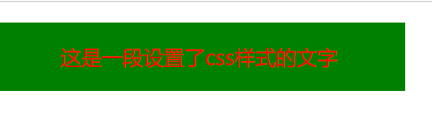
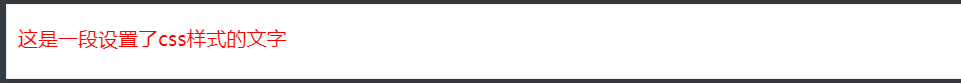
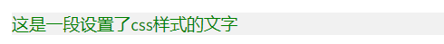
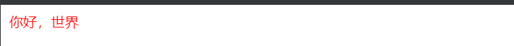
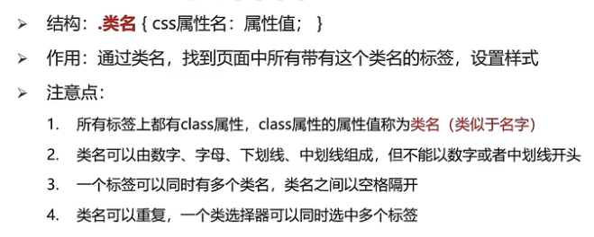
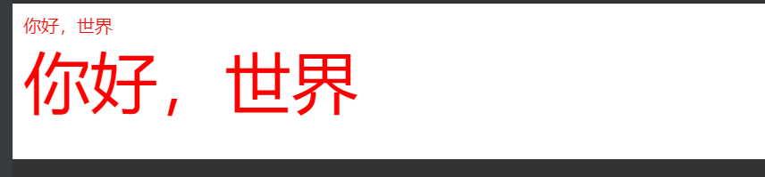

# CSS ——层叠样式表

Cascading style sheets

作用：给html设置样式

## 语法规则

```
选择器 {
    属性名: 属性值;
}
```

## 书写位置

```
<head>
    <title></title>

    <style>
        /* 这里写css */
    </style>
<head>
```

## CSS 引入方式

| 引入方式 | 书写位置                   | 作用范围 | 使用场景     |
| -------- | -------------------------- | -------- | ------------ |
| 内嵌式   | style 标签                 | 当前页面 | 小案例       |
| 外链式   | link 标签引入单独 css 文件 | 多个页面 | 项目中       |
| 行内式   | 标签 style 属性中          | 当前标签 | 配合 js 使用 |

（1）内嵌式

- CSS 写在 style 标签中
- style 标签可以写在页面任意位置，一般放在 head 标签中，title标签下面

```html
<!DOCTYPE html>
<html lang="en">

<head>
    <meta charset="UTF-8">
    <meta http-equiv="X-UA-Compatible"
          content="IE=edge">
    <meta name="viewport"
          content="width=device-width, initial-scale=1.0">
    <title>Document</title>

    <style>
        p {
            /* 这里是注释，快捷键ctrl + /  */
            /* 文字颜色设置为红色 */
            color: red;

            /* 字体大小设置为30像素 */
            font-size: 30px;

            /* 背景颜色 */
            background-color: green;

            /* 设置宽度和高度 */
            width: 600px;
            height: 100px;
            line-height: 100px;
            text-align: center;
        }
    </style>

</head>

<body>
    <p>这是一段设置了css样式的文字</p>
</body>

</html>
```



（2）外链式

- CSS 写在单独的`.css`文件中
- 通过 link 标签引入到网页中

```css
p {
  color: red;
}
```

```css

<!DOCTYPE html>
<html lang="en">

<head>
    <link rel="stylesheet" /* 这里表示：关系是：样式表*/
          href="./css-2.css">
</head>

<body>
    <p>这是一段设置了css样式的文字</p>
</body>

</html>
```



（3）行内式

- CSS 写在标签 style 属性中

```html
<div style="color: green; background-color: #f1f1f1;">
  这是一段设置了css样式的文字
</div>
```



## 基础选择器

- 标签选择器
- 类选择器
- id 选择器
- 通配符选择器

（1）标签选择器

- 标签选择器选择的是一类标签，而不是单独某一个
- 标签选择器无论嵌套关系有多深，都能找到对应的标签

```html
标签名 {
    属性名：属性值;
}
<style>
    p {
        color: red;
    }
</style>


<p>你好，世界</p>
```



（2）类选择器

```
.类名{
    属性名：属性值;
}
```

- 合法的类名：数字、字母、下划线、中划线
- 一个元素可以有多个类名，空格隔开



```html
<style>
    .red {
        color: red;
    }

    .size {
        font-size: 60px;
    }
</style>

<p class="red">你好，世界</p>
<div class="red size">你好，世界</div>
```



（3）id 选择器

```
#元素id{
    属性名：属性值;
}
```

- 页面中唯一，不能重复
- 一个标签只能有一个 id
- 一个id选择器只能选中一个标签
- id 选择器一般与 js 配合使用

```html
<style>
    #name {
        color: green;
    }
</style>

<div id="name">你好，世界</div>
```


（4）通配符选择器

```
* {
   属性名：属性值;
}
```

- 选中页面所有标签
- 一般用于统一设置页面样式

```css
/* 清除内外边距 */
* {
  margin: 0;
  padding: 0;
  box-sizing: border-box;
}
```