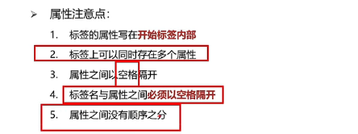
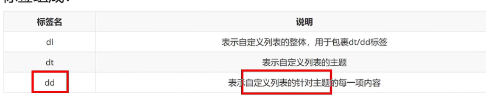
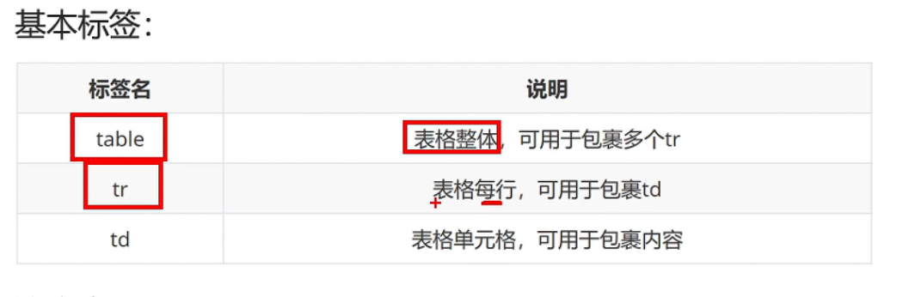

# [HTML 基本认知](https://mouday.github.io/coding-tree/#/blog/front-end-learn/html-basic?id=html-基本认知)

## [1、常见 5 大浏览器](https://mouday.github.io/coding-tree/#/blog/front-end-learn/html-basic?id=_1、常见-5-大浏览器)

- IE
- 火狐 FireFox
- 谷歌 Chrome
- Safari
- 欧朋 Opera

## [2、渲染引擎](https://mouday.github.io/coding-tree/#/blog/front-end-learn/html-basic?id=_2、渲染引擎)

| 浏览器       | 内核    |
| ------------ | ------- |
| IE           | Trident |
| FireFox      | Gecko   |
| Safari       | Webkit  |
| Chrome/Opera | Blink   |

## [3、Web 标准](https://mouday.github.io/coding-tree/#/blog/front-end-learn/html-basic?id=_3、web-标准)

保证不同浏览器打开页面显示效果一样

| 构成 | 语言       | 说明                     |
| ---- | ---------- | ------------------------ |
| 结构 | HTML       | 页面元素和内容           |
| 表现 | CSS        | 页面样式（颜色，大小等） |
| 行为 | JavaScript | 页面交互                 |

## [4、HTML](https://mouday.github.io/coding-tree/#/blog/front-end-learn/html-basic?id=_4、html)

Hyper Text Markup Language 超文本标记语言

## [5、hello world](https://mouday.github.io/coding-tree/#/blog/front-end-learn/html-basic?id=_5、hello-world)

需要设置显示`文件扩展名`

文件扩展名：`.html`

index.html

文字变粗案例：

```html
<strong>hello world</strong>
```

**hello world**

## [6、HTML 骨架](https://mouday.github.io/coding-tree/#/blog/front-end-learn/html-basic?id=_6、html-骨架)

```html
<html>
  <head>
    <title>网页的标题</title>
  </head>

  <body>
  	网页的主体内容
  </body>
</html>
```

- html 最外层标签
- head 头部
- title 标题
- body 主体

## [7、开发工具](https://mouday.github.io/coding-tree/#/blog/front-end-learn/html-basic?id=_7、开发工具)

- Visual Studio Code （首选）
- WebStorm
- Sublime Text
- DreamWeaver
- HBuilder

## [8、VS Code 使用](https://mouday.github.io/coding-tree/#/blog/front-end-learn/html-basic?id=_8、vs-code-使用)

快速生成 html 网页结构：

- `! + Tab` 多了一行代码`<!DOCTYPE html>`
- `doc + Tab`

```html
<!DOCTYPE html>
<html lang="en">
<head>
    <meta charset="UTF-8">
    <meta http-equiv="X-UA-Compatible" content="IE=edge">
    <meta name="viewport" content="width=device-width, initial-scale=1.0">
    <title>Document</title>
</head>
<body>
    
</body>
</html>
```

快捷键

下载 open in browser插件，以及自动保存插件

- 浏览器打开：`Alt + B` / `option⌥ + B`
- ÏLive Server 打开：`[command⌘ + L, command⌘ + O]`

## [9、注释](https://mouday.github.io/coding-tree/#/blog/front-end-learn/html-basic?id=_9、注释)

```html
<!-- 注释内容 -->
```

- 浏览器中不显示注释内容
- 添加和取消注释快捷键：`ctrl + /`

## [10、标签结构](https://mouday.github.io/coding-tree/#/blog/front-end-learn/html-basic?id=_10、标签结构)

- 双标签 `<开始标签>内容</结束标签>`, 例如：`<strong>内容</strong>`
- 前部分叫开始标签，后部分叫结束标签
- 单标签 `<标签 />`, 例如：`<br>`
- 自成一体，无法包裹内容

## [11、标签关系](https://mouday.github.io/coding-tree/#/blog/front-end-learn/html-basic?id=_11、标签关系)

- 父子关系（嵌套关系）

```html
<html>
  <head></head>
</html>
```

- 兄弟关系（并列关系）

```html
<head></head>
<body></body>
```


# [HTML 标签元素](https://mouday.github.io/coding-tree/#/blog/front-end-learn/html-element?id=html-标签元素)

## [1、标题标签 Heading](https://mouday.github.io/coding-tree/#/blog/front-end-learn/html-element?id=_1、标题标签-heading)

```html
h1~h6
<h1>一级标题</h1>
<h2>二级标题</h2>
<h3>三级标题</h3>
<h4>四级标题</h4>
<h5>五级标题</h5>
<h6>六级标题</h6>
```

一级标题二级标题三级标题四级标题五级标题六级标题

同时选中下一个相同字符：`ctrl+ D`

特点：

- 独占一行
- 文字加粗
- 文字变大，h1->h6 文字逐渐变小

## [2、段落标签 Paragraph]()

```html
<p>内容</p>
```

用于分段显示

特点：

- 段落之间存在间隙
- 独占一行

可以在 查看 中，点击自动换行排版

## [3、排版标签](https://mouday.github.io/coding-tree/#/blog/front-end-learn/html-element?id=_3、排版标签)

（1）换行符 Line Break

```html
第一行文本<br>第二行文本
```

第一行文本
第二行文本

特点

- 单标签
- 让文字强制换行

（1）水平分割线 Horizontal Rule

```html
<hr>
```


## [4、文本格式化标签](https://mouday.github.io/coding-tree/#/blog/front-end-learn/html-element?id=_4、文本格式化标签)

推荐使用后者（后者强调重要性）

- b/strong 加粗
- u/ins 下划线
- i/em 倾斜
- s/del 删除线

```html
<b>加粗</b>
<strong>加粗</strong>

<u>下划线</u>
<ins>下划线</ins>

<i>倾斜</i>
<em>倾斜</em>

<s>删除线</s>
<del>删除线</del>
```

**加粗** **加粗**

下划线 下划线

*倾斜* *倾斜*

删除线 ~~删除线~~

## 5、媒体标签

（1）图片标签 Image

```html

```

标签属性：属性名=属性值

 

alt 属性：替换文本

- 当图片加载失败时，才会显示alt的文本

title 属性：提示文本

- 当鼠标悬停时，才显示的文本
- 注意 title 属性不仅仅可以用于图片标签，还可以用于其他标签

## 6、资源路径

绝对路径一般用的较少，一般使用相对路径

网址也是绝对路径

（1）当前路径

```html


<!-- 推荐使用./ -->

```

（2）下级路径

```html

```

（3）上级路径

```html

```

## 7、音频标签

```html
<audio
  src="音频地址"
  controls 显示播放控件
  autoplay 自动播放（部分浏览器不支持）
  loop 循环播放
</audio>
```

支持的格式 mp3 wav Ogg

## 8、视频标签

```html
<video src="视频地址"
  controls 显示播放控件
  autoplay 自动播放（谷歌浏览器需要配合muted静音播放）
  muted 静音播放
  loop 循环播放
</video>
```

支持的格式 mp4 、WebM、Ogg

## 9、链接标签 Anchor

```html
<a href="目标地址">文字内容</a>

<!-- eg: -->
<a href="https://www.baidu.com/">百度</a>

<!-- #表示不确定 -->
<a href="#">百度</a>
```

[百度](https://www.baidu.com/) 

属性：

- href ： 跳转地址

- target: 目标网页的打开形式
  - _self 当前窗口打开（默认） / _blank 新窗口打开

Tips: chrome 地址栏双击可以看到完整地址

网站的默认首页 index.html

## [10、列表](https://mouday.github.io/coding-tree/#/blog/front-end-learn/html-element?id=_10、列表)

- 无序列表
- 有序列表
- 自定义列表

（1）无序列表 Unordered List

列表项 List Item

ul中只能有 <li>

li标签可以包含任意内容

```html
<ul>
  <li>苹果</li>
  <li>香蕉</li>
  <li>桃子</li>
</ul>
```

- 苹果
- 香蕉
- 桃子

（2）有序列表 Ordered List

ol中只能有 <li>

li标签可以包含任意内容

```html
<ol>
  <li>苹果</li>
  <li>香蕉</li>
  <li>桃子</li>
</ol>
```

1. 苹果
2. 香蕉
3. 桃子

（3）自定义列表 Description List

```html
<dl>
  <dt>水果</dt>
  <dd>苹果</dd>
  <dd>香蕉</dd>
  <dd>桃子</dd>
</dl>
```



水果

​	苹果 

​	香蕉

​	桃子

dl只能放dt/dd，dt/dd中可以任意

## [11、表格](https://mouday.github.io/coding-tree/#/blog/front-end-learn/html-element?id=_11、表格)

（1）基本元素

标签含义

- 

table 属性：

- border 边框宽度
- width 表格宽度
- height 表格高度

```html
<table border="1">
    <caption>
        表格大标题
    </caption>
    
    <tr>
        <th>姓名</th>
        <th>年龄</th>
    </tr>
    <tr>
        <td>Tom</td>
        <td>23</td>
    </tr>
    <tr>
        <td>Jack</td>
        <td>24</td>
    </tr>
</table>
```

<iframe src="https://mouday.github.io/coding-tree/blog/front-end-learn/demo/table-1.html" height="150" style="-webkit-font-smoothing: antialiased; -webkit-tap-highlight-color: transparent; text-size-adjust: none; box-sizing: border-box; font-size: inherit; border: 1px solid rgb(238, 238, 238); width: 1px; min-width: 100%; margin: 1em 0px;"></iframe>

（2）表格结构，可以省略

- thead 表格头部
- tbody 表格主体
- tfoot 表格底部

```html
<table border="1">
    <caption>
        表格大标题
    </caption>

    <thead>
        <tr>
            <th>姓名</th>
            <th>年龄</th>
        </tr>
    </thead>

    <tbody>
        <tr>
            <td>Tom</td>
            <td>23</td>
        </tr>
        <tr>
            <td>Jack</td>
            <td>24</td>
        </tr>
    </tbody>
    
    <tfoot>
        <tr>
            <td>求和</td>
            <td>57</td>
        </tr>
    </tfoot>
</table>
```

<iframe src="https://mouday.github.io/coding-tree/blog/front-end-learn/demo/table-2.html" height="170" style="-webkit-font-smoothing: antialiased; -webkit-tap-highlight-color: transparent; text-size-adjust: none; box-sizing: border-box; font-size: inherit; border: 1px solid rgb(238, 238, 238); width: 1px; min-width: 100%; margin: 1em 0px;"></iframe>

（3）合并单元格

- 跨行合并（垂直）rowspan
- 跨列合并（水平）colspan

左上原则

- 上下合并，保留最上
- 左右合并，保留最左

> Tips: 不能跨结构合并

```html
<table border="1">
    <caption>
        表格大标题
    </caption>

    <thead>
        <tr>
            <th>姓名</th>
            <th>年龄</th>
        </tr>
    </thead>
    
    <tbody>
        <tr>
            <td>Tom</td>
            <td rowspan="2">23</td>
        </tr>
        <tr>
            <td>Jack</td>
        </tr>
    </tbody>

    <tfoot>
        <tr>
            <td colspan="2">求和: 57</td>
        </tr>
    </tfoot>
</table>
```

<iframe src="https://mouday.github.io/coding-tree/blog/front-end-learn/demo/table-3.html" height="170" style="-webkit-font-smoothing: antialiased; -webkit-tap-highlight-color: transparent; text-size-adjust: none; box-sizing: border-box; font-size: inherit; border: 1px solid rgb(238, 238, 238); width: 1px; min-width: 100%; margin: 1em 0px;"></iframe>

## [12、表单](https://mouday.github.io/coding-tree/#/blog/front-end-learn/html-element?id=_12、表单)

输入框 input

| type 属性 | 输入框类型 |
| --------- | ---------- |
| text      | 文本框     |
| password  | 密码框     |
| radio     | 单选框     |
| checkbox  | 多选框     |
| file      | 文件选择   |
| submit    | 提交按钮   |
| reset     | 重置按钮   |
| button    | 普通按钮   |

（1）text 文本框

placeholder 占位符

```html
<input type="text" placeholder="文本框占位符" />
```


（2）password 密码框

placeholder 占位符

```html
<input type="password" placeholder="密码框占位符" />
```


（3）radio 单选框

name 属性分组，一个分组只能有一个值被选中

checked 默认选中

```html
<input type="radio" name="sex" value="1" />男
<input type="radio" name="sex" value="2" checked />女
```

男 女

（4）checkbox 多选框

checked 默认选中

```html
<input type="checkbox" name="city" value="beijing" />北京
<input type="checkbox" name="city" value="shanghai" checked />上海
```

北京 上海

（5）file 文件选择

multiple 多选(按住 ctrl 多选)

```html
<input type="file" /> <input type="file" multiple />
```

 

（6）按钮

- submit 提交按钮
- reset 重置按钮
- button 普通按钮

需要配合 form 表单域使用

属性 value 修改按钮显示的值

```html
<input type="submit" />
<input type="reset" />
<input type="button" value="普通按钮" />
```

 

## [button 按钮标签](https://mouday.github.io/coding-tree/#/blog/front-end-learn/html-element?id=button-按钮标签)

type 取值

- submit 提交按钮
- reset 重置按钮
- button 普通按钮(默认)

```html
<button type="submit">提交按钮</button>
<button type="reset">重置按钮</button>
<button type="button">普通按钮</button>
<button>普通按钮</button>
```

提交按钮 重置按钮 普通按钮 普通按钮

## [select 下拉菜单](https://mouday.github.io/coding-tree/#/blog/front-end-learn/html-element?id=select-下拉菜单)

```html
<select>
  <option>北京</option>
  <option>上海</option>
  <option selected>广州</option>
  <select></select>
</select>
```

  北京  上海  广州 

option 选项

默认选中第一项，可以指定默认选中 selected

## [textarea 多行文本域](https://mouday.github.io/coding-tree/#/blog/front-end-learn/html-element?id=textarea-多行文本域)

属性

- cols 宽度 列数
- rows 高度 行数

```html
<textarea></textarea>
```


## [label 标签](https://mouday.github.io/coding-tree/#/blog/front-end-learn/html-element?id=label-标签)

点击文字也可选中选项

两种使用方式等效

```html
<input type="radio" name="sex" id="man" />
<label for="man">男</label>

<label><input type="radio" name="sex" />女</label>
```

 男 女

## [无语义标签](https://mouday.github.io/coding-tree/#/blog/front-end-learn/html-element?id=无语义标签)

- div 块级标签，独占一行
- span 行内标签

## [语义化标签](https://mouday.github.io/coding-tree/#/blog/front-end-learn/html-element?id=语义化标签)

手机端常用

- header 网页头部
- nav 网页导航
- footer 网页底部
- aside 网页侧边栏
- section 网页区块
- article 网页文章

以上标签和 div 等效，多了语义化

## [字符实体](https://mouday.github.io/coding-tree/#/blog/front-end-learn/html-element?id=字符实体)

在网页中显示特殊字符

- 空格 ` `
- 版权符 `©`

```html
<!-- 单词之间有5个空格，最后只显示一个空格 -->
hello world

<!-- 实现单词之间有5个空格 -->
hello&nbsp;&nbsp;&nbsp;&nbsp;&nbsp;world

<!-- 版权符号 -->
&copy;
```

hello world

hello   world

©

## [综合案例](https://mouday.github.io/coding-tree/#/blog/front-end-learn/html-element?id=综合案例)

```html
<!DOCTYPE html>
<html lang="en">

<head>
    <meta charset="UTF-8">
    <meta http-equiv="X-UA-Compatible"
          content="IE=edge">
    <meta name="viewport"
          content="width=device-width, initial-scale=1.0">
    <title>Form Demo</title>
</head>

<body>
    <h2>个人信息</h2>
    <form action="">
        <p>姓名:
            <input type="text"
                   placeholder="姓名">
        </p>
        <p>性别:
            <label><input type="radio"
                       name="sex"
                       checked>男</label>
            <label><input type="radio"
                       name="sex">女</label>
        </p>
        <p>爱好:
            <label><input type="checkbox"
                       checked>足球</label>
            <label><input type="checkbox">篮球</label>
            <label><input type="checkbox">羽毛球</label>
        </p>

        <p>现居：<select>
                <option value="">北京</option>
                <option value="">上海</option>
                <option value="">广州</option>
                <option value="">深圳</option>
            </select>
        </p>

        <p>个人简介：
            <br />
            <textarea cols="60"
                      rows="10"></textarea>
        </p>

        <input type="submit"
               value="提交">
        <button type="reset">重置</button>
    </form>
</body>

</html>
```

<iframe src="https://mouday.github.io/coding-tree/blog/front-end-learn/demo/form-1.html" height="470" style="-webkit-font-smoothing: antialiased; -webkit-tap-highlight-color: transparent; text-size-adjust: none; box-sizing: border-box; border: 1px solid rgb(238, 238, 238); width: 1px; min-width: 100%; margin: 1em 0px; color: rgb(52, 73, 94); font-family: &quot;Source Sans Pro&quot;, &quot;Helvetica Neue&quot;, Arial, sans-serif; font-size: 15px; font-style: normal; font-variant-ligatures: normal; font-variant-caps: normal; font-weight: 400; letter-spacing: normal; orphans: 2; text-align: start; text-indent: 0px; text-transform: none; white-space: normal; widows: 2; word-spacing: 0px; -webkit-text-stroke-width: 0px; background-color: rgb(255, 255, 255); text-decoration-thickness: initial; text-decoration-style: initial; text-decoration-color: initial;"></iframe>