# 左程云2022大厂算法笔试面试题

**题目一：一颗二叉树有黑白两种节点，请调整这棵树，让它只保留有黑节点的路径**

**思路：递归套路**

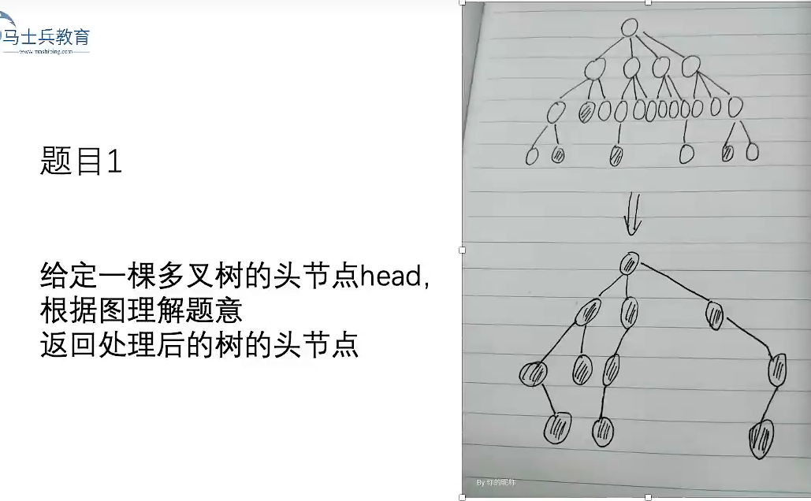

```java
public class Main{
    public static class Node{
        public int value;
        public boolean retain;//是否保留
        public List<Node> nexts;//下级节点
        public Node(int value,boolean r){
            value = value;
            retain = r;
            nexts = new ArrayList<>();
        }
    }
    
    //根据题意，递归保留需要保留的节点的路径，返回头节点
    public static Node retain(Node node){
        if(node.nexts.isEmpty()) return node.retain ? node : null;
        //下层有节点
        List<Node> newNexts = new ArrayList<Node>();
        for(Node next : node.nexts){
            Node newNext = retain(next);
            if(newNext != null){
                newNexts.add(newNext);
            }
        }
        //如果新的下级链表不为空，或者自己本身就是需要保留的，那就需要保留
        if(!newNexts.isEmpty() || node.retain){
            node.nexts = newNexts;
            return node;
        }
        return null;
    }
    
}
```

----

**题目二：我们正在玩一个猜数游戏，游戏规则如下:
我从1到n之间选择1个数字。
你来猜我选了哪个数字。
如果你猜到正确的数字，就会赢得游戏。
如果你猜错了，那么我会告诉你，我选的数字比你的更大或者更小，并且你需要继续猜数。
每当你猜了数字x并且猜错了的时候，你需要支付金额为x的现金。
如果你花光了钱，就会输掉游戏。
给你一个特定的数字n，返回能够确保你获胜的最小现金数，不管我选择那个数字。**

**思路：暴力递归到动态规划**

```java
public Class Main{
    //正确的数字，在1~n之间
    //每次猜错会花费猜的数字的钱
    //返回：即使每次都最倒霉，但是也能赢的时候，所需要的最少钱数
    //目标是确保自己的钱能支撑到即视每次都错每次都选到花销最大的情况下，最少需要多少钱
    public static int minGold(int n){
        return zuo(1,n);
    }
    
    //目前锁定了在L~R范围上
    public static int zuo(int L,int R){
        if(L==R) return 0;//只有一个数字，猜对，不花钱
        if(L==R-1) return L;//每次都最倒霉要猜错，所以我们肯定要猜小的，如果我们猜R，猜错就要花L+1块钱
        //L-R不止2个数
        int p1 = L + zuo(L+1,R);//选L
        int p2 = R + zuo(L,R-1);//选R
        int min = Math.min(p1,p2);
        //除了选上面两种，还可以选中间任意一个
        for(int i = L+1;i < R;i++){
            //每次都会告诉我我猜的是大了还是小了，所以会分成两部分
            int left = zuo(L,i-1);//如果大了
            int right = zuo(i+1,R);//如果小了
            int cur = i + Math.max(left,right);//每次都最倒霉，所以肯定是选花销最大的那个
            min = Math.min(min,cur);
        }
        return min;
    }
    
}
```

**下一步，分析改进：我们发现，只要L和R确定，那么得到的答案跟我们从哪个状态转移过来没关系，假设是先8，然后7，确定出5和6，那么跟我们先7，然后确定出5和6得到的答案是一样的**

**所以可以考虑动态规划，L和R范围都是1-n，二维动态规划**

首先L不可能大于R

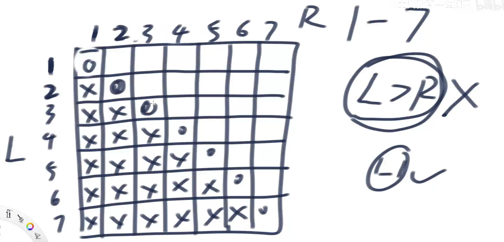

L==R时，直接为0

当L==R-1时，直接填L

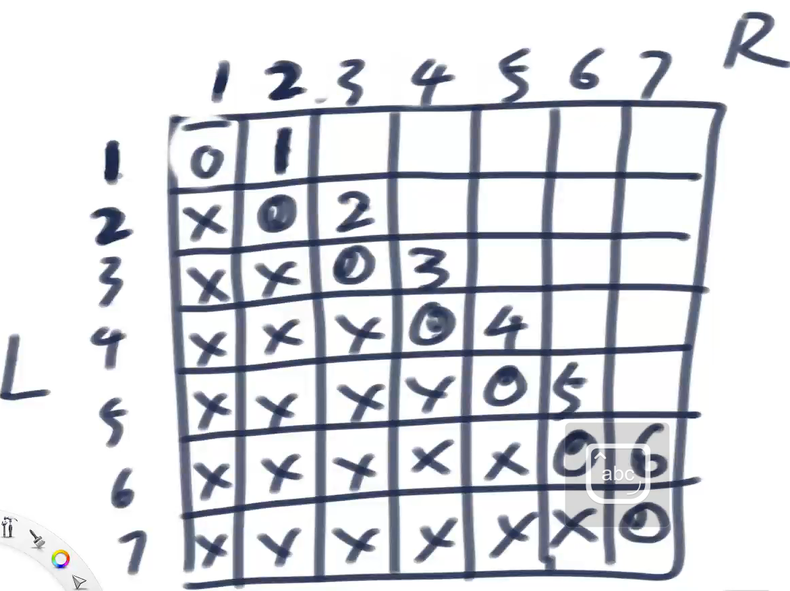

分析普遍情况，1-7时，选1需要2-7，选7需要1-6，选2需要1-1和3-7.....分析可得，普遍位置依赖其左边和下方的值

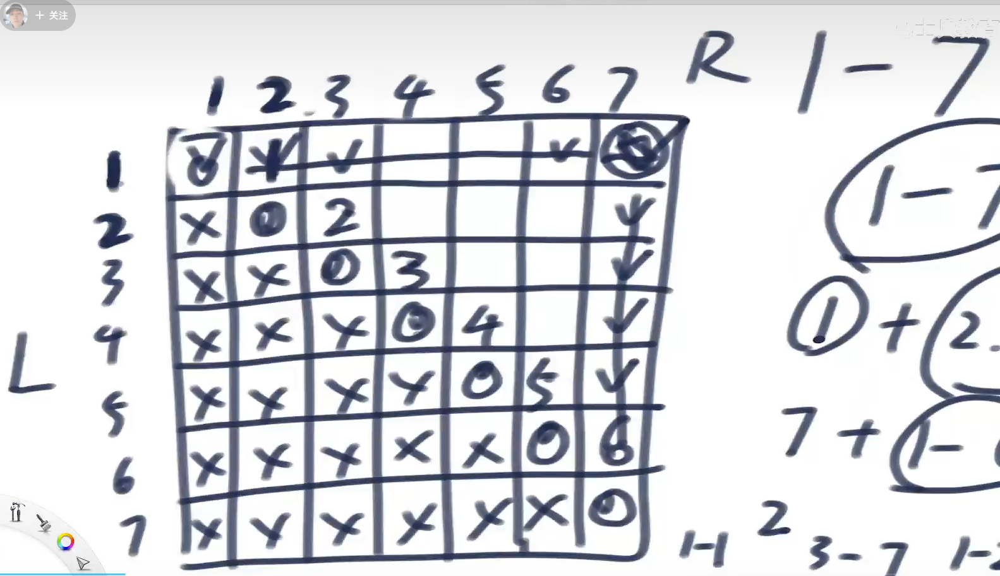

```java
public static minGold(int n){
    int[][] dp = new int[n+1][n+1];
    for(int i = 1;i<n;i++){
        dp[i][i+1] = i;//填倒数第二条对角线，到不了n
    }
    for(int L = n-2;L>=1;L--){
        for(int R = L+2;R<=n;R++){
            int min = Math.min(L + dp[L + 1][R],R+dp[L][R-1]);
            for(int i = L+1;i < R;i++){
                min = Math.min(min,i + Math.max(dp[L][i-1],dp[i+1][R]));
            }
            dp[L][R] = min;
        }
    }
    return dp[1][n];
}
```

----

**题目三：int n, int【】【】 roads, int x, int y
n表示城市数量，城市编号0~n-1
roads【i】【j】 == distance,表示城市i到城市j距离为distance(无向图)
求城市x到城市y的最短距离**

单元最短路径算法：限制有向图，路径值不能为负数，求出一个点到其他所有点的最短距离

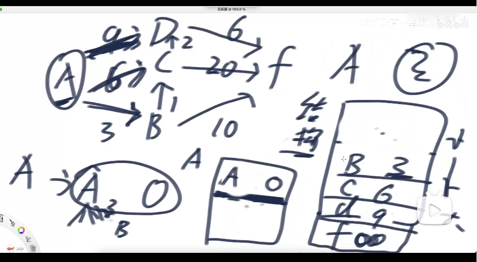

刚开始只有A-A是0，A到其他点都是正无穷，表示不可达，然后我们有一个结构存储A到各个点的距离，我们弹出A-A = 0

放到另一个存储结构中，在这个结构中就是记录最短距离，且不可变，然后根据A能到达的点去更新第一个存储结构中到各个点的距离（在这个结构中，认为类似小根堆，最小在最上）

弹出顶部最小的，然后写入到第二个存储结构

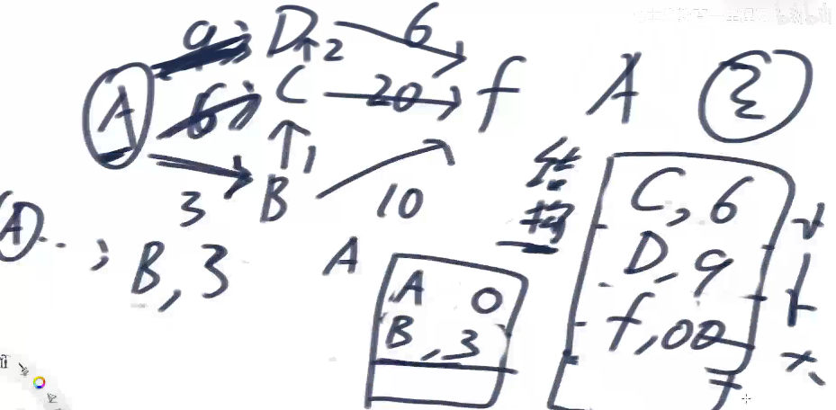

然后看B能到达哪些点，发现B-C=1，A-B-C=4<6，所以更新

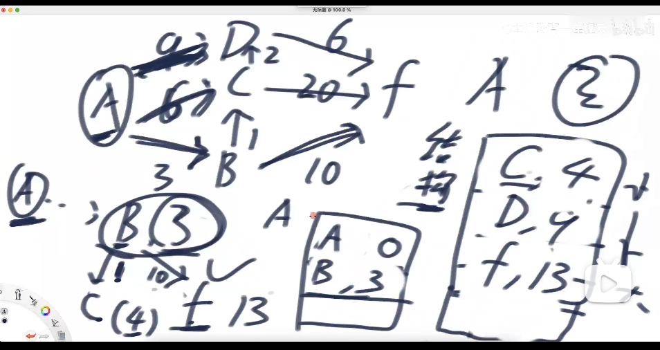

B的任务完成后，继续弹出，直到所有表填完

其实第一个结构就是堆，会不断调整的加强小根堆，但是实际上可以用另外方法解决，因为这种加强堆代码复杂

因此我们可以记录下每次弹出的节点，把已经弹出的节点记录后，我们就知道，后续再弹出已经存在的节点，就直接忽略，因为第一次弹出就是最小的值

回到题目：

这是一个无向图，我们可以直接理解为两条有向图

第一种解法：暴力dfs尝试所有情况

roads中表示x->y 的distance

```java
public static int minDistance1(int n,int[][] roads,int x,int y){
    //生成邻接矩阵
    int[][] map = new int[n+1][n+1];
    for(int i = 0;i <= n;i++){
        for(int j = 0;j <= n;j++){
            map[i][j] = Integer.MAX_VALUE;
        }
    }
    for(int[] road : roads){
        map[road[0]][road[1]] = Math.min(map[road[0]][road[1]],road[2]);
        map[road[1]][road[0]] = Math.min(map[road[1]][road[0]],road[2]);
    }
    boolead[] visited = new boolead[n+1];
    return process(x,y,n,map,visited);
}

//当前来到cur，目的地是aim，一共1-n个城市
//所有城市的距离都在map里面
//之前走过的记录在visited
//返回cur到aim的所有路径中，最短的记录
public static int process(int cur,int aim,int n,int[][] map,boolean[] visited){
    if(visited[cur]) return Integer.MAX_VALUE;
    if(cur == aim) return 0;
    visited[cur] = true;
    int ans = Integer.MAX_VALUE;
    for(int next = 1;next <= n;next++){
        if(next != cur && map[cur][next] != Integer.MAX_VALUE){
            int rest = process(next,aim,n,map,visited);
            if(rest != Integer.MAX_VALUE) ans = Math.min(ans,map[cur][next] + rest);
        }
    }
    visited[cur] = false;
    return ans;
}
```

第二种解法：Dijkstra

```java
public static class Node {
    //当前来到的城市编号
	public int city;
    //从源地址到这个城市的距离和
    public int pathSum;
    
    public Node(int c,int p){
        city = c;
        pathSum = p;
    }
}

public static int minDistance2(int n,int[][] roads,int x,int y){
    //生成邻接矩阵
    int[][] map = new int[n+1][n+1];
    for(int i = 0;i <= n;i++){
        for(int j = 0;j <= n;j++){
            map[i][j] = Integer.MAX_VALUE;
        }
    }
    for(int[] road : roads){
        map[road[0]][road[1]] = Math.min(map[road[0]][road[1]],road[2]);
        map[road[1]][road[0]] = Math.min(map[road[1]][road[0]],road[2]);
    }
    //computed[i] = true，表示从源出发点到i这个城市，已经计算出最短距离了，就是上文说的已经弹出
    //computed[i] = false，表示从源出发点到i这个城市，还没计算出最短距离
    boolean[] computed = new boolean[n+1];
    //距离的小根堆
    PriorityQueue<Node> heap = new PriorityQueue<>((a,b) -> (a.pathSum - b.pathSum));
 	heap.add(new Node(x,0));
    while(!heap.isEmpty()){
        //弹出一个x - 当前城市，有距离
        Node cur = heap.poll();
        if(computed[cur.city]) continue;
        //没算过
        if(cur.city == y) return cur.pathSum;
        //没到y,到的点是p
        computed[cur.city] = true;
        for(int next = 1;next <= n;next++){
            //看p再往下走能到哪些点
            if(next != cur.city && map[cur.city][next] != Integer.MAX_VALUE && !computed[next]){
                heap.add(new Node(next,cur.pathSum+map[cur.city][next]));
            }
        }
    }
    return Integer.MAX_VALUE;
}
```

改进：如果我们求的不是最短距离，而是最短距离的那个路径

那么我们可以修改Node结构，多记录一个从那个城市来的属性

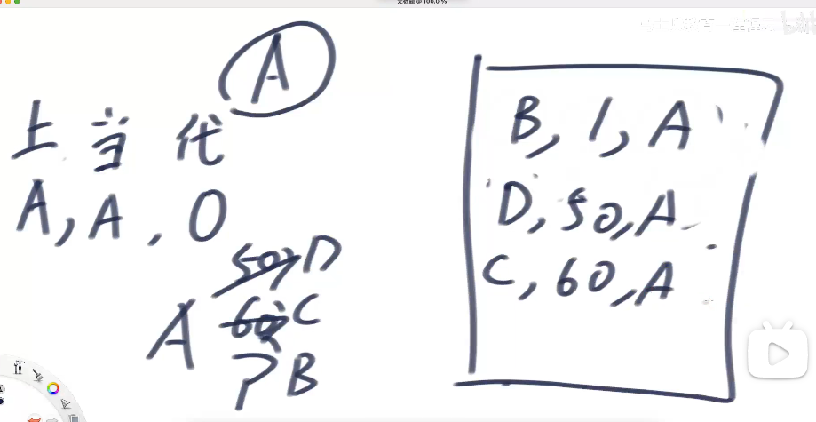

比如A-D是50，那么记录D，50，A

----

**题目四：一开始屏幕上什么也没有，粘贴板里什么也没有,
你只能在键盘上做如'下4种操作中的1种:
输入:在屏幕上已经显示内容的后面加一个A
全选:把屏幕上已经显示的全部内容选中
复制:被选中的内容复制进粘贴板
粘贴:在屏幕上已经显示内容的后面添加粘贴板里的内容
给定一个正数n,表示你能操作的步数，
返回n步内你能让最多多少个A显示在屏幕上**

6步以内，直接输入A更好，我们要求dp【i】，表示 i 步以内能获得的A的最多数量

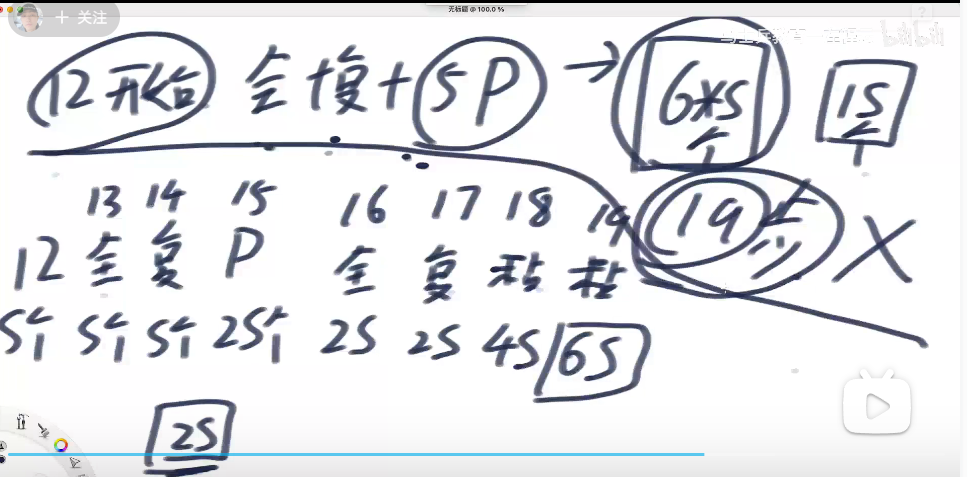

从12步开始，有S个A，然后做全选，复制，连续粘贴5次，到19步，发现可以有6S个A，但是我们再用另一种步骤来做，2S后继续全选复制粘贴，发现19步还是能到6S，所以可以发现，连续五次的粘贴，肯定不是最优解，因为在同等步骤下，两次全选再复制粘贴的效果也能这样，但是有可能更好

可以推出，连续粘贴次数 > 5次时更不好

可以推出，当规模达到一定程度，直接插入A并不经济，所以最后肯定是通过粘贴得到

那么我们可以知道，最终得到 第 i 步得A得数量，要么是1次粘贴，要么是2次粘贴，要么是3次，要么是4次

第一种可能性：只经历一次粘贴，dp[I] = dp[i - 3] * 2

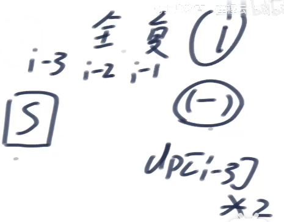

同理，第二次就是dp[i] = dp[i - 4] * 3

```java
public static int maxA(int n){
    //dp[0]代表1步内得最优解
    int[] dp = new int[n];
    for(int i = 0;i<6 && i < n;i++){
        dp[i] = i + 1;
    }
    for(int i = 6; i < n;i++){
        dp[i] = Math.max(
        		Math.max(dp[i-3] * 2,dp[i-4] * 3),
        		Math.max(dp[i-5] * 4,dp[i-6] * 5));
    }
    return dp[n-1];
}
```

----

**题目五：所有黑洞的中心点记录在holes数组里
比如【[3,5]，[6,9]】表示，第-个黑洞在(3,5)，第二个黑洞在(6,9)
并且所有黑洞的中心点都在左下角(0,0)，右上角（x，y)的区域里
飞船一-旦开始进入黑洞，就会被吸进黑洞里
返回如果统一所有黑洞的半径，最大半径是多少，依然能保证飞船从(0,0)能到达(xy)**

分析：如果半径为5，飞不过去，那么说明半径为789都飞不过去

如果半径为3飞得过去，那么1和2也飞的过去，表示有单调性，可以使用二分

那么我们确定一个最大值就可以开始做二分，最大值其实就是边界得最大值，就是Max(x，y)，因为半径达到边界值了，肯定全部覆盖

接下来就是判断这个半径情况下能否飞过去，使用并查集

先把每个黑洞认为是一个集合，集合中保存他的左右上下边界，那么要判断这两个集合是否要合并，判断条件其实就是判断圆心之间的距离是否 <= 2R，是的话就要合并

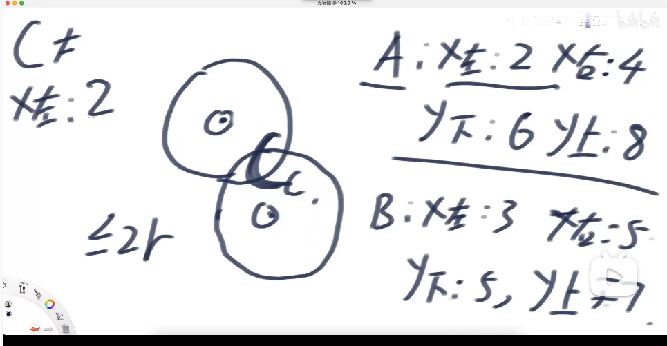

合并后，C的集合的边界就是取原来两个集合的边界的最大值

然后判断，如果合并后的集合的左右上下边界有超过了范围，那么表示一定过不去

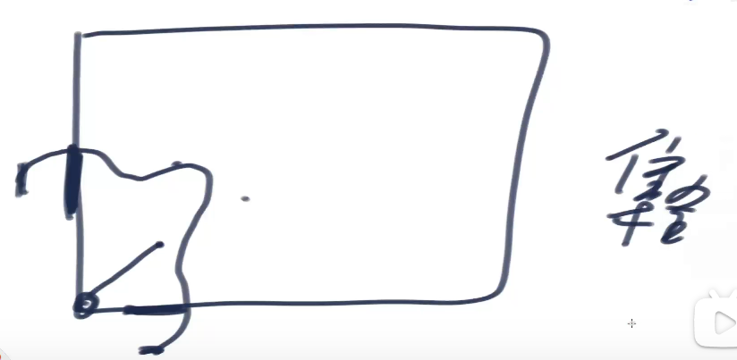

还有可能，如果左边越界，下面越界，把起始位置00堵死，那么也过不去

同理，如果把目标地址堵死，那么也飞不过去

除了这些情况，其他一定能飞过去

```java
//并查集
public static class UnionFind {
    public int[] father;
    public int[] size;
    public int[] xmin;
    public int[] xmax;
    public int[] ymin;
    public int[] ymax;
    public int[] help;
    
    public UnionFind(int[][] holes,int n,int r){
        father = new int[n];
        size = new int[n];
        xmin = new int[n];
        xmax = new int[n];
        ymin = new int[n];
        ymax = new int[n];
        help = new int[n];
        for(int i=0; i < n;i++){
            father[i] = i;
            size[i] = 1;
            xmin[i] = holes[i][0] - r;
            xmax[i] = holes[i][0] + r;
            ymin[i] = holes[i][1] - r;
            ymax[i] = holes[i][1] + r;
        }
    }
    
    private int find(int i){
        int hi = 0;
        while(i != father[i]){
            help[hi++] = i;
            i = father[i];
        }
        for(hi--;hi >= 0;hi--){
            father[help[hi]] = i;
        }
        return i;
    }
    
    public void union(int i,int j){
        int fatheri = find(i);
        int fatherj = find(j);
        if(fatheri != fatherj){
            
        }
    }
    
}

public static int maxRadius(int[][] holes,int x,int y){
    int L = 1;
    int R = Math.max(x,y);
    int ans = 0;
    while(L <= R){
        int M = (L+R) / 2;
        if(ok(holes,M,x,y)){
            ans = M;
            L = M + 1;
        } else {
            R = M - 1;
        }
    }
    return ans;
}
```

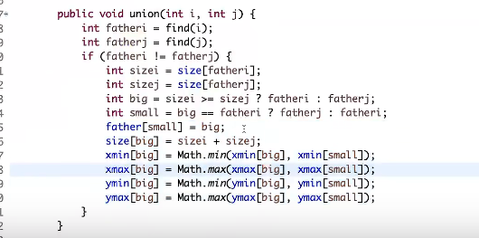

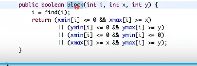

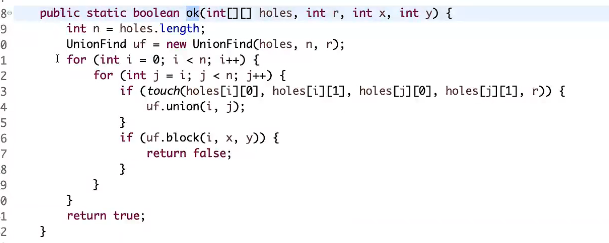

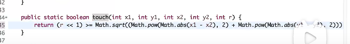

----

**题目六：已知一棵二叉树上所有的值都不一样,给定这棵二叉树的头节点head,
给定一个整型数组arr, arr里放着不同的值，每个值一定在树上
返回数组里所有值的最低公共祖先**

注意返回得是所有值得最低公共祖先

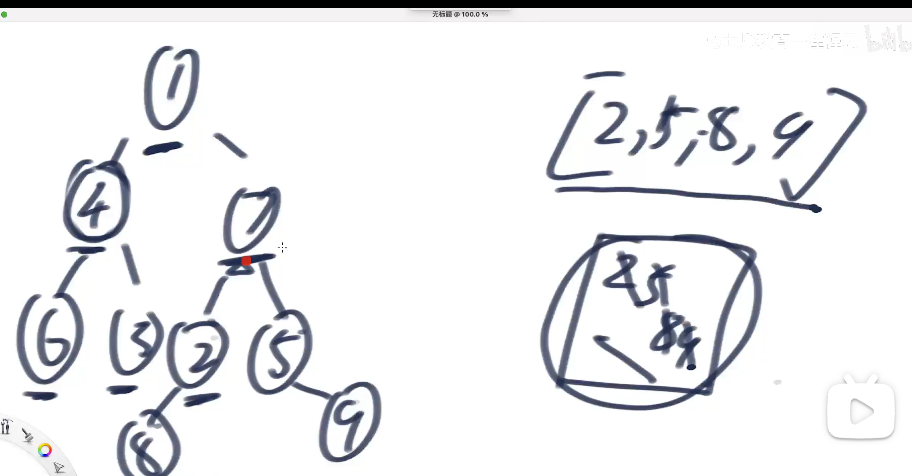

用一个哈希表存储数组中得值，然后遍历二叉树，先序遍历，当遍历到存在哈希表中得数时，就删除哈希表中得数，当遍历到左树删除得数量 + 右树删除得数量 + 自己删除得数量(自己删了就 + 1，自己不在哈希表就 + 0)，当删除得数量=数组得长度时，就是这个节点，因为先序遍历会回到这个节点

```java
public static class TreeNode{
    public int val;
    publice TreeNode left;
    public TreeNode right;
}
public static class Info {
    //找没找到最低公共祖先
    //没找到，find=null
    //找到了最低公共祖先，find是 最低公共祖先
    public TreeNode find;
    //我这颗子树上，删掉了几个节点!
    public int removes; I
    public Info(TreeNode f, int门) {
        find = f;
        removes = r;
	}
}

public TreeNode lowestCommonAncestor(TreeNode root,TreeNode[] nodes){
    HashSet<Integer> set = new HashSet<>();
    for(TreeNode node : nodes){
        set.add(node.val);
    }
    return process(root,set,set.size()).find();
}

public static Info process(TreeNode x,HashSet<Integer> set,int all){
    if(x == null) return new Info(null,0);
    Info left = process(x.left,set,all);
    if(left.find != null) return left;
    Info right = process(x.right,set,all);
    if(left.right != null) return right;
    int cur = set.contains(x.val) ? 1 : 0;
    set.remove(x.val);
    if(left.removes + right.removes + cur == all) return new Info(x,all);
    else return new Info(null,left.removes + right.removes + cur);
}
```

----

**题目七：给定一个长度为N的字符串S，由字符'a'和'b'组成， 空隙由'?' 表示
你的任务是用a字符或b字符替换每个间隙，
替换完成后想让连续出现同一种字符的最长子串尽可能短
例如，S = "aa??bbb",
如果将??"替换为"aa"，即"aaaabbb"， 则由相等字符组成的最长子串长度为4
如果将”??"替换为"ba"，即"aababbb"，则由相等字符组成的最长子串长度为3
那么方案二是更好的结果，返回3
s的长度<= 10^6**

贪心：

可能性分类：

第一种：左边 = 右边，中间 ？长度为奇数

让最左边界填不同字符，最右边界填不同字符，中间再填不同得字符，使得每个都断开

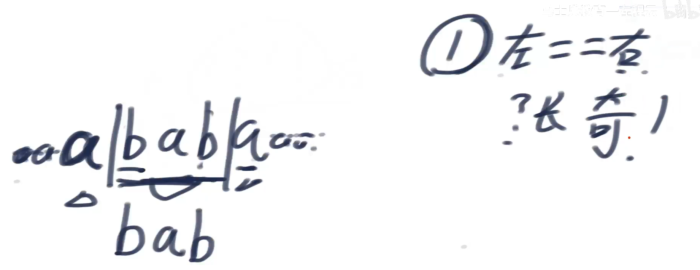

第二种：左边 = 右边， ？ 为偶数，同样得方法

第三种：左边 ！= 右边， ？为偶数，同上方法

第四种，左边！=右边， ？是 > 1 的奇数，同上，中间随便填一个都行

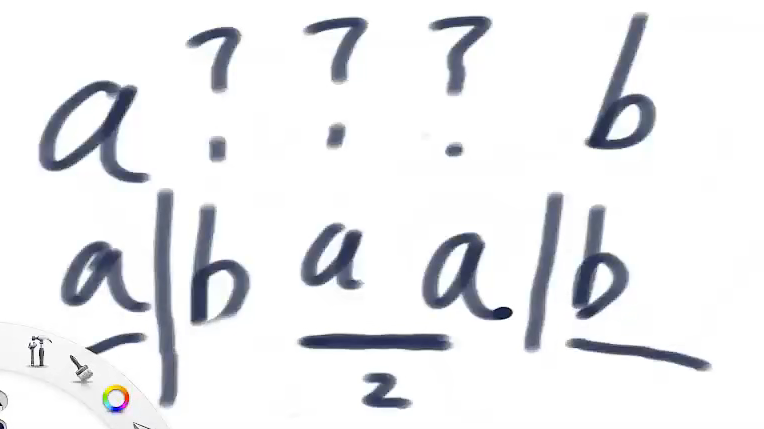

第五种，左边！=右边， ？ = 1，此时需要考虑到底给哪个比较合适


所以算法流程可以是先遍历字符串，把前四种情况都跑一遍，最后就可能剩下第五种情况出现

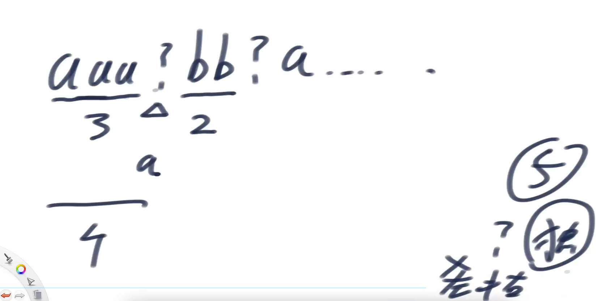

孤独的 ？出现，只有一个，此时就考虑左边或者右边的连续长度

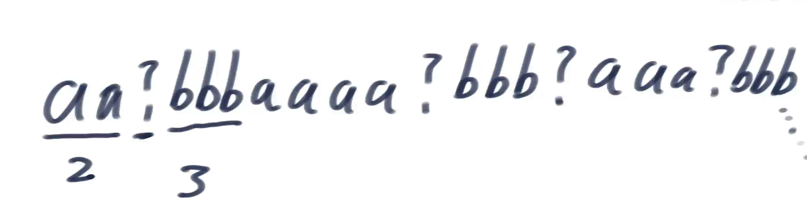

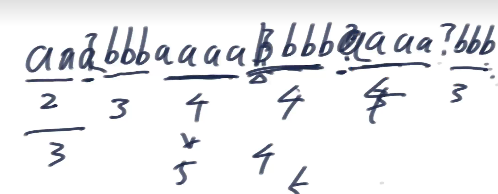

成全小的那个

当出现左右相等时

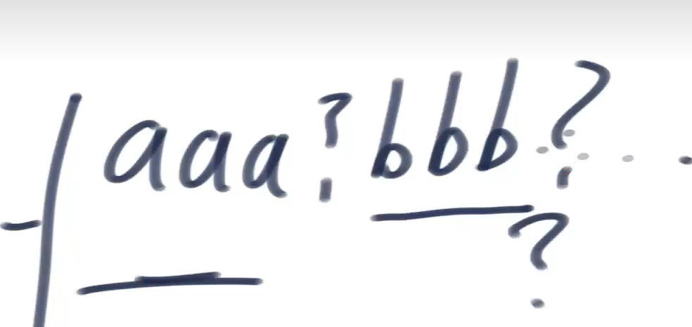

我们成全左边的，因为左边我们已经确定完了，但是右边还有没遍历完的?

纯暴力解法：

```java
public static int minContinuous1(String s){
    if(s == null || s.length() == 0) return 0;
    char[] str = s.toCharArray();
    return process(str,0);
}

public static int process(char[] str,int index){
    if(index == str.length) return maxLen(str);
    else{
        if(str[index] != '?') return process(str,index + 1);
        else{
            str[index] = 'a';
            int p1 = process(str,index + 1);
            str[index] = 'b';
            int p2 = process(str,index + 1);
            str[index] = '?';
            return Math.min(p1,p2);
        }
    }
}
```

贪心：

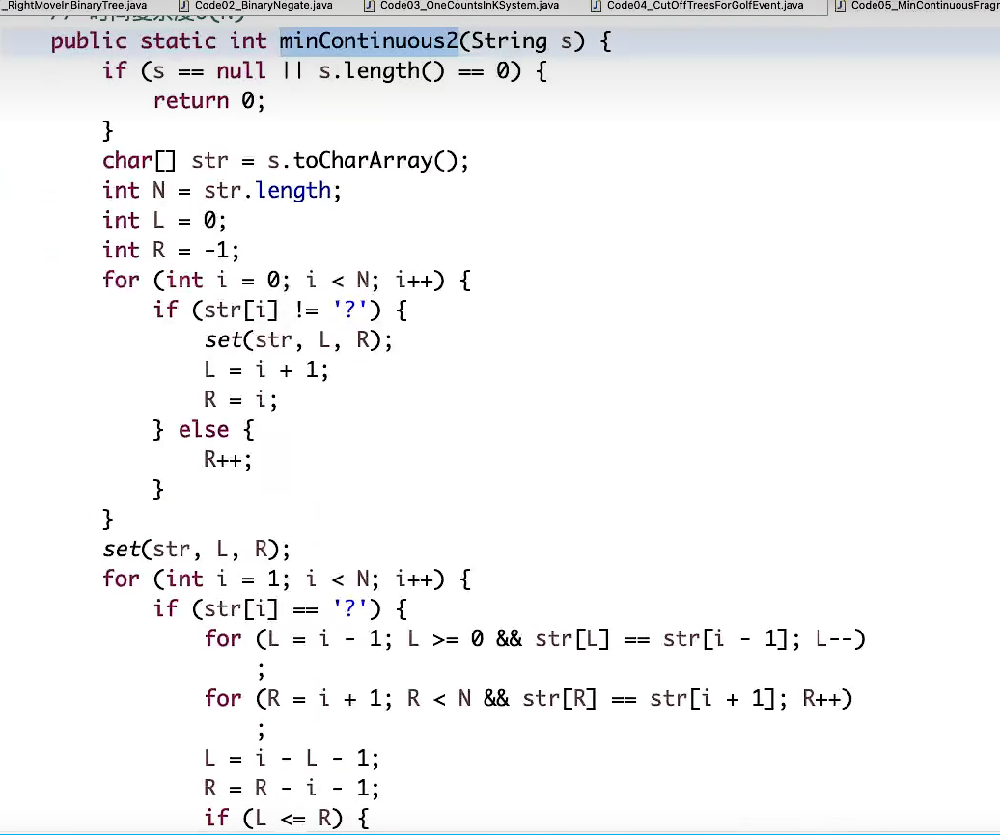

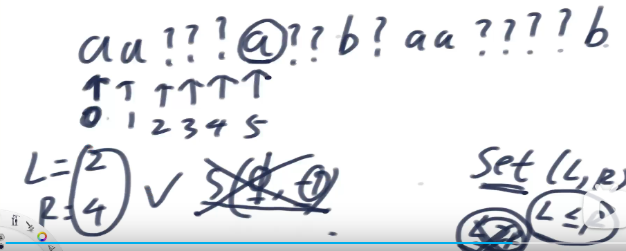

为什么第一个for循环要执行set就是这样实际上不符合条件就不会执行

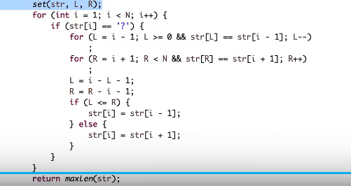

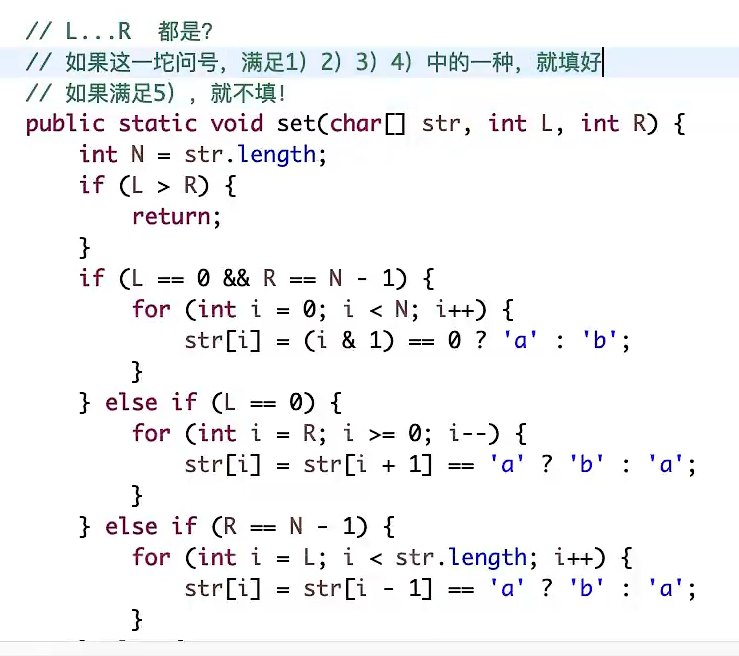

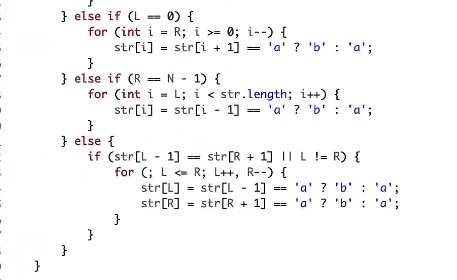

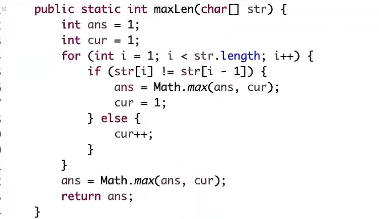

----

**题目八：你被请来给一个要举办高尔夫比赛的树林砍树。树林由一个m x n的矩
阵表示，在这个矩阵中:
●0表示障碍，无法触碰
●1表示地面，可以行走
比1大的数表示有树的单元格，可以行走，数值表示树的高度
每一步，你都可以向上、下、左、右四个方向之一移动一个单位，如果你站
的地方有一棵树，那么你可以决定是否要砍倒它。
你需要按照树的高度从低向高砍掉所有的树，每砍过一颗树， 该单元格的值
变为1 (即变为地面)。
你将从(0，0)点开始工作，返回你砍完所有树需要走的最小步数。如
果你无法砍完所有的树，返回-1。
可以保证的是，没有两棵树的高度是相同的，并且你至少需要砍倒一棵树。**

这题就是砍完2必须走到3，然后去4，实际上就是求如何从一个位置通过最经济的方式走到下一个位置

```java
public static int cutOffTree(List<List<Integer>> forest){
    int n = forest.size();
    int m = forest.get(0).size();
    // [ [3,5,2]， [1,9,4] ，[2,6,10]
	//              中         高 
    ArrayList<int]> cells = new ArrayList<>();
    for(inti=0;i<n;i++){
        for(intj=0;j<m;j++){
            int val = forest. get(i). get(j);
            if(val>1){
                cells. add(new int[] { i, j, val });
            }
        }
    }
    cells.sort(Ca, b) -> a[2] - b[2]);
    int ans=0，lastR=0，lastC=0;
    for (int[] cell : cells) {
        int step = bestWalk(forest，lastR, lastC, cell[0], cell[1]);
        if (step == -1) {
            return -1;
    	}
        ans += step;
        lastR = cell[0];
        lastC = cell[1];
        forest.get(lastR). set(lastC, 1);
    }
}

//找从一个点到另一个点的最经济路径可以BFS也可以DFS，但是不一定是最好的

```

