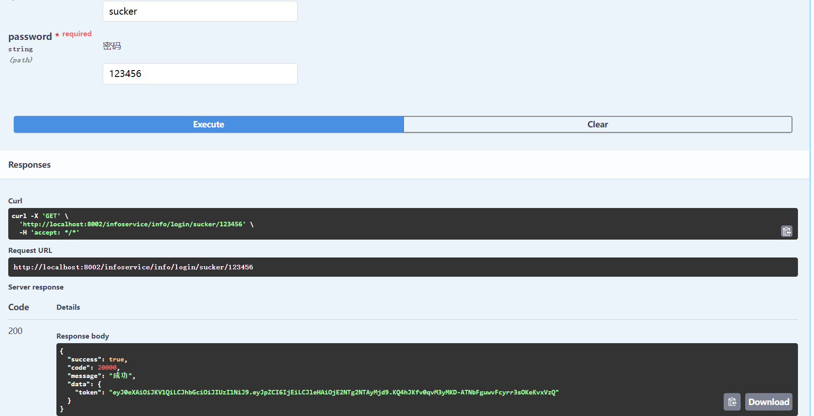
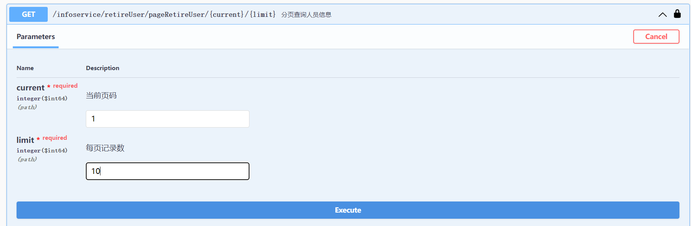
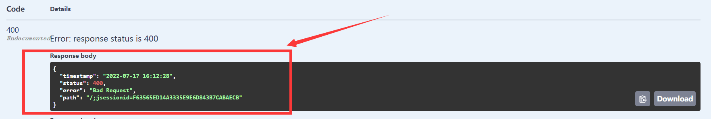
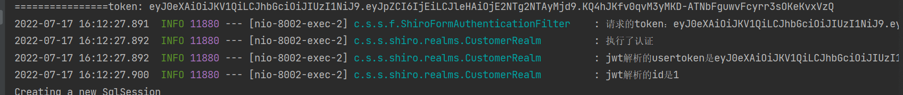
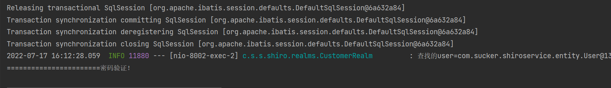

# 服务器相关知识

> 为什么程序员都需要一个自己的服务器？

1、作为一个程序员，必须要发布自己的网站和项目
2、练习[Linux](https://so.csdn.net/so/search?from=pc_blog_highlight&q=Linux)操作
3、自己的远程仓库、远程数据库、远程tomcat…搭建在服务器上
4、练习，Linux进行任意的环境部署操作

> 服务器如何购买？

尽量打折的时候买
香港服务器可以避免备案，但尽量不要自己挂VPN，会被封


**阿里云高校计划学生免费领取服务器**

[高校学生免费算力 - 飞天加速计划 (aliyun.com)](https://developer.aliyun.com/plan/student)

**阿里云折扣活动**

https://www.aliyun.com/minisite/goods?userCode=0phtycgr

> 买完服务器之后该做什么

服务器就是一个远程Linux
1、在阿里云购买的，需要开通安全组设置；[端口映射](https://so.csdn.net/so/search?from=pc_blog_highlight&q=端口映射)（端口映射都需要在阿里云的面板安装）


2、获取服务器的公网ip地址：47.113.224.15

修改实例名称和密码，第一次修改需要重启，使用Xshell远程连接

**下载Xshell和Xftp**

打开Xshell-新建，名称自取，主机名为公网ip，点击连接


这里就是Linux操作系统了！以后的Linux操作都在此操作，项目也在此发布!

输入命令clear清屏

ctrl+鼠标滚轮放大字体

从Xshell中打开Xftp


JAVA_HOME=/usr/java/jdk1.8.0_221-amd64      
JRE_HOME=$JAVA_HOME/jre
CLASSPATH=.:$JAVA_HOME/lib/dt.jar:$JAVA_HOME/lib/tools.jar:$JRE_HOME/lib
PATH=$JAVA_HOME/bin:$JRE_HOME/bin:$PATH
export JAVA_HOME JRE_HOME PATH CLASSPATH

# linux jar包项目指定启动端口

java -jar xx.jar --server.port=你随便

```
#开启防火墙端口
firewall-cmd --zone=public --add-port=9000/tcp --permanent
#重启防火墙
systemctl restart firewalld.service
#查看所有开启的端口，如果是阿里云 需要配置安全组规则
firewall-cmd --list-ports
后台运行
nohup java -jar shareniu.jar &  注意要在jar包目录下
nginx重启：
cd /usr/local/nginx/sbin
./nginx -s reload

mysql的配置文件目录

```


___
## 前言
* **本篇博客主要解决`shiro`在前后端分离项目应用中，结合`jwt`进行鉴权时，出现的第一次请求接口报错404问题**

​    查询网上资料，大部分是前后端不分离的解决方法，或是只描述问题并不给出解决方法，本文针对前后端分离情况，使用了 jwt 鉴权后，第一次请求接口不执行 shiro 的 AuthorizationInfo 方法，给出一个简便的解决方法。

**白嫖容易，创作不易，若大家认为有用，学到知识，不妨点个赞**

**博客原创，转载请注明出处**

___
## 背景描述

项目采用前后端分离模式，使用 SpringBoot + Shiro + Jwt 进行前后端分离鉴权,使用Swagger进行测试

此时登录通过校验用户名密码后返回 token，登录接口已在shiro配置中放行

```java
    public R login(@Parameter(description = "用户名") @PathVariable String username, @Parameter(description = "密码") @PathVariable String password){
        User user = null;
        try {
            user = userService.findByUserName(username);
        } catch (Exception e) {
            e.printStackTrace();
            return R.error().message("用户名或密码错误！");
        }
        if (user == null) {
            return R.error().message("用户名或密码错误！");
        }
        if (!user.getPassword().equals(password)) {
            return R.error().message("用户名或密码错误！");
        }
        String token = TokenUtils.getToken(user.getUserId());
        return R.ok().data("token",token);
    }
```

------

## 问题描述

1. 启动项目后，先进行登录



2. 随意选择一个接口进行测试

   

3. 结果出现404，但第二次就可正常执行

   

4. 查看后台日志可以发现，确实执行了认证方法

   

5. 继续查看发现，执行完认证方法后，并不执行授权方法

   

   以下为认证方法部分代码

   ```java
           //密码认证shiro做，由于该项目密码没有加密加盐，所以调用的是这个简单构造方法
           SimpleAuthenticationInfo info = new SimpleAuthenticationInfo(user, useToken.getPrincipal().toString(), this.getName());
           System.out.println("=======================密码验证！");
           return info;
   ```

___
## 解决过程

查询各种博客资料后，发现了：shiro中的授权方法，即 AuthorizationInfo 方法，**并不是执行认证后就会执行**，而是访问限制资源时才执行。

这时我们回想我们的问题：**登录后，第一次请求接口只认证不授权，但第二次后便恢复正常**，第一次请求的接口也是限制资源，那为什么会出现这样的问题？

这时我们回想，在前后端不分离的项目中，没有使用 jwt 登录鉴权，这时的 shiro 登录是需要用到 subject.login 方法进行主动登录，而在前后端分离的项目中，我们并不需要这样进行，只需要在认证时校验用户即可。

由此我猜想，或许跟这个问题有关。

------

## 解决方法

直接在登录时采用原来的 subject.login 登录方式

```java
    public R login(@Parameter(description = "用户名") @PathVariable String username, @Parameter(description = "密码") @PathVariable String password){
        User user = null;
        try {
            user = userService.findByUserName(username);
        } catch (Exception e) {
            e.printStackTrace();
            return R.error().message("用户名或密码错误！");
        }
        if (user == null) {
            return R.error().message("用户名或密码错误！");
        }
        if (!user.getPassword().equals(password)) {
            return R.error().message("用户名或密码错误！");
        }
        String token = TokenUtils.getToken(user.getUserId());
        Subject subject = SecurityUtils.getSubject();
        subject.login(new AuthToken(token));
        return R.ok().data("token",token);
    }
```

由此测试，加入这句登录代码后，在登录的时候便执行了一次认证，接着请求第二个限制资源时，便可以正常进行认证授权了。

由此猜测，shiro 的认证授权，是需要第一次认证后，shiro才能“记住这个用户”。因此以subject.login 方法来执行一次认证即可。

**本人技术水平有限，难免出现逻辑不清晰或解释错误等问题，请大家包涵！可在评论区反馈**